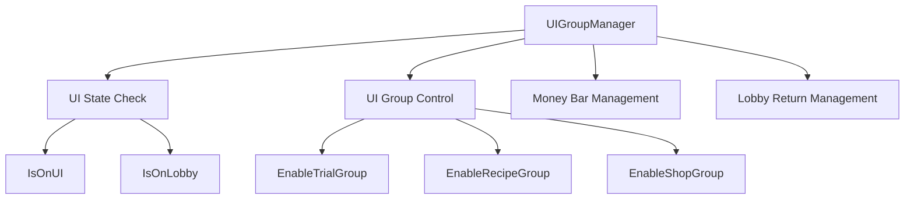
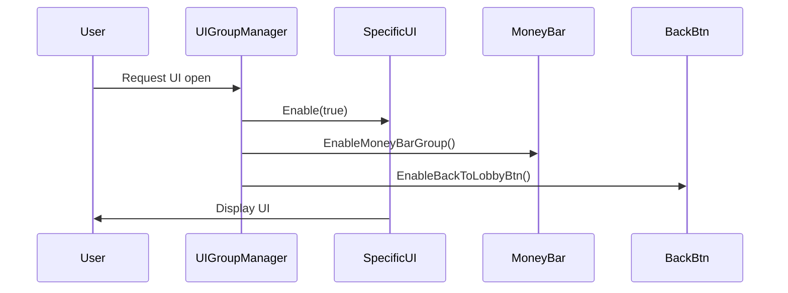
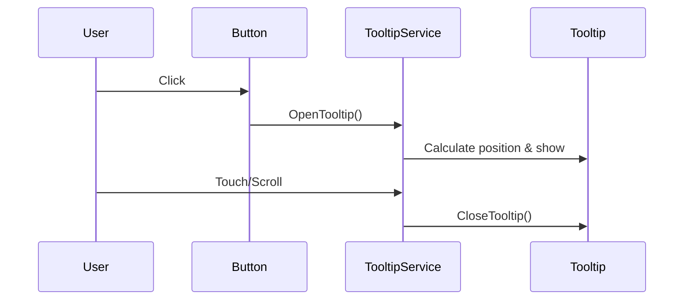
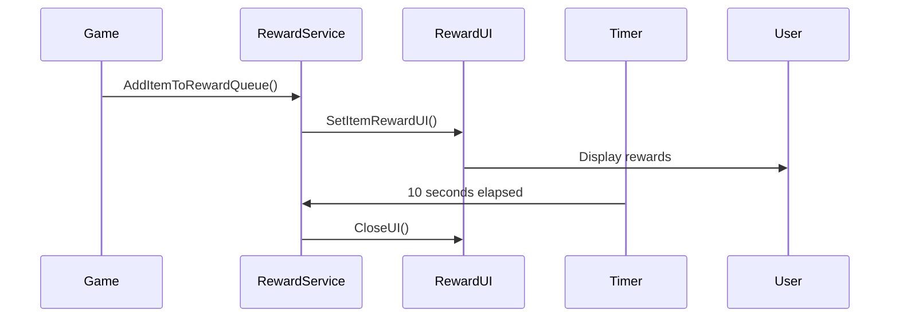

# UI Basic Structure

ChuChu Burger systematically manages user interfaces for various game functions through a comprehensive UI system. This system consists of UI group management, reusable components, tooltip management, and reward systems.

## Core Components

### 1. UI Group Manager (UIGroupManager)

UIGroupManager serves as the integrated manager for all major UI groups in the game.

#### Major UI Groups
- **Gameplay UI**: RecipeGroup, EmployeeManageGroup, TrainingGroup
- **Management UI**: ManagementGroup, UpgradeGroup, StoreRankingGroup  
- **Shop UI**: ShopGroup, SpecialShopGroup, StagePassGroup
- **System UI**: EventGroup, TutorialGroup, FadeGroup, PopupGroup
- **Collection UI**: AchievementGroup, BadgeGroup, ChuchuCollectionGroup

#### Core Functions

##### UI State Check and Control
- `IsOnUI()`: Check if there's currently active UI
- `IsOnLobby()`: Check if in lobby state
- `ClearAllUI()`: Close all UIs

##### Special UI Control
- `EnableMoneyBarGroup()`: Control money bar display
- `EnableBackToLobbyBtn()`: Control back to lobby button



### 2. Reusable UI Components

Standard UI components used throughout the game are implemented in the Common/UIScript folder.

#### Basic Components

##### UIPopup Series
- **UIPopup**: Basic popup with confirm/cancel buttons
- **UIPopupOK**: Simple popup with only confirm button  
- **UIPopupPurchase**: Special popup for purchase confirmation

##### Input Components
- **UIButtonTypeA**: Standard button component
- **UIToggleTypeA**: Selection toggle component
- **UIGaugeBar**: Progress display gauge bar

#### Component Features
- Popup overlap prevention validation (`IsEnableOpenPopUp()`)
- Tween animation support (open/close effects)
- Event handling and callback system
- Sound effect integration

### 3. Tooltip Management System (TooltipService)

TooltipService handles all tooltip display and management in the game.

#### Core Functions
- **Basic Tooltip**: `OpenTooltip()` - Simple text tooltip
- **Padded Tooltip**: `OpenTooltipWithPadding()` - Tooltip with position adjustment and flip functionality
- **Auto Close**: Automatic close on touch/scroll events

#### Advanced Features
- Screen boundary detection and auto flip
- Padding application and position adjustment
- Separate display of item name/description
- Scroll event detection

### 4. Reward UI System (UIItemRewardService)

Dedicated system that handles all reward display in the game.

#### Reward Display Features
- **Item Rewards**: Visual display of acquired items
- **Reputation Rewards**: Separate UI for reputation changes
- **Queue System**: Sequential display of multiple rewards

#### Special Features
- Auto timer (automatic close after 10 seconds)
- Multi-row display support
- Title change by source
- Animation effects

## UI System Operation Principles

### 1. UI Opening Flow


### 2. Tooltip System Flow


### 3. Reward Display Flow


## Developer Guide

### When Adding UI Groups
1. Add new group property to UIGroupManager
2. Add conditions to `IsOnUI()` and `IsOnLobby()` methods
3. Implement dedicated Enable method
4. Consider money bar and lobby button states

### When Developing New UI Components
1. Follow Common/UIScript patterns
2. Include `IsEnableOpenPopUp()` validation
3. Consider tween animation support
4. Integrate sound effects

### When Using Tooltips
1. Use `OpenTooltip()` for simple text
2. Use `OpenTooltipWithPadding()` for item information
3. Set position considering screen boundaries
4. Utilize auto-close on touch/scroll events

## Code References

### Main Files
- `RootDesk/MyDesk/Common/UIScript/UIGroupManager.mlua :: IsOnUI(), ClearAllUI(), EnableMoneyBarGroup()` — UI group integrated management
- `RootDesk/MyDesk/Common/UIScript/UIPopup.mlua :: Open(), StartTween()` — Basic popup component
- `RootDesk/MyDesk/Common/UIScript/TooltipService.mlua :: OpenTooltip(), OpenTooltipWithPadding()` — Tooltip management system
- `RootDesk/MyDesk/Common/UIScript/UIItemRewardService.mlua :: SetItemRewardUI(), AddItemToRewardQueue()` — Reward UI system
- `RootDesk/MyDesk/Common/UIScript/UIButtonTypeA.mlua :: OnClickButton(), SetEnable()` — Standard button component
- `RootDesk/MyDesk/Common/UIScript/UIToggleTypeA.mlua :: SetSelect(), OnClickButton()` — Toggle component

### Core Interfaces
**Core Interfaces:**

<details>
<summary>UI System Core Method Definitions</summary>

```lua
-- UIGroupManager core methods
method boolean IsOnUI()
method boolean ClearAllUI()
method void EnableMoneyBarGroup(boolean isEnable)

-- TooltipService core methods  
method void OpenTooltip(Entity tooltipEntity, string text)
method void OpenTooltipWithPadding(Entity tooltipEntity, string descKey, string nameKey, Vector3 worldPosition)

-- UIItemRewardService core methods
method void SetItemRewardUI(SyncTable<string, integer> items, string source)
method void AddItemToRewardQueue(string itemId, integer itemCount)
```
</details>
