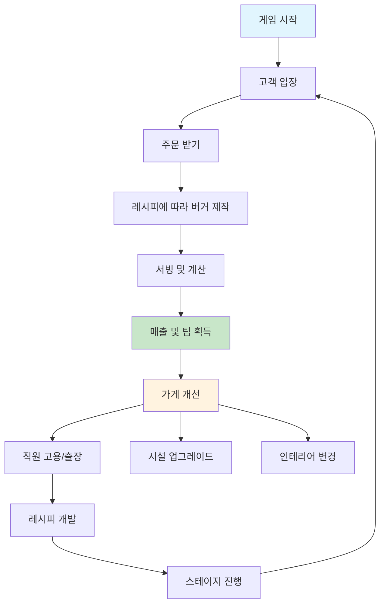

# 츄츄버거 - 햄버거 가게 경영 게임 개요

## 프로젝트 소개

**츄츄버거**는 MapleStory Worlds 플랫폼에서 개발된 2D 햄버거 가게 경영 시뮬레이션 게임입니다. 플레이어는 햄버거 가게의 사장이 되어 고객을 맞이하고, 직원을 고용하고, 레시피를 개발하며 가게를 성장시켜나가는 경영 게임입니다.

### 게임의 목표
- 햄버거 가게를 경영하여 매출과 평판을 높이기
- 다양한 레시피와 재료를 수집하고 조합하기
- 직원을 고용하고 성장시켜 효율성 향상
- 스테이지를 진행하며 새로운 콘텐츠 해금

## 핵심 게임플레이 루프



### 주요 게임 흐름
1. **고객 관리**: 고객이 입장하여 주문을 하고 만족도에 따라 팁을 지급
2. **메뉴 제작**: 다양한 재료를 조합하여 레시피 개발 및 버거 제작
3. **직원 운영**: 요리사와 서빙 직원을 배치하여 자동화된 가게 운영
4. **가게 성장**: 매출을 통해 시설 확장, 장비 업그레이드, 새로운 기능 해금

## 주요 기능 시스템

### 1. 플레이어 관리 시스템
- **계정 관리**: 플레이어 진행도, 재화, 업적 등 종합 관리
- **인벤토리**: 골드, 하트, 도시락, 클로버 등 다양한 재화 관리
- **진행 상태**: 스테이지, 레벨, 업적, 컬렉션 등 게임 진행도 추적

### 2. 고객 시스템
- **AI 고객**: 입장, 주문, 대기, 계산, 퇴장의 상태 기반 행동 패턴
- **선호도 시스템**: 고객별 선호도에 따른 주문 결정 및 만족도 계산
- **스폰 관리**: 가게 매력도에 따른 동적 고객 생성 및 대기열 관리

### 3. 직원 시스템
- **직원 AI**: 요리사와 서빙 직원의 자동화된 작업 처리
- **성장 시스템**: 레벨업, 스킬 해금, 장비 착용을 통한 능력치 향상
- **관리 기능**: 고용, 배치, 급여, 출장, 전근 등 포괄적 직원 관리

### 4. 레시피 제작 시스템
- **재료 조합**: 다양한 재료와 번을 조합하여 독창적인 레시피 개발
- **밸런스 관리**: 맛, 매운맛, 밸런스 점수를 고려한 레시피 최적화
- **트렌드 반영**: 시장 트렌드에 맞는 레시피로 매출 보너스 획득

### 5. 가게 운영 시스템
- **시설 관리**: 주방 기기, 카운터, 디스플레이 등 시설 업그레이드
- **확장 시스템**: 가게 공간 확장, 인테리어 변경, 데코레이션
- **정산 관리**: 일일/월별 매출 분석 및 비용 관리

## 프로젝트 구조

### 폴더 구조 개요
```
ChuChuBurger/
├── RootDesk/MyDesk/           # 핵심 게임 로직
│   ├── 00. Player/            # 플레이어 관리 시스템
│   ├── 01. Lobby/             # 로비 및 가게 환경
│   ├── 02. Employee/          # 직원 시스템
│   ├── 03. KitchenAppliance/  # 주방 기기 관리
│   ├── 04. Recipe/            # 레시피 시스템
│   ├── 05. Customer/          # 고객 시스템
│   ├── 06. Training/          # 직원 출장
│   ├── 07. Menu/              # 메뉴 관리
│   ├── 08. Event/             # 이벤트 및 다이얼로그
│   ├── 09. Management/        # 가게 경영
│   ├── 10. Trial/             # 경쟁 시스템
│   └── [기타 시스템들...]
├── ui/                        # UI 그룹 정의
├── map/                       # 게임 맵 (스테이지별)
├── Global/                    # 전역 설정 및 모델
└── docs/                      # 문서화
```

### 핵심 컴포넌트 구조
프로젝트의 모든 주요 기능은 `Global/DefaultPlayer.model`에서 플레이어 엔티티에 컴포넌트로 등록됩니다:

- **데이터 관리**: PlayerDBManager, PlayerInventory, PlayerRecipe
- **게임 시스템**: CustomerManager, EmployeeManager, MenuManager  
- **진행 관리**: PlayerStage, PlayerAchievement, PlayerEvent
- **특수 기능**: PlayerTrainingManager, PlayerTrial, PlayerVIPOrder

## MapleStory Worlds 플랫폼 특성

### 아키텍처 특징
- **클라이언트-서버 분리**: `@ExecSpace("ServerOnly")`, `@ExecSpace("ClientOnly")`로 실행 공간 구분
- **컴포넌트 기반**: Entity-Component 구조로 모듈화된 시스템 설계  
- **이벤트 기반**: OnBeginPlay, OnUpdate, OnMapEnter 등 생명주기 이벤트 활용
- **자동 동기화**: 서버-클라이언트 간 데이터 자동 동기화 제공

### 데이터 관리
- **DB 시스템**: 자동 저장/로드 시스템으로 플레이어 진행도 보존
- **CSV 데이터**: 게임 밸런스와 설정을 CSV 파일로 관리
- **리소스 관리**: 아틀라스, 애니메이션, 사운드 등 리소스 최적화

## 초보 개발자 가이드

### 시작하기 전 준비사항
1. **MapleStory Worlds 개발 환경** 설치 및 설정
2. **Lua 스크립팅** 기본 지식 (mlua 확장 문법 포함)
3. **게임 디자인 패턴** 이해 (Entity-Component, State Machine 등)

### 개발 시작 단계
1. **프로젝트 구조 파악**: 각 폴더의 역할과 주요 컴포넌트 이해
2. **핵심 시스템 분석**: CustomerManager, EmployeeManager 등 주요 시스템 동작 원리 학습
3. **데이터 플로우 추적**: DB 저장/로드, UI 업데이트, 이벤트 처리 흐름 파악
4. **작은 기능부터 시작**: 기존 시스템을 참고하여 점진적으로 기능 추가

### 주요 학습 포인트
- **상태 관리**: 고객과 직원의 상태 기반 AI 시스템
- **데이터 주도 설계**: CSV 데이터를 통한 게임 밸런스 관리
- **UI 시스템**: 재사용 가능한 UI 컴포넌트 패턴
- **성능 최적화**: 대용량 리스트 처리 및 리소스 관리

### 디버그 및 개발 도구
프로젝트에는 개발 효율성을 위한 다양한 도구들이 포함되어 있습니다:
- **디버그 모니터**: 실시간 게임 상태 모니터링
- **치트 시스템**: 개발 및 테스트용 치트 명령어
- **에디터 도구**: 맵 편집 및 데이터 설정 도구

## 코드 참조

### 핵심 초기화 시스템
- `RootDesk/MyDesk/00. Player/PlayerDBManager.mlua :: OnBeginPlay()` — 게임 시작 시 DB 로드 및 초기화
- `RootDesk/MyDesk/01. Lobby/LobbyManager.mlua :: RequestInit()` — 로비 환경 초기화
- `RootDesk/MyDesk/01. Lobby/TimeManager.mlua :: OnUpdate()` — 게임 시간 시스템

### 주요 게임플레이 시스템  
- `RootDesk/MyDesk/05. Customer/CustomerManager.mlua :: SpawnCustomer()` — 고객 생성 및 관리
- `RootDesk/MyDesk/02. Employee/EmployeeManager.mlua :: UpdateEmployee()` — 직원 상태 관리
- `RootDesk/MyDesk/04. Recipe/PlayerRecipe.mlua :: CreateRecipe()` — 레시피 생성 시스템
- `RootDesk/MyDesk/07. Menu/MenuManager.mlua :: UpdateMenu()` — 메뉴 관리 시스템

### UI 및 사용자 경험
- `RootDesk/MyDesk/Common/UIScript/UIGroupManager.mlua :: OpenUIGroup()` — UI 그룹 관리
- `RootDesk/MyDesk/08. Event/EventManager.mlua :: CallEvent()` — 이벤트 시스템
- `RootDesk/MyDesk/08. Event/TutorialManager.mlua :: StartTutorial()` — 튜토리얼 시스템

---

이 문서는 츄츄버거 프로젝트의 전체적인 개요를 제공합니다. 각 시스템의 자세한 구현 내용은 해당 시스템별 문서에서 다루어집니다.
