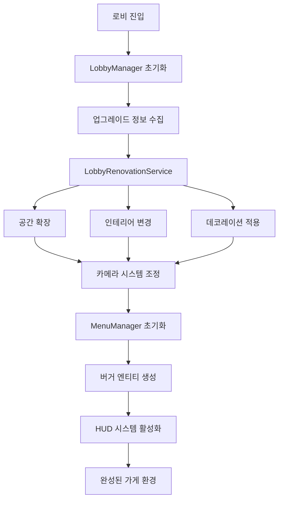

# 가게 환경과 분위기

츄츄버거 가게 환경과 분위기 시스템은 플레이어가 자신만의 독특한 햄버거 가게를 만들어갈 수 있도록 하는 핵심 메커니즘입니다. 이 시스템은 로비 관리, 메뉴 시각화, 카메라 제어, HUD 표시 등을 통해 몰입감 있는 가게 운영 경험을 제공합니다.

## 시스템 개요

가게 환경 시스템은 크게 **물리적 환경**과 **시각적 표현**으로 구분됩니다. 물리적 환경은 확장, 인테리어, 데코레이션 등을 통해 가게의 실제 공간을 변화시키고, 시각적 표현은 메뉴 디스플레이, UI 요소, 카메라 앵글 등을 통해 플레이어에게 생동감 있는 경험을 선사합니다.



## 로비 관리 시스템

### LobbyManager

게임의 로비(가게 내부) 전반을 관리하는 핵심 컴포넌트입니다.

**초기화 과정:**
`LobbyManager.RequestInit()`  
→ 플레이어의 업그레이드 레벨 정보를 수집하여 로비 초기화

- **확장 레벨**: `ReturnCurrentPlayerValue()`로 ExpansionStep 값 확인
- **인테리어 레벨**: InteriorLevel 업그레이드 상태 확인
- **데코레이션 레벨**: StoreDeco 업그레이드 상태 확인

<details>
<summary>관련 코드</summary>

```lua
-- LobbyManager.mlua :: RequestInit()
local expansionLv = _UpgradeDataSetLogic:ReturnCurrentPlayerValue(player, _UpgradeTypeEnum.ExpansionStep)
local interiorLv = _UpgradeDataSetLogic:ReturnCurrentPlayerLevel(player, _UpgradeTypeEnum.InteriorLevel) 
local decoLv = _UpgradeDataSetLogic:ReturnCurrentPlayerLevel(player, _UpgradeTypeEnum.StoreDeco)
```
</details>

로비 초기화는 다음 단계를 거쳐 진행됩니다:

1. **업그레이드 레벨 수집**: 확장, 인테리어, 데코레이션 레벨 확인
2. **주방 기기 정보 수집**: 그릴, 디스플레이, 카운터 개수 파악
3. **클라이언트 초기화**: 리노베이션 서비스를 통한 시각적 변경
4. **UI 및 서비스 초기화**: HUD, 카메라, 직원 관리 등 활성화

### LobbyRenovationService

가게의 물리적 환경을 변화시키는 핵심 서비스입니다.

**주요 기능:**
- **ExpandLobby()**: 확장 레벨에 따른 공간 확대
- **RedesignInterior()**: 인테리어 테마 변경
- **UpdateExteriorObject()**: 외부 오브젝트 배치
- **UpdateWaitSeatPos()**: 고객 대기석 위치 조정

**확장 시스템:**
`LobbyRenovationService.ExpandLobby()`  
→ 확장 레벨에 따른 주방 기기, 경로, 고객 위치 재조정

- **주방 기기 배치**: `VisibleKitAppsEntity()`로 기기 가시성 조정
- **경로 초기화**: `_PathFinder:InitNodes()`로 새 공간에 맞는 경로 설정
- **고객 위치 조정**: `UpdateCustomerSpawnPos()`로 스폰 위치 업데이트

<details>
<summary>관련 코드</summary>

```lua
-- LobbyRenovationService.mlua :: ExpandLobby() 
_KitchenAppService:VisibleKitAppsEntity(expansionLv,interiorLv,grillCount,displayCount,counterCount)
_PathFinder:InitNodes(expansionLv)
player.CustomerManager:UpdateCustomerSpawnPos(expansionLv)
```
</details>

확장이 진행되면 주방 기기 배치, 경로찾기 노드, 고객 스폰 위치 등이 모두 새로운 공간에 맞게 재조정됩니다.

## 메뉴 시각화 시스템

### MenuManager

가게에서 판매하는 모든 메뉴(버거)의 상태를 관리하는 컴포넌트입니다.

**핵심 데이터 구조:**
- `DisplayBurger`: 디스플레이된 버거 [레시피ID][슬롯Idx] = 개수
- `SalesBurger`: 판매된 버거 수량 추적
- `CookingBurger`: 현재 요리 중인 버거 수량
- `BurgerEntityPool`: 버거 엔티티 재활용 풀

**메뉴 변경 처리:**
`MenuManager.RefreshDisplayBurger()`  
→ 메뉴 변경 시 기존 디스플레이된 버거들을 새로운 설정에 맞게 재배치

- **레시피 검색**: `findRecipe()` 함수로 uniqueID 기반 레시피 매칭
- **슬롯 재배치**: 기존 버거를 적절한 새 슬롯으로 이동

<details>
<summary>관련 코드</summary>

```lua  
-- MenuManager.mlua :: RefreshDisplayBurger()
local findRecipe = function(uniqueID)
    for slotIdx,curRecipeId in pairs(self.CurrentSetRecipes) do		
        local setRecipeUniqueID = self:ReturnRecipeUniqueID(curRecipeId)
        if uniqueID == setRecipeUniqueID then 
            return slotIdx 
        end
    end
    return -1
end
```
</details>

### BurgerComponent

개별 버거 엔티티의 시각적 표현을 담당하는 컴포넌트입니다.

**시각적 스택 표현:**
`BurgerComponent.OnBurgerEntity()`  
→ 버거가 쌓일 때마다 스프라이트 세로 크기를 증가시켜 물리적 스택 표현

- **크기 계산**: `0.75 + 0.25 * (self.burgerCount - 1)` 공식으로 동적 크기 조정

<details>
<summary>관련 코드</summary>

```lua
-- BurgerComponent.mlua :: OnBurgerEntity()
self.spriteRendererComponent.TiledSize.y = 0.75 + 0.25 * (self.burgerCount - 1)
```
</details>

버거가 쌓일 때마다 스프라이트의 세로 크기가 증가하여 물리적인 스택을 시각적으로 표현합니다.

**수량 관리:**
- `AddBurgerEntity()`: 버거 추가 시 시각적 크기 업데이트
- `SubstractBurgerEntity()`: 버거 제거 시 크기 축소 및 0개 시 비활성화
- `OffBurgerEntity()`: 요리 중인 버거 수량 차감 처리

### MenuService

버거 엔티티의 생성, 재활용, 위치 관리를 담당하는 서비스입니다.

**엔티티 풀링 시스템:**
`MenuService.CreateBurgerEntity()`  
→ 효율적인 메모리 사용을 위해 버거 엔티티를 풀링하여 재활용

- **풀에서 재사용**: `#burgerEntityPool > 0` 조건으로 기존 엔티티 활용
- **새로 생성**: 풀이 비어있으면 `_SpawnService:SpawnByModelId()`로 생성

<details>
<summary>관련 코드</summary>

```lua
-- MenuService.mlua :: CreateBurgerEntity()
if #burgerEntityPool > 0 then 
    burger = burgerEntityPool[1]
    burger:AttachTo(parent)
    table.remove(burgerEntityPool,1)	
elseif menuManager.CurBurgerEntityNum < self.MaxBurgerEntityNum then 
    local id = _EntryService:GetModelIdByName("Model_SpawnBurger")
    burger = _SpawnService:SpawnByModelId(id, "burger"..menuManager.BurgerIdx, Vector3(0,0,0), parent)
```
</details>

효율적인 메모리 사용을 위해 버거 엔티티를 풀링하여 재활용합니다.

**메뉴 변경 시 상태 조정:**
`MenuService.ChangeMenuRecipe()`  
→ 메뉴 변경 시 고객과 직원 상태를 초기화하여 시스템 동기화

- **고객 상태**: `ExitWaitCustomer()`로 대기 중인 고객들 정리
- **직원 상태**: `EmployeeStateStop()` 후 `EmployeeStateStart()`로 재시작

<details>
<summary>관련 코드</summary>

```lua
-- MenuService.mlua :: ChangeMenuRecipe()
player.CustomerManager:ExitWaitCustomer() 
player.EmployeeManager:EmployeeStateStop() 
player.EmployeeManager:EmployeeStateStart()
```
</details>

## HUD 및 UI 시스템

### LobbyHUDService

로비의 모든 HUD 요소를 관리하는 포괄적인 서비스입니다.

**관리하는 HUD 요소들:**
- **재화 UI**: 골드, 하트, 클로버, 다이아몬드
- **출장 토큰**: 게이지와 타이머 표시
- **상점 정보**: 월별 매출, 고객 수, 유지비
- **트렌드 정보**: 현재 활성화된 트렌드 표시
- **팁 저장소**: 팁 수집 및 사용 UI
- **VIP 주문**: 특별 주문 상태 표시

**HUD 초기화:**
`LobbyHUDService.OpenHUD()`  
→ 로비 HUD 요소들을 활성화하고 초기 데이터로 갱신

- **HUD 그룹 활성화**: `EnableLobbyHUDGroup(true)`로 전체 HUD 활성화
- **재화 UI**: `UpdateMoneyUI()`로 가금 정보 업데이트
- **경영 정보**: `ManagementUI.Refresh()`로 경영 데이터 표시

<details>
<summary>관련 코드</summary>

```lua
-- LobbyHUDService.mlua :: OpenHUD()
_UIGroupManager:EnableLobbyHUDGroup(true)
_UIMoneyBarLogic:UpdateMoneyUI(player.PlayerInventory.Money)
self.ManagementUI.UIHUDManagement:Refresh()
self:UpdateTrainingTokenUI(player.PlayerInventory.LunchBox)
```
</details>

### 리포트 시스템

`LobbyHUDService.UpdateStoreInfoReportUI()`  
→ 실시간으로 가게에서 발생하는 이벤트들을 HUD에 표시

- **리포트 엔티티 생성**: `SpawnByEntity()`로 새로운 리포트 UI 생성
- **메시지 설정**: `clone.TextComponent.Text`로 리포트 내용 설정

<details>
<summary>관련 코드</summary>

```lua
-- LobbyHUDService.mlua :: UpdateStoreInfoReportUI()
local clone = _SpawnService:SpawnByEntity(self.ReportOrigin, "Report"..tostring(self._T.reportIndex), Vector3.zero, self.StoreInfoReportLayout)
clone.TextComponent.Text = message
```
</details>

최대 5개의 리포트를 순환 관리하여 화면이 복잡해지지 않도록 조절합니다.

## 카메라 시스템

### LobbyCameraService

가게 환경을 다양한 각도에서 관찰할 수 있는 카메라 시스템입니다.

**카메라 타입:**
- **FullView**: 전체 가게를 조망하는 기본 카메라
- **MovingCamera**: 플레이어가 직접 조작 가능한 카메라
- **확장별 전용 카메라**: 각 확장 레벨에 최적화된 시점

**확장 레벨별 카메라 조정:**
`LobbyCameraService.SetCamerasForExpansion()`  
→ 확장 레벨이 변경되면 카메라 경계와 위치를 새로운 공간에 맞게 자동 조정

- **카메라 데이터**: `GetLobbyCameraData()`로 확장 레벨별 카메라 설정 조회
- **경계 조정**: `CustomBoundLB`로 좌측 하단 경계 설정

<details>
<summary>관련 코드</summary>

```lua
-- LobbyCameraService.mlua :: SetCamerasForExpansion()
local cameraData = _CameraDataSetLogic:GetLobbyCameraData(expansionLevel)
for k, cameraComponent in pairs(self.lobbyCameras) do
    if typeData.CustomBoundLB ~= nil then
        cameraComponent.LeftBottom = Vector2(typeData.CustomBoundLB.x, typeData.CustomBoundLB.y)
    end
end
```
</details>

확장 레벨이 변경되면 카메라 경계와 위치가 새로운 공간에 맞게 자동 조정됩니다.

**터치 조작 지원:**
모바일 플레이를 고려하여 터치를 통한 카메라 이동과 줌 기능을 제공합니다.

## 환경 상호작용

### 엔티티 참조 관리

로비의 모든 중요한 엔티티들은 체계적으로 관리됩니다:

- **고객 스폰 포인트**: 확장에 따라 동적으로 위치 변경
- **직원 작업 위치**: 주방 기기 배치에 연동
- **버거 디스플레이 위치**: 메뉴 슬롯별 정확한 배치
- **데코레이션 오브젝트**: 인테리어 테마에 맞는 배치

### 분위기 연출

**감정적 피드백:**
- 최고 기록 달성 시 특별한 시각 효과
- 적자 발생 시 캐릭터의 슬픈 표정
- 성공적인 하루 종료 시 축하 애니메이션

**사운드 시스템:**
- 환경음: 주방에서 나는 그릴 소리, 고객의 대화 소리
- 효과음: 버거 완성, 돈 획득, 레벨업 등의 피드백
- 배경음악: 가게 분위기에 맞는 편안한 BGM

## 성능 최적화

### 엔티티 풀링

`MenuService.ResetBurgerEntity()`  
→ 대량의 버거 엔티티를 효율적으로 관리하기 위한 풀링 시스템

- **엔티티 초기화**: `Enable = false`로 비활성화 후 위치 초기화
- **풀 반환**: `table.insert(burgerEntityPool, burger)`로 재사용을 위해 풀에 반환

<details>
<summary>관련 코드</summary>

```lua
-- MenuService.mlua :: ResetBurgerEntity()
burger:AttachTo(parent)
burger.Enable = false
burger.TransformComponent.WorldPosition = Vector3(0,0,0)
table.insert(burgerEntityPool,burger)
```
</details>

### 조건부 렌더링

화면에 보이지 않는 요소들은 비활성화하여 성능을 최적화합니다:

- 확장되지 않은 영역의 오브젝트 비활성화
- 메뉴에 설정되지 않은 버거 슬롯 숨김
- 조건에 맞지 않는 UI 요소 제거

## 사용자 경험 향상

### 직관적인 정보 표시

- **색상 코딩**: 수익(초록), 손실(빨강), 중립(회색) 등으로 직관적 정보 전달
- **아이콘 시스템**: 복잡한 텍스트 대신 명확한 아이콘 사용
- **애니메이션**: 중요한 변화 시 부드러운 전환 효과

### 접근성 고려

- **다양한 화면 비율**: 모바일, 태블릿, PC 등 다양한 환경 지원
- **터치 친화적 UI**: 적절한 버튼 크기와 간격
- **명확한 피드백**: 모든 조작에 대한 즉각적인 시각/청각 피드백

---

## 코드 참조

**핵심 파일들:**
- `RootDesk/MyDesk/01. Lobby/LobbyManager.mlua :: InitClient()` — 로비 초기화 총괄
- `RootDesk/MyDesk/01. Lobby/LobbyRenovationService.mlua :: ExpandLobby()` — 확장/인테리어/데코 적용
- `RootDesk/MyDesk/07. Menu/MenuManager.mlua :: RefreshDisplayBurger()` — 메뉴 디스플레이 관리
- `RootDesk/MyDesk/07. Menu/BurgerComponent.mlua :: OnBurgerEntity()` — 버거 시각화
- `RootDesk/MyDesk/07. Menu/MenuService.mlua :: CreateBurgerEntity()` — 버거 엔티티 생성/재활용
- `RootDesk/MyDesk/01. Lobby/LobbyHUDService.mlua :: OpenHUD()` — HUD 시스템 관리
- `RootDesk/MyDesk/01. Lobby/Camera/LobbyCameraService.mlua :: SetCamerasForExpansion()` — 카메라 시스템 조정
