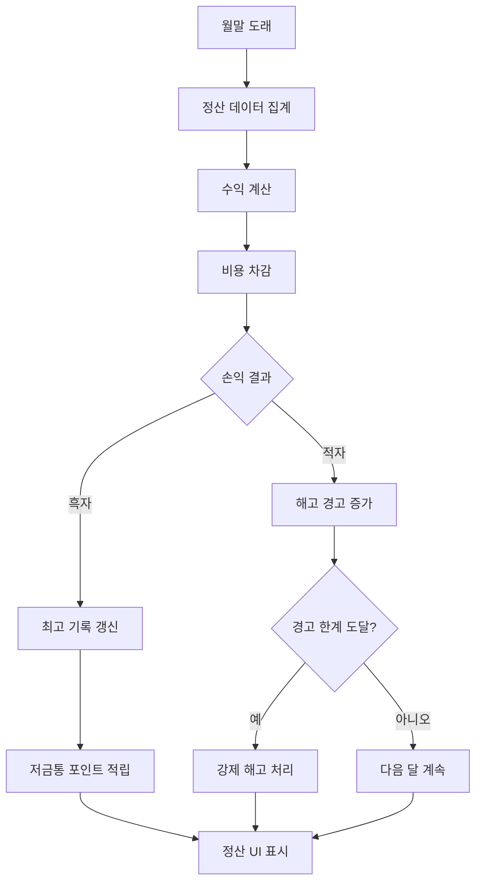

# 매출과 수익 관리

츄츄버거 매출과 수익 관리 시스템은 플레이어의 가게 운영 성과를 월별로 정산하고, 수익과 비용을 체계적으로 관리하는 핵심 시스템입니다. 이 시스템은 현실적인 사업 운영 메커니즘을 게임에 적용하여, 플레이어가 경영자로서 재무 상태를 파악하고 의사결정을 내릴 수 있게 합니다.

## 시스템 개요

매출과 수익 관리 시스템의 핵심은 **월말 정산**입니다. 매월 말이 되면 자동으로 정산이 진행되며, 플레이어의 수익과 비용을 계산하여 최종적인 손익을 결정합니다. 이 과정에서 적자가 발생하면 해고 경고가 주어지고, 흑자를 달성하면 저금통에 수익이 쌓이는 등 다양한 후속 처리가 이루어집니다.



## 핵심 컴포넌트

### PlayerSettlement

게임의 정산 시스템을 총괄하는 핵심 컴포넌트입니다.

**주요 속성:**
- `SettlementDatas`: 최대 7개월간의 정산 데이터 보관
- `BestRecipeEarnings`: 최고 레시피 수익 기록 
- `ResignWarningCount`: 해고 경고 횟수 (최대 3회)
- `PiggyBankEarnings`: 저금통 수익 누적액

**핵심 메서드:**
- `Settlement()`: 월말 정산 처리
- `AddValueForSettlement()`: 실시간 정산 데이터 누적
- `CreateNewMonthSettlementData()`: 새 달 데이터 초기화

### SettlementData

월별 정산 정보를 담는 데이터 구조체입니다.

**수익 항목:**
- `P_RecipeTotal`: 레시피(버거) 판매 수익
- `P_Training`: 출장을 통한 수익 
- `P_Etc`: 기타 수익

**비용 항목:**
- `M_AccumSalary`: 직원 급여 누적액
- `M_AccumMaintenance`: 시설 유지비 누적액
- `M_ChuchuEmployment`: 직원 고용 비용
- `M_Upgrade`: 업그레이드 비용
- `M_Etc`: 기타 지출

**운영 지표:**
- `CustomerCount`: 방문 고객 수
- `BurgerCount`: 판매된 버거 수
- `IsMinusBudget`: 적자 발생 여부

## 정산 처리 과정

### 1. 데이터 집계
월말이 되면 `TimeManager`의 시간 시스템에 의해 정산이 자동으로 트리거됩니다. 현재 달의 모든 수익과 비용 데이터가 집계되어 최종 손익이 계산됩니다.

### 2. 비용 차감
급여와 유지비를 합산한 총 비용이 플레이어의 보유 자금에서 차감됩니다. 이 과정에서 `PlayerInventory:SubMoneyUnderZero()`를 통해 잔액 부족 여부가 확인됩니다.

### 3. 적자 처리
`PlayerSettlement.Settlement()`  
→ 자금 부족 시 초기 단계에서는 긴급 자금 지원, 후반 단계에서는 경고 누적 처리

- **초기 보호**: `NowStage <= 2`일 때 긴급 자금 지원 
- **경고 시스템**: 후반 단계에서는 `ResignWarningCount` 증가

<details>
<summary>관련 코드</summary>

```lua
-- PlayerSettlement.mlua :: Settlement()
if self.Entity.PlayerStage.NowStage <= 2 then
    if self.Entity.PlayerManagement.ManagementLevel <= emergencyFundMLevel then
        local emergencyFund = _GetConfigDataLogic:GetConfigNumDataByKey("EmergencyFundManagementLevel"..self.Entity.PlayerManagement.ManagementLevel)
        self.Entity.PlayerInventory:ModifyMoney(emergencyFund, "Emergency fund", "Settlement popup")
    end
else
    self.ResignWarningCount = self.ResignWarningCount + 1		
end
```
</details>

### 4. 해고 시스템
연속된 적자로 인해 경고가 3회 누적되면 자동으로 직원 해고가 진행됩니다. 이는 현실적인 경영 압박감을 제공합니다.

## 수익 기록 및 보상

### 최고 기록 관리
매월 레시피 수익이 기존 최고 기록을 갱신하면 새로운 기록으로 저장되며, 업적 시스템과 연동되어 추가 보상이 주어집니다.

### 저금통 시스템
`PlayerSettlement.AddValueForSettlement()`  
→ 흑자 달성 시 수익의 일부를 저금통(PiggyBank)에 축적하는 장기 수익 시스템

- **스테이지 제한**: `NowStage > 1`일 때만 저금통 적립 활성화
- **수익 연동**: `_PaidLogic:AddEarnings_PiggyBank()`로 저금통 포인트 추가

<details>
<summary>관련 코드</summary>

```lua
-- PlayerSettlement.mlua :: AddValueForSettlement()
if self.Entity.PlayerStage.NowStage > 1 then
    _PaidLogic:AddEarnings_PiggyBank(addValue, self.Entity.PlayerComponent.UserId)
end
```
</details>

저금통은 일정 기준에 도달하면 다이아몬드로 전환되는 장기 수익 시스템 역할을 합니다.

### 업적 연동
`PlayerSettlement.Settlement()`  
→ 월별 고객 수와 버거 판매량을 업적 시스템과 연동하여 기록

- **진행도 확인**: `ReturnAchievementProgress()`로 현재 업적 진행도 확인
- **기록 갱신**: `customerProgress < customerCount` 조건으로 최고 기록 갱신

<details>
<summary>관련 코드</summary>

```lua
-- PlayerSettlement.mlua :: Settlement()
local customerProgress = self.Entity.PlayerAchievement:ReturnAchievementProgress(_RecordAchievementTypeEnum.MonthlyCustomerCount)
if customerProgress < customerCount then
    self.Entity.PlayerAchievement:ChangeProgress(_RecordAchievementTypeEnum.MonthlyCustomerCount, customerCount)
end
```
</details>

## UI 시스템

### 정산 패널 (UISettlementPanel)
월말 정산 결과를 시각적으로 표시하는 메인 UI입니다. 슬라이드 애니메이션과 함께 등장하며, 다음 정보를 제공합니다:

- 해당 월의 년/월 정보
- 레시피 수익과 기타 수익 분석
- 유지비 및 총 비용 내역  
- 최고 기록 달성 여부
- 적자/흑자 상태에 따른 캐릭터 감정 표현

### 진행도 그래프 (UISettlementProgressGraphLine)
과거 7개월간의 수익 추이를 막대 그래프로 표시합니다. 각 막대는 다음과 같이 구성됩니다:

- **높이**: 최고 기록 대비 해당 월 수익 비율
- **색상**: 흑자/적자 상태 표시
- **아이콘**: 최고 기록 달성 월 표시 (`BEST` 아이콘)
- **적자 표시**: 마이너스 아이콘으로 적자 월 표시

### 매장 정보 연동
정산 시스템은 매장 정보 UI와 연동되어, 플레이어가 언제든지 과거 정산 내역을 확인할 수 있습니다.

## 실시간 데이터 수집

정산은 월말에만 이루어지지만, 데이터 수집은 실시간으로 진행됩니다:

- **고객 구매 시**: 레시피 수익 누적
- **직원 급여 지급 시**: 급여 비용 누적  
- **시설 업그레이드 시**: 업그레이드 비용 기록
- **출장 완료 시**: 출장 수익 추가

이러한 실시간 데이터 수집을 통해 플레이어는 월 중간에도 현재 수익 상황을 파악할 수 있습니다.

## 데이터 관리

### 저장 및 로드
모든 정산 데이터는 JSON 형태로 데이터베이스에 저장되며, 게임 재시작 시에도 완벽하게 복원됩니다.

### 데이터 보관 정책
성능을 위해 최대 7개월간의 데이터만 보관하며, 새로운 월이 시작되면 가장 오래된 데이터는 자동으로 삭제됩니다.

## 균형 조정과 난이도

정산 시스템은 게임의 균형을 맞추는 핵심 요소입니다:

- **초기 단계**: 긴급 자금 지원으로 학습 기회 제공
- **중급 단계**: 점진적인 경영 압박감 증가  
- **고급 단계**: 엄격한 수익성 요구사항

이를 통해 플레이어는 단계적으로 경영 스킬을 습득하면서도 지속적인 도전과 성장을 경험할 수 있습니다.

---

## 코드 참조

**핵심 파일들:**
- `RootDesk/MyDesk/00. Player/PlayerSettlement.mlua :: Settlement()` — 월말 정산 핵심 로직
- `RootDesk/MyDesk/01. Lobby/Settlement/SettlementData.mlua :: ConvertToTable()` — 정산 데이터 구조체  
- `RootDesk/MyDesk/01. Lobby/Settlement/UISettlementPanel.mlua :: Open()` — 정산 결과 UI 표시
- `RootDesk/MyDesk/01. Lobby/Settlement/UISettlementProgressGraphLine.mlua :: Refresh()` — 그래프 라인 렌더링
- `RootDesk/MyDesk/01. Lobby/TimeManager.mlua :: OnMonthChanged()` — 월말 정산 트리거
- `RootDesk/MyDesk/00. Player/PlayerOutgameManager.mlua :: AddPiggyBankPoint()` — 저금통 포인트 적립
- `RootDesk/MyDesk/Shop/BMCommon/PaidLogic.mlua :: AddEarnings_PiggyBank()` — 저금통 수익 처리
