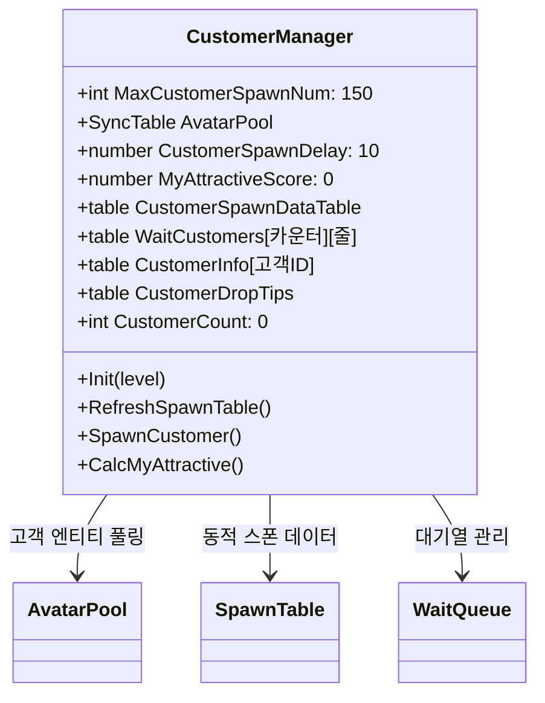
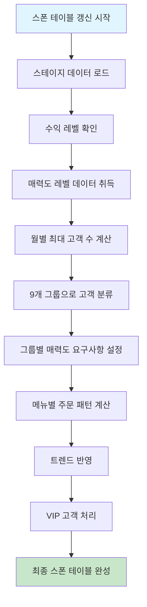
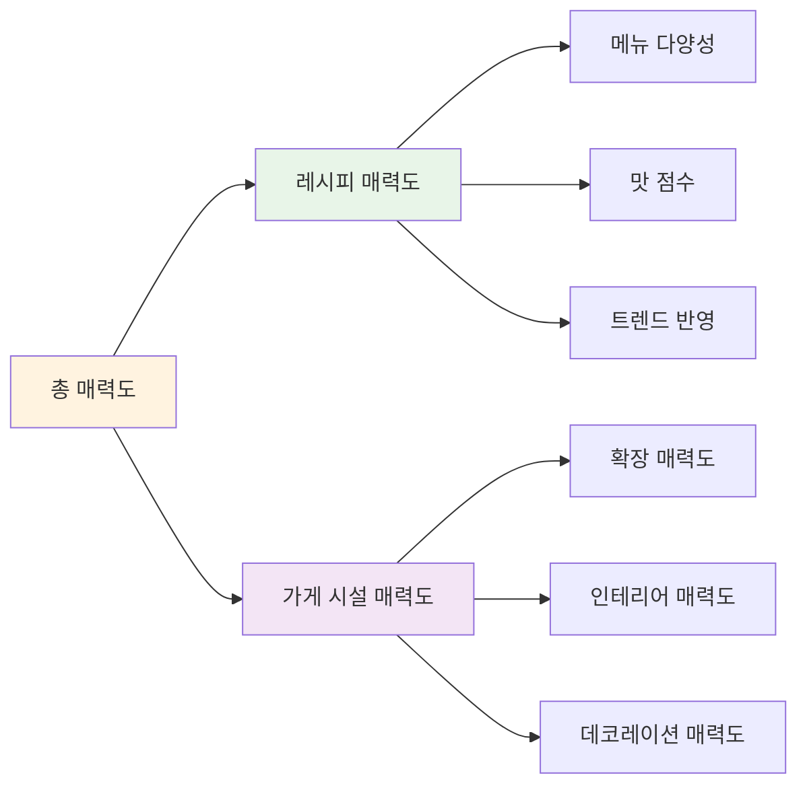
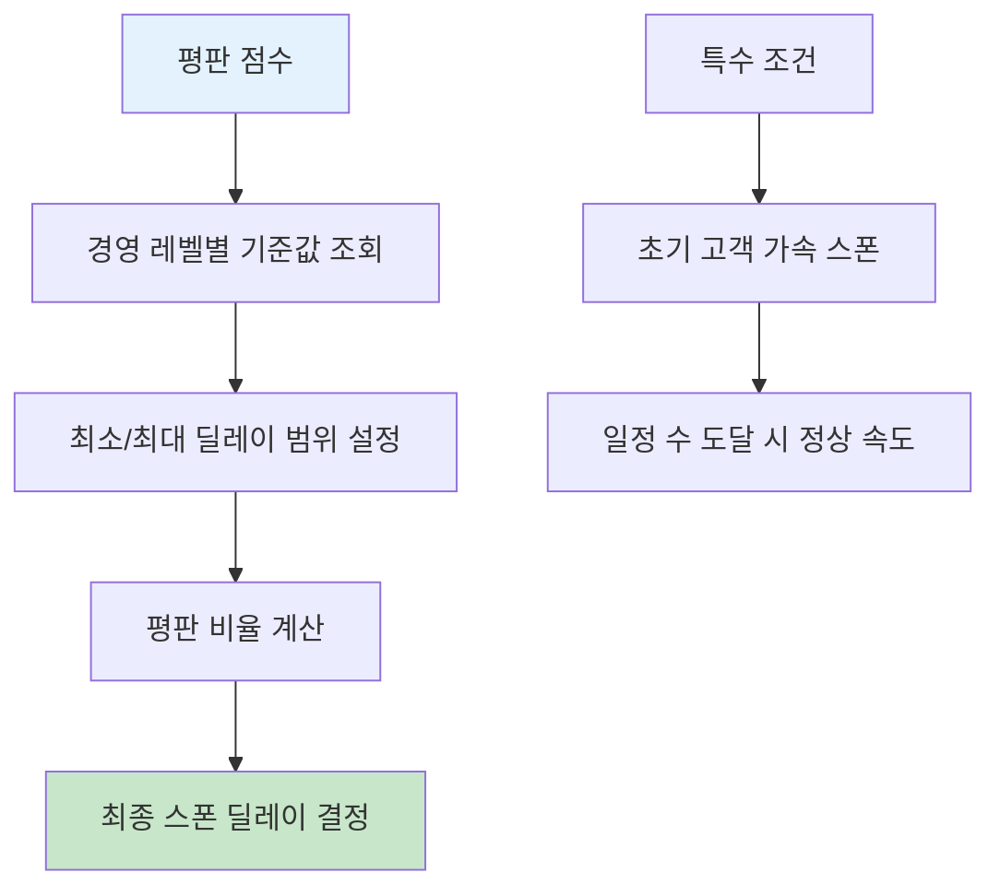
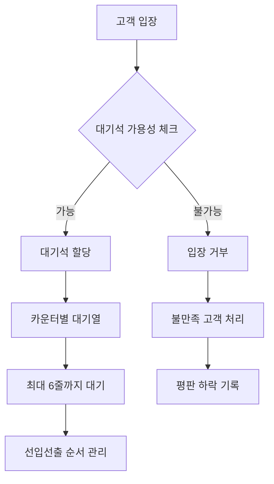
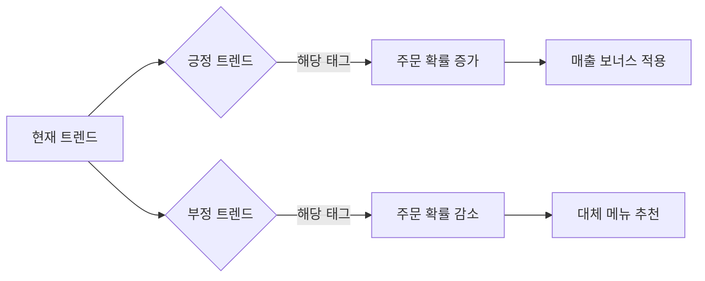
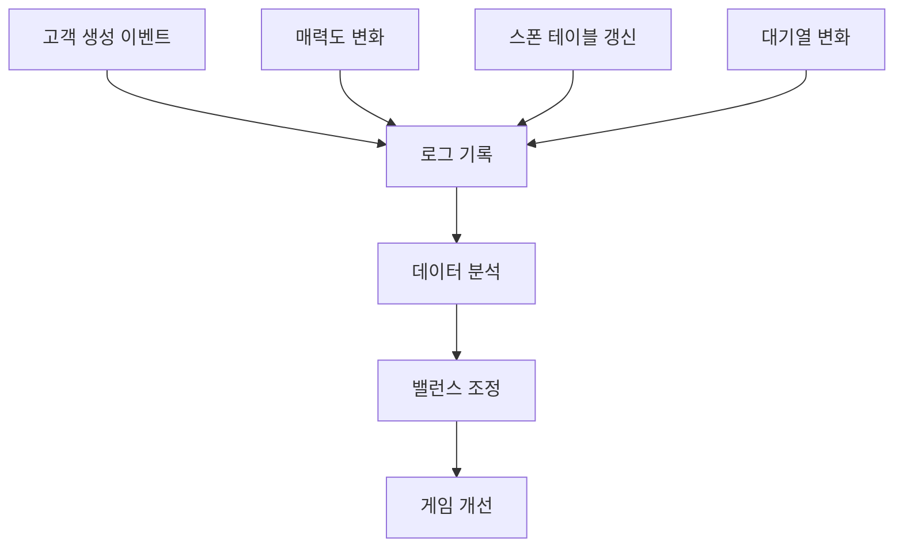

# 고객 생성과 관리 시스템

## 시스템 개요

츄츄버거 고객 생성과 관리 시스템은 `CustomerManager` 컴포넌트를 중심으로 운영됩니다. 이 시스템은 가게의 매력도, 평판, 경영 레벨, 트렌드 등 다양한 요소를 종합적으로 고려하여 동적으로 고객을 생성하고 관리합니다.

## CustomerManager 핵심 구조

### 주요 속성 및 데이터


### 고객 오브젝트 풀링 시스템
성능 최적화를 위해 고객 엔티티를 사전에 생성하여 풀로 관리합니다:

- **풀 크기**: 최대 150개의 고객 엔티티
- **재사용**: 퇴장한 고객 엔티티를 풀에 반환하여 재사용
- **초기화**: 로비 진입 시 모든 고객 엔티티를 비활성 상태로 생성

## 동적 스폰 테이블 시스템

### RefreshSpawnTable 메커니즘


### 고객 그룹 분류 시스템
고객은 매력도 요구사항에 따라 9개 그룹(G1~G8 + 특별)으로 분류됩니다:

1. **그룹 G1-G7**: 일반 고객 (매력도 요구사항 증가)
2. **그룹 G8**: 높은 매력도 요구 고객
3. **특별 그룹**: VIP 고객 및 이벤트 고객

### 월별 고객 수 계산 공식
```
월별고객수 = 기본고객수 × (1 + 추가비율) × 남은날짜비율 + 1
```

- **기본 고객 수**: 매력도 레벨별 기준 고객 수
- **추가 비율**: 설정 가능한 보너스 비율
- **남은 날짜 비율**: 월 초일수록 더 많은 고객 생성

## 매력도 기반 고객 생성

### 매력도 계산 시스템


### 매력도별 고객 접근 패턴
- **높은 매력도**: 상위 그룹 고객 유입, 짧은 스폰 딜레이
- **낮은 매력도**: 하위 그룹 고객만 입장, 긴 스폰 딜레이
- **임계점 시스템**: 각 그룹별 최소 매력도 요구사항

## 스폰 딜레이 조절 시스템

### 평판 기반 딜레이 계산


### 딜레이 계산 공식
```
스폰딜레이 = 최대딜레이 × (1 - 평판비율) + 최소딜레이
```

- **평판 비율**: 현재평판 ÷ 최대평판
- **경영 레벨**: 더 높은 레벨일수록 더 빠른 기본 속도
- **가속 시스템**: 초기 일정 수의 고객은 빠른 속도로 스폰

## 대기열 관리 시스템

### 대기석 구조


### 대기석 확장 시스템
- **기본**: 카운터당 3줄까지 대기 가능
- **확장 후**: 로비 레벨 6 이상 시 6줄까지 확장
- **동적 관리**: 실시간 대기석 상태 추적

## 주문 패턴 결정 시스템

### 메뉴별 주문 비율 계산
현재 설정된 메뉴를 기반으로 고객의 주문 패턴을 결정합니다:

1. **보장 주문**: 각 메뉴별 최소 주문 보장
2. **선호도 매칭**: 고객 선호 태그와 메뉴 태그 매칭
3. **랜덤 분배**: 남은 고객에게 랜덤 메뉴 할당
4. **주문 개수**: 1-3개 범위에서 가중치 기반 선택

### 트렌드 반영 시스템


## 특별 고객 시스템

### VIP 고객 처리
- **생성 조건**: 특정 매력도 달성 시
- **특별 혜택**: 높은 팁, 특별 주문
- **우선 처리**: 일반 고객보다 우선적 서빙

### 튜토리얼 고객
- **1년 미만 고객**: 특별한 주문 태그 목록 관리
- **단계적 해제**: 튜토리얼 진행에 따른 점진적 메뉴 해금
- **가이드 역할**: 신규 플레이어를 위한 학습 지원

## 성능 최적화 및 관리

### 메모리 관리
- **오브젝트 풀링**: 고객 엔티티 재사용으로 메모리 효율성
- **데이터 정리**: 맵 이동 시 모든 고객 데이터 초기화
- **타이머 관리**: 불필요한 타이머 정리로 리소스 절약

### 동적 업데이트
- **실시간 계산**: 스폰 테이블을 필요 시마다 동적 생성
- **조건 변화 감지**: 매력도, 평판 변화 시 자동 재계산
- **오류 복구**: 데이터 불일치 시 자동 복구 메커니즘

## 디버깅 및 모니터링

### 개발자 도구
- **고객 정보 모니터**: 실시간 고객 상태 추적
- **스폰 테이블 뷰어**: 현재 스폰 데이터 시각화
- **매력도 계산기**: 현재 매력도 점수 표시
- **딜레이 조정**: 개발 시 스폰 속도 조절

### 로깅 시스템


## 코드 참조

### 핵심 관리 시스템
- `RootDesk/MyDesk/05. Customer/CustomerManager.mlua :: RefreshSpawnTable()` — 동적 스폰 테이블 생성
- `RootDesk/MyDesk/05. Customer/CustomerManager.mlua :: SpawnCustomer()` — 고객 생성 및 스폰 처리  
- `RootDesk/MyDesk/05. Customer/CustomerManager.mlua :: CalcMyAttractive()` — 매력도 계산
- `RootDesk/MyDesk/05. Customer/CustomerManager.mlua :: SetCustomerSpawnDelay()` — 스폰 딜레이 설정

### 매력도 계산 시스템
- `RootDesk/MyDesk/05. Customer/CustomerManager.mlua :: CalcAttractiveRecipe()` — 레시피 매력도 계산
- `RootDesk/MyDesk/05. Customer/CustomerManager.mlua :: CalcAttractiveExpension()` — 확장 매력도 계산
- `RootDesk/MyDesk/05. Customer/CustomerManager.mlua :: CalcAttractiveInterior()` — 인테리어 매력도 계산
- `RootDesk/MyDesk/05. Customer/CustomerManager.mlua :: CalacAttractiveDeco()` — 데코 매력도 계산

### 대기열 및 스폰 관리
- `RootDesk/MyDesk/05. Customer/CustomerManager.mlua :: ReturnWaitSeat()` — 대기석 할당 로직
- `RootDesk/MyDesk/05. Customer/CustomerManager.mlua :: AddWaitCustomer()` — 대기열 추가
- `RootDesk/MyDesk/05. Customer/CustomerManager.mlua :: InitCustomerSpawner()` — 스폰 시스템 초기화

### 평판 및 밸런스 시스템
- `RootDesk/MyDesk/01. Lobby/Reputation/ReputationDataSetLogic.mlua :: ReturnSpawnDelay()` — 평판 기반 딜레이 계산
- `RootDesk/MyDesk/01. Lobby/StoreInfo/StoreInfoDataSetLogic.mlua :: ReturnPlayerScoreByCustomerReviewId()` — 리뷰 점수 계산
- `RootDesk/MyDesk/Common/Balance/BalanceDataSetLogic.mlua :: GetStoreAttractiveLevelData()` — 매력도 레벨 데이터

---

이 문서는 츄츄버거 고객 생성과 관리 시스템의 복잡한 메커니즘을 상세히 설명합니다. 매력도, 평판, 트렌드 등 다양한 요소가 어떻게 상호작용하여 동적이고 균형 잡힌 고객 경험을 만들어내는지 이해할 수 있습니다.
