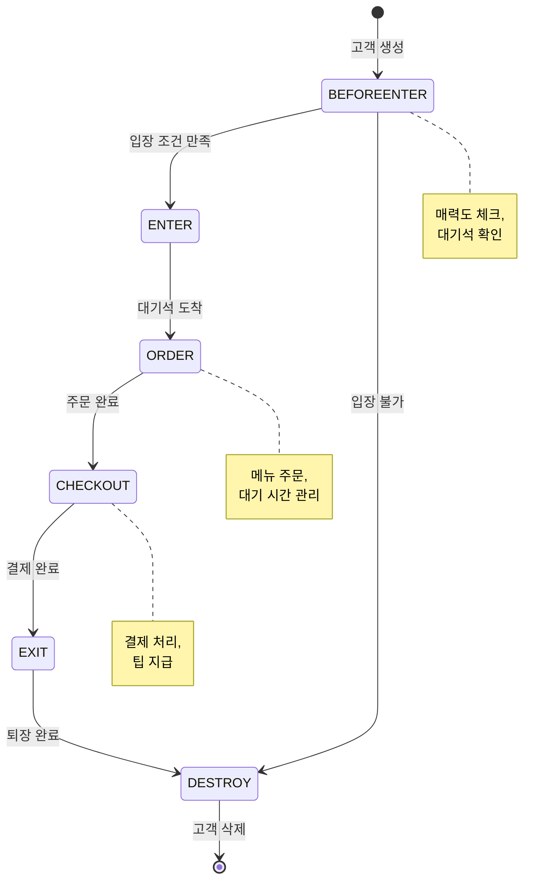
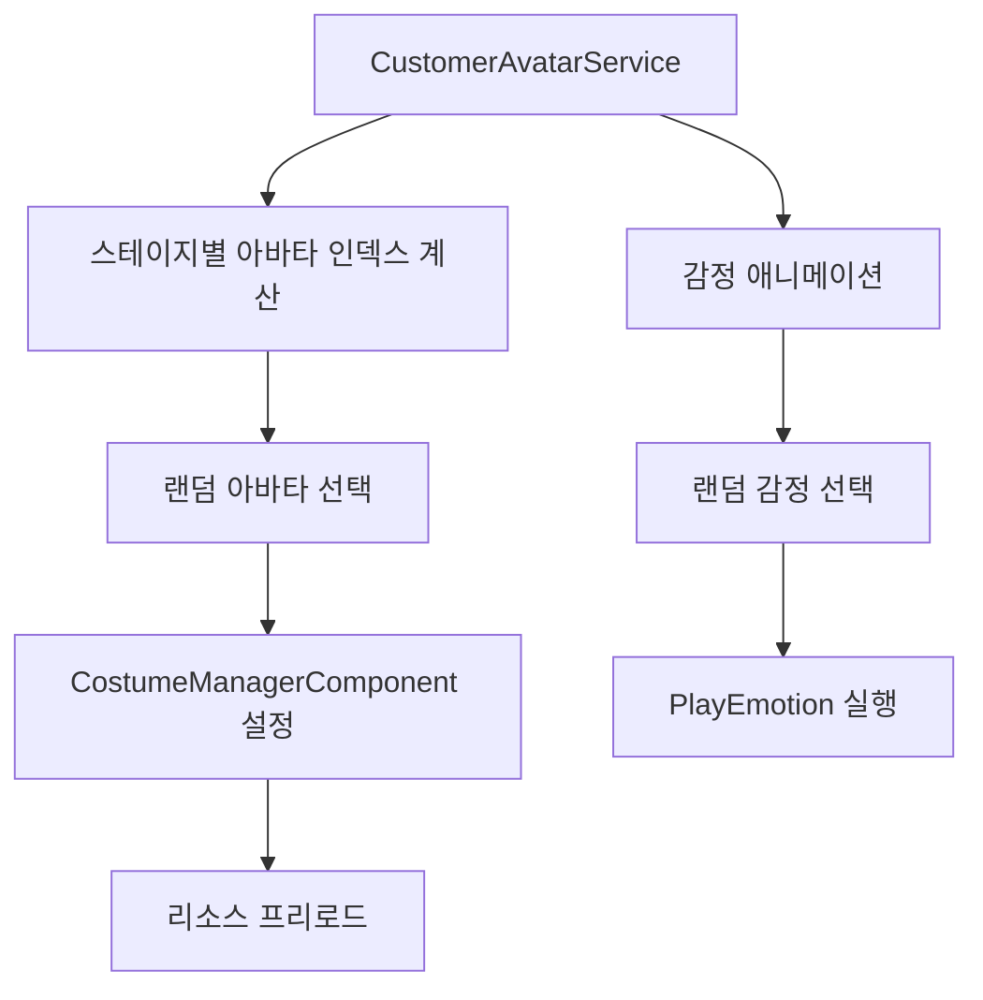
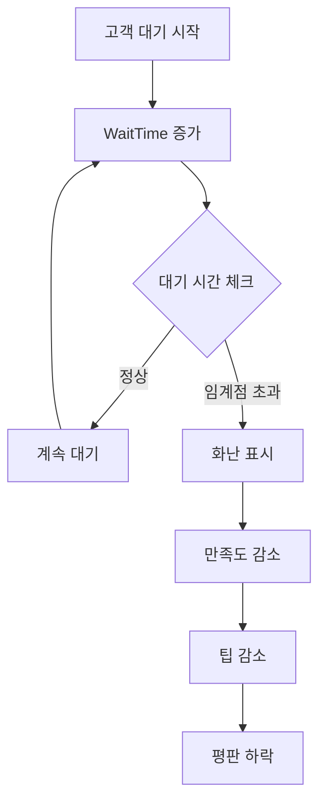

# 고객 입장과 주문 시스템

## 시스템 개요

츄츄버거 고객 시스템은 AI 기반의 상태 머신으로 동작하며, 고객의 입장부터 주문, 계산, 퇴장까지의 전체 과정을 자연스럽게 관리합니다. 각 고객은 개별적인 선호도를 가지고 있으며, 가게의 매력도와 메뉴 구성에 따라 행동 패턴이 결정됩니다.

## 고객 행동 상태 머신

### 상태 다이어그램

### 상태별 세부 동작

#### 1. BEFOREENTER (입장 전)
- **목적**: 고객이 가게에 입장할 수 있는 조건을 확인
- **주요 처리**:
  - 가게 매력도 기반 입장 가능 여부 확인
  - 대기석 가용성 체크
  - 주문하려는 메뉴 존재 여부 확인
- **결과**: 조건 만족 시 ENTER로, 불만족 시 DESTROY로 전환

#### 2. ENTER (입장)
- **목적**: 고객을 입구에서 대기석으로 이동시킴
- **주요 처리**:
  - 입구 위치에서 대기석으로 경로 이동
  - 렌더링 레이어 순서 조정 (대기 순서 반영)
  - 선호도 UI 표시 후 자동 숨김
- **결과**: 대기석 도착 시 ORDER로 전환

#### 3. ORDER (주문)
- **목적**: 고객의 주문을 처리하고 주문 UI를 표시
- **주요 처리**:
  - 주문 메뉴 검증 및 데이터 확인
  - 주문 UI 생성 (주문 개수 및 메뉴 태그 표시)
  - 대기 시간 증가 및 만족도 관리
- **결과**: 주문 완료 시 CHECKOUT으로 전환

#### 4. CHECKOUT (계산)
- **목적**: 결제를 처리하고 팁을 계산
- **주요 처리**:
  - 버거 재고 확인 및 차감
  - 매출 및 팁 계산
  - 고객 만족도에 따른 보상 처리
- **결과**: 결제 완료 시 EXIT로 전환

#### 5. EXIT (퇴장)
- **목적**: 고객을 가게에서 퇴장시킴
- **주요 처리**:
  - 퇴장 위치로 이동
  - 대기석 해제
  - 관련 UI 정리
- **결과**: 퇴장 완료 시 DESTROY로 전환

## 고객 외관 관리 시스템

### CustomerAvatarData 구조
고객의 외관은 여러 파츠로 구성되어 체계적으로 관리됩니다:

- **Body**: 몸 아바타 RUID
- **Face**: 얼굴 아바타 RUID  
- **Hair**: 헤어 아바타 RUID
- **Longcoat**: 롱코트 아바타 RUID
- **Shoes**: 신발 아바타 RUID
- **Cap**: 모자 아바타 RUID

### CustomerAvatarService 기능

#### 스테이지별 외관 관리

#### 주요 특징
- **스테이지 기반**: 각 스테이지마다 30개(PC) 또는 10개(모바일)의 고유 아바타
- **동적 로딩**: 필요한 아바타 리소스만 선별적으로 프리로드
- **감정 표현**: Smile, Cheers, Glitter, Chu, Love, Shine 등 다양한 감정 애니메이션

## 고객 선호도 시스템

### 선호도 처리 메커니즘
고객은 개별적인 선호 태그를 가지고 있으며, 이는 주문 결정과 만족도에 영향을 미칩니다:

1. **선호 태그**: 각 고객은 특정 메뉴 태그를 선호
2. **메뉴 매칭**: 가게에서 판매하는 메뉴 중 선호도에 맞는 항목 검색
3. **만족도 계산**: 선호도 일치 여부에 따른 만족도 및 팁 조정

### 피드백 시스템
- **만족**: 선호도에 맞는 메뉴 제공 시
- **불만족**: 선호 메뉴 부재, 긴 대기시간, 매력도 부족 등

## 대기 시간 및 만족도 관리

### 대기 시간 시스템

### 만족도 영향 요소
- **서빙 시간**: 빠른 서비스 → 높은 만족도
- **메뉴 일치**: 선호 메뉴 제공 → 보너스 만족도
- **가게 환경**: 높은 매력도 → 기본 만족도 상승

## 팁 지급 시스템

### 팁 계산 공식
팁은 여러 요소를 종합적으로 고려하여 계산됩니다:

1. **기본 팁**: 메뉴 가격 대비 일정 비율
2. **만족도 보정**: 고객 만족도에 따른 가감
3. **서빙 시간 보정**: 빠른 서빙 시 보너스
4. **선호도 보정**: 선호 메뉴 제공 시 추가 보너스

### 특별 상황 처리
- **VIP 고객**: 높은 기본 팁률
- **단골 고객**: 충성도에 따른 보너스
- **이벤트 기간**: 특별 이벤트 시 팁 증가

## 성능 최적화

### 리소스 관리
- **아바타 프리로드**: 스테이지 진입 시 필요한 아바타만 선별 로딩
- **리소스 캐시**: 사용된 아바타 리소스 캐싱으로 재사용 효율성 증대
- **모바일 최적화**: 플랫폼에 따른 아바타 개수 조정

### 상태 머신 최적화
- **타이머 기반**: 일정 주기로 상태 체크 (불필요한 업데이트 방지)
- **조건부 실행**: 시간 흐름 정지 시 상태 변경 중단
- **메모리 관리**: 고객 삭제 시 관련 리소스 완전 정리

## 코드 참조

### 핵심 고객 AI 시스템
- `RootDesk/MyDesk/05. Customer/CustomerAIScript.mlua :: StateManager()` — 상태 머신 메인 루프
- `RootDesk/MyDesk/05. Customer/CustomerAIScript.mlua :: Create()` — 고객 생성 및 초기화
- `RootDesk/MyDesk/05. Customer/CustomerAIScript.mlua :: BEFOREENTER()` — 입장 전 조건 검사
- `RootDesk/MyDesk/05. Customer/CustomerAIScript.mlua :: ORDER()` — 주문 처리 로직
- `RootDesk/MyDesk/05. Customer/CustomerAIScript.mlua :: CHECKOUT()` — 결제 및 팁 처리

### 외관 관리 시스템
- `RootDesk/MyDesk/05. Customer/CustomerAvatarService.mlua :: SetRandomCostume()` — 스테이지별 랜덤 코스튬 적용
- `RootDesk/MyDesk/05. Customer/CustomerAvatarService.mlua :: ResetCustomerAvatarResources()` — 아바타 리소스 관리
- `RootDesk/MyDesk/05. Customer/CustomerAvatarData.mlua :: Load()` — CSV 데이터에서 아바타 정보 로드

### UI 및 상호작용
- `RootDesk/MyDesk/05. Customer/CustomerService.mlua :: SetEmotion()` — 고객 감정 애니메이션
- `RootDesk/MyDesk/05. Customer/CustomerUIService.mlua :: CreateOrderUI()` — 주문 UI 생성
- `RootDesk/MyDesk/05. Customer/CustomerUIService.mlua :: UpdatePeedbackUI()` — 피드백 UI 업데이트

---

이 문서는 츄츄버거 고객 입장과 주문 시스템의 구조와 동작 원리를 설명합니다. 각 상태별 세부 로직과 외관 관리, 선호도 처리 등의 복합적인 시스템이 어떻게 연동되어 자연스러운 고객 경험을 만들어내는지 이해할 수 있습니다.
