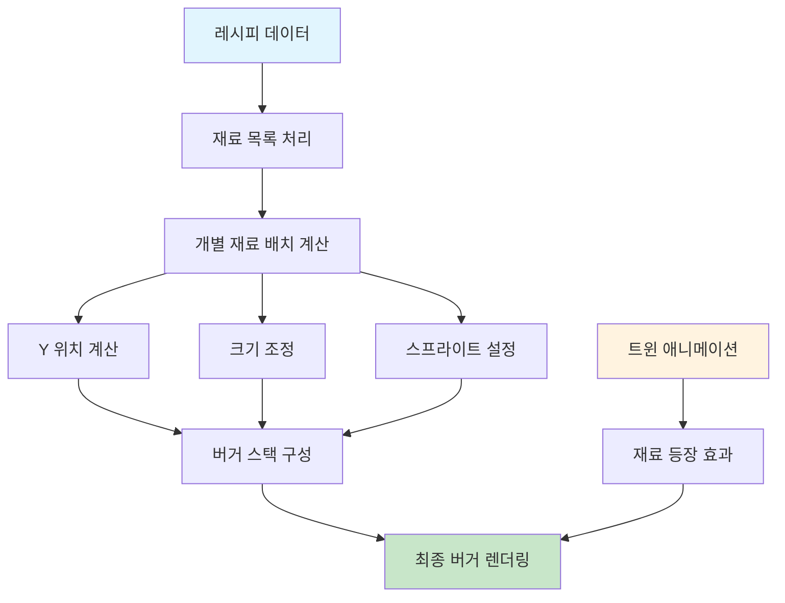
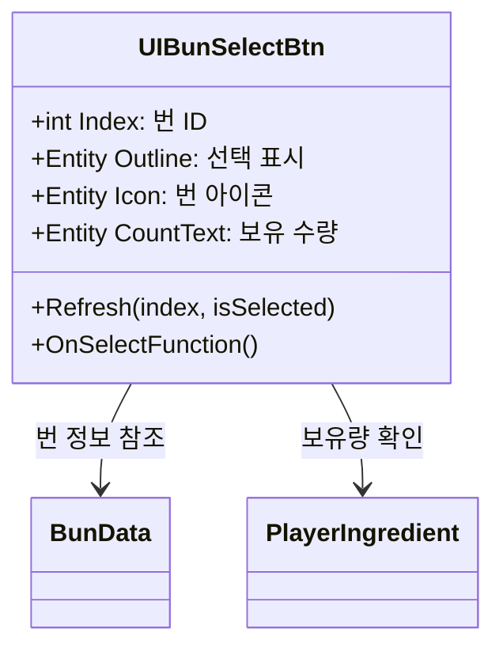
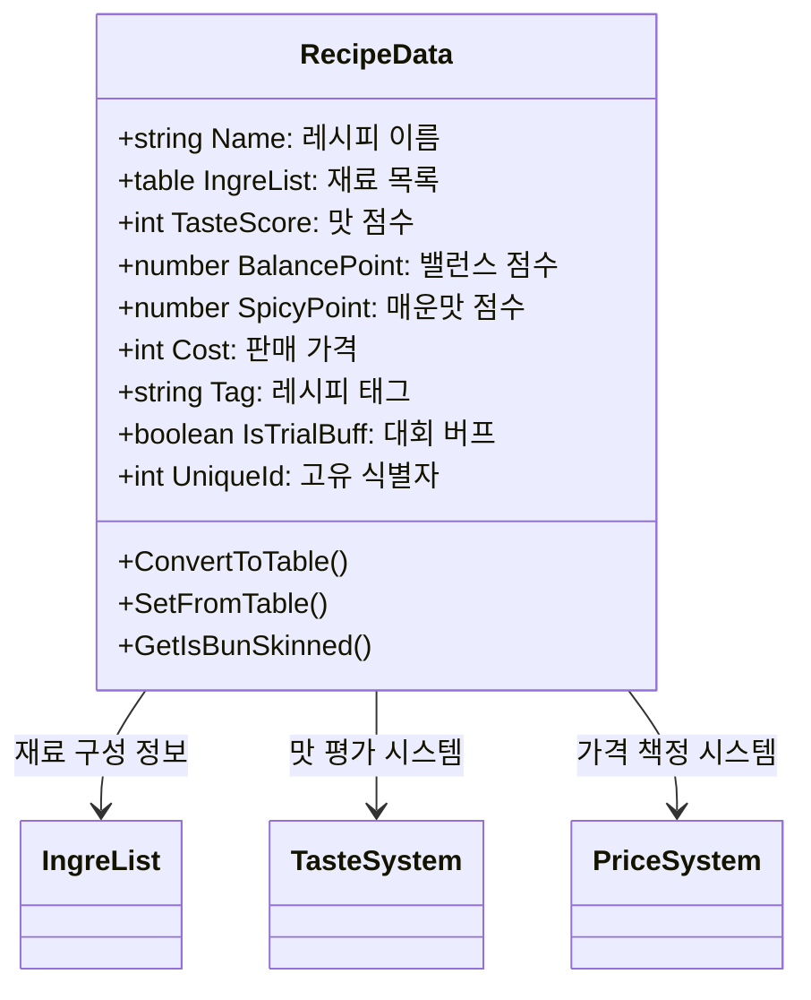
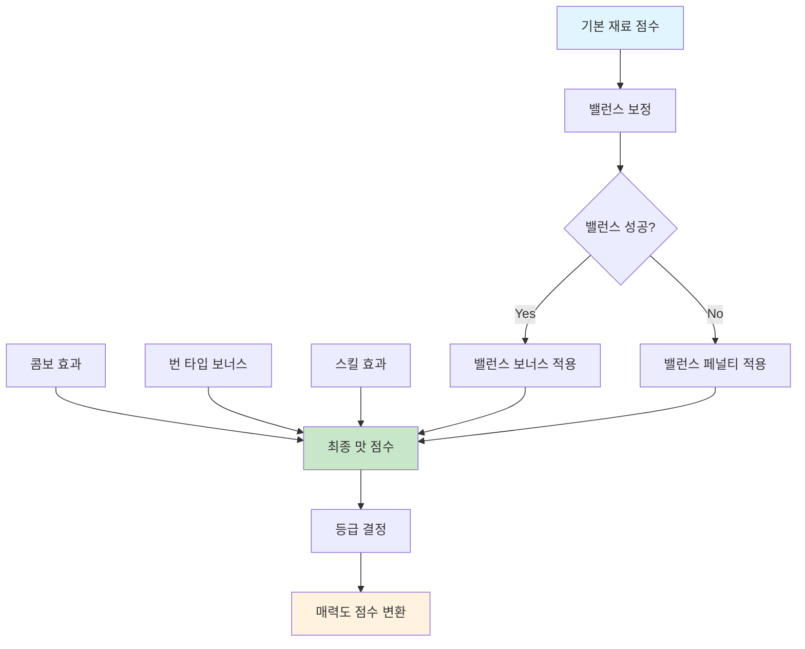
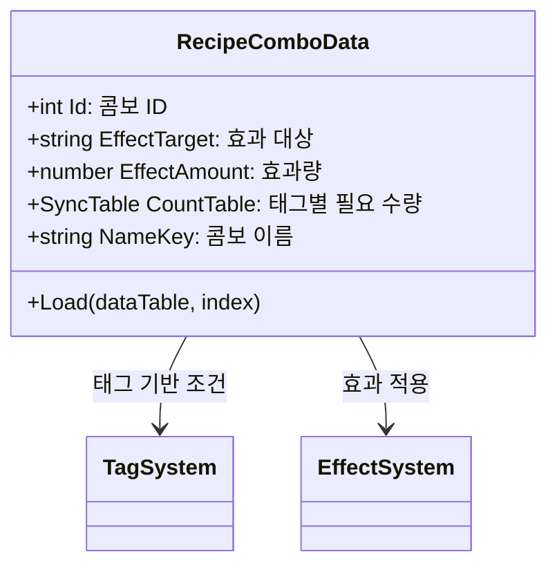
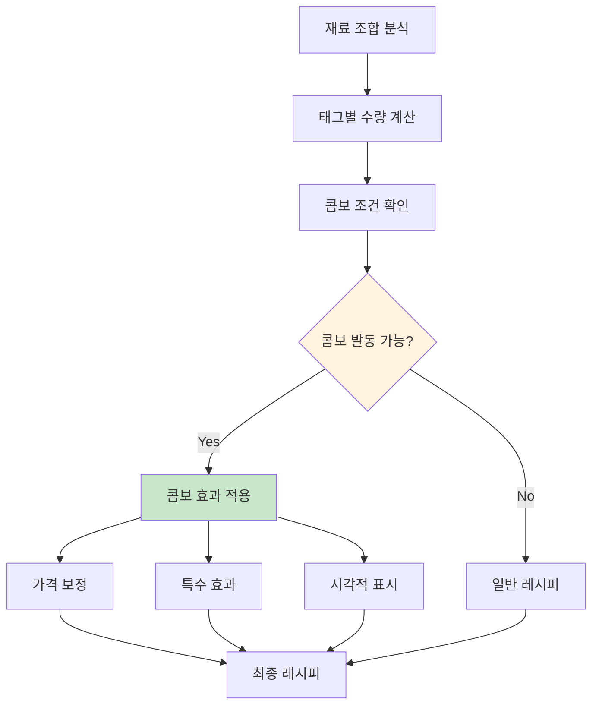
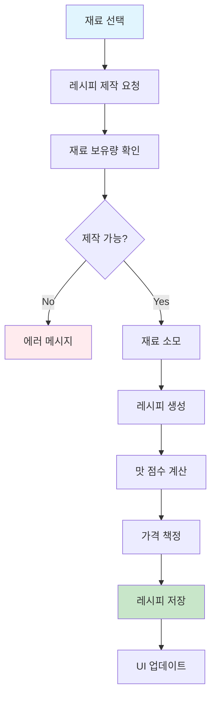
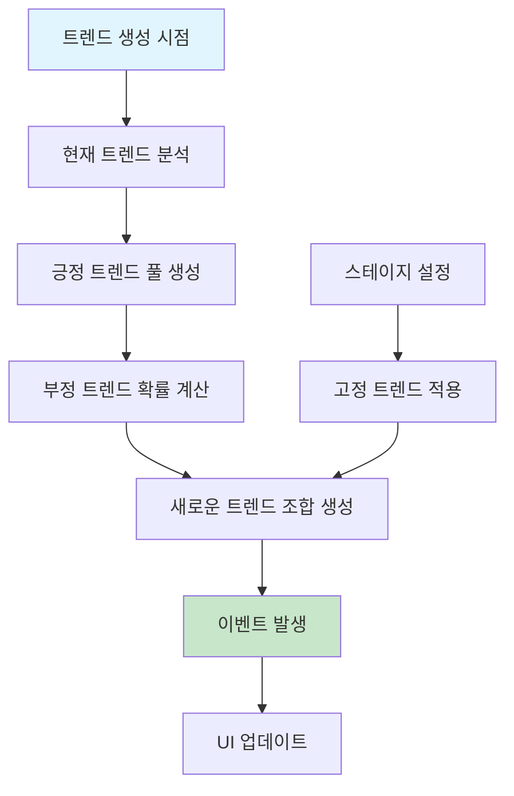

# 레시피 만들기 시스템

## 시스템 개요

츄츄버거 레시피 제작 시스템은 플레이어가 다양한 재료를 조합하여 독창적인 햄버거 레시피를 만들 수 있는 핵심 기능입니다. 재료 선택부터 버거 렌더링, 밸런스 조정, 맛 점수 계산까지 복합적인 시스템이 연동되어 깊이 있는 레시피 제작 경험을 제공합니다.

## 레시피 제작 UI 시스템

### DrawBurgerUIService - 버거 시각적 렌더링


#### 버거 렌더링 핵심 메커니즘
- **계층적 배치**: 재료들을 Y축 기준으로 순차 배치
- **동적 크기 조정**: 화면 크기에 따른 버거 크기 자동 조정
- **애니메이션 효과**: 재료 추가 시 자연스러운 등장 효과
- **실시간 미리보기**: 제작 과정 중 실시간 버거 모습 확인

### 재료 선택 시스템

#### UIBunSelectBtn - 번 선택 인터페이스


#### 번 선택 특징
- **등급별 표시**: 번의 등급에 따른 배경 색상 구분
- **보유량 표시**: 현재 보유 수량 실시간 업데이트
- **무한 재료**: 기본 재료의 경우 무한(∞) 표시
- **부족 상태**: 보유량 0일 때 빨간색으로 경고 표시

#### UIIngreCard - 재료 선택 인터페이스
재료 카드를 통한 직관적인 재료 선택 시스템:

- **카드 형태**: 각 재료를 카드 형태로 시각화
- **등급 표시**: 재료 등급에 따른 시각적 구분
- **효과 정보**: 재료가 버거에 미치는 효과 표시
- **수량 관리**: 사용 가능한 재료 수량 확인

## RecipeData 구조체 시스템

### 핵심 데이터 구조


### 재료 구성 시스템
레시피는 다양한 재료의 조합으로 구성됩니다:

- **번 (Bun)**: 상단, 하단 번과 번 스킨
- **재료 (Ingredient)**: 고기, 야채, 소스 등 다양한 재료
- **계층 구조**: 재료 배치 순서에 따른 버거 모양 결정
- **시각적 표현**: 각 재료의 RUID를 통한 스프라이트 렌더링

## 밸런스 및 맛 점수 시스템

### 맛 점수 계산 메커니즘


#### TasteGradeDataSetLogic - 맛 등급 관리
`TasteGradeDataSetLogic.ReturnGradeDataByScore(number score)`  
→ 점수를 기반으로 레시피 등급을 결정하는 핵심 시스템

- **등급 순회**: TasteGradeData 배열을 순회하며 점수에 맞는 등급 찾기
- **임계값 비교**: `gradeData.GradeValue > score` 조건으로 등급 결정

<details>
<summary>관련 코드</summary>

```lua
-- TasteGradeDataSetLogic.mlua
method TasteGradeData ReturnGradeDataByScore(number score)
    local gradeIndex = 0
    for i = 1, #self.TasteGradeData do
        if gradeData.GradeValue > score then break end
        gradeIndex = i
    end
    return self.TasteGradeData[gradeIndex]
end
```
</details>

### 밸런스 포인트 시스템
각 재료는 밸런스 포인트를 가지며, 전체 밸런스의 균형이 맞을 때 보너스를 획득:

- **밸런스 성공**: 설정 범위 내 밸런스 달성 시 보너스
- **밸런스 실패**: 범위 초과 시 페널티 적용
- **전략 효과**: 사이드메뉴 전략에 따른 보너스 조정
- **스킬 연동**: 직원 스킬에 따른 밸런스 계산 보정

### 매운맛 포인트 시스템
매운 재료 사용에 따른 특별 효과:

- **매운맛 누적**: 매운 재료 사용 시 포인트 증가
- **고객 선호도**: 매운맛을 선호하는 고객층 공략
- **특수 효과**: 매운맛 레벨에 따른 추가 보너스
- **위험 요소**: 과도한 매운맛으로 인한 고객 이탈 가능성

## 콤보 시스템

### RecipeComboData - 콤보 효과 관리


#### 콤보 발동 조건
콤보는 특정 태그의 재료를 일정 수량 이상 사용할 때 발동:

- **태그 분류**: Meat, Chicken, Seafood, Veggie, Spicy
- **수량 요구**: 각 태그별 최소 필요 수량
- **효과 적용**: 가격 증가, 매력도 보너스 등
- **시각적 피드백**: 콤보 발동 시 특별한 UI 효과

### 콤보 효과 시스템


## PlayerRecipe 관리 시스템

### 레시피 제작 프로세스


#### 제작 조건 검증
`PlayerRecipe.CheckCanStartRecipeMaking(table cards)`  
→ 레시피 제작 가능 여부를 종합적으로 검증합니다.

- **재료 수량 검증**: PlayerIngredient 컴포넌트를 통해 각 재료 보유량 확인  
- **공간 확인**: `recipeCount >= recipeMaxCount` 조건으로 레시피 박스 여유 공간 체크

<details>
<summary>관련 코드</summary>

```lua
-- PlayerRecipe.mlua
method void CheckCanStartRecipeMaking(table cards)
    -- 재료 수량 확인
    for k, v in pairs(countTable) do
        local error = self.Entity.PlayerIngredient:CanUseIngredientCard(k, v)
        if error ~= 0 then break end
    end
    
    -- 레시피 박스 공간 확인
    if recipeCount >= recipeMaxCount then
        canStart = 4  -- 공간 부족
    end
end
```
</details>

### 자동 메뉴 설정 시스템
`PlayerRecipe.AutoSetRecipe()`  
→ 보유 레시피 중 최적 조합을 자동 선택하여 메뉴 슬롯에 배치

- **가격 우선 정렬**: `a.Cost > b.Cost` 조건으로 높은 가격 레시피 우선 배치
- **슬롯 제한**: recipeSlotLimit만큼 레시피 자동 설정

<details>
<summary>관련 코드</summary>

```lua
-- PlayerRecipe.mlua
method void AutoSetRecipe()
    table.sort(canSetRecipes, function(a, b)
        return a.Cost > b.Cost  -- 높은 가격 우선
    end)
    
    for i = 1, recipeSlotLimit do
        self:SetRecipe(i, playerRecipeIndex)
    end
end
```
</details>

## 트렌드 시스템

### MakeNewTrend - 동적 트렌드 생성


#### 트렌드 종류와 효과
- **긍정 트렌드**: 특정 태그 레시피의 가격 증가
- **부정 트렌드**: 특정 태그 레시피의 수요 감소  
- **조합 효과**: 긍정/부정 트렌드의 복합적 영향
- **지속 기간**: 설정된 기간 동안 트렌드 유지

### 연간 계획 시스템
트렌드 발생을 미리 계획하여 예측 가능한 시장 변화:

- **YearlyPlan**: 연간 트렌드 발생 스케줄
- **계절성 반영**: 특정 시기의 트렌드 패턴
- **전략적 대응**: 플레이어의 사전 준비 유도
- **이벤트 연동**: 특별 이벤트와 트렌드 연계

## 리롤 및 최적화 시스템

### 레시피 리롤 기능
만족스럽지 않은 레시피를 다시 제작할 수 있는 시스템:

- **비용 시스템**: 리롤 횟수에 따른 비용 증가
- **재료 보존**: 기존 사용 재료 유지하며 결과만 재계산
- **확률 요소**: 리롤 시 다른 결과 획득 가능
- **제한 사항**: 무제한 리롤 방지를 위한 비용 증가

### 직원 스킬 연동
요리 직원의 스킬이 레시피 제작에 미치는 영향:

- **맛 점수 보너스**: 요리 스킬에 따른 점수 향상
- **밸런스 보정**: 숙련된 직원의 밸런스 조정 능력
- **특수 효과**: 고급 스킬의 특별한 레시피 효과
- **성공률 향상**: 스킬 레벨에 따른 실패 확률 감소

## 성능 최적화 및 사용자 경험

### UI 최적화
- **오브젝트 풀링**: 재료 UI 엔티티 재사용으로 성능 향상
- **동적 로딩**: 필요한 리소스만 선택적 로드
- **애니메이션 최적화**: 60fps 유지를 위한 트윈 최적화
- **메모리 관리**: 사용하지 않는 UI 엔티티 자동 해제

### 사용자 경험 개선
- **직관적 조작**: 드래그 앤 드롭 방식의 재료 선택
- **실시간 피드백**: 재료 선택 시 즉시 결과 미리보기
- **가이드 시스템**: 초보자를 위한 레시피 제작 가이드
- **자동 저장**: 제작 과정 중 의도치 않은 데이터 손실 방지

## 코드 참조

### 버거 렌더링 시스템
- `RootDesk/MyDesk/04. Recipe/DrawBurgerUIService.mlua :: DrawBurgerUI()` — 버거 시각적 렌더링
- `RootDesk/MyDesk/04. Recipe/DrawBurgerUIService.mlua :: TweenIngredientUI()` — 재료 추가 애니메이션
- `RootDesk/MyDesk/04. Recipe/DrawBurgerUIService.mlua :: ReturnIngreData()` — 재료 배치 계산

### 레시피 데이터 시스템
- `RootDesk/MyDesk/04. Recipe/Data/RecipeData.mlua :: ConvertToTable()` — 레시피 데이터 직렬화
- `RootDesk/MyDesk/04. Recipe/Data/RecipeData.mlua :: SetFromTable()` — 데이터 역직렬화
- `RootDesk/MyDesk/04. Recipe/Data/RecipeData.mlua :: GetIsBunSkinned()` — 번 스킨 적용 확인

### 플레이어 레시피 관리
- `RootDesk/MyDesk/00. Player/PlayerRecipe.mlua :: CheckCanStartRecipeMaking()` — 제작 가능성 검증
- `RootDesk/MyDesk/00. Player/PlayerRecipe.mlua :: AutoSetRecipe()` — 자동 메뉴 설정
- `RootDesk/MyDesk/00. Player/PlayerRecipe.mlua :: MakeNewTrend()` — 트렌드 생성

### 맛 점수 및 콤보 시스템
- `RootDesk/MyDesk/04. Recipe/Data/TasteGradeDataSetLogic.mlua :: ReturnGradeDataByScore()` — 맛 등급 계산
- `RootDesk/MyDesk/04. Recipe/Data/TasteGradeDataSetLogic.mlua :: GetFinalComboBonus()` — 콤보 보너스 계산
- `RootDesk/MyDesk/04. Recipe/Data/RecipeComboData.mlua :: Load()` — 콤보 데이터 로드

### UI 인터페이스
- `RootDesk/MyDesk/04. Recipe/UIScript/IngreCardSetting/UIBunSelectBtn.mlua :: Refresh()` — 번 선택 UI 갱신
- `RootDesk/MyDesk/04. Recipe/UIScript/IngreCardSetting/UIIngreCard.mlua` — 재료 카드 UI 관리

### 트렌드 시스템
- `RootDesk/MyDesk/04. Recipe/Data/RecipeDataSetLogic.mlua :: IsRecipeTrend()` — 레시피 트렌드 확인
- `RootDesk/MyDesk/04. Recipe/Data/RecipeDataSetLogic.mlua :: GetTrendData()` — 트렌드 데이터 조회

---

이 문서는 츄츄버거 레시피 제작 시스템의 모든 측면을 상세히 다룹니다. 재료 선택부터 최종 레시피 완성까지의 전 과정이 어떻게 구현되어 있고, 각 시스템이 서로 어떻게 연동되어 깊이 있는 게임플레이를 만들어내는지 이해할 수 있습니다.
