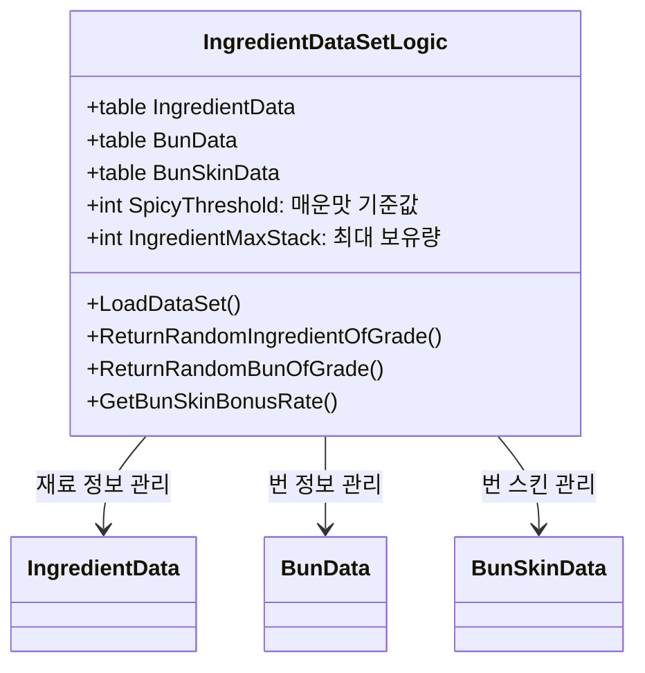
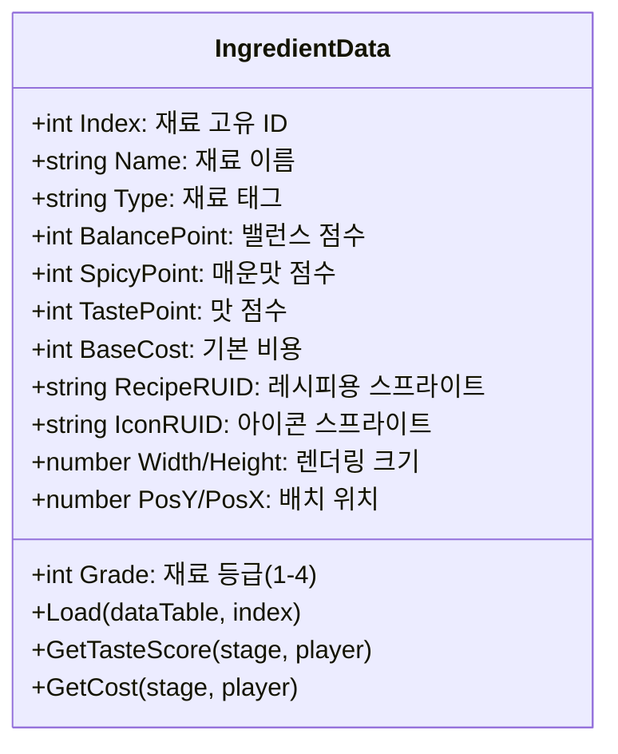
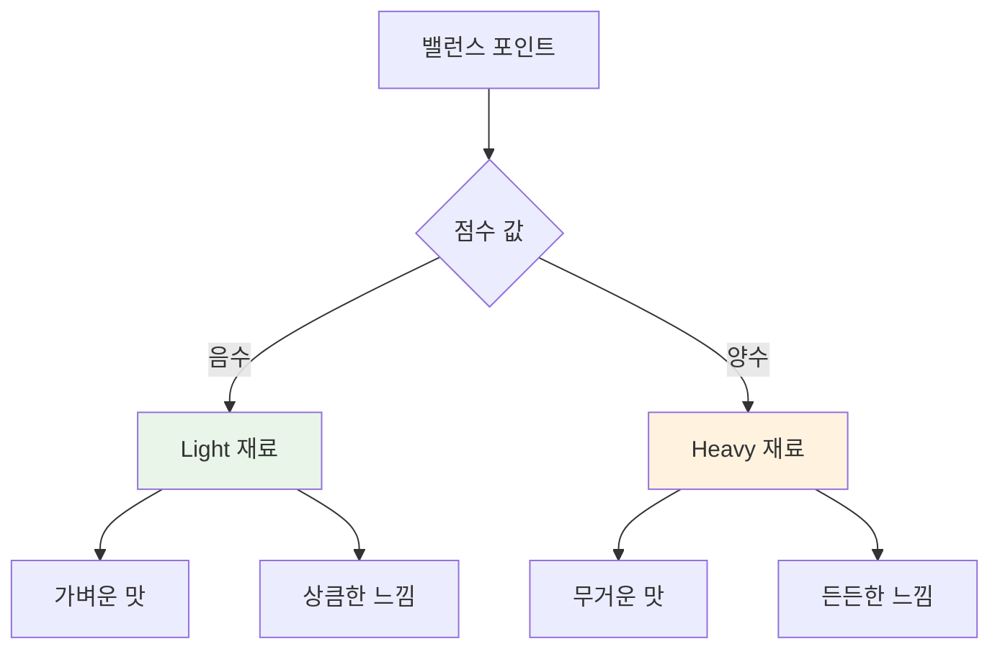
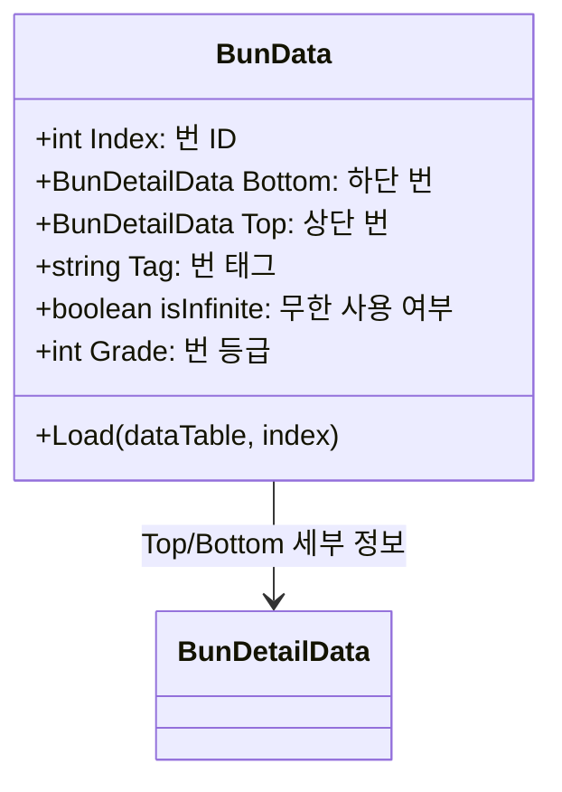
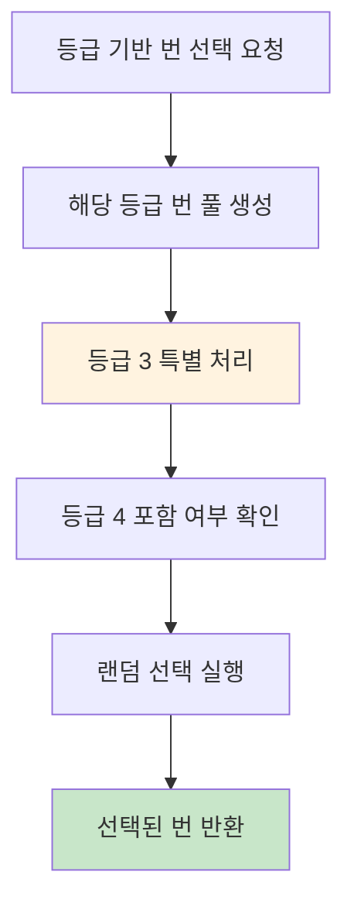
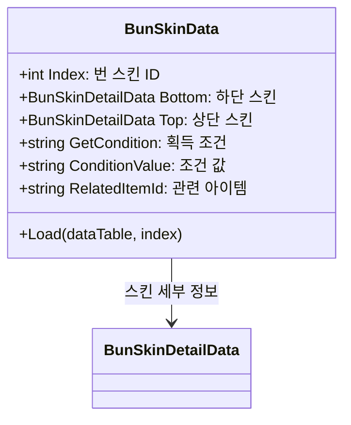
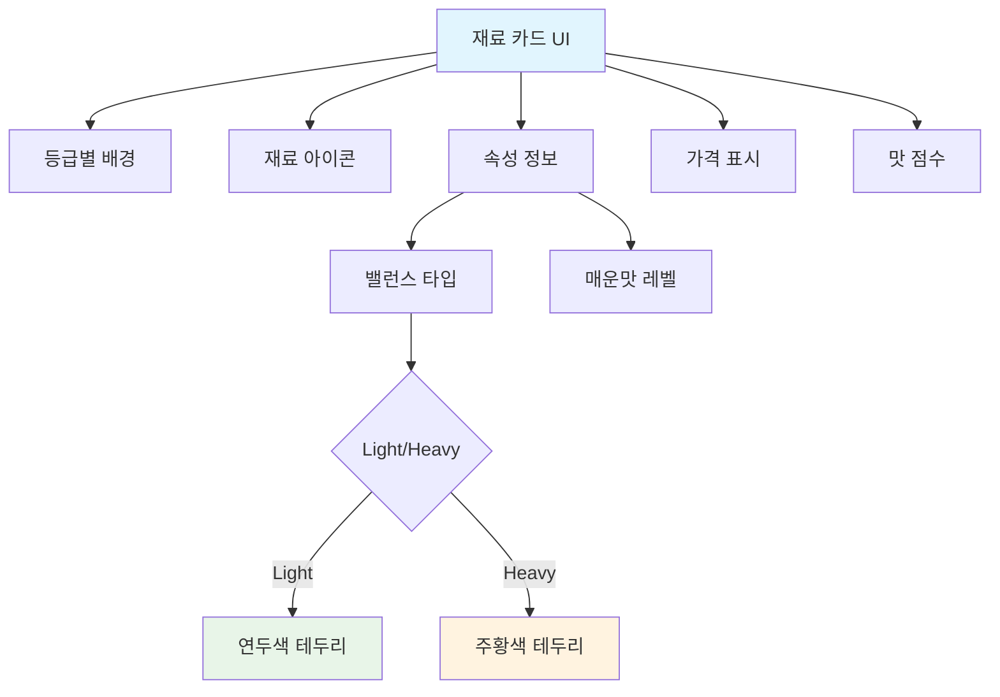
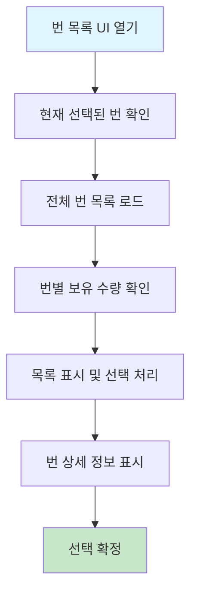
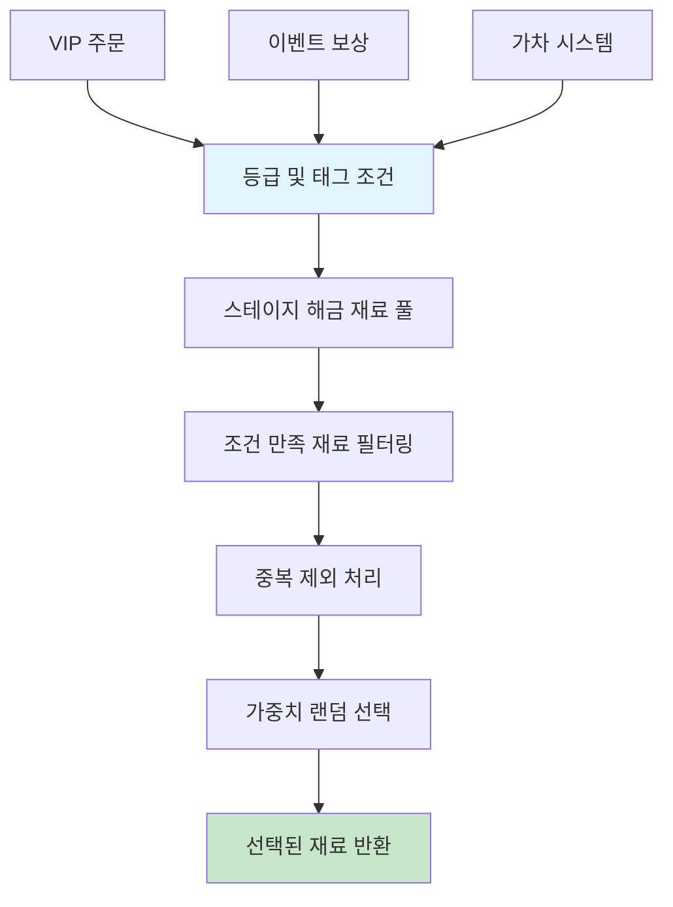
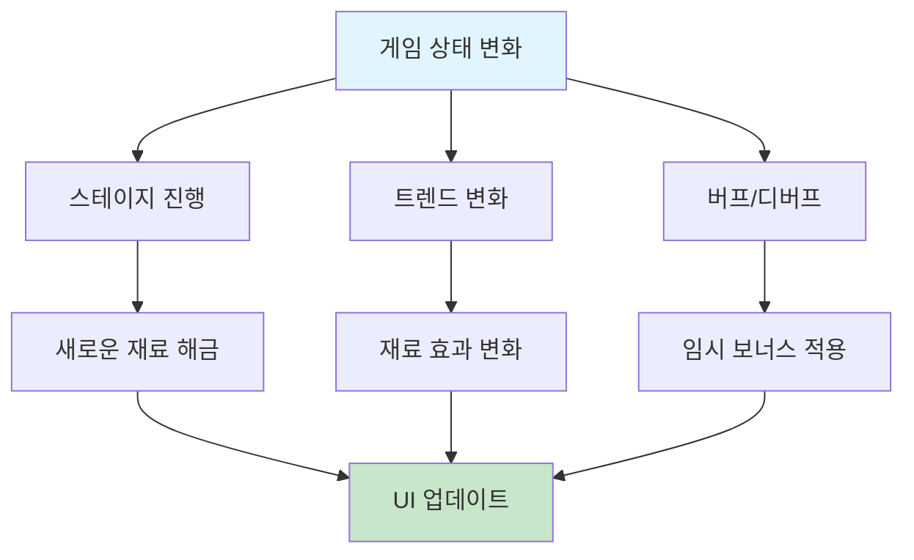

# 재료와 번 관리 시스템

## 시스템 개요

츄츄버거 재료와 번 관리 시스템은 레시피 제작의 핵심 기반이 되는 시스템입니다. 다양한 등급의 재료와 번, 그리고 특별한 번 스킨을 통해 플레이어가 창의적이고 전략적인 레시피를 만들 수 있도록 지원합니다. `IngredientDataSetLogic`을 중심으로 모든 재료 데이터가 체계적으로 관리됩니다.

## IngredientDataSetLogic - 재료 시스템 총괄

### 핵심 데이터 구조


### 데이터 초기화 프로세스
`IngredientDataSetLogic.LoadDataSet()`  
→ CSV 데이터를 로드하여 구조화된 데이터로 변환하는 초기화 과정

- **재료 데이터 로드**: `ingreData:Load(ingreDataSet, i)`로 각 재료 객체 생성
- **번 데이터 로드**: Top/Bottom 타입별로 분리하여 저장

<details>
<summary>관련 코드</summary>

```lua
-- IngredientDataSetLogic.mlua
-- 재료 데이터 로드
for i = 1, ingreDataSet:GetRowCount() do
    local ingreData = IngredientData()
    ingreData:Load(ingreDataSet, i)
    self.IngredientData[ingreData.Index] = ingreData
end

-- 번 데이터 로드 (Top/Bottom 분리 처리)
for i = 1, bunDataSet:GetRowCount() do
    local type = bunDataSet:GetRow(i):GetItem("Type")
    bunDatas[index][type] = bunDataSet:GetRow(i)
end
```
</details>

## IngredientData 구조체 시스템

### 재료 속성 체계


#### 재료 등급 시스템
재료는 4단계 등급으로 분류되어 품질과 효과가 결정됩니다:

- **1등급 (일반)**: 기본 재료, 낮은 효과
- **2등급 (고급)**: 향상된 맛과 밸런스
- **3등급 (희귀)**: 높은 효과, 특별한 속성
- **4등급 (전설)**: 최고 등급, 극대화된 효과

#### 재료 속성 시스템
각 재료는 다음과 같은 주요 속성을 가집니다:

**밸런스 포인트 (BalancePoint)**


**매운맛 포인트 (SpicyPoint)**
- **0**: 일반 재료
- **1-15**: 약간 매운 재료
- **16+**: 매우 매운 재료 (SpicyThreshold 기준)

**맛 점수 (TastePoint)**
- 레시피 전체 맛 점수에 기여하는 기본 점수
- 스테이지와 플레이어 상태에 따른 동적 조정

### 재료 태그 시스템
재료는 태그를 통해 분류되어 콤보와 트렌드에 활용됩니다:

- **Meat**: 고기류 재료
- **Chicken**: 치킨류 재료  
- **Seafood**: 해산물류 재료
- **Veggie**: 채소류 재료
- **Spicy**: 매운 재료 (매운맛 포인트 기준)

## BunData 및 번 관리 시스템

### 번 구조체 설계


#### 번 세부 데이터 (BunDetailData)
`BunData.Load(dataTable, index)`  
→ 상단과 하단 번을 별도로 로드하여 시각적 완성도를 높이는 구조

- **하단 번**: `bottomData:Load(dataTable["Bottom"])`로 Bottom 데이터 로드
- **상단 번**: `topData:Load(dataTable["Top"])`로 Top 데이터 로드

<details>
<summary>관련 코드</summary>

```lua
-- BunData.mlua
local bottomData = BunDetailData()
bottomData:Load(dataTable["Bottom"], index)
self.Bottom = bottomData

local topData = BunDetailData()
topData:Load(dataTable["Top"], index) 
self.Top = topData
```
</details>

#### 기본 번 시스템
- **Index 1**: 무한 사용 가능한 기본 번 (isInfinite = true)
- **고급 번**: 유한한 수량, 특별한 효과 제공
- **등급별 분류**: 번도 재료와 같은 등급 체계 적용

### 등급별 랜덤 선택 시스템


`IngredientDataSetLogic.ReturnRandomBunOfGrade(integer grade)`  
→ 등급별 번 선택을 위한 동적 풀 생성 시스템

- **등급 보정**: `grade == 3 and 4 or 0`로 등급 3 요청 시 등급 4도 포함
- **풀 생성**: 조건에 맞는 번들만 gradePool에 추가

<details>
<summary>관련 코드</summary>

```lua
-- IngredientDataSetLogic.mlua
method integer ReturnRandomBunOfGrade(integer grade)
    local gradePool = {}
    local correctedGrade = grade == 3 and 4 or 0  -- 등급 3 요청 시 등급 4도 포함
    
    for k, v in pairs(self.BunData) do
        if data.Grade == grade or data.Grade == correctedGrade then
            table.insert(gradePool, k)
        end
    end
    
    local randomIndex = _UtilLogic:RandomIntegerRange(1, #gradePool)
    return randomIndex
end
```
</details>

## BunSkinData - 번 스킨 시스템

### 번 스킨 구조체


### 획득 조건 시스템
번 스킨은 다양한 조건을 만족했을 때 획득 가능합니다:

- **GetCondition**: 획득 조건 타입
  - Achievement: 업적 달성
  - Stage: 스테이지 클리어
  - Collection: 컬렉션 완성
  - Purchase: 구매
- **ConditionValue**: 구체적인 조건 값
- **RelatedItemId**: 관련 아이템 또는 재화

### 컬렉션 보너스 시스템
`IngredientDataSetLogic.GetBunSkinBonusRate(Entity player)`  
→ 번 스킨 수집에 따른 게임 전반의 보너스 효과 계산

- **수집 개수 계산**: PlayerCollection.BunSkinCollection에서 수집 상태 확인
- **보너스 계산**: `count * bonus`로 수집 개수에 비례한 보너스 적용

<details>
<summary>관련 코드</summary>

```lua
-- IngredientDataSetLogic.mlua
method number GetBunSkinBonusRate(Entity player)
    local count = 0
    for i, data in pairs(self.BunSkinData) do
        if player.PlayerCollection.BunSkinCollection[i] == true then
            count += 1
        end
    end
    
    local bonus = _GetConfigDataLogic:GetConfigNumDataByKey("BunSkinCollectBonusAmountPerCount")
    return count * bonus  -- 수집한 스킨 개수 × 개당 보너스
end
```
</details>

## 재료 선택 UI 시스템

### UIIngreCard - 재료 카드 인터페이스


#### 재료 카드 시각적 표현
`UIIngreCard.Refresh()`  
→ 재료 속성에 따른 동적 UI 변화 처리

- **Light 재료**: `balancePoint < 0`일 때 연두색 카드 표시
- **Heavy 재료**: `balancePoint >= 0`일 때 주황색 카드 표시

<details>
<summary>관련 코드</summary>

```lua
-- UIIngreCard.mlua
-- 밸런스 포인트에 따른 UI 변화
if balancePoint < 0 then
    -- Light 재료: 연두색 카드
    self.IngreCardBtn.SpriteGUIRendererComponent.ImageRUID = "429ea5587d4046bfbfda7311954a743f"
    self.NameText.OutlineColor = _ColorCodeEnum:GetColor("#5f6f16")
    type = "light"
else
    -- Heavy 재료: 주황색 카드
    self.IngreCardBtn.SpriteGUIRendererComponent.ImageRUID = "226068cf32474d35b343bda0202df635"
    self.NameText.OutlineColor = _ColorCodeEnum:GetColor("#a17407")
    type = "heavy"
end
```
</details>

#### 동적 정보 표시
- **버프 상태**: 트렌드나 이벤트 버프 적용 시 황금색으로 표시
- **매운맛 정보**: 매운 재료의 경우 "+매운맛수치" 표시
- **실시간 가격**: 스테이지와 보너스를 반영한 실시간 가격
- **맛 점수**: 현재 상황에서의 실제 맛 점수

### UIBunList - 번 선택 인터페이스
번 선택을 위한 전용 UI 시스템:



#### 번 선택 기능
- **보유량 표시**: 각 번의 현재 보유 수량 실시간 표시
- **무한 표시**: 기본 번의 경우 "∞" 마크 표시
- **부족 경고**: 보유량 0인 번은 빨간색으로 표시
- **선택 피드백**: 현재 선택된 번에 아웃라인 표시

### UIIngreCardSetting - 재료 설정 관리
전체적인 재료 선택 과정을 관리하는 상위 컴포넌트:

- **카드 조합 관리**: 선택된 재료 카드들의 조합 추적
- **밸런스 계산**: 실시간 밸런스 포인트 계산 및 표시
- **VIP 주문 연동**: 특별 주문에 맞는 재료 필터링
- **자동 설정**: AI 기반 최적 재료 조합 제안

## 고급 재료 관리 기능

### 태그 매칭 시스템
`IngredientDataSetLogic.ReturnIsTagMatch()`  
→ 특정 요구사항에 맞는 재료를 자동으로 필터링하는 시스템

- **스테이지 확인**: `IsStageUnlocked()`로 재료 해금 상태 확인
- **태그 매칭**: 요구 태그와 재료 태그 일치 여부 검증
- **매운맛 특별 처리**: `SpicyPoint > 0` 조건으로 매운맛 재료 식별

<details>
<summary>관련 코드</summary>

```lua
-- IngredientDataSetLogic.mlua
method boolean ReturnIsTagMatch(string requireTag, IngredientData ingreData, 
                                boolean includeEtc, boolean includeVeggie, Entity player)
    -- 스테이지별 재료 해금 상태 확인
    local stageUnlocked = self:IsStageUnlocked(ingreData.RelatedStage, player.PlayerStage.NowStage)
    
    -- 태그 일치 여부 확인
    if requireTag == _RecipeTagEnum.All or requireTag == _RecipeTagEnum.None then
        return stageUnlocked
    end
    
    -- 매운맛 특별 처리
    if requireTag == _RecipeTagEnum.Spicy then
        return (ingreData.SpicyPoint > 0) and stageUnlocked
    end
    
    return (ingreData.Type == requireTag) and stageUnlocked
end
```
</details>

### 등급별 랜덤 선택
게임 내 다양한 시스템에서 활용되는 스마트 재료 선택:



#### 활용 사례
- **VIP 주문**: 특정 등급과 태그의 재료 요구
- **이벤트 보상**: 균형 잡힌 재료 조합 제공
- **가차 시스템**: 확률 기반 재료 획득
- **자동 추천**: AI 기반 레시피 제안

### VIP 주문 연동 시스템
특별 주문에 대응하기 위한 재료 관리:

- **주문별 필터링**: VIP 고객의 요구사항에 맞는 재료만 표시
- **등급 제한**: 최소 등급 이상의 재료만 선택 가능
- **태그 강제**: 특정 태그 재료 필수 포함
- **보상 배율**: VIP 주문 완성 시 추가 보상

## 성능 최적화 및 데이터 관리

### 메모리 효율화
- **데이터 캐싱**: 자주 사용되는 재료 데이터 캐시
- **지연 로딩**: 필요한 시점에 상세 데이터 로드
- **리소스 공유**: 동일 등급 재료의 시각적 리소스 공유

### 동적 데이터 업데이트


### 사용자 경험 개선
- **직관적 시각화**: 재료 속성을 색상과 아이콘으로 표현
- **실시간 피드백**: 선택한 재료의 효과 즉시 확인
- **스마트 필터링**: 상황에 맞지 않는 재료 자동 숨김
- **추천 시스템**: 초보자를 위한 재료 조합 가이드

## 코드 참조

### 핵심 데이터 관리
- `RootDesk/MyDesk/04. Recipe/Data/IngredientDataSetLogic.mlua :: LoadDataSet()` — 재료/번/번스킨 데이터 로드
- `RootDesk/MyDesk/04. Recipe/Data/IngredientDataSetLogic.mlua :: ReturnRandomIngredientOfGrade()` — 등급별 랜덤 재료 선택
- `RootDesk/MyDesk/04. Recipe/Data/IngredientDataSetLogic.mlua :: ReturnRandomBunOfGrade()` — 등급별 랜덤 번 선택
- `RootDesk/MyDesk/04. Recipe/Data/IngredientDataSetLogic.mlua :: GetBunSkinBonusRate()` — 번스킨 컬렉션 보너스 계산

### 재료 데이터 구조체
- `RootDesk/MyDesk/04. Recipe/Data/IngredientData.mlua :: Load()` — 재료 데이터 로드
- `RootDesk/MyDesk/04. Recipe/Data/IngredientData.mlua :: GetTasteScore()` — 맛 점수 계산
- `RootDesk/MyDesk/04. Recipe/Data/IngredientData.mlua :: GetCost()` — 재료 비용 계산

### 번 시스템
- `RootDesk/MyDesk/04. Recipe/Data/BunData.mlua :: Load()` — 번 데이터 로드
- `RootDesk/MyDesk/04. Recipe/Data/BunSkinData.mlua :: Load()` — 번 스킨 데이터 로드
- `RootDesk/MyDesk/04. Recipe/Data/BunSkinDetailData.mlua` — 번 스킨 세부 정보

### UI 인터페이스
- `RootDesk/MyDesk/04. Recipe/UIScript/IngreCardSetting/UIIngreCard.mlua :: Refresh()` — 재료 카드 UI 갱신
- `RootDesk/MyDesk/04. Recipe/UIScript/IngreCardSetting/UIBunList.mlua :: RefreshList()` — 번 목록 갱신
- `RootDesk/MyDesk/04. Recipe/UIScript/IngreCardSetting/UIBunSelectBtn.mlua :: Refresh()` — 번 선택 버튼 갱신

### 태그 및 필터링 시스템
- `RootDesk/MyDesk/04. Recipe/Data/IngredientDataSetLogic.mlua :: ReturnIsTagMatch()` — 태그 매칭 확인
- `RootDesk/MyDesk/04. Recipe/Data/IngredientDataSetLogic.mlua :: ReturnIsTagExclusive()` — 태그 배타성 확인

---

이 문서는 츄츄버거 재료와 번 관리 시스템의 전체적인 구조와 동작 원리를 상세히 설명합니다. 다양한 등급의 재료와 번, 특별한 번 스킨 시스템이 어떻게 연동되어 풍부한 레시피 제작 경험을 제공하는지 이해할 수 있습니다.
