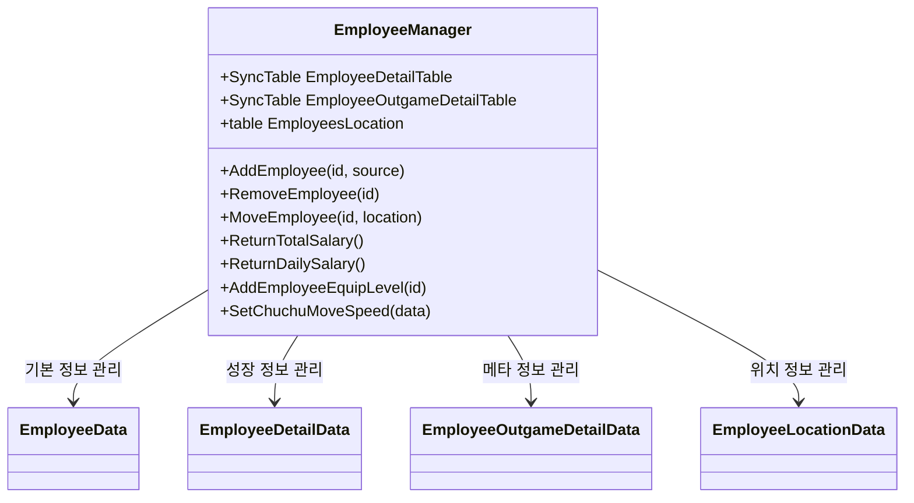
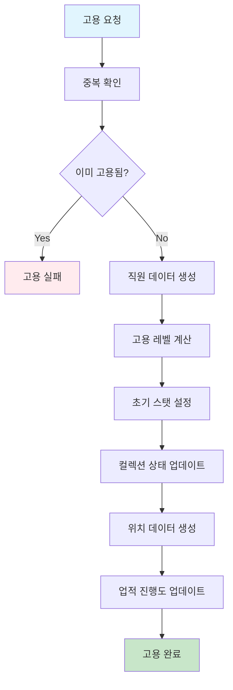
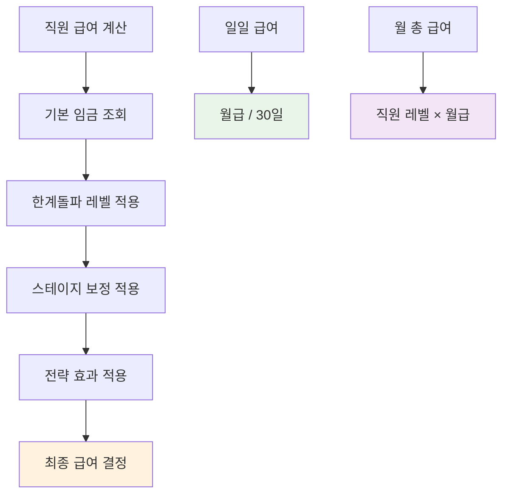
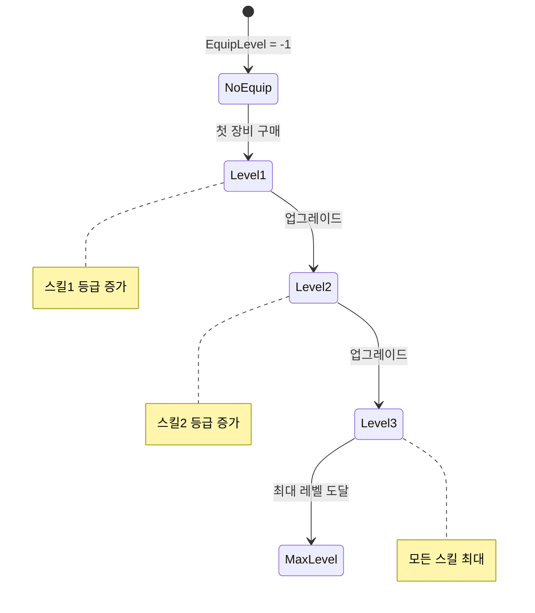
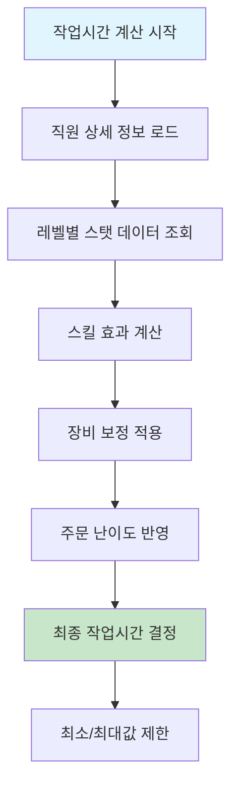
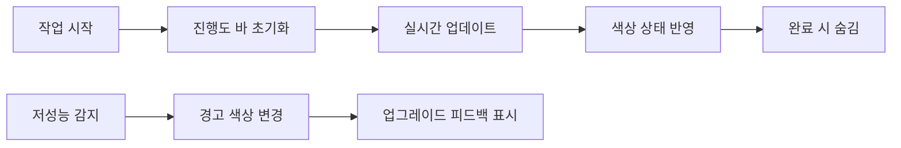
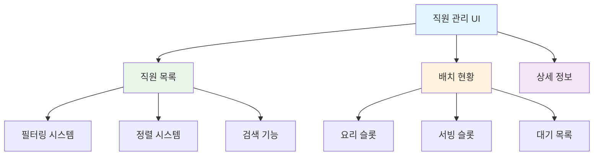
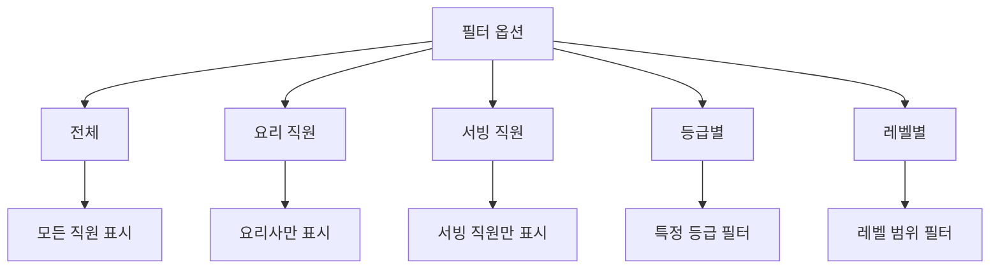
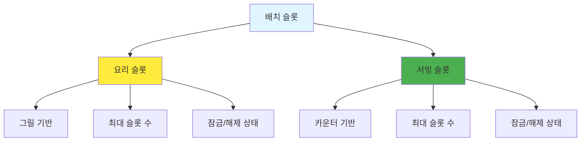
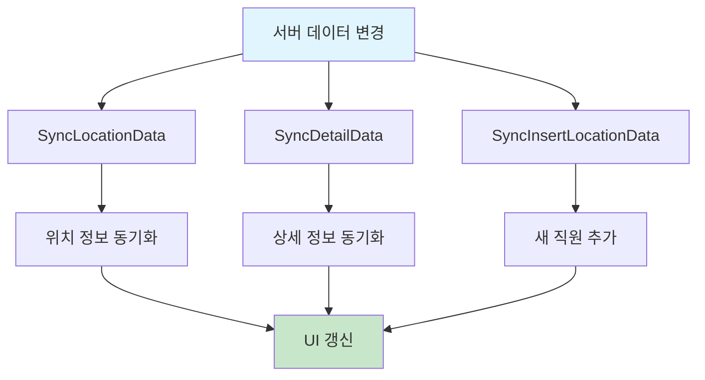

# 직원 관리와 배치 시스템

## 시스템 개요

츄츄버거 직원 관리와 배치 시스템은 `EmployeeManager` 컴포넌트를 중심으로 구성되어 있으며, 직원의 고용부터 배치, 성장, 급여 관리까지 모든 직원 관련 업무를 총괄합니다. 또한 직관적인 UI를 통해 플레이어가 쉽게 직원을 관리하고 배치할 수 있도록 지원합니다.

## EmployeeManager 핵심 기능

### 직원 시스템 총괄 관리


### 데이터 구조 관계
- **EmployeeDetailTable**: 레벨, 경험치, 한계돌파 정보
- **EmployeeOutgameDetailTable**: 장비, 스킬 등급, 컬렉션 상태
- **EmployeesLocation**: 직원의 현재 배치 위치 (대기, 요리, 서빙)

## 직원 생성 및 관리

### 직원 고용 시스템


#### 고용 프로세스 상세
**직원 고용 처리:**  
method AddEmployee(string id, table source)  
→ 중복 확인 후 직원 데이터를 생성하고 초기 스탯을 설정합니다.

- **레벨 계산**: 고용 레벨에 따른 초기 능력치 결정  
- **타입별 설정**: 요리/서빙 직원에 따른 차별화된 초기화

<details>
<summary>관련 코드</summary>

```lua
-- EmployeeManager.mlua :: AddEmployee()
detailData.EmploymentLevel = calculatedLevel
if data.Type == Cook then
    detailData.CookLevel = level
else
    detailData.ServingLevel = level
end
```
</details>

### 직원 해고 시스템
- **전근 처리**: UI를 통한 직원 해고
- **보상금 계산**: 한계돌파 레벨에 따른 보상금 환급
- **컬렉션 상태**: 해고 시에도 컬렉션 기록 유지
- **업적 업데이트**: 직원 수 관련 업적 자동 조정

## 급여 시스템

### 급여 계산 구조


### 급여 계산 공식
**급여 산정 과정:**  
method ReturnTotalSalary()  
→ 모든 직원의 월급을 계산하여 총합을 반환합니다.

- **기본 공식**: 월급 = 기본임금[한계돌파레벨] × (1 + 스테이지보정) × (1 - 급여절약전략)  
- **일급 변환**: 일급 = (직원레벨 × 월급) ÷ 30일

<details>
<summary>관련 코드</summary>

```lua
-- EmployeeManager.mlua :: ReturnTotalSalary()
method number ReturnTotalSalary()
    local totalSalary = 0
    -- 모든 직원의 급여 합산 로직
    return totalSalary
end
```
</details>

#### 급여 관련 주요 메서드
- **ReturnTotalSalary()**: 전체 직원 월급 총합
- **ReturnDailySalary()**: 일일 급여 총합  
- **ReturnEmployeeWage()**: 개별 직원 기본 임금
- **ReturnTransferRefundJemCost()**: 해고 시 보상금

## 장비 업그레이드 시스템

### 장비 레벨 관리


### 장비 업그레이드 효과
- **스킬 등급 향상**: 장비 레벨에 따른 스킬 등급 자동 조정
- **시각적 변화**: 장비 착용 시 애니메이션 변경
- **성능 향상**: 작업 속도 및 효율성 증가
- **컬렉션 연동**: 장비 업그레이드 진행도 추적

## EmployeeService - 비즈니스 로직

### 작업 지속시간 계산 시스템


#### 작업시간 계산 공식
**작업 효율성 계산:**  
method ReturnWorkDuration(table employeeDetailData, table orderData)  
→ 직원의 스탯과 주문 난이도를 종합하여 작업 시간을 계산합니다.

- **다단계 보정**: 기본시간 × 레벨보정 × 스킬보정 × 장비보정  
- **범위 제한**: 최소/최대 시간 내에서 최종 결정

<details>
<summary>관련 코드</summary>

```lua
-- EmployeeService.mlua :: ReturnWorkDuration()
local workDuration = WorkDurationMax * levelCorrection * skillCorrection
return math.max(minTime, math.min(maxTime, workDuration))
```
</details>

### 저성능 직원 감지 시스템
직원의 작업 효율성을 실시간으로 모니터링하여 업그레이드가 필요한 직원을 자동 감지합니다:

- **요리 직원**: 설정된 기준 시간 초과 시 경고
- **서빙 직원**: 주문 처리 능력 부족 시 경고  
- **UI 피드백**: 저성능 직원에 대한 시각적 알림
- **업그레이드 안내**: 적절한 업그레이드 방향 제시

## EmployeeUIService - UI 관리

### 진행도 UI 시스템


### UI 피드백 시스템
- **ProgressUIInit()**: 진행도 바 초기 설정
- **ProgressUIUpdate()**: 실시간 진행도 업데이트
- **PeedbackUIUpdate()**: 상태별 피드백 메시지
- **PreogressUIOff()**: 작업 완료 시 UI 정리

## 직원 배치 관리 시스템

### UI 구조 개요


### UIEmployeeManageService - 총괄 관리
직원 관리 UI의 모든 기능을 통합 관리하는 핵심 서비스:

- **UIOpen()/UIClose()**: 관리 화면 열기/닫기
- **UIRefresh()**: 전체 UI 갱신
- **RefreshTotalSalary()**: 급여 총합 표시 갱신
- **SelectEmp()**: 직원 선택 및 상세 정보 표시
- **StatSort()**: 직원 목록 정렬 처리

### UIEmployeeManageList - 직원 목록 관리

#### 필터링 시스템


#### 정렬 시스템
- **레벨 순**: 높은/낮은 레벨 순서
- **등급 순**: 직원 등급별 정렬
- **고용일 순**: 고용된 순서대로
- **타입별**: 요리/서빙 직원 분류

#### 주요 기능
- **RefreshList()**: 필터/정렬 적용하여 목록 갱신
- **UpdateSlotOutline()**: 선택된 직원 하이라이트
- **RegisterRecycleScrollLayoutCallback()**: 대용량 리스트 최적화

### UIEmployeeManageDeployList - 배치 슬롯 관리

#### 슬롯 구조


#### 슬롯 관리 로직
- **Init()**: 업그레이드 레벨에 따른 슬롯 수 설정
- **RefreshList()**: 현재 배치 상황 반영
- **동적 슬롯 생성**: 업그레이드에 따른 슬롯 확장
- **잠금 시스템**: 업그레이드 전까지 슬롯 비활성화

### UIEmployeeManageDeployListRenderer - 개별 슬롯

#### 슬롯 상태 관리
- **빈 슬롯**: 배치 가능한 빈 자리
- **배치됨**: 직원이 배치된 상태  
- **잠김**: 업그레이드 필요한 슬롯
- **선택됨**: 현재 선택된 슬롯

#### 시각적 표현
- **초상화**: 배치된 직원의 얼굴 표시
- **레벨 표시**: 직원의 현재 레벨
- **타입 아이콘**: 요리/서빙 구분 아이콘
- **아웃라인**: 선택 상태 시각적 피드백

## 데이터 동기화 시스템

### 클라이언트-서버 동기화


### 실시간 업데이트
- **위치 변경**: 직원 배치 변경 시 즉시 동기화
- **레벨업**: 경험치 획득 및 레벨업 실시간 반영
- **장비 변경**: 장비 업그레이드 시 즉시 적용
- **급여 변동**: 급여 관련 변경사항 자동 계산

## 성능 최적화

### 대용량 리스트 처리
- **RecycleScrollView**: 가상화된 스크롤뷰로 메모리 효율성
- **필터링 최적화**: 클라이언트 사이드 필터링으로 네트워크 부하 감소
- **LazyLoading**: 필요한 데이터만 선택적 로드

### 메모리 관리
- **오브젝트 풀링**: 슬롯 UI 재사용으로 가비지 컬렉션 최소화
- **데이터 캐싱**: 자주 참조되는 직원 데이터 캐시
- **이벤트 해제**: UI 닫힐 때 이벤트 리스너 정리

## 코드 참조

### 핵심 관리 시스템
- `RootDesk/MyDesk/02. Employee/EmployeeManager.mlua :: AddEmployee()` — 직원 고용 처리
- `RootDesk/MyDesk/02. Employee/EmployeeManager.mlua :: ReturnTotalSalary()` — 급여 총합 계산
- `RootDesk/MyDesk/02. Employee/EmployeeManager.mlua :: AddEmployeeEquipLevel()` — 장비 업그레이드 처리
- `RootDesk/MyDesk/02. Employee/EmployeeManager.mlua :: SyncLocationData()` — 위치 데이터 동기화

### 비즈니스 로직 서비스
- `RootDesk/MyDesk/02. Employee/EmployeeService.mlua :: ReturnWorkDuration()` — 작업 지속시간 계산
- `RootDesk/MyDesk/02. Employee/EmployeeService.mlua :: IsStatLevelLow()` — 저성능 직원 감지
- `RootDesk/MyDesk/02. Employee/EmployeeService.mlua :: GetData()` — 직원 기본 데이터 조회
- `RootDesk/MyDesk/02. Employee/EmployeeService.mlua :: GetStatLevelData()` — 레벨별 스탯 데이터 조회

### UI 관리 서비스
- `RootDesk/MyDesk/02. Employee/EmployeeUIService.mlua :: ProgressUIUpdate()` — 진행도 UI 업데이트
- `RootDesk/MyDesk/02. Employee/EmployeeUIService.mlua :: PeedbackUIUpdate()` — 피드백 UI 업데이트
- `RootDesk/MyDesk/02. Employee/EmployeeUIService.mlua :: ProgressUIInit()` — 진행도 UI 초기화

### 배치 관리 UI 시스템
- `RootDesk/MyDesk/02. Employee/Manage/UIEmployeeManageService.mlua :: UIRefresh()` — 전체 UI 갱신
- `RootDesk/MyDesk/02. Employee/Manage/UIEmployeeManageService.mlua :: SelectEmp()` — 직원 선택 처리
- `RootDesk/MyDesk/02. Employee/Manage/UIEmployeeManageList.mlua :: RefreshList()` — 직원 목록 갱신
- `RootDesk/MyDesk/02. Employee/Manage/UIEmployeeManageDeployList.mlua :: RefreshList()` — 배치 현황 갱신

### 개별 UI 컴포넌트
- `RootDesk/MyDesk/02. Employee/Manage/UIEmployeeManageListRenderer.mlua :: Set()` — 직원 슬롯 데이터 설정
- `RootDesk/MyDesk/02. Employee/Manage/UIEmployeeManageDeployListRenderer.mlua :: Set()` — 배치 슬롯 데이터 설정

---

이 문서는 츄츄버거 직원 관리와 배치 시스템의 포괄적인 구조를 설명합니다. 직원의 고용부터 성장, 배치, 급여 관리까지 모든 과정이 어떻게 체계적으로 관리되고, 직관적인 UI를 통해 플레이어에게 제공되는지 이해할 수 있습니다.
