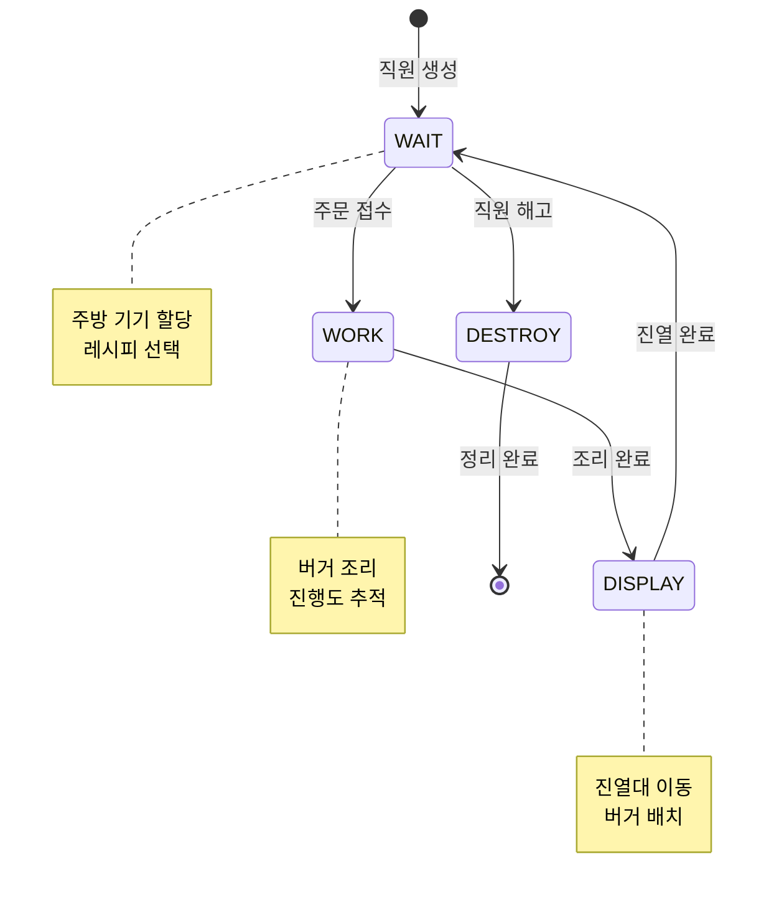
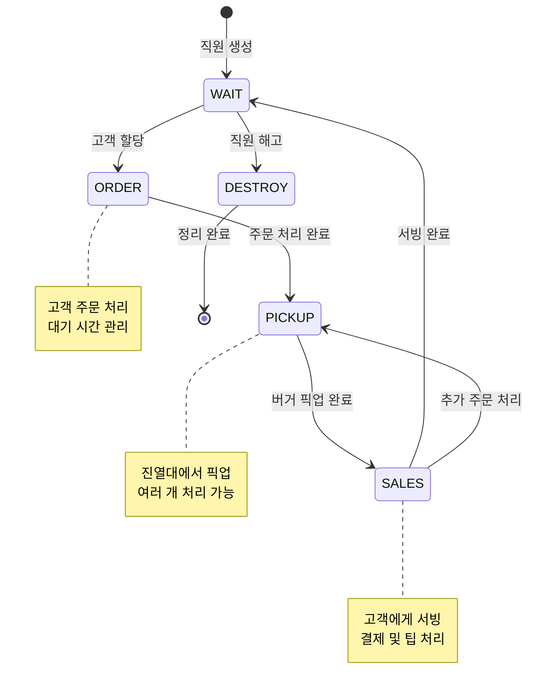
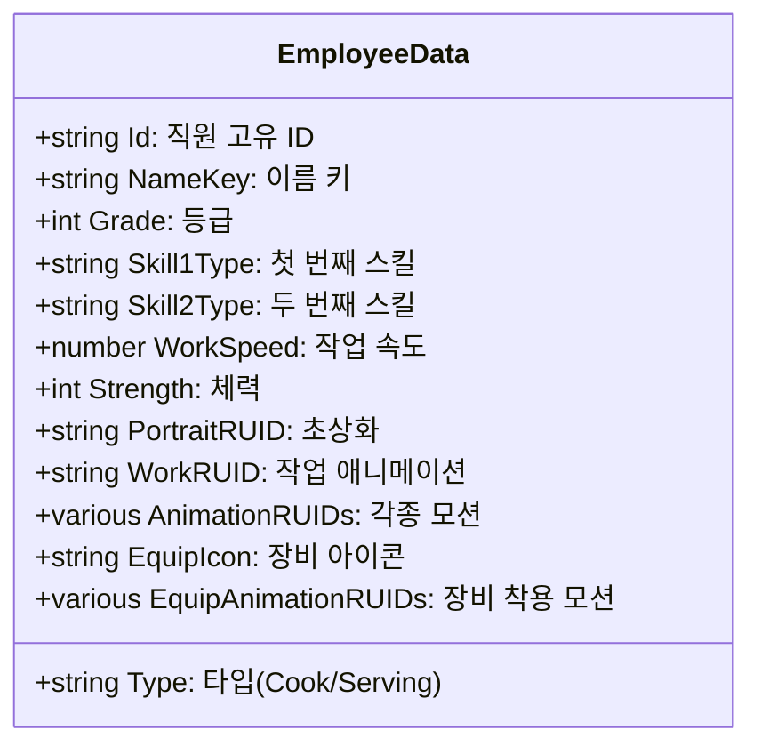
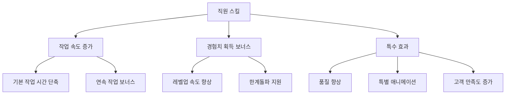
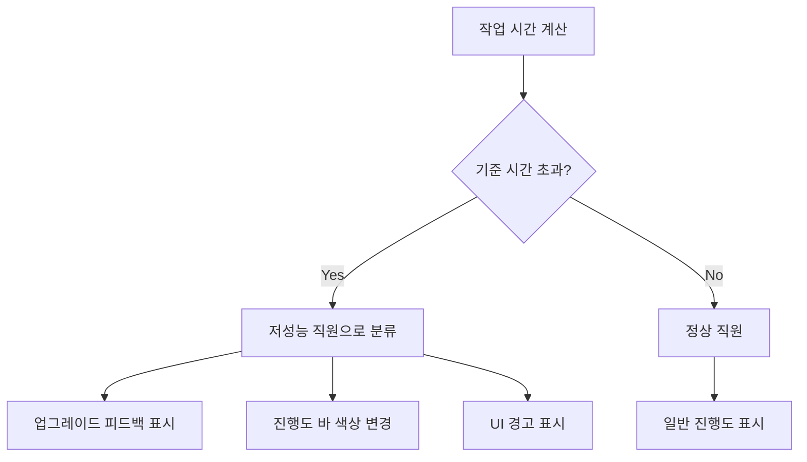
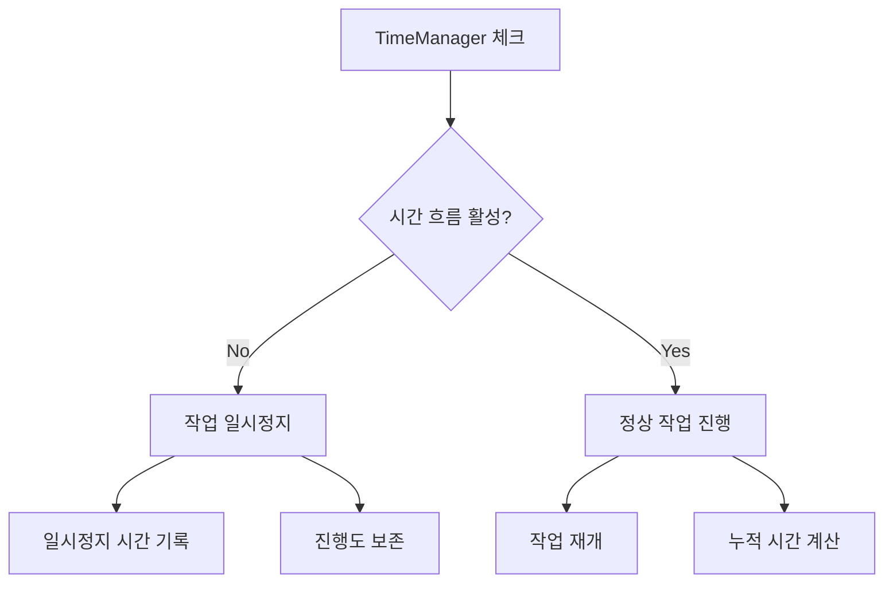

# 직원의 역할과 행동 시스템

## 시스템 개요

츄츄버거 직원 시스템은 두 가지 주요 타입의 직원으로 구성됩니다: **요리 직원(Cook)**과 **서빙 직원(Serving)**. 각 직원은 독립적인 AI 상태 머신을 통해 자율적으로 작업을 수행하며, 플레이어는 직원을 고용하고 배치하여 가게를 자동화할 수 있습니다.

## 직원 타입과 역할

### 요리 직원 (Cook)
- **주요 역할**: 주방에서 햄버거 제작
- **작업 공간**: 그릴(Grill) 기기
- **담당 업무**: 레시피에 따른 버거 조리, 진열대 배치

### 서빙 직원 (Serving)
- **주요 역할**: 고객 서빙 및 계산 처리
- **작업 공간**: 카운터(Counter) 기기
- **담당 업무**: 고객 주문 접수, 버거 픽업, 서빙, 결제 처리

## 직원 AI 상태 머신 시스템

### 요리 직원 상태 머신 (CookEmployeeAIScript)


#### 상태별 세부 동작

**1. WAIT (대기 상태)**
- 사용 가능한 주방 기기(그릴) 할당
- 현재 설정된 메뉴 중 제작할 레시피 선택
- 가장 가까운 진열대 ID 확인
- 작업 조건 만족 시 WORK 상태로 전환

**2. WORK (작업 상태)**
- 선택된 레시피에 따른 버거 제작 시작
- 작업 진행도 UI 표시 및 업데이트
- 직원 스킬 및 레벨에 따른 작업 속도 적용
- 조리 완료 시 DISPLAY 상태로 전환

**3. DISPLAY (진열 상태)**
- 완성된 버거를 들고 진열대로 이동
- 진열대에 버거 배치
- 재고 업데이트 및 UI 반영
- 작업 완료 후 WAIT 상태로 복귀

### 서빙 직원 상태 머신 (ServingEmployeeAIScript)


#### 상태별 세부 동작

**1. WAIT (대기 상태)**
- 대기 중인 고객 확인 및 할당
- 사용 가능한 카운터 기기 할당
- 고객 할당 시 ORDER 상태로 전환

**2. ORDER (주문 처리 상태)**
- 할당된 고객의 주문 정보 확인
- 주문 처리 진행도 표시
- 고객 대기 시간 관리
- 작업 완료 시 PICKUP 상태로 전환

**3. PICKUP (픽업 상태)**
- 고객이 주문한 버거를 진열대에서 픽업
- 여러 개 주문 시 순차적 픽업 처리
- 재고 부족 시 피드백 표시
- 필요한 수량 확보 시 SALES 상태로 전환

**4. SALES (서빙 상태)**
- 고객에게 버거 전달
- 주문 수량이 많을 경우 추가 PICKUP 실행
- 모든 주문 완료 시 결제 처리
- 팁 계산 및 매출 기록

## 직원 데이터 구조

### EmployeeData (기본 정보)


### EmployeeDetailData (성장 정보)
직원의 레벨 및 경험치를 관리하는 구조체:

- **CookLevel/ServingLevel**: 각 분야별 레벨 (1-10)
- **CookExp/ServingExp**: 누적 경험치
- **MaxLevel**: 현재 최대 레벨 제한
- **OverLimitLevel**: 한계돌파 레벨
- **EmploymentLevel**: 고용 당시 레벨

### EmployeeOutgameDetailData (메타 정보)
게임 외적 요소들을 관리하는 구조체:

- **EquipLevel**: 장비 착용 레벨 (-1: 미착용)
- **Skill1Grade/Skill2Grade**: 스킬 등급
- **MoveSpeed**: 이동 속도 레벨
- **InCollection**: 컬렉션 포함 여부
- **CanBuyEquip**: 장비 구매 가능 여부

## 직원 스킬 시스템

### 스킬 타입과 효과
직원은 2개의 스킬 슬롯을 가지며, 각 스킬은 등급에 따라 효과가 달라집니다:



### 스킬 등급 시스템
- **1등급**: 기본 효과
- **2등급**: 효과량 증가
- **3등급**: 추가 특수 효과
- **4등급**: 최고 등급, 모든 효과 최대화

## 작업 진행도 및 성능 시스템

### 작업 시간 계산
```
최종작업시간 = 기본시간 × (1 - 스킬보정) × (1 - 레벨보정) × (1 - 장비보정)
```

### 성능 지표
- **WorkSpeed**: 기본 작업 속도 (높을수록 빠름)
- **Strength**: 연속 작업 가능 시간
- **레벨 보정**: 레벨에 따른 효율성 향상
- **장비 보정**: 착용 장비에 따른 추가 보너스

### 저성능 직원 감지 시스템


## 직원 애니메이션 시스템

### 기본 애니메이션
- **Stand**: 기본 서있는 자세
- **Move**: 이동 애니메이션
- **Work**: 작업 애니메이션 (요리/서빙)
- **Chat**: 대화/상호작용
- **Love**: 기쁨 표현
- **Cry**: 슬픔 표현
- **Sleep**: 휴식/대기
- **Stunned**: 기절/놀람

### 장비 착용 애니메이션
직원이 장비를 착용하면 모든 애니메이션이 장비 버전으로 전환:
- **EquipStand**, **EquipMove**, **EquipWork** 등
- 장비별 고유 모션 및 이펙트
- 성능 향상 시각적 표현

## 시간 흐름 및 일시정지 시스템

### 시간 제어 연동


### 일시정지 처리
- **isPauseWork**: 일시정지 상태 플래그
- **workTimeBeforePause**: 일시정지 전 작업 시간 기록
- **ResumeWorkTime**: 작업 재개 시간
- 정확한 작업 시간 계산을 위한 누적 시간 관리

## 성능 최적화

### 상태 머신 최적화
- **타이머 기반 업데이트**: 일정 주기로 상태 체크 (EmployeeStateTick)
- **조건부 실행**: 불필요한 상황에서 상태 변경 중단
- **도착 상태 체크**: 이동 완료 확인 후 다음 단계 진행

### 메모리 관리
- **컴포넌트 재사용**: 직원 해고 시에도 엔티티 재활용
- **타이머 정리**: 상태 전환 시 불필요한 타이머 제거
- **리소스 해제**: DESTROY 상태에서 모든 참조 정리

## 디버깅 및 모니터링

### 개발자 도구
- **직원 정보 모니터**: 실시간 직원 상태 및 진행도 표시
- **작업 시간 추적**: 각 작업 단계별 소요 시간 기록
- **성능 분석**: 직원별 효율성 비교
- **스킬 효과 검증**: 스킬 적용 전후 성능 차이 확인

## 코드 참조

### 요리 직원 AI 시스템
- `RootDesk/MyDesk/02. Employee/CookEmployeeAIScript.mlua :: StateManager()` — 요리 직원 상태 머신 메인 루프
- `RootDesk/MyDesk/02. Employee/CookEmployeeAIScript.mlua :: WAIT()` — 대기 상태 처리 및 레시피 선택
- `RootDesk/MyDesk/02. Employee/CookEmployeeAIScript.mlua :: WORK()` — 버거 조리 작업 처리
- `RootDesk/MyDesk/02. Employee/CookEmployeeAIScript.mlua :: DISPLAY()` — 진열대 배치 처리

### 서빙 직원 AI 시스템
- `RootDesk/MyDesk/02. Employee/ServingEmployeeAIScript.mlua :: StateManager()` — 서빙 직원 상태 머신 메인 루프
- `RootDesk/MyDesk/02. Employee/ServingEmployeeAIScript.mlua :: WAIT()` — 고객 할당 및 대기 처리
- `RootDesk/MyDesk/02. Employee/ServingEmployeeAIScript.mlua :: ORDER()` — 주문 접수 및 처리
- `RootDesk/MyDesk/02. Employee/ServingEmployeeAIScript.mlua :: PICKUP()` — 버거 픽업 처리
- `RootDesk/MyDesk/02. Employee/ServingEmployeeAIScript.mlua :: SALES()` — 고객 서빙 및 결제 처리

### 직원 데이터 구조
- `RootDesk/MyDesk/02. Employee/EmployeeData.mlua :: Load()` — 기본 직원 정보 로드
- `RootDesk/MyDesk/02. Employee/EmployeeDetailData.mlua :: ConvertToDBTable()` — 성장 데이터 저장
- `RootDesk/MyDesk/02. Employee/EmployeeOutgameDetailData.mlua :: SetFromTable()` — 메타 데이터 로드

### 직원 서비스 및 관리
- `RootDesk/MyDesk/02. Employee/EmployeeService.mlua :: ReturnWorkDuration()` — 작업 시간 계산
- `RootDesk/MyDesk/02. Employee/EmployeeService.mlua :: IsStatLevelLow()` — 저성능 직원 감지
- `RootDesk/MyDesk/02. Employee/EmployeeUIService.mlua :: ProgressUIUpdate()` — 진행도 UI 업데이트

---

이 문서는 츄츄버거 직원 시스템에서 각 직원이 어떻게 독립적으로 작업을 수행하는지, 그리고 이들의 행동이 어떤 복잡한 상태 머신과 데이터 구조로 관리되는지를 상세히 설명합니다. 직원의 AI, 성장 시스템, 스킬 효과가 모두 연동되어 플레이어에게 자동화된 가게 운영 경험을 제공합니다.
