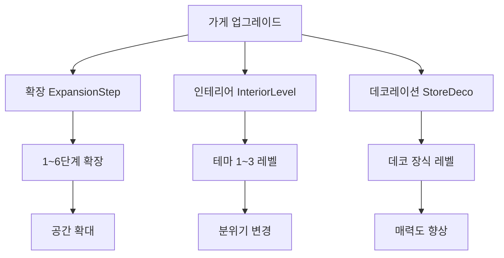

# 가게 확장과 개선

## 개요

츄츄버거 가게 확장과 개선 시스템은 플레이어가 가게의 규모를 늘리고 인테리어를 업그레이드하여 더 많은 고객을 수용하고 매력도를 향상시킬 수 있는 핵심 메커니즘입니다. 확장, 인테리어 변경, 데코레이션 업그레이드를 통해 단계적 성장과 시각적 만족감을 제공합니다.

## 시스템 구조

### 업그레이드 타입



### PlayerUpgrade 컴포넌트

플레이어의 모든 업그레이드 정보를 관리:

```lua
-- RootDesk/MyDesk/00. Player/PlayerUpgrade.mlua
@Component
script PlayerUpgrade extends Component
    @TargetUserSync
    property SyncTable<integer, integer> Upgrades    -- 업그레이드 타입별 레벨
    @TargetUserSync  
    property SyncTable<string, integer> Subscriptions -- 구독 서비스 상태
```

## 확장 시스템 (ExpansionStep)

### 확장 레벨별 공간 변화

`LobbyRenovationService :: ExpandLobby()`에서 처리하는 전체 확장 프로세스:

1. **타일맵 업데이트**: `UpdateLobbyTileMap()` - 바닥과 벽 레이아웃 변경
2. **외부 오브젝트 갱신**: `UpdateExteriorObject()` - 외관 변경
3. **우편함 위치 조정**: `UpdatePostBox()` - 확장 레벨별 위치 이동
4. **주방 기기 재배치**: `_KitchenAppService:VisibleKitAppsEntity()` 호출
5. **경로 재계산**: `_PathFinder:InitNodes()` - AI 경로 업데이트
6. **인테리어 적용**: `RedesignInterior()` - 테마 적용
7. **고객 위치 업데이트**: 대기석 및 스폰 위치 재조정

### 타일맵 관리 시스템

#### 스테이지별 벽 관리
```lua
-- 확장 레벨에 따른 벽 활성화
for i = 1, #self.StageWalls do 
    if i == expansionLv then 
        self.StageWalls[i].Enable = true 
    else
        self.StageWalls[i].Enable = false 
    end
end
```

#### 영역별 바닥 타일 설정
```lua
local space = {"Kitchen","Cash"}  -- 주방, 계산대 영역
local tileSprite = {"kitchen","cash1","cash2","cash3","HalfFloor"}

-- 각 영역별 타일 배치
for i = 1, #space do
    local bottomPos = _LobbySpawnPositionLogic.ExpansionTileGroup[space[i]][expansionLv]["Bottom"]
    local topPos = _LobbySpawnPositionLogic.ExpansionTileGroup[space[i]][expansionLv]["Top"]
    -- 영역 크기 계산 후 타일 설정
end
```

## 인테리어 시스템 (InteriorLevel)

### 테마별 시각적 변화

`RedesignInterior()`에서 인테리어 테마 적용:

```lua
-- 테마별 타일셋 RUID
if themeLv == 1 then 
    ruid = "tileset://9c83666b-7388-4664-a444-3ee19e1e7980"
elseif themeLv == 2 then 
    ruid = "tileset://660f086b-019f-4423-8d9a-874099926c53"
elseif themeLv == 3 then 
    ruid = "tileset://362cff79-7315-493d-bf04-1656dfb05207"
end
```

### 인테리어 엔티티 관리

#### 동적 인테리어 생성
```lua
-- 기존 인테리어 엔티티 파괴
for _, entity in pairs(lobby.Children) do
    if _UtilLogic:Contains(entity.Name, "Interior") then
        entity:Destroy(0)
    end
end

-- 새로운 인테리어 엔티티 스폰
local decoEntityName = "Interior_Theme"..themeLv.."_Level"..expansionLv
local decoEntity = _SpawnService:SpawnByModelId(decoModelId, decoEntityName, Vector3.zero, lobby)
```

#### 인테리어 오브젝트 레이어 설정
- 각 인테리어 요소의 렌더링 순서 조정
- 투명도 및 색상 설정
- 충돌 감지 영역 설정

## 데코레이션 시스템 (StoreDeco)

### 데코레이션 업그레이드

`UpdateInteriorObject()`에서 데코레이션 레벨 적용:
- 장식 요소 추가/제거
- 매력도에 직접적 영향
- 고급 가구 및 장식품 배치

### 매력도 연동
```lua
-- 데코레이션 업그레이드 시 매력도 재계산
self.Entity.CustomerManager:CalcMyAttractive()
```

## 업그레이드 프로세스

### 업그레이드 실행 단계

`PlayerUpgrade :: UpgradeFunction()`의 처리 순서:

1. **조건 확인**:
   - 최대 레벨 확인
   - 비용 확인 (`self.Entity.PlayerInventory.Money`)
   - 업그레이드 가능 여부 (`_UpgradeDataSetLogic:CanUpgrade()`)

2. **비용 결제**:
```lua
local cost = nextLevelData:GetUpgradeCost(self.Entity)
self.Entity.PlayerInventory:ModifyMoney(-cost, "Upgrade", "Upgrade popup")
```

3. **레벨업 적용**:
```lua
self.Upgrades[typeId] = nextLevel
```

4. **특수 처리**:
   - **확장**: 이벤트 C8001 발생 → 공사 진행 연출
   - **인테리어**: 이벤트 C8002 발생 → 리디자인 연출
   - **데코레이션**: 이벤트 C8003 발생 → 장식 업데이트

### 업그레이드별 특수 효과

#### 확장 업그레이드 (ExpansionStep)
```lua
if typeId == _UpgradeTypeEnum.ExpansionStep then
    if isCheat == false then
        _UpgradeDataSetLogic:RequestCloseUpgradeUI(self.Entity.PlayerComponent.UserId)
        _EventManager:SetEventReferKeyData("C8001", "Expansion", self.Entity.PlayerComponent.UserId)
        self.Entity.PlayerEvent:RequestCallEvent("C8001")
    else
        -- 즉시 확장 적용 (치트 모드)
        _LobbyRenovationService:ExpandLobby(expansionLv, interiorLv, decoLv, grillCount, displayCount, counterCount, self.Entity)
    end
end
```

#### 인테리어 업그레이드 (InteriorLevel)
```lua
if typeId == _UpgradeTypeEnum.InteriorLevel then 
    if isCheat == false then
        _EventManager:SetEventReferKeyData("C8002", "Interior", self.Entity.PlayerComponent.UserId)
        self.Entity.PlayerEvent:RequestCallEvent("C8002")
    else
        _LobbyRenovationService:RedesignInterior(interiorLv, expansionLv, decoLv)
    end
end
```

## 시각적 연출 시스템

### 단계별 공사 진행

업그레이드 이벤트를 통한 단계적 연출:
1. **업그레이드 UI 닫기**
2. **공사 진행 다이얼로그 표시**
3. **실제 리노베이션 적용**
4. **완료 알림**

### 미리보기 시스템

업그레이드 전 미리보기 기능:
- 고스트 엔티티를 통한 확장 영역 표시
- 인테리어 변경 사항 미리 확인
- 비용 대비 효과 사전 평가

## 내부 벽 관리 시스템

### 동적 벽 생성

`AddBoxTile()`과 `RemoveTile()`을 통한 벽 관리:

```lua
-- 계산대 영역 내부 벽 추가
local displayInnerWallY = topPos.y + 2
_LobbyRenovationService:AddBoxTile(expansionLv, Vector2(startX, displayInnerWallY), Vector2(endX, displayInnerWallY), player, self.insideWallCenterTileImg)

-- 카운터 영역 내부 벽
local counterInnerWallY = topPos.y  
_LobbyRenovationService:AddBoxTile(expansionLv, Vector2(startX, counterInnerWallY), Vector2(endX, counterInnerWallY), player, self.insideWallCenterTileImg)
```

### 벽 타일 타입
- `insideWallCenterTileImg`: 중앙 벽 타일
- `insideWallLeftSideTileImg`: 좌측 벽 타일  
- `insideWallRightSideTileImg`: 우측 벽 타일
- `SingleWallTileImg`: 단독 벽 타일

## 성능 최적화

### 엔티티 관리
- 사용하지 않는 확장 레벨의 벽 비활성화
- 인테리어 엔티티 동적 생성/파괴
- 고스트 엔티티 미리 비활성화

### 메모리 관리
```lua
-- 엔티티 참조 정리
table.clear(self.InteriorEntities)
for _, ie in pairs(self.NowInteriorEntity.Children) do
    self.InteriorEntities[ie.Name] = ie
end
```

## 연동 시스템

### 주방 기기 연동
확장 시 주방 기기 재배치:
- 그릴, 디스플레이, 카운터 위치 업데이트
- 확장 레벨별 기기 가시성 제어
- 직원 이동 경로 재계산

### 고객 시스템 연동
확장 시 고객 관련 업데이트:
- 대기석 위치 재조정: `UpdateWaitSeatPos()`
- 고객 스폰 위치 업데이트: `UpdateCustomerSpawnPos()`
- 고객 이동 경로 재계산

### 카메라 시스템 연동
```lua
-- 확장 레벨별 카메라 설정
_LobbyCameraService:SetCamerasForExpansion(expansionLv)
```

## 코드 참조

### 핵심 리노베이션 시스템
- `RootDesk/MyDesk/01. Lobby/LobbyRenovationService.mlua :: ExpandLobby()` — 전체 확장 프로세스
- `RootDesk/MyDesk/01. Lobby/LobbyRenovationService.mlua :: RedesignInterior()` — 인테리어 리디자인
- `RootDesk/MyDesk/01. Lobby/LobbyRenovationService.mlua :: UpdateLobbyTileMap()` — 타일맵 업데이트

### 업그레이드 관리
- `RootDesk/MyDesk/00. Player/PlayerUpgrade.mlua :: UpgradeFunction()` — 업그레이드 실행
- `RootDesk/MyDesk/00. Player/PlayerUpgrade.mlua :: ForceSetUpgradeLevel()` — 강제 레벨 설정
- `RootDesk/MyDesk/01. Lobby/LobbyManager.mlua :: InitClient()` — 초기 리노베이션 적용

### 타일 관리
- `RootDesk/MyDesk/01. Lobby/LobbyRenovationService.mlua :: AddBoxTile()` — 벽 타일 추가
- `RootDesk/MyDesk/01. Lobby/LobbyRenovationService.mlua :: RemoveTile()` — 타일 제거
- `RootDesk/MyDesk/01. Lobby/LobbyRenovationService.mlua :: UpdateInteriorObject()` — 인테리어 오브젝트 업데이트

### 연동 시스템
- `RootDesk/MyDesk/01. Lobby/LobbyRenovationService.mlua :: UpdatePostBox()` — 우편함 위치 조정
- `RootDesk/MyDesk/01. Lobby/LobbyRenovationService.mlua :: UpdateWaitSeatPos()` — 대기석 위치 업데이트
