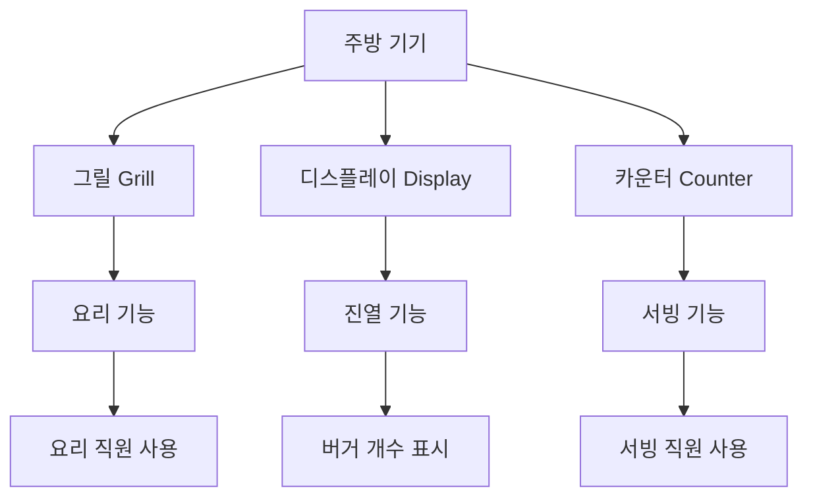

# 주방 기기 관리

## 개요

츄츄버거 주방 기기 관리 시스템은 그릴, 디스플레이, 카운터 등 3가지 핵심 기기의 사용 상태, 시각적 표현, 직원 연동을 종합적으로 관리하는 시스템입니다. 실시간 기기 할당, 동적 스프라이트 업데이트, 확장 레벨별 기기 관리를 통해 몰입감 있는 가게 운영 경험을 제공합니다.

## 주방 기기 시스템 구조

### 기기 타입



### KitchenAppData 구조체

```lua
-- RootDesk/MyDesk/03. KitchenAppliance/KitchenAppData.mlua
@Struct
script KitchenAppData
    property string Id = ""             -- 기기 ID (예: "Grill1", "Display3")
    property string Group = ""          -- 기기 그룹
    property integer Level = 0          -- 기기 레벨
    property string EffectType = ""     -- 효과 타입
    property integer EffectValue = 0   -- 효과 값
```

## 기기 사용 관리 시스템 (KitchenAppManager)

### 기기 할당 메커니즘

`KitchenAppManager`는 클라이언트에서 실시간 기기 사용 상태를 추적합니다:

```lua
-- 기기 사용자 테이블 구조
property table AppUser = {
    ["Grill"] = {1="직원ID1", 2="직원ID2", ...},
    ["Display"] = {1="", 2="직원ID3", ...},
    ["Counter"] = {1="직원ID4", 2="", ...}
}
```

### 핵심 관리 기능

#### 기기 할당/해제
- `AssignApp(appType, appIdx, assignerName)`: 특정 기기를 직원에게 할당
- `ReleaseApp(appType, appIdx)`: 기기 사용 해제

#### 사용 가능한 기기 검색
- `ReturnAvailableApp()`: 순차적으로 첫 번째 사용 가능한 기기 반환
- `ReturnRandomAvailableApp()`: 무작위로 사용 가능한 기기 선택

```lua
-- 사용 가능 기기 개수 확인
local grillCount = _UpgradeDataSetLogic:ReturnCurrentPlayerValue(player, _UpgradeTypeEnum.GrillCount)
local displayCount = _KitchenAppService:ReturnDisplayNum(player)
local counterCount = _UpgradeDataSetLogic:ReturnCurrentPlayerValue(player, _UpgradeTypeEnum.CounterCount)
```

## 시각적 관리 시스템 (KitchenAppService)

### 디스플레이 스프라이트 시스템

#### 동적 버거 표시
`ReturnDisplayRUID(tag, themeLv, burgerNum)`에서 구현:

1. **버거 개수 비율 계산**:
```lua
local ratio = burgerNum / displayMaxCount * 100
-- 0%: BurgerNum0, ~50%: BurgerNum1, ~75%: BurgerNum2, ~95%: BurgerNum3, 100%: BurgerNum4
```

2. **스프라이트 데이터 조회**:
- `DisplaySpritreDataSet`에서 `태그+테마레벨` 조합으로 스프라이트 RUID 획득
- 예: `Meat1` (고기 태그 + 테마레벨1) → 버거개수별 5가지 스프라이트

#### 전체 디스플레이 업데이트
`UpdateAllDisplaySprite()`에서 모든 디스플레이 일괄 업데이트:

```lua
-- 각 슬롯별 버거 정보 확인
local returnSlotAmount = function(slotIdx)
    for uniqueID, slotAmountData in pairs(menuManger.DisplayBurger) do
        if slotAmountData[slotIdx] > 0 then
            return {uniqueID, slotAmountData[slotIdx]}
        end
    end
    return {nil, 0}
end
```

### 기기 애니메이션 시스템

#### 사용 상태별 스프라이트
`ReturnKitchenAppRUID(type, isUsed, interior)`에서 관리:

- **그릴**: `OnAnimGrill1~3` / `OffAnimGrill1~3`
- **카운터**: `OnCounter1~3` / `OffCounter1~3`
- 인테리어 레벨별 다른 애니메이션 적용

#### 위치 및 오프셋 관리
```lua
-- 기기별 오프셋 데이터
self.KAppsOffset[_KitchenAppEnumType.Grill] = {{0,0}, {0.0,0}, {0.0,0}}
self.KAppsOffset[_KitchenAppEnumType.Display] = {{0,-0.3}, {0.0,-0.3}, {0.0,-0.3}}
self.KAppsOffset[_KitchenAppEnumType.Counter] = {{-0.02,0}, {0,0}, {0,0}}
```

## 직원 연동 시스템

### 요리 직원 연동 (CookEmployeeAIScript)

#### 기기 할당 과정
```lua
-- WAIT 상태에서 기기 할당
if self.WorkAppID == 0 then
    self.WorkAppID = _UserService.LocalPlayer.EmployeeManager:SetKitchenAppId(self.Entity.Name)
    if self.WorkAppID == 0 then
        return  -- 사용 가능한 기기 없음
    end
end
```

#### 기기 사용 상태 변경
```lua
-- WORK 상태 시작 시 기기 활성화
_KitchenAppService:KitchenAppProductionByID(self.WorkAppID, true, _KitchenAppEnumType.Grill)
```

#### 디스플레이 선택
```lua
-- 그릴 위치 기반 가장 가까운 디스플레이 선택
local decoPos = _LobbySpawnPositionLogic.EmployeeUseKitchenAppPosGroup[_KitchenAppEnumType.Grill][self.WorkAppID]
self.TargetDisplayID = _EmployeeService:GetNearestDisplayId(self.UniqueRecipeID, self.WorkAppID, _EmployeeTypeEnum.Cook, decoPos.x)
```

### 서빙 직원 연동 (ServingEmployeeAIScript)

- `WorkAppID`: 담당 카운터 기기 ID
- `TargetDisplayId`: 픽업할 디스플레이 ID
- 버거 픽업 시 디스플레이 스프라이트 업데이트

## 확장 레벨별 기기 관리

### 기기 가시성 제어
`VisibleKitAppsEntity()`에서 확장 레벨에 따른 기기 표시:

```lua
-- 확장 레벨별 기기 그룹 생성
local entityName = "KitchenApp_Level" .. expansionLv
local group = _SpawnService:SpawnByModelId(modelId, entityName, Vector3.zero, lobby)

-- 업그레이드 레벨 미만의 기기는 빈 슬롯으로 표시
if hasAppNum[appType] < kitAppIdx then
    decoKApp.SpriteRendererComponent.SpriteRUID = _IconRuidEnum.KitchenNoneRUID
    -- 빈 슬롯 오프셋 적용
    decoKApp.TransformComponent.WorldPosition.x = tonumber(data:GetItem("PosX")) + self.KAppsNoneOffset[appType][1]
end
```

### 위치 데이터 관리
- `KitchenAppPosDataSet`: 스테이지별, 기기별 위치 데이터
- `InsertKitAppOffsetDataSet()`: 에디터에서 위치 데이터 자동 생성

## 디스플레이 데이터 구조

### DisplaySpritreDataSet 예시
```csv
Id,BurgerNum0,BurgerNum1,BurgerNum2,BurgerNum3,BurgerNum4
Veggie1,empty_sprite,low_sprite,mid_sprite,high_sprite,full_sprite
Meat1,empty_sprite,low_sprite,mid_sprite,high_sprite,full_sprite
Seafood1,empty_sprite,low_sprite,mid_sprite,high_sprite,full_sprite
```

### 버거 개수 표시 로직
1. **현재 디스플레이 최대 용량** 확인 (`DisplaystandLevel` 업그레이드)
2. **실제 버거 개수 / 최대 용량** 비율 계산
3. **5단계 시각적 구분**: 0%, ~50%, ~75%, ~95%, 100%
4. **태그별 스프라이트** 적용 (Veggie, Meat, Seafood, Chicken, Spicy)

## 성능 최적화

### 실시간 업데이트 전략
- **개별 업데이트**: `UpdateDisplaySpriteByID()` - 특정 디스플레이만 업데이트
- **일괄 업데이트**: `UpdateAllDisplaySprite()` - 확장/테마 변경시 전체 업데이트
- **상태 변경**: `KitchenAppProductionByID()` - 개별 기기 사용 상태 변경

### 메모리 관리
- 기기별 오프셋 데이터 사전 로딩
- 스프라이트 RUID 캐싱
- 사용하지 않는 기기 엔티티 파괴

## 코드 참조

### 핵심 관리 시스템
- `RootDesk/MyDesk/03. KitchenAppliance/KitchenAppManager.mlua :: AssignApp()` — 기기 할당
- `RootDesk/MyDesk/03. KitchenAppliance/KitchenAppManager.mlua :: ReturnAvailableApp()` — 사용 가능 기기 검색
- `RootDesk/MyDesk/03. KitchenAppliance/KitchenAppService.mlua :: LoadData()` — 기기 데이터 로딩

### 시각적 관리
- `RootDesk/MyDesk/03. KitchenAppliance/KitchenAppService.mlua :: ReturnDisplayRUID()` — 디스플레이 스프라이트 결정
- `RootDesk/MyDesk/03. KitchenAppliance/KitchenAppService.mlua :: UpdateAllDisplaySprite()` — 디스플레이 일괄 업데이트
- `RootDesk/MyDesk/03. KitchenAppliance/KitchenAppService.mlua :: VisibleKitAppsEntity()` — 기기 가시성 제어

### 직원 연동
- `RootDesk/MyDesk/02. Employee/CookEmployeeAIScript.mlua :: WAIT()` — 요리 직원 기기 할당
- `RootDesk/MyDesk/02. Employee/CookEmployeeAIScript.mlua :: WORK()` — 기기 사용 상태 활성화
- `RootDesk/MyDesk/02. Employee/EmployeeManager.mlua :: EmployeeStateStop()` — 기기 사용 상태 초기화

### 데이터 구조
- `RootDesk/MyDesk/03. KitchenAppliance/KitchenAppData.mlua :: KitchenAppData` — 기기 데이터 구조체
- `RootDesk/MyDesk/03. KitchenAppliance/DisplaySpritreDataSet.csv` — 디스플레이 스프라이트 데이터
