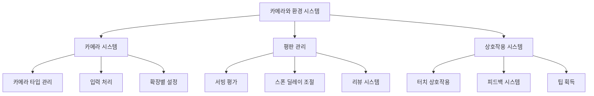

# 카메라와 환경

## 개요

츄츄버거 카메라와 환경 시스템은 플레이어에게 최적의 가게 관찰 경험을 제공하고, 평판 관리를 통해 게임의 깊이를 더하며, 직관적인 상호작용으로 몰입감을 극대화하는 통합 시스템입니다. 동적 카메라 제어, 실시간 평판 피드백, 다양한 오브젝트 상호작용을 통해 살아있는 가게 운영 경험을 선사합니다.

## 시스템 구성



## 카메라 시스템 (LobbyCameraService)

### 카메라 타입 관리

`LobbyCameraService`는 다양한 카메라 타입을 동적으로 관리합니다:

```lua
-- RootDesk/MyDesk/01. Lobby/Camera/LobbyCameraService.mlua
@Logic
script LobbyCameraService extends Logic
    property SyncTable<string, CameraComponent> lobbyCameras  -- 카메라 컴포넌트 관리
    property string nowCamera = ""                           -- 현재 활성 카메라
    property number cameraMoveSpeed = 0.8                    -- 카메라 이동 속도
    property Vector2 cameraBoundLB = Vector2(0,0)           -- 카메라 경계 (좌하단)
    property Vector2 cameraBoundRT = Vector2(0,0)           -- 카메라 경계 (우상단)
```

### 카메라 전환 시스템

#### 동적 카메라 전환
```lua
-- 지정된 키의 카메라로 전환
method void ChangeCameraTo(string key)
    self.nowCamera = key
    local nowCamera = self.lobbyCameras[key]
    
    -- MovingCamera를 기본으로 사용
    if _CameraService:GetCurrentCameraComponent() ~= self.lobbyCameras["MovingCamera"] then
        _CameraService.TransitionBlendTime = 0
        _CameraService:SwitchCameraTo(self.lobbyCameras["MovingCamera"])
    end
    
    if key ~= "MovingCamera" then
        self:SetCameraSetting("MovingCamera", nowCamera.Entity.TransformComponent.Position, nowCamera.ZoomRatio)
    end
end
```

#### 확장 레벨별 카메라 설정
```lua
-- 확장 레벨에 따라 카메라 설정 적용
method void SetCamerasForExpansion(integer expansionLevel)
    local cameraData = _CameraDataSetLogic:GetLobbyCameraData(expansionLevel)
    
    for k, cameraComponent in pairs(self.lobbyCameras) do
        local typeData = cameraData.CameraTypeData[k]
        
        -- 카메라 경계 설정
        if typeData.CustomBoundLB ~= nil then
            cameraComponent.LeftBottom = Vector2(typeData.CustomBoundLB.x, typeData.CustomBoundLB.y)
            self.cameraBoundLB = Vector2(typeData.CustomBoundLB.x, typeData.CustomBoundLB.y)
        end
        
        -- 카메라 위치 및 줌 설정
        if typeData.PosX ~= nil and typeData.PosY ~= nil then
            cameraComponent.Entity.TransformComponent.Position = Vector3(typeData.PosX, typeData.PosY, cameraComponent.Entity.TransformComponent.Position.z)
        end
    end
    
    self:ChangeCameraTo("FullView")  -- 기본 전체 보기 카메라로 설정
end
```

### 입력 처리 시스템

#### 키보드 입력
```lua
-- 방향키를 통한 카메라 이동
property boolean UpInput = false
property boolean DownInput = false  
property boolean LeftInput = false
property boolean RightInput = false

method void MoveMovingCamera(number delta)
    local dirX = self.RightInput and 1 or (self.LeftInput and -1 or 0)
    local dirY = self.UpInput and 1 or (self.DownInput and -1 or 0)
    
    local moveX = dirX * delta * self.cameraMoveSpeed
    local moveY = dirY * delta * self.cameraMoveSpeed
    
    -- 경계 확인 후 이동
    self:ForceCorrectPos()
    movingCamera.Entity.TransformComponent:Translate(moveX, moveY)
end
```

#### 터치 입력
```lua
-- 터치를 통한 카메라 이동
property Vector2 lastTouchPoint = Vector2(0,0)
property Vector2 curTouchPoint = Vector2(0,0)
property number touchCameraMoveSpeed = 0.4

method void MoveMovingCameraByTouchPoint(number delta)
    -- 터치 포인트 계산 후 카메라 이동 적용
    -- 경계 내에서만 이동 허용
end
```

### 카메라 경계 관리

#### 동적 경계 계산
```lua
-- 확장 레벨에 따른 카메라 이동 범위 계산
local xLength = self.cameraBoundRT.x - self.cameraBoundLB.x
local yLength = self.cameraBoundRT.y - self.cameraBoundLB.y
self.moveBoundLimit = Vector2(xLength/4, yLength/4)

-- 경계 범위 내에서만 이동 허용
if (nowPosX+moveX) < self.cameraBoundLB.x + self.moveBoundLimit.x or 
   (nowPosX+moveX) > self.cameraBoundRT.x - self.moveBoundLimit.x then
    moveX = 0
end
```

## 평판 관리 시스템 (ReputationDataSetLogic)

### 서빙 기반 평판 시스템

#### 서빙 시간에 따른 평판 변화
```lua
-- 서빙 시간을 기반으로 별점 및 평판 변화 계산
method number ReturnReputationChangeByServingTime(number servingTime, Entity player)
    local getStarGrade = function(e)
        if e < configValue(5) then return 6
        elseif configValue(5) <= e and e < configValue(4) then return 5
        elseif configValue(4) <= e and e < configValue(3) then return 4
        elseif configValue(3) <= e and e < configValue(2) then return 3
        elseif configValue(2) <= e and e < configValue(1) then return 2
        elseif configValue(1) <= e then return 1
        end
    end
    
    local starGrade = getStarGrade(servingTime)
    local reputationChange = reviewStarScore * adjustRate
    return reputationChange
end
```

#### 평판 기반 고객 스폰 딜레이 조절
```lua
-- 평판에 따른 고객 방문 빈도 조절
method number ReturnSpawnDelay(Entity player)
    local reputation = player.PlayerInventory.Reputation
    local maxReputation = storeAttractiveData.MaxReputation
    local myReputationRate = reputation/maxReputation
    
    -- 평판이 높을수록 스폰 딜레이 감소 (더 많은 고객 방문)
    local spawnDelay = maxSpawnDelay * (1 - myReputationRate) + minSpawnDelay
    return spawnDelay
end
```

### 평판 효과 시스템

#### 평판 변화 시각 효과
```lua
-- HUD에서 평판 변화 이펙트 재생
method void PlayReputationChangeEffectHUD(boolean isUp)
    local randDir = Vector2(_UtilLogic:RandomIntegerRange(-10, 10)/10, 2)
    local entity = _UIEntityService:GetOrCreateEntityOfModel("UISprite", self._T.effectIdx, parent)
    
    -- 평판 상승/하락에 따른 다른 아이콘 표시
    if isUp then
        entity.SpriteGUIRendererComponent.ImageRUID = "d9d9547d80954b18839f66db7674f3ed"  -- 상승 아이콘
    else
        entity.SpriteGUIRendererComponent.ImageRUID = "c25f96f836ab40e38bd039e268600a8b"  -- 하락 아이콘
    end
    
    -- 트윈 애니메이션으로 시각 효과
    _TweenLogic:PlayTween(entity.UITransformComponent.anchoredPosition, randDir*moveAmount, effDuration, EaseType.CubicEaseOut, ...)
end
```

#### 맵 내 평판 효과
```lua
-- 고객이나 직원 근처에서 평판 변화 효과 표시
method void PlayReputationChangeEffectMap(boolean isUp, Entity parent)
    local entity = _SpawnService:SpawnByModelId(modelId, "ReputationEffect", parent.TransformComponent.WorldPosition + Vector3(0, 0.3, 0), parent)
    -- 3D 공간에서 평판 변화 시각화
end
```

### 경영 레벨 연동

#### 스테이지별 평판 조정
```lua
-- 경영 레벨과 스테이지에 따른 평판 점수 조정
local level = _UserService.LocalPlayer.PlayerManagement.ManagementLevel
local adjustRate = 1
if player.PlayerStage.NowStage == 6 then
    adjustRate = _GetConfigDataLogic:GetConfigNumDataByKey(string.format("ReputationReviewScoreRateLevel%dForStage6", level))
else
    adjustRate = _GetConfigDataLogic:GetConfigNumDataByKey(string.format("ReputationReviewScoreRateLevel%d", level))
end
```

## 상호작용 시스템

### InteractionScript - 기본 상호작용

#### 엔티티 타입별 상호작용
```lua
-- RootDesk/MyDesk/01. Lobby/Interaction/InteractionScript.mlua
@Component
script InteractionScript extends Component
    property string Type = ""  -- "Customer", "Employee", "Deco" 등
    
    method void OnBeginPlay()
        -- 엔티티 이름으로 타입 자동 결정
        if string.find(self.Entity.Name,"Deco") then 
            self.Type = string.sub(self.Entity.Name,5,#self.Entity.Name)
        elseif string.find(self.Entity.Name,"Customer") then 
            self.Type ="Customer"
        else
            self.Type = "Employee"
        end
    end
    
    method void OnTouch()
        if self.Type =="Customer" then
            -- 고객 디버그 정보 표시
            local debugMonitorUICustomer = _UserService.LocalPlayer.PlayerDebugMonitor.CustomerInfoMonitor:GetChildByName("InfoLayout").DebugMonitorUICustomer
            debugMonitorUICustomer:SetSelectedCustomer(self.Entity)
        elseif self.Type =="Employee" then 
            -- 직원 정보 UI 열기
            _InteractionUIService:OpenUIEmployeeInfo(self.Entity.EmployeeInfoScript.Id,_UserService.LocalPlayer)
        end
    end
end
```

### InteractionTipScript - 팁 획득 시스템

#### 팁 드롭 및 획득
```lua
-- RootDesk/MyDesk/01. Lobby/Interaction/InteractionTipScript.mlua
@Component
script InteractionTipScript extends Component
    property integer amount = 0    -- 팁 금액
    property integer OwnerID = 0   -- 팁 소유자 ID
    
    -- 팁 생성
    method void Create(integer ownerID, integer amount, number removeTime)
        self.OwnerID = ownerID
        self.amount = amount
        
        -- 골드 아이템 아이콘 사용
        self.Entity.SpriteRendererComponent.SpriteRUID = _ItemDataSetLogic:GetItemData("G0005").IconRUID
        
        -- 자동 삭제 타이머 설정
        if removeTime ~= nil then
            self.Entity:Destroy(removeTime)
        end
    end
    
    -- 팁 획득
    method void GetItem(Entity player)
        _CustomerService:RequestGainDropTip(self.OwnerID, self.amount, player)
        _CustomerUIService:CreateTipProductionUI(self.Entity, string.format("%d", self.amount))
        self.Entity:Destroy()
    end
end
```

### InteractionUIService - 상호작용 UI 관리

#### 통합 UI 관리
```lua
-- RootDesk/MyDesk/01. Lobby/Interaction/InteractionUIService.mlua  
@Logic
script InteractionUIService extends Logic
    property Entity UIEmployeeInfo = "..."      -- 직원 정보 UI
    property Entity UIKitchenAppInfo = "..."     -- 주방 기구 정보 UI
    property Entity UIKitchenAppNone = "..."     -- 주방 기구 없음 UI
    
    -- 상호작용 UI들 간 전환 관리
    method void OpenUIEmployeeInfo(string employeeId, Entity player)
        -- 다른 UI들 닫기
        self:CloseUIKitchenAppNone()
        self:CloseUIUIKitchenAppInfo()
        
        -- 직원 정보 UI 열기 및 데이터 설정
    end
end
```

## 구독 우편함 시스템

### SubscriptionPostBox - 구독 서비스 연동

특별한 상호작용 오브젝트로 구독 관련 아이템을 받을 수 있는 시스템:

```lua
-- 구독 우편함 터치 시 구독 아이템 수령 UI 표시
-- 확장 레벨에 따라 위치 자동 조정
-- 구독 상태에 따른 시각적 피드백 제공
```

## 시스템 연동

### 카메라-평판 연동
- 평판 변화 시 카메라가 해당 영역을 자동으로 포커스
- 중요한 평판 이벤트 발생 시 카메라 줌 및 하이라이트

### 평판-상호작용 연동  
- 고객 터치 시 해당 고객의 만족도 및 예상 평판 변화 표시
- 직원 터치 시 해당 직원의 서빙 성과 및 평판 기여도 확인

### 카메라-상호작용 연동
```lua
-- 터치 입력 시 카메라 이동 일시 정지
if _InputService:IsPointerOverUI() then 
    self:SetEnableCameraZoom(false)
    return
end

-- UI가 열려있을 때 카메라 제어 비활성화
if player.TimeManager:CheckCanTimeFlows() == false or _InputService:IsPointerOverUI() then
    self:SetEnableCameraZoom(false)
    return
end
```

## 성능 최적화

### 카메라 최적화
- 카메라 전환 시 블렌딩 시간 최소화 (`TransitionBlendTime = 0.2`)
- 불필요한 카메라 업데이트 방지
- 경계 계산 캐싱

### 평판 시스템 최적화
- 평판 변화 이펙트 풀링 시스템
- 타이머 기반 지연 처리로 성능 부하 분산
- 로그 데이터 7일 제한으로 메모리 관리

### 상호작용 최적화
- 터치 중복 방지 플래그 (`isTouch`)
- UI 상태 확인으로 불필요한 처리 방지
- 엔티티 타입 캐싱

## 코드 참조

### 카메라 시스템
- `RootDesk/MyDesk/01. Lobby/Camera/LobbyCameraService.mlua :: ChangeCameraTo()` — 카메라 전환
- `RootDesk/MyDesk/01. Lobby/Camera/LobbyCameraService.mlua :: SetCamerasForExpansion()` — 확장별 카메라 설정
- `RootDesk/MyDesk/01. Lobby/Camera/LobbyCameraService.mlua :: MoveMovingCamera()` — 카메라 이동 처리

### 평판 관리
- `RootDesk/MyDesk/01. Lobby/Reputation/ReputationDataSetLogic.mlua :: ReturnReputationChangeByServingTime()` — 서빙 평판 계산
- `RootDesk/MyDesk/01. Lobby/Reputation/ReputationDataSetLogic.mlua :: ReturnSpawnDelay()` — 평판 기반 스폰 딜레이
- `RootDesk/MyDesk/01. Lobby/Reputation/ReputationDataSetLogic.mlua :: PlayReputationChangeEffectHUD()` — 평판 시각 효과

### 상호작용 시스템
- `RootDesk/MyDesk/01. Lobby/Interaction/InteractionScript.mlua :: OnTouch()` — 기본 터치 상호작용
- `RootDesk/MyDesk/01. Lobby/Interaction/InteractionTipScript.mlua :: GetItem()` — 팁 획득 처리
- `RootDesk/MyDesk/01. Lobby/Interaction/InteractionUIService.mlua` — 상호작용 UI 통합 관리
