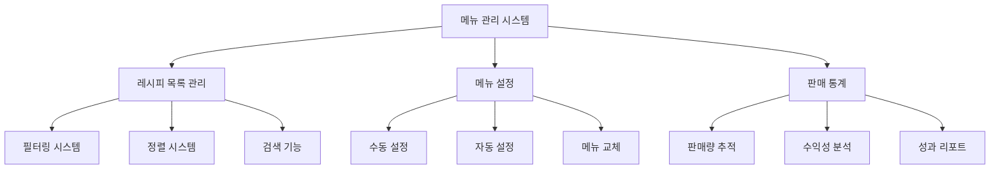

# 메뉴 설정과 관리

츄츄버거의 메뉴 설정과 관리 시스템은 플레이어가 제작한 레시피를 효율적으로 관리하고, 상점에서 판매할 메뉴를 선택하며, 판매 성과를 추적할 수 있는 종합적인 시스템입니다.

## 1. 메뉴 관리 시스템 개요

### 1.1 시스템 구조



### 1.2 핵심 컴포넌트

**플레이어 레시피 관리:**
- `PlayerRecipe`: 플레이어가 보유한 모든 레시피와 설정된 메뉴 관리
- `MenuManager`: 디스플레이된 버거와 판매 통계 관리
- `UIRecipeList`: 레시피 목록 UI와 필터링 시스템
- `UIRecipeBook`: 메뉴 설정 UI와 자동 설정 기능

## 2. 레시피 목록 관리 (UIRecipeList)

### 2.1 필터링 시스템

`UIRecipeList`는 다양한 조건으로 레시피를 필터링할 수 있습니다.

**관련 파일:**
- `RootDesk/MyDesk/04. Recipe/UIScript/RecipeList/UIRecipeList.mlua`

**레시피 필터링:**  
method table FilterRecipes(SyncTable<string, string> filters)  
→ 필수 재료, VIP 주문 등 다양한 조건에 맞는 레시피만 필터링하여 반환합니다.

<details>
<summary>관련 코드</summary>

```lua
@ExecSpace("ClientOnly")
method table FilterRecipes(SyncTable<string, string> filters)
    local reqIngre = tonumber(filters["ReqIngre"])
    local orderSlot = tonumber(filters["VIPOrder"])
    
    local recipes = _UserService.LocalPlayer.PlayerRecipe.Recipes
    local drawList = {}
    for i = 1, #table.keys(recipes) do
        local recipeData = recipes[i]
        local canDraw = true
        
        -- 필수 재료 필터링
        if reqIngre ~= nil then
            local isContained = _RecipeDataSetLogic:IsRecipeIncludeIngredient(recipeData.IngreList, reqIngre)
            if isContained == false then
                canDraw = false
            end
        end
        
        -- VIP 주문 필터링
        if orderSlot ~= nil then
            canDraw = _VIPOrderDataSetLogic:IsRecipeCorrectForOrder(_UserService.LocalPlayer, orderSlot, recipeData)
        end
        
        if canDraw then
            table.insert(drawList, i)
        end
    end
    
    return drawList
end
```
</details>

**필터 타입:**
- **태그별 필터**: 특정 태그를 가진 레시피만 표시
- **재료별 필터**: 특정 재료를 포함한 레시피만 표시
- **VIP 주문 필터**: VIP 주문 조건에 맞는 레시피만 표시
- **대회 필터**: 대회 모드에서 유효한 레시피만 표시

### 2.2 정렬 시스템

레시피는 다양한 기준으로 정렬할 수 있습니다:

**레시피 정렬:**  
method integer SortRecipes(string sortKey, table recipes, integer recipeId, string listKey)  
→ 지정된 기준에 따라 레시피 목록을 정렬하며, 대회 모드에서는 보너스를 고려합니다.

<details>
<summary>관련 코드</summary>

```lua
@ExecSpace("ClientOnly")
method integer SortRecipes(string sortKey, table recipes, integer recipeId, string listKey)
    if sortKey == "Latest" then
        table.sort(recipes, function(a, b) return a > b end)
    elseif sortKey == "Cost" then
        -- 비용 순으로 정렬
        table.sort(recipes, function(a, b)
            local aRecipe = playerRecipes[a]
            local bRecipe = playerRecipes[b]
            if aRecipe.Cost == bRecipe.Cost then
                return a > b
            else
                return aRecipe.Cost > bRecipe.Cost
            end
        end)
    elseif sortKey == "TasteScore" then
        -- 맛 점수 순으로 정렬 (대회 보너스 포함)
        table.sort(recipes, function(a, b)
            local aScore = aRecipe.TasteScore
            local bScore = bRecipe.TasteScore
            
            if listKey == "Trial" then
                if isvalid(aRecipe.TrialSkillBonus) then
                    aScore = aScore * (1 + aRecipe.TrialSkillBonus)
                end
                if isvalid(bRecipe.TrialSkillBonus) then
                    bScore = bScore * (1 + bRecipe.TrialSkillBonus)
                end
            end
            
            return aScore > bScore
        end)
    end
end
```
</details>

**정렬 기준:**
- **Latest**: 최신 제작 순
- **Cost**: 판매 가격 순
- **TasteScore**: 맛 점수 순
- **Tag**: 태그별 분류
- **VIPOrder**: VIP 주문 적합도 순

### 2.3 빈 목록 처리

필터링 결과가 없을 때 적절한 안내 메시지를 표시합니다:
- **전체 목록 없음**: "레시피를 먼저 만들어보세요"
- **필터링 결과 없음**: "조건에 맞는 레시피가 없습니다"

## 3. 메뉴 설정 시스템 (UIRecipeBook)

### 3.1 메뉴북 인터페이스

`UIRecipeBook`은 현재 설정된 메뉴를 관리하는 중앙 허브입니다.

**관련 파일:**
- `RootDesk/MyDesk/04. Recipe/UIScript/UIRecipeBook.mlua`

**메뉴북 새로고침:**  
method void Refresh()  
→ 현재 설정된 메뉴 슬롯들을 업데이트하고 트렌드, 콤보 정보를 표시합니다.

<details>
<summary>관련 코드</summary>

```lua
@ExecSpace("ClientOnly")
method void Refresh()
    local player = _UserService.LocalPlayer
    local setRecipes = player.PlayerRecipe.SetRecipes
    local slotLimit = _UpgradeDataSetLogic:ReturnCurrentPlayerValue(player, _UpgradeTypeEnum.DisplayCount)
    
    -- 각 슬롯별 레시피 표시
    for i = 1, _RecipeDataSetLogic.MaxRecipeSetSlot do
        local entity = _UIEntityService:GetOrCreateEntityOfModel("Model_RecipeBurgerSlot", i, self.RecipeList)
        entity.UIRecipeBurgerSlot.SlotIndex = i
        
        if i > slotLimit then
            entity.UIRecipeBurgerSlot:Refresh(true, nil, false, nil) -- 잠금 상태
        else
            if setRecipes[i] == nil then
                entity.UIRecipeBurgerSlot:Refresh(false, nil, false, nil) -- 빈 슬롯
            else
                entity.UIRecipeBurgerSlot:Refresh(false, setRecipes[i], false, nil) -- 설정된 레시피
            end
        end
    end
    
    -- 트렌드 정보, 콤보 정보, 레시피 카운트바 새로고침
    self.TrendInfo.UITrendInfoBar:Refresh(false)
    self:RefreshComboInfo()
    self.RecipeCountBar.UIRecipeCountBar:Refresh()
end
```
</details>

### 3.2 자동 메뉴 설정

플레이어가 수동으로 메뉴를 설정하는 대신 자동으로 최적의 메뉴를 선택할 수 있습니다:

**자동 메뉴 설정:**  
method void OnClickAutoSetBtn()  
→ 현재 트렌드와 콤보 효과를 고려하여 어난 자동으로 최적 메뉴를 설정합니다.

<details>
<summary>관련 코드</summary>

```lua
@ExecSpace("ClientOnly")
method void OnClickAutoSetBtn()
    local player = _UserService.LocalPlayer
    local playerRecipe = player.PlayerRecipe
    playerRecipe:RequestAutoSetRecipe()
end
```
</details>

**자동 설정 기준:**
- 맛 점수가 높은 레시피 우선
- 현재 트렌드에 맞는 레시피 선택
- 콤보 효과를 고려한 조합
- 재료 보유량 고려

### 3.3 메뉴 교체 및 삭제

**전체 메뉴 초기화:**  
method void ClearFunction()  
→ 설정된 모든 메뉴를 제거하고 연결 상태를 해제합니다.

<details>
<summary>관련 코드</summary>

```lua
@ExecSpace("ClientOnly")
method void ClearFunction()
    _UserService.LocalPlayer.PlayerRecipe:RequestUnsetRecipe(0, true)
    _UserService.LocalPlayer.PlayerRecipe:ChangeConnectingStatus(false)
end
```
</details>

## 4. 레시피 카운트 관리 (UIRecipeCountBar)

### 4.1 레시피 수량 표시

`UIRecipeCountBar`는 현재 보유한 레시피 수와 최대 수량을 표시합니다.

**관련 파일:**
- `RootDesk/MyDesk/04. Recipe/UIScript/UIRecipeCountBar.mlua`

**레시피 수량 처리:**  
method boolean Refresh()  
→ 현재 보유한 레시피 수와 최대 수량을 비교하여 Red Dot을 표시합니다.

<details>
<summary>관련 코드</summary>

```lua
@ExecSpace("ClientOnly")
method boolean Refresh()
    local playerRecipe = _UserService.LocalPlayer.PlayerRecipe
    local recipeCount = #table.keys(playerRecipe.Recipes)
    local recipeMaxCount = _UpgradeDataSetLogic:ReturnCurrentPlayerValue(_UserService.LocalPlayer, _UpgradeTypeEnum.RecipeBoxCount)
    
    self.CountText.Text = recipeCount.."/"..recipeMaxCount
    
    if recipeCount >= recipeMaxCount then
        self.CountText.OutlineColor = _ColorCodeEnum:GetColor("#fa5246") -- 빨간색 경고
        self.RedDot.Enable = true
        return true
    else
        self.CountText.OutlineColor = _ColorCodeEnum:GetColor("#a87811") -- 기본 색상
        self.RedDot.Enable = false
        return false
    end
end
```
</details>

### 4.2 업그레이드 연동

레시피 보관함이 꽉 찼을 때 업그레이드 UI로 직접 연결됩니다:
- **Red Dot 표시**: 수량 초과 시 경고 표시
- **업그레이드 버튼**: 레시피 보관함 확장 UI로 이동
- **클릭 시 레시피 목록**: 전체 레시피 목록으로 이동

## 5. 판매 통계 관리 (MenuManager)

### 5.1 메뉴별 판매 추적

`MenuManager`는 각 메뉴의 판매량을 실시간으로 추적합니다.

**관련 파일:**
- `RootDesk/MyDesk/07. Menu/MenuManager.mlua`

**판매 통계 처리:**  
method void AddSaleBurgerCount(integer uniqueId, integer amount)  
→ 각 메뉴별 판매량을 실시간으로 추적하고 조회할 수 있는 기능을 제공합니다.

<details>
<summary>관련 코드</summary>

```lua
-- 판매된 버거 수량 추가
@ExecSpace("Server")
method void AddSaleBurgerCount(integer uniqueId, integer amount)
    if not isvalid(self.SalesBurger[uniqueId]) then
        self.SalesBurger[uniqueId] = 0
    end
    self.SalesBurger[uniqueId] = self.SalesBurger[uniqueId] + amount
end

-- 레시피 ID로 판매량 조회
@ExecSpace("Client")
method integer ReturnSalesBurgerByRecipeID(integer recipeId)
    local uniqueId = self:ReturnRecipeUniqueID(recipeId)
    local count = self.SalesBurger[uniqueId]
    if isvalid(count) then
        return count
    else
        return 0
    end
end
```
</details>

### 5.2 디스플레이 관리

메뉴 변경 시 기존에 진열된 버거의 처리를 관리합니다:

**디스플레이 버거 관리:**  
method void RefreshDisplayBurger()  
→ 메뉴 변경 시 기존에 진열된 버거 중 제거된 메뉴의 버거를 삭제 처리합니다.

<details>
<summary>관련 코드</summary>

```lua
-- 디스플레이 버거 새로고침 (메뉴 변경 시)
@ExecSpace("ClientOnly")
method void RefreshDisplayBurger()
    local findRecipe = function(uniqueID)
        for slotIdx, curRecipeId in pairs(self.CurrentSetRecipes) do
            local setRecipeUniqueID = self:ReturnRecipeUniqueID(curRecipeId)
            if uniqueID == setRecipeUniqueID then
                return slotIdx
            end
        end
        return -1
    end
    
    -- 메뉴에서 제거된 버거는 삭제 처리
    for uniqueID, slotAmountData in pairs(self.DisplayBurger) do
        local menuSlotIdx = findRecipe(uniqueID)
        if menuSlotIdx == -1 then
            if not isvalid(self.DeleteBurger[uniqueID]) then
                self.DeleteBurger[uniqueID] = 0
            end
            self.DeleteBurger[uniqueID] += amount
        end
    end
end
```
</details>

### 5.3 삭제된 버거 처리

메뉴에서 제거된 레시피의 버거는 자동으로 폐기되며 리포트로 알립니다:
- 폐기된 버거 수량 기록
- 폐기 리포트 생성
- 튜토리얼 트리거 발생

## 6. 메뉴 플로우 로깅

### 6.1 메뉴 변경 추적

모든 메뉴 변경사항은 상세히 로그로 기록됩니다.

**관련 파일:**
- `RootDesk/MyDesk/00. Player/PlayerLog.mlua`

**메뉴 변경 로깅:**  
method void MenuFlow(SyncTable<integer, integer> lastMenu, SyncTable<integer, integer> CurMenu)  
→ 메뉴 변경사항을 상세히 기록하여 플레이어의 메뉴 관리 패턴을 분석할 수 있도록 합니다.

<details>
<summary>관련 코드</summary>

```lua
@ExecSpace("ServerOnly")
method void MenuFlow(SyncTable<integer, integer> lastMenu, SyncTable<integer, integer> CurMenu)
    local recipeTable = {}
    for k, v in pairs(CurMenu) do
        local recipeData = self.Entity.PlayerRecipe.Recipes[v]
        table.insert(recipeTable, {
            recipeId = tostring(recipeData.UniqueId),
            recipeName = recipeData.Name,
            price = tostring(recipeData.Cost),
            tag = recipeData.Tag,
            grade = tostring(_TasteGradeDataSetLogic:ReturnGradeDataByScore(recipeData.TasteScore).Index)
        })
    end
    
    -- 메뉴 변경 유형 결정
    local flowType = ""
    if #table.keys(lastMenu) < #table.keys(CurMenu) then
        flowType = "1" -- 메뉴 추가
    elseif #table.keys(lastMenu) > #table.keys(CurMenu) then
        flowType = "2" -- 메뉴 제거
    elseif #table.keys(lastMenu) == #table.keys(CurMenu) then
        flowType = "3" -- 메뉴 교체
    end
end
```
</details>

### 6.2 로그 데이터

메뉴 로그에는 다음 정보가 포함됩니다:
- **레시피 정보**: ID, 이름, 가격, 태그, 등급
- **변경 유형**: 추가/제거/교체
- **콤보 상태**: 현재 활성화된 콤보
- **트렌드 정보**: 현재 적용 중인 트렌드
- **플레이어 상태**: 스테이지, 경영 레벨

## 7. 성과 분석 시스템

### 7.1 수익성 계산

각 레시피의 수익성을 실시간으로 계산합니다:
- **판매량 × 단가**: 총 매출 계산
- **재료비 대비 수익률**: 순이익 분석
- **판매 속도**: 시간당 판매량
- **고객 만족도**: 평점 및 리뷰

### 7.2 트렌드 영향 분석

트렌드에 따른 판매 성과 변화를 추적합니다:
- **트렌드 보너스**: 해당하는 레시피의 매출 증가
- **트렌드 페널티**: 맞지 않는 레시피의 매출 감소
- **시즌 효과**: 특정 시기의 판매 패턴 분석

### 7.3 최적화 제안

시스템이 자동으로 메뉴 최적화 제안을 제공합니다:
- **저성과 메뉴 식별**: 판매량이 낮은 레시피 표시
- **고수익 레시피 추천**: 현재 트렌드에 맞는 레시피 제안
- **재고 관리**: 재료 보유량을 고려한 메뉴 구성

## 8. UI/UX 최적화

### 8.1 직관적 인터페이스

- **드래그 앤 드롭**: 레시피를 슬롯에 직접 드래그하여 설정
- **원클릭 설정**: 자주 사용하는 메뉴 조합 저장 및 적용
- **시각적 피드백**: 설정 변경 시 즉시 결과 미리보기

### 8.2 성능 최적화

- **지연 로딩**: 필요한 레시피 정보만 선택적으로 로드
- **캐싱 시스템**: 자주 접근하는 데이터 메모리 캐시
- **배치 처리**: 여러 메뉴 변경을 한 번에 처리

### 8.3 접근성 개선

- **검색 기능**: 레시피 이름이나 재료로 빠른 검색
- **즐겨찾기**: 자주 사용하는 레시피 북마크
- **최근 사용**: 최근 설정한 메뉴 히스토리

## 9. 확장성과 미래 계획

### 9.1 고급 기능

- **A/B 테스트**: 두 가지 메뉴 구성의 성과 비교
- **시뮬레이션**: 메뉴 변경 전 예상 수익 계산
- **자동 최적화**: AI가 자동으로 최적 메뉴 구성 제안

### 9.2 소셜 기능

- **메뉴 공유**: 다른 플레이어와 메뉴 구성 공유
- **랭킹 시스템**: 인기 메뉴 순위 표시
- **커뮤니티 평가**: 플레이어들의 메뉴 평점 시스템

이러한 포괄적인 메뉴 설정과 관리 시스템을 통해 플레이어는 효율적으로 가게를 운영하며, 데이터 기반의 의사결정을 통해 수익을 최대화할 수 있습니다.
