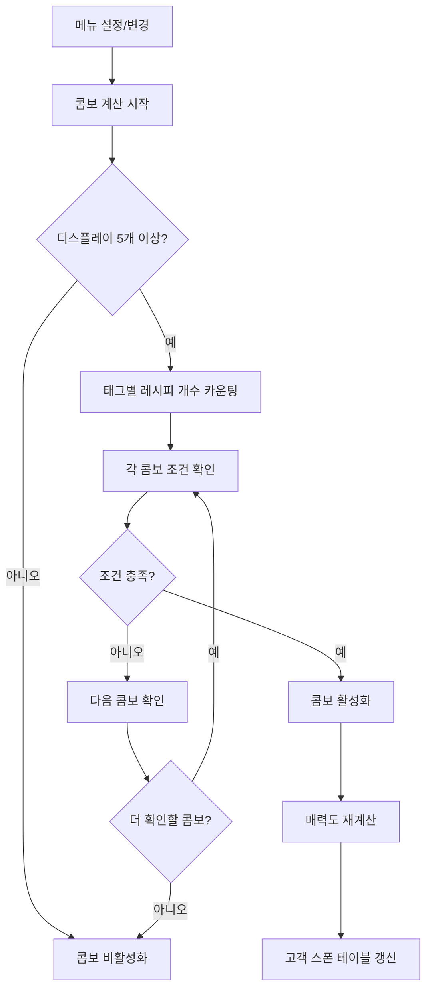
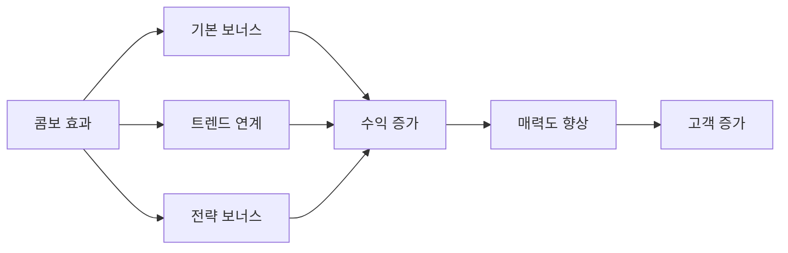

# 콤보와 특수 효과

## 개요

츄츄버거 콤보 시스템은 플레이어가 설정한 메뉴의 태그 조합을 분석하여 특별한 보너스 효과를 제공하는 고급 메커니즘입니다. 전략적인 메뉴 구성을 통해 수익을 극대화할 수 있으며, 트렌드 시스템과의 시너지를 통해 추가적인 혜택을 얻을 수 있습니다.

## 콤보 시스템의 구조

### RecipeComboData 구조체

```lua
-- RootDesk/MyDesk/04. Recipe/Data/RecipeComboData.mlua
@Struct
script RecipeComboData
    property integer Id = 0
    property string EffectTarget = ""           -- 효과 적용 대상 태그
    property number EffectAmount = 0            -- 효과 크기 (비율)
    property SyncTable<string, integer> CountTable  -- 태그별 필요 개수
    property string NameKey = ""               -- 콤보 이름 키
```

### 콤보 활성화 시스템



## 콤보 활성화 조건

### 기본 요구사항
`PlayerRecipe :: CalculateActiveRecipeCombo()`에서 구현:

1. **디스플레이 슬롯**: 5개 이상 필요 (`DisplayCount` 업그레이드)
2. **태그 조합**: 각 콤보별 지정된 태그의 최소 개수 충족
3. **우선순위**: 여러 콤보 조건 충족시 첫 번째 발견된 콤보 활성화

### 콤보 조건 확인 알고리즘

```lua
-- 현재 설정된 레시피들의 태그 카운팅
local tagCountTable = {}
for i, recipeId in pairs(self.SetRecipes) do
    local recipeData = self.Recipes[recipeId]
    local tag = recipeData.Tag
    tagCountTable[tag] = (tagCountTable[tag] or 0) + 1
end

-- 각 콤보 조건 확인
for comboId, comboData in pairs(_RecipeTagDataSetLogic.RecipeComboData) do
    local isCombo = true
    for tag, requiredCount in pairs(comboData.CountTable) do
        if (tagCountTable[tag] or 0) < requiredCount then
            isCombo = false
            break
        end
    end
    if isCombo then
        self.ActiveRecipeCombo = comboId
        return
    end
end
```

## 콤보 효과 시스템

### 가격 보너스
`RecipeDataSetLogic :: GetRecipeCost()`에서 적용:

```lua
if isComboBonusApplied then
    local isRecipeCombo = _RecipeTagDataSetLogic:IsRecipeComboActiveForTag(player, recipeData.Tag)
    if isRecipeCombo then
        local comboData = _RecipeTagDataSetLogic.RecipeComboData[player.PlayerRecipe.ActiveRecipeCombo]
        local comboBonus = comboData.EffectAmount
        cost = math.floor(cost * (1 + comboBonus + strategyBonus))
    end
end
```

### 효과 적용 대상

1. **특정 태그**: `EffectTarget`으로 지정된 태그의 레시피에만 적용
2. **전체 적용**: `EffectTarget`이 "All"인 경우 모든 레시피에 적용
3. **적용 없음**: `EffectTarget`이 "None"인 경우 효과 없음

### 트렌드 연계 보너스

콤보와 트렌드의 시너지 효과:
- 활성 콤보의 `EffectTarget`과 긍정 트렌드의 `TargetTag`가 일치할 때
- `_StrategyEnum.TrendMenuComboBonus` 전략 효과가 추가로 적용

## UI 표시 시스템

### UIRecipeComboInfo 컴포넌트

**주요 기능**:
- 모든 콤보 목록 표시
- 현재 활성화된 콤보 우선 표시
- 콤보별 상세 정보 제공

**핵심 메서드**:
- `Refresh()`: 콤보 목록 갱신 및 정렬

### UIRecipeComboInfoSlot 컴포넌트

**표시 정보**:
- 콤보 이름 및 설명
- 필요한 태그 조합 시각화
- 효과 크기 (백분율 표시)
- 활성화 상태 표시

**시각적 구분**:
```lua
-- 활성 콤보 색상
self.NameText.TextComponent.OutlineColor = _ColorCodeEnum:GetColor("#d98a1a")
self.DescText.TextComponent.FontColor = _ColorCodeEnum:GetColor("#93640a")
self.TopBG.SpriteGUIRendererComponent.Color = _ColorCodeEnum:GetColor("#fac629")

-- 비활성 콤보 색상  
self.NameText.TextComponent.OutlineColor = _ColorCodeEnum:GetColor("#919191")
self.DescText.TextComponent.FontColor = _ColorCodeEnum:GetColor("#737171")
self.TopBG.SpriteGUIRendererComponent.Color = _ColorCodeEnum:GetColor("#d3d3d3")
```

## 콤보 관리 시스템

### 자동 콤보 계산
메뉴 변경 시 자동으로 콤보 재계산:
- `SetRecipe()` - 메뉴 설정 시
- `UnsetRecipe()` - 메뉴 해제 시
- `ClearSetRecipes()` - 전체 메뉴 초기화 시

### 콤보 활성화 효과
콤보 활성화 시 연쇄 반응:
1. **업적 진행**: `_TutorialAchievementTypeEnum.MenuComboCount` 증가
2. **매력도 재계산**: `CustomerManager:CalcMyAttractive()` 호출
3. **스폰 테이블 갱신**: `CustomerManager:RefreshSpawnTable()` 호출
4. **비서 정보 갱신**: 빈 디스플레이 관련 ToDo 업데이트

## 전략적 활용

### 콤보 최적화 전략

1. **태그 균형**: 다양한 태그를 조합하여 여러 콤보 조건 동시 충족 시도
2. **트렌드 연계**: 긍정 트렌드와 콤보 효과 대상이 일치하는 상황 활용
3. **전략 연동**: `TrendMenuComboBonus` 전략으로 추가 보너스 확보

### 콤보 시너지 요소



## 특수 효과 시스템

### 콤보 발견 시스템
새로운 콤보 조건 달성 시:
- 자동으로 콤보 활성화
- 튜토리얼 진행도 업데이트
- 시각적 피드백 제공

### 숨겨진 콤보 메커니즘
- 데이터 테이블에 정의된 모든 콤보가 게임에서 발견 가능
- 플레이어는 다양한 태그 조합 실험을 통해 새로운 콤보 발견

## 코드 참조

### 핵심 데이터 구조
- `RootDesk/MyDesk/04. Recipe/Data/RecipeComboData.mlua :: RecipeComboData` — 콤보 데이터 구조체
- `RootDesk/MyDesk/04. Recipe/Data/RecipeTagDataSetLogic.mlua :: LoadDataSet()` — 콤보 데이터 로딩

### 콤보 계산 로직
- `RootDesk/MyDesk/00. Player/PlayerRecipe.mlua :: CalculateActiveRecipeCombo()` — 콤보 활성화 계산
- `RootDesk/MyDesk/04. Recipe/Data/RecipeTagDataSetLogic.mlua :: IsRecipeComboActiveForTag()` — 태그별 콤보 활성화 확인

### 콤보 효과 적용
- `RootDesk/MyDesk/04. Recipe/Data/RecipeDataSetLogic.mlua :: GetRecipeCost()` — 콤보 보너스 적용
- `RootDesk/MyDesk/00. Player/PlayerRecipe.mlua :: SetRecipe()` — 메뉴 설정 및 콤보 계산

### UI 구현
- `RootDesk/MyDesk/04. Recipe/UIScript/RecipeCombo/UIRecipeComboInfo.mlua :: Refresh()` — 콤보 목록 UI
- `RootDesk/MyDesk/04. Recipe/UIScript/RecipeCombo/UIRecipeComboInfoSlot.mlua :: Refresh()` — 개별 콤보 슬롯 UI
