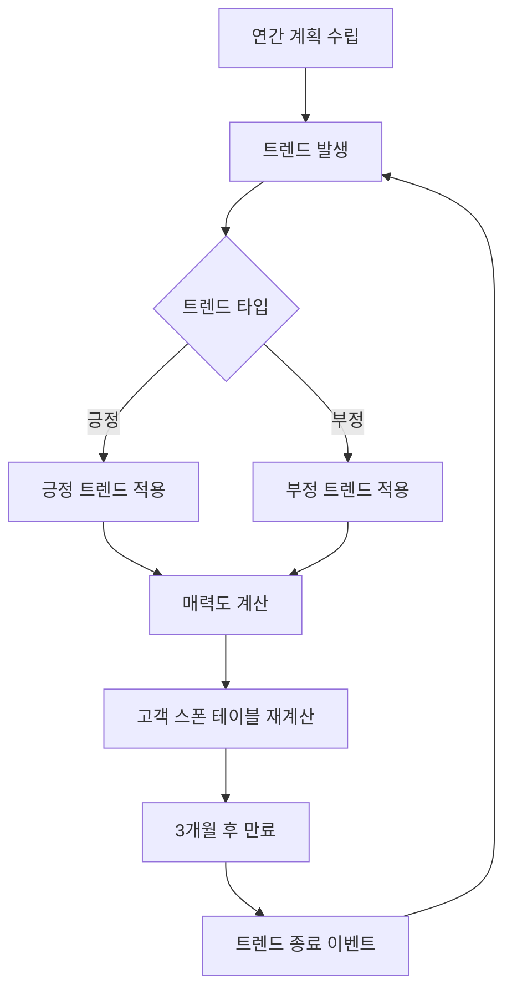

# 트렌드와 시장 반응

## 개요

츄츄버거 트렌드 시스템은 게임 내 시장 변화를 시뮬레이션하는 핵심 메커니즘입니다. 시간의 흐름에 따라 특정 음식 태그에 대한 고객들의 선호도가 변화하며, 플레이어는 이러한 트렌드를 파악하여 메뉴 구성을 조정해야 합니다.

## 트렌드 시스템의 구조

### TrendData 구조체

**트렌드 데이터 구조:**  
struct TrendData  
→ 트렌드의 기본 정보와 이벤트 연동을 정의하는 데이터 구조체입니다.

<details>
<summary>관련 코드</summary>

```lua
-- RootDesk/MyDesk/04. Recipe/Data/TrendData.mlua
@Struct
script TrendData
    property integer Id = 0
    property string Type = ""           -- "Positive" 또는 "Negative"
    property string TargetTag = ""      -- 대상 레시피 태그
    property string OccurEvent = ""     -- 트렌드 발생시 이벤트
    property string EndEvent = ""       -- 트렌드 종료시 이벤트
```
</details>

### 트렌드 관리 시스템



## 트렌드 발생 메커니즘

### 트렌드 생성 조건
- **시기**: 매년 (Year > 1)
- **스테이지**: 2스테이지 이상
- **발생**: 긍정 트렌드 100% + 부정 트렌드 30% 확률

### 트렌드 생성 알고리즘
`PlayerRecipe :: MakeNewTrend()`에서 구현:

1. **긍정 트렌드 선택**: 현재 활성 트렌드를 제외한 풀에서 랜덤 선택
2. **부정 트렌드 선택**: 긍정 트렌드와 다른 태그 중에서 30% 확률로 선택
3. **기존 트렌드 종료**: 새로운 트렌드 발생 시 기존 트렌드 종료
4. **이벤트 발생**: 트렌드 시작/종료 이벤트 호출

## 트렌드의 게임 효과

### 매력도 점수 영향

**부정 트렌드 패널티:**  
method CalcRecipeAttractive()  
→ 부정 트렌드에 해당하는 레시피의 매력도 점수를 감소시켜 고객의 선택 확률을 낮춥니다.

<details>
<summary>관련 코드</summary>

```lua
-- 부정 트렌드 영향
if recipeData.Tag == negativeTrendTag then
    recipeAttractiveScore = recipeAttractiveScore * (1 - penaltyForNegativeTrend)
end
```
</details>

### 콤보 보너스 연동
`RecipeDataSetLogic :: GetRecipeCost()`에서 트렌드와 콤보 연계:
- 긍정 트렌드 태그와 콤보 효과 대상이 일치할 경우 전략 보너스 적용
- `_StrategyEnum.TrendMenuComboBonus` 전략 효과 활용

### 리뷰 시스템 연동
`StoreInfoDataSetLogic`에서 고객 리뷰 점수 계산:
- **긍정 트렌드**: 해당 태그 메뉴가 없으면 점수 60점 감점
- **부정 트렌드**: 해당 태그 메뉴가 있으면 점수 60점 감점

## UI 표시 시스템

### UITrendInfo 컴포넌트
- **기능**: 개별 트렌드 정보 표시 (긍정/부정)
- **구현**: 트렌드 타입에 따른 색상 코딩 (#FFE92C / #863205)

### UITrendInfoBar 컴포넌트  
- **기능**: 현재 활성 트렌드 전체 표시
- **위치**: 레시피 관련 UI 상단 바

## 트렌드 생명주기 관리

### 트렌드 진행도
`PlayerRecipe :: ChangeTrendProgress()` - 매월 진행도 증가

### 트렌드 만료
`PlayerRecipe :: CheckTrendExpiry()` - 3개월 후 자동 만료:
- 만료 조건: `progress >= TrendExpireMonth (3)`
- 만료 시 종료 이벤트 발생

### 연간 계획
`PlayerRecipe :: SetYearlyPlan()` - 연간 트렌드 발생 스케줄 설정

## 이벤트 시스템 연동

### 트렌드 발생 이벤트
- `OccurEvent` 필드로 지정된 이벤트 호출
- 이벤트 참조 키로 `TargetTag` 전달

### 트렌드 종료 이벤트  
- `EndEvent` 필드로 지정된 이벤트 호출
- 트렌드 만료 시 자동 실행

## 전략적 활용

### 플레이어 대응 전략
1. **트렌드 모니터링**: UI를 통한 현재 트렌드 파악
2. **메뉴 조정**: 긍정 트렌드 태그 메뉴 추가, 부정 트렌드 태그 메뉴 제거
3. **콤보 활용**: 트렌드와 연계된 콤보 보너스 극대화

### 밸런스 설정
- `NegativeTrendWeight = 30`: 부정 트렌드 발생 확률
- `TrendExpireMonth = 3`: 트렌드 지속 기간
- `AttractiveScoreDownForNegativeTrendRecipe`: 부정 트렌드 패널티

## 코드 참조

### 핵심 구현
- `RootDesk/MyDesk/04. Recipe/Data/TrendData.mlua :: TrendData` — 트렌드 데이터 구조
- `RootDesk/MyDesk/04. Recipe/Data/RecipeDataSetLogic.mlua :: LoadDataSet()` — 트렌드 데이터 로딩
- `RootDesk/MyDesk/00. Player/PlayerRecipe.mlua :: MakeNewTrend()` — 트렌드 생성 로직
- `RootDesk/MyDesk/05. Customer/CustomerManager.mlua :: CalcRecipeAttractive()` — 트렌드 효과 적용

### UI 구현
- `RootDesk/MyDesk/04. Recipe/UIScript/Trend/UITrendInfo.mlua :: Refresh()` — 트렌드 정보 표시
- `RootDesk/MyDesk/04. Recipe/UIScript/Trend/UITrendInfoBar.mlua :: Refresh()` — 트렌드 바 업데이트

### 시간 관리
- `RootDesk/MyDesk/01. Lobby/TimeManager.mlua :: OnYearChanged()` — 연간 계획 설정
- `RootDesk/MyDesk/00. Player/PlayerRecipe.mlua :: CheckTrendExpiry()` — 트렌드 만료 확인
