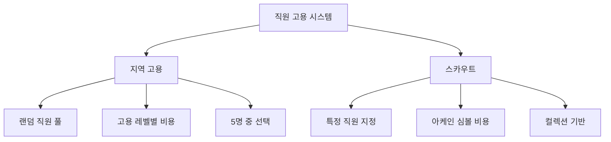

# 직원 고용과 관리

츄츄버거의 직원 고용과 관리 시스템은 다양한 방식으로 직원을 채용하고, 효율적으로 관리할 수 있는 포괄적인 인사 관리 시스템입니다.

## 1. 고용 시스템 개요

### 1.1 고용 방식 분류

직원 고용은 크게 두 가지 방식으로 이루어집니다:



### 1.2 고용 상태 관리

`PlayerEmployment` 컴포넌트가 모든 고용 프로세스를 관리합니다.

**관련 파일:**
- `RootDesk/MyDesk/11. Employment/PlayerEmployment.mlua`

**고용 상태:**
- **LevelButtonList**: 고용 타입 선택 단계
- **OnProcessing**: 지역 고용 진행 중
- **Scout**: 스카우트 진행 중
- **EmployeeList**: 직원 목록 표시 및 선택

## 2. 지역 고용 시스템

### 2.1 고용 프로세스

**지역 고용 처리:**  
method void OnProcessingRecruit(integer employmentId)  
→ 튜토리얼 상황을 확인하고, 랜덤 직원 풀에서 중복 없이 5명을 선택하여 고용 후보를 제시합니다.

<details>
<summary>관련 코드</summary>

```lua
@ExecSpace("ServerOnly")
method void OnProcessingRecruit(integer employmentId)
    -- 튜토리얼 중일 때는 고정 직원 제공
    if self.Entity.PlayerStage.NowStage == 1 then
        if self.Entity.PlayerAchievement:ReturnAchievementProgress(_TutorialAchievementTypeEnum.EmploymentCount) < 1 then
            self:Recruit_Fix(employmentId, _EmployeeTypeEnum.Serving)
            return
        end
    end
    
    -- 랜덤 직원 풀에서 5명 선택
    local empIdRandomBox = self:ReturnEmploymentChuchuPool(employmentId)
    for i = 1, self.DEFINE_EMPNUM do
        -- 중복 없이 5명 선택
        local idx = _UtilLogic:RandomIntegerRange(1, #empIdRandomBox)
        local newEmployeeId = empIdRandomBox[idx]
        empList[i] = newEmployeeId
        table.remove(empIdRandomBox, idx)
    end
end
```
</details>

### 2.2 고용 레벨 시스템

고용을 진행할수록 고용 레벨이 상승하며, 더 높은 등급의 직원을 만날 확률이 증가합니다.

**레벨업 조건:**
- 지역 고용 성공 시 고용 레벨 +1
- 스카우트 성공 시 스카우트 레벨 +1

**고용 비용 계산:**  
method integer ReturnCostByEmploymentLv()  
→ 현재 고용 레벨에 따른 지역 고용 비용을 데이터 테이블에서 조회하여 계산합니다.

<details>
<summary>관련 코드</summary>

```lua
method integer ReturnCostByEmploymentLv()
    local employmnetLv = math.min(self.EmploymentLv, self.MaxEmploymentCount)
    local costData = _DataService:GetTable("EmploymentLevelDataSet")
    local row = costData:FindRow("EmployementLevel", _StringUtilLogic:NumToString(employmnetLv))
    local employmentCost = _StringUtilLogic:StringToInt(row:GetItem("EmployementRandomCost"))
    return employmentCost
end
```
</details>

### 2.3 보증금 시스템

직원을 고용할 때는 보증금을 지불해야 하며, 이는 나중에 해고 시 일부 반환됩니다.

**관련 파일:**
- `RootDesk/MyDesk/02. Employee/EmployeeService.mlua`

**보증금 계산:**  
method integer ReturnDeposit(Entity player, integer employmentType)  
→ 고용 타입과 레벨에 따른 보증금을 계산하며, 스테이지별 보정을 적용합니다.

<details>
<summary>관련 코드</summary>

```lua
method integer ReturnDeposit(Entity player, integer employmentType)
    local deposit = 0
    local depositDataSet = _DataService:GetTable("EmploymentLevelDataSet")
    
    if employmentType == 1 then -- 지역 고용
        local employmentLv = math.min(player.PlayerEmployment.EmploymentLv, player.PlayerEmployment.MaxEmploymentCount)
        deposit = depositDataSet:GetRow(employmentLv):GetItem("RandomDepositCost")
    elseif employmentType == 2 then -- 스카우트
        local scoutLv = math.min(player.PlayerEmployment.ScoutLv, player.PlayerEmployment.MaxEmploymentCount)
        deposit = depositDataSet:GetRow(scoutLv):GetItem("ScoutDepositCost")
    end
    
    -- 스테이지별 보정 적용
    local stageConfig = _BalanceDataSetLogic:GetStageConfigData(player.PlayerStage.NowStage).EmploymentCostRate
    deposit = math.floor(deposit * (1 + stageConfig))
    
    return deposit
end
```
</details>

## 3. 스카우트 시스템

### 3.1 특정 직원 스카우트

스카우트는 컬렉션에서 원하는 특정 직원을 직접 고용할 수 있는 시스템입니다.

**프로세스:**
1. 아케인 심볼 비용 지불
2. 컬렉션에서 직원 선택
3. 즉시 고용 완료

**스카우트 처리:**  
method void OnSelectChuchuInCollection(string chuchuId)  
→ 컬렉션에서 선택한 특정 직원을 아케인 심볼 비용으로 즉시 고용합니다.

<details>
<summary>관련 코드</summary>

```lua
@ExecSpace("Server")
method void OnSelectChuchuInCollection(string chuchuId)
    local cost = self:ReturnCostByScoutLv()
    if self.Entity.PlayerInventory:ModifyArcaneSymbol(-cost, "Employment fee", "Select employeement type popup") then
        local empList = {}
        table.insert(empList, chuchuId)
        self.NewEmployeeIdList = empList
        self.EmploymentId = 2
        self:OnFinishRecruiting(self.NewEmployeeIdList, self.EmploymentId)
    end
end
```
</details>

### 3.2 스카우트 비용

스카우트 레벨에 따라 비용이 증가하며, 아케인 심볼로 결제합니다.

## 4. 직원 해고 (전근) 시스템

### 4.1 전근 UI

`UITransfer`를 통해 직원을 해고(전근)할 수 있습니다.

**관련 파일:**
- `RootDesk/MyDesk/11. Employment/UITransfer.mlua`
- `RootDesk/MyDesk/02. Employee/EmployeeManager.mlua`

**전근 실행:**  
method void TransferChuChu()  
→ 선택된 직원의 전근을 요청하고 UI를 닫습니다.

<details>
<summary>관련 코드</summary>

```lua
@ExecSpace("ClientOnly")
method void TransferChuChu()
    local player = _UserService.LocalPlayer
    player.EmployeeManager:RequestTransferEmployee(self.EmployeeId, true, "Transfer")
    self:CloseUI()
end
```
</details>

### 4.2 전근 보상

직원을 해고할 때 다음과 같은 보상을 받을 수 있습니다:

**전근 보상 지급:**  
method void RewardTransfer(string employeeId, integer refundHeart, table refundJem)  
→ 해고된 직원에 대한 하트와 경험치 아이템을 일부 환불처리합니다.

<details>
<summary>관련 코드</summary>

```lua
@ExecSpace("ServerOnly")
method void RewardTransfer(string employeeId, integer refundHeart, table refundJem)
    -- 하트 환불
    player.PlayerInventory:ModifyHeart(refundHeart, "Transfer fee", "Transfer popup")
    -- 경험치 아이템 환불
    player.PlayerInventory:AddItem(jemItemId, jemCost, "Transfer fee", "Transfer popup")
end
```
</details>

**환불 항목:**
- **하트**: 투자한 하트의 일정 비율
- **경험치 포션**: 사용한 경험치 아이템의 일부

### 4.3 전근 제한

일부 상황에서는 전근이 제한됩니다:
- 튜토리얼 진행 중
- 특정 업적 달성 과정
- 스쿠터 출장 진행 중인 직원

## 5. 고용 UI 시스템

### 5.1 고용 메인 UI

`UIEmployment`가 모든 고용 관련 UI를 관리합니다.

**관련 파일:**
- `RootDesk/MyDesk/11. Employment/UIEmployment.mlua`

**주요 기능:**
- **고용 타입 선택**: 지역 고용 vs 스카우트
- **직원 목록 표시**: 선택 가능한 직원들 표시
- **비용 정보**: 고용 비용과 보증금 표시
- **직원 상세정보**: 스탯, 스킬, 외관 미리보기

### 5.2 직원 선택 인터페이스

**직원 정보 표시:**
- 직원 이름과 등급
- 요리/서빙/이동속도 스탯
- 보유 스킬 정보
- 3D 모델 미리보기

**직원 선택 확인:**  
method void OnCilckEmpListButton(Entity selectedButton)  
→ 선택한 직원의 고용 가능 여부를 확인하고 고용 프로세스를 시작합니다.

<details>
<summary>관련 코드</summary>

```lua
@ExecSpace("Client")
method void OnCilckEmpListButton(Entity selectedButton)
    local player = _UserService.LocalPlayer
    player.PlayerEmployment:CheckCanEmployChuchu(selectedButton.UIEmployeeManageListRenderer.EmployeeId)
end
```
</details>

### 5.3 고용 결과 처리

**고용 성공 처리:**  
method void SuccessEmploy(string employeeId)  
→ 고용 성공 시 UI를 닫고 성공 메시지를 표시하며, Red Dot 상태를 업데이트합니다.

<details>
<summary>관련 코드</summary>

```lua
@ExecSpace("Client")
method void SuccessEmploy(string employeeId)
    self:CloseUI()
    local empData = _EmployeeService:GetData(employeeId)
    local name = _LocalizationService:GetText(empData.NameKey)
    _ReportMessageMaker:RequestAddToReportQueue(2003, name, "", "")
    _MainMenuRedDotManager:EnableEmploymentRedDot(false)
    _MainMenuRedDotManager:EnableEmployeeManageRedDot(true)
end
```
</details>

**실패 시:**
- 자금 부족 알림
- 고용 취소 처리

## 6. 직원 관리 시스템

### 6.1 직원 상태 관리

`EmployeeManager`가 모든 직원의 상태를 총괄 관리합니다.

**관리 정보:**
- **위치 정보**: 각 직원의 현재 배치 위치
- **작업 상태**: 요리/서빙/대기 상태
- **스탯 정보**: 레벨, 경험치, 스킬 등급
- **장비 정보**: 착용 중인 장비와 레벨

### 6.2 직원 AI 상태 제어

**직원 작업 시작:**  
method void EmployeeStateStart()  
→ 배치된 모든 직원들에게 적절한 AI 컴포넌트를 추가하여 작업을 시작시킵니다.

<details>
<summary>관련 코드</summary>

```lua
@ExecSpace("ClientOnly")
method void EmployeeStateStart()
    for idx, data in pairs(self.EmployeesLocation) do
        local locationData = data
        local employee = _UserService.LocalPlayer.CurrentMap:GetChildByName(locationData.Id)
        if isvalid(employee) then
            employee:AddComponent("EmployeeMoveScript")
            if locationData.Location == _EmployeeTypeEnum.Cook then
                employee:AddComponent("CookEmployeeAIScript")
            elseif locationData.Location == _EmployeeTypeEnum.Serving then
                employee:AddComponent("ServingEmployeeAIScript")
            end
        end
    end
end
```
</details>

**작업 중지:**
- AI 컴포넌트 제거
- 작업 중인 버거 정리
- 이동 스크립트 해제

### 6.3 직원 배치 관리

**배치 시스템:**
- 요리 직원: 주방 기기에 배치
- 서빙 직원: 서빙 구역에 배치
- 자동 최적 배치 기능
- 수동 위치 조정 가능

## 7. 튜토리얼 연동

### 7.1 초보자 지원

첫 번째 스테이지에서는 특별한 튜토리얼 지원이 제공됩니다:

**고정 직원 제공:**
- 첫 번째 고용: 서빙 직원 고정 제공
- 두 번째 고용: 요리 직원 고정 제공
- 특별 할인 가격 적용

### 7.2 업적 연동

고용 활동은 다양한 업적과 연동됩니다:
- **총 고용 횟수**: 고용한 직원 수 추적
- **직종별 고용**: 요리/서빙 직원별 고용 수
- **고용 레벨**: 고용 시스템 발전도

## 8. 경제 시스템과의 연동

### 8.1 비용 구조

**지역 고용:**
- 보증금: 골드로 지불
- 고용 레벨에 따른 비용 증가
- 스테이지별 보정 적용

**스카우트:**
- 스카우트 비용: 아케인 심볼로 지불
- 스카우트 레벨에 따른 비용 증가
- 특정 직원 확정 고용

### 8.2 정산 시스템 연동

고용한 직원의 급여는 월말 정산에서 자동으로 차감됩니다:
- 직원별 급여 계산
- 한계돌파 레벨에 따른 급여 증가
- 적자 시 직원 해고 위험

### 8.3 투자 수익률

직원 고용은 명확한 투자 수익률을 제공합니다:
- **작업 효율**: 직원 수 증가로 인한 처리량 증가
- **고급 직원**: 높은 스탯의 직원일수록 높은 성능
- **장기 투자**: 레벨업을 통한 지속적 성능 향상

## 9. 고용 데이터 관리

### 9.1 데이터 저장

모든 고용 관련 정보는 데이터베이스에 안전하게 저장됩니다:

**고용 데이터 저장:**  
method void SaveToDB(table saveData)  
→ 고용 상태, 레벨, 직원 목록 등 모든 고용 관련 정보를 문자열로 변환하여 저장합니다.

<details>
<summary>관련 코드</summary>

```lua
@ExecSpace("ServerOnly")
method void SaveToDB(table saveData)
    local employmentTotal = {}
    employmentTotal["NewEmployeeIdList"] = _UtilLogic:TableToString(self.NewEmployeeIdList)
    employmentTotal["EmploymentState"] = self.EmploymentState
    employmentTotal["EmploymentLv"] = tostring(self.EmploymentLv)
    employmentTotal["ScoutLv"] = tostring(self.ScoutLv)
    employmentTotal["RerollCount"] = tostring(self.RerollCount)
    saveData["EmploymentData"] = employmentTotal
end
```
</details>

### 9.2 로깅 시스템

모든 고용 활동은 상세히 로그로 기록됩니다:
- 고용 타입과 결과
- 비용과 보상 내역
- 직원 정보와 스탯

이러한 포괄적인 고용과 관리 시스템을 통해 플레이어는 전략적으로 직원을 채용하고 효율적으로 관리하여 가게 운영의 성공을 달성할 수 있습니다.
