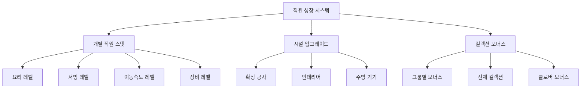
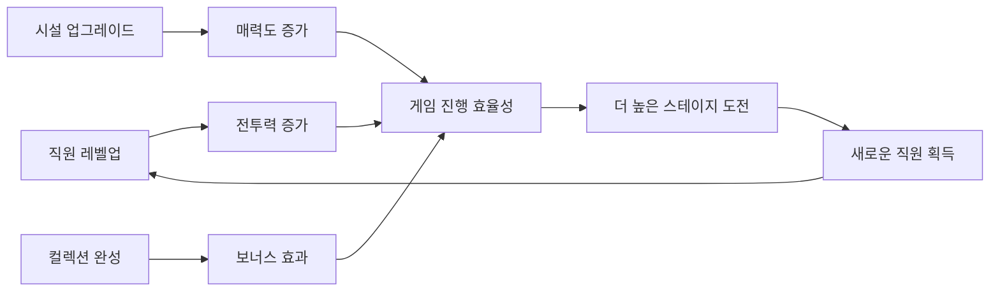

# 직원 레벨업과 스킬

츄츄버거의 직원 성장 시스템은 경험치 아이템을 사용한 레벨업, 시설 업그레이드를 통한 가게 개선, 그리고 직원 컬렉션을 통한 보너스 효과를 포함한 종합적인 성장 메커니즘입니다.

## 1. 직원 레벨업 시스템 개요

### 1.1 성장 구조

직원의 성장은 다음과 같은 계층적 구조로 이루어집니다:



## 2. 직원 개별 레벨업

### 2.1 경험치 아이템 시스템

직원의 레벨업은 경험치 포션을 사용하여 이루어집니다.

**관련 파일:**
- `RootDesk/MyDesk/02. Employee/Upgrade/EmployeeUpgradeService.mlua`

**포션 종류:**
- **요리 포션**: M0001~M0005 (요리 스탯 강화)
- **서빙 포션**: M1001~M1005 (서빙 스탯 강화)
- **이동속도 포션**: 스탯 타입별 전용 아이템

**레벨업 계산:**  
method table CalcNextUpgradeData(string statType, string empId, number potionExp, Entity player)  
→ 현재 경험치와 포션 경험치를 합산하여 다음 레벨을 계산합니다.

<details>
<summary>관련 코드</summary>

```lua
method table CalcNextUpgradeData(string statType, string empId, number potionExp, Entity player)
    local detail = player.EmployeeManager:GetEmployeeDetail(empId):ConvertToTable()
    local empStatExp = detail[statType.."Exp"]
    local empStatLevel = math.max(1,detail[statType.."Level"])
    -- 경험치 계산 및 다음 레벨 결정
    local nextLevel = self:ReturnNextLevelOfExpSum(curExp,statType, player)
end
```
</details>

### 2.2 레벨업 계산 시스템

**경험치 누적 방식:**
1. **현재 경험치** + **포션 경험치** = **총 경험치**
2. **총 경험치**를 기반으로 **새로운 레벨** 계산
3. **최대 레벨** 제한 확인
4. **여분 경험치** 처리

**자동 레벨업 기능:**
- 목표 레벨 설정 시 필요한 포션 자동 계산
- 보유 포션으로 달성 가능한 최대 레벨 제안
- 부족한 경우 가능한 범위로 조정

### 2.3 한계돌파 시스템

직원이 최대 레벨에 도달한 후 추가 강화가 가능합니다.

**한계돌파 효과:**
- **1단계**: 스킬 1개 해제
- **2단계**: 스킬 2개 해제  
- **3단계**: 스킬 3개 해제

**스킬 해제 계산:**  
method integer ReturnSkillNumByOverLimitLevel(integer overLimitLevel)  
→ 한계돌파 단계에 따라 해제되는 스킬 개수를 결정합니다.

<details>
<summary>관련 코드</summary>

```lua
method integer ReturnSkillNumByOverLimitLevel(integer overLimitLevel)
    if overLimitLevel == 0 or overLimitLevel == 1 then
        return 1
    elseif overLimitLevel == 2 then
        return 2
    elseif overLimitLevel == 3 then
        return 3
    end
end
```
</details>

## 3. 장비 업그레이드 시스템

### 3.1 장비 레벨 관리

각 직원은 개별적인 장비 레벨을 가지며, 이는 스킬 등급에 직접적인 영향을 미칩니다.

**관련 파일:**
- `RootDesk/MyDesk/02. Employee/EmployeeManager.mlua`

**장비 레벨 상승:**  
method void AddEmployeeEquipLevel(string employeeId)  
→ 직원 장비 레벨을 상승시키고 스킬 등급을 업데이트합니다.

<details>
<summary>관련 코드</summary>

```lua
@ExecSpace("ServerOnly")
method void AddEmployeeEquipLevel(string employeeId)
    self.EmployeeOutgameDetailTable[employeeId].EquipLevel += 1
    local equipLevel = self.EmployeeOutgameDetailTable[employeeId].EquipLevel
    local data = _EmployeeEquipUpgradeDataLogic:GetEmployeeEquipUpgrageData(equipLevel)
    self.EmployeeOutgameDetailTable[employeeId].Skill1Grade = data.Skill1Grade
    self.EmployeeOutgameDetailTable[employeeId].Skill2Grade = data.Skill2Grade
end
```
</details>

### 3.2 스킬 등급 시스템

장비 레벨에 따라 스킬의 효과가 향상됩니다:
- **Skill1Grade**: 첫 번째 스킬의 효과 레벨
- **Skill2Grade**: 두 번째 스킬의 효과 레벨

### 3.3 장비 업그레이드 연동

장비 업그레이드 시 다음과 같은 시스템이 연동됩니다:
- **컬렉션 퍼센트** 재계산
- **배지 진행도** 업데이트
- **클라이언트 동기화**

## 4. 시설 업그레이드 시스템

### 4.1 업그레이드 관리자

`PlayerUpgrade` 컴포넌트가 모든 시설 업그레이드를 총괄 관리합니다.

**관련 파일:**
- `RootDesk/MyDesk/00. Player/PlayerUpgrade.mlua`

**관리 대상:**
- **확장 공사**: 가게 크기 확장
- **인테리어**: 바닥, 벽 꾸미기
- **데코레이션**: 장식품 배치
- **주방 기기**: 그릴, 디스플레이, 카운터

### 4.2 업그레이드 실행 과정

**업그레이드 실행 과정:**  
method void RequestApplyUpgradeDataServer(integer typeId, boolean isCheat)  
→ 업그레이드 타입별로 적절한 서비스를 호출하여 시설을 개선하고 관련 업적을 업데이트합니다.

<details>
<summary>관련 코드</summary>

```lua
@ExecSpace("ServerOnly")
method void RequestApplyUpgradeDataServer(integer typeId, boolean isCheat)
    -- 업그레이드 타입별 처리
    if typeId == _UpgradeTypeEnum.ExpansionStep then
        _LobbyRenovationService:ExpandLobby(expansionLv,interiorLv,decoLv,grillCount,displayCount,counterCount,self.Entity)
        self.Entity.CustomerManager:CalcMyAttractive()
    elseif typeId == _UpgradeTypeEnum.InteriorLevel then
        _LobbyRenovationService:RedesignInterior(interiorLv,expansionLv, decoLv)
        self.Entity.PlayerAchievement:ChangeProgress(_AchievementTypeEnum.Interior, level)
    end
end
```
</details>

### 4.3 업그레이드 효과

**확장 공사:**
- 고객 수용 능력 증가
- 직원 배치 공간 확대
- 새로운 기능 해제

**인테리어 업그레이드:**
- 가게 매력도 증가
- 고객 만족도 향상
- 시각적 개선

**주방 기기:**
- 요리 효율성 향상
- 디스플레이 용량 증가
- 서빙 속도 개선

## 5. 직원 컬렉션 시스템

### 5.1 컬렉션 데이터베이스

`ChuchuCollectionDB`가 모든 직원 컬렉션을 관리합니다.

**관련 파일:**
- `RootDesk/MyDesk/02. Employee/ChuchuCollection/ChuchuCollectionDB.mlua`

**저장 정보:**
- **직원 수집 상태**: 각 직원별 수집 여부
- **스테이지별 진행도**: 스테이지별 컬렉션 완성도
- **그룹 레벨**: 직원 그룹별 달성 레벨
- **보상 수령 상태**: 컬렉션 보상 획득 여부

### 5.2 컬렉션 진행도 계산

**컬렉션 진행도 계산:**  
method void CountCollectionPercent()  
→ 직원 수집과 장비 보유를 가중치를 적용하여 전체 컬렉션 완성도를 백분율로 계산합니다.

<details>
<summary>관련 코드</summary>

```lua
@ExecSpace("ServerOnly")
method void CountCollectionPercent()
    local chuchuData = _EmployeeService.EmployeeData
    local maxCount = #table.keys(chuchuData) * (self.EquipCountWeight + self.ChuchuCountWeight)
    local count = 0
    -- 직원 수집: 가중치 1
    -- 장비 보유: 가중치 3
    local percent = (count / maxCount)
    self.CollectionPercent = percent * 100
end
```
</details>

**컬렉션 보너스:**
- **클로버 보너스**: 컬렉션 진행도에 비례한 클로버 획득량 증가
- **그룹 보너스**: 특정 그룹 완성 시 이동속도 보너스

### 5.3 그룹 레벨 시스템

각 직원 그룹은 다음 조건에 따라 레벨이 결정됩니다:

**그룹 레벨 계산:**  
method integer CalcGroupLevel(integer groupId)  
→ 그룹 내 모든 직원의 수집 및 장비 레벨 조건을 확인하여 그룹 레벨을 결정합니다.

<details>
<summary>관련 코드</summary>

```lua
method integer CalcGroupLevel(integer groupId)
    -- 모든 그룹 직원 수집 필수
    -- 장비 레벨 조건: 0, 2, 4, 6, 8
    local conditionLevelList = {0, 2, 4, 6, 8}
    -- 각 단계별로 모든 직원이 해당 장비 레벨 달성해야 함
end
```
</details>

**그룹 보너스 효과:**
- **레벨당 이동속도**: 각 그룹 레벨마다 일정 이동속도 증가
- **최대 6레벨**: 모든 직원 장비 레벨 8 달성 시

### 5.4 컬렉션 보상

**개별 직원 보상:**
- 새로운 직원 수집 시 **50 다이아몬드** 지급
- 수집 즉시 보상 지급

**단계별 보상:**
- **50% 달성**: 1000 다이아몬드
- **100% 달성**: 2000 다이아몬드

**그룹 레벨 보상:**
- 각 그룹별 레벨 달성 시 단계별 보상
- 비트마스크를 활용한 중복 수령 방지

## 6. 성장 시스템 상호작용

### 6.1 통합적 성장 구조

모든 성장 시스템은 서로 유기적으로 연결되어 있습니다:



### 6.2 업적 시스템 연동

성장 활동은 다음과 같은 업적 진행도에 영향을 미칩니다:
- **인테리어 업그레이드**: 인테리어 레벨 업적
- **장비 강화**: 장비 업그레이드 배지 진행도
- **시설 확장**: 확장 관련 업적
- **컬렉션**: 수집 관련 업적

### 6.3 자동화 기능

**자동 레벨업:**
- 목표 레벨 설정 시 필요 포션 자동 계산
- 보유 자원 범위 내 최적 레벨업 제안

**자동 설정:**
- 가능한 최대 업그레이드 레벨 제안
- 비용 대비 효율성 분석

## 7. 경제 시스템과의 연동

### 7.1 비용 관리

**레벨업 비용:**
- 경험치 포션 소모
- 포션 등급별 효율성 차이

**업그레이드 비용:**
- 골드, 하트, 다이아몬드 등 다양한 재화
- 레벨별 비용 증가 곡선

**컬렉션 비용:**
- 직원 고용 비용
- 장비 업그레이드 비용

### 7.2 투자 수익률

각 성장 시스템은 명확한 투자 수익률을 제공합니다:
- **직원 레벨업**: 작업 효율성 향상
- **시설 업그레이드**: 고객 수용량 및 만족도 증가
- **컬렉션**: 지속적인 보너스 효과

이러한 종합적인 성장 시스템을 통해 플레이어는 다양한 방향으로 가게를 발전시키며, 각각의 투자가 게임 플레이에 실질적인 도움이 되도록 설계되어 있습니다.
