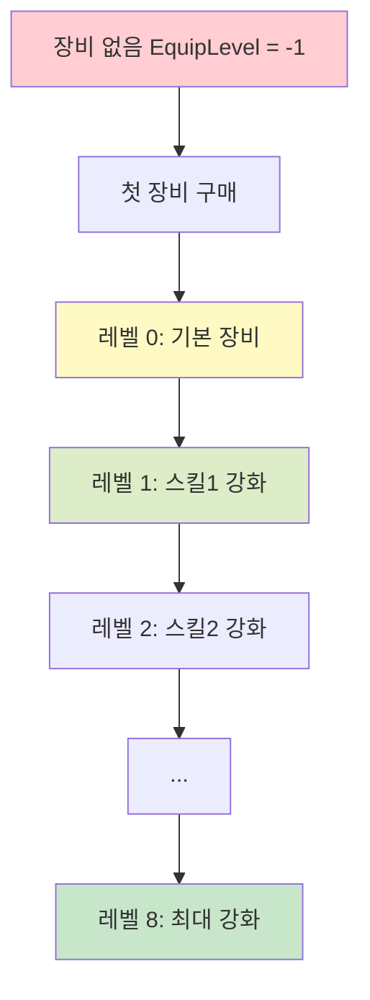

# 직원 장비와 커스터마이징

츄츄버거의 직원 장비 시스템은 직원의 성능 향상과 시각적 커스터마이징을 동시에 제공하는 핵심 성장 메커니즘입니다. 확률 기반 업그레이드와 다양한 외관 변화를 통해 플레이어에게 깊이 있는 육성 재미를 선사합니다.

## 1. 장비 시스템 개요

### 1.1 장비 레벨 구조



### 1.2 장비 효과

장비를 착용하면 다음과 같은 변화가 발생합니다:
- **성능 향상**: 스킬 등급 증가로 작업 효율성 개선
- **시각적 변화**: 모든 애니메이션이 장비 버전으로 전환
- **컬렉션 진행도**: 전체 컬렉션 퍼센트에 기여

## 2. 장비 데이터 시스템

### 2.1 장비 업그레이드 데이터

`EmployeeEquipUpgradeData`가 각 레벨별 장비 정보를 관리합니다.

**관련 파일:**
- `RootDesk/MyDesk/Shop/EmployeeEquip/Data/EmployeeEquipUpgradeData.mlua`
- `RootDesk/MyDesk/Shop/EmployeeEquip/EmployeeEquipUpgradeDataLogic.mlua`

**장비 데이터 구조:**  
struct EmployeeEquipUpgradeData  
→ 장비 레벨별 스킬 등급, 업그레이드 비용 및 성공 확률을 정의하는 데이터 구조입니다.

<details>
<summary>관련 코드</summary>

```lua
@Struct
script EmployeeEquipUpgradeData
    property integer EquipLevel = 0        -- 장비 레벨
    property integer Skill1Grade = 0       -- 첫 번째 스킬 등급
    property integer Skill2Grade = 0       -- 두 번째 스킬 등급
    property integer UpgradeCost = 0       -- 업그레이드 비용
    property integer UpgradeProb = 0       -- 업그레이드 성공 확률
    property string EquipLevelDescKey = "" -- 장비 설명 키
end
```
</details>

### 2.2 최대 업그레이드 레벨

현재 시스템에서는 **8레벨**이 최대 업그레이드 레벨로 설정되어 있습니다.

## 3. 장비 구매 시스템

### 3.1 첫 장비 구매

직원이 처음 장비를 구매할 때는 특별한 아이템이 필요합니다.

**관련 파일:**
- `RootDesk/MyDesk/Shop/BMCommon/PaidLogic.mlua`

**장비 구매 처리:**  
method void RequestPurchaseEmployeeEquip(string employeeId, string userId)  
→ 장비를 소유하지 않은 직원에게 장비 구매 아이템을 소모하여 첫 장비를 지급합니다.

<details>
<summary>관련 코드</summary>

```lua
@ExecSpace("Server")
method void RequestPurchaseEmployeeEquip(string employeeId, string userId)
    -- 장비를 아직 구매하지 않은 경우에만 (EquipLevel == -1)
    if employeeOutgameDetailData.EquipLevel ~= -1 then
        return -- 이미 장비 보유
    end
    
    -- 장비 구매 아이템 소모하고 레벨을 0으로 설정
    userEntity.PlayerInventory:RemoveItem(_ItemDataEnum.EmployeeEquipOpenItemId, 1, "Employee Equip Open")
    userEntity.EmployeeManager:AddEmployeeEquipLevel(employeeId)
end
```
</details>

첫 장비 구매 시에는 특별한 구매 아이템이 필요하며, 구매 완료 시 EquipLevel이 -1에서 0으로 변경됩니다.

### 3.2 구매 후 처리

장비 구매 완료 시 다음과 같은 처리가 이루어집니다:
- **애니메이션 업데이트**: 장비 착용 애니메이션으로 변경
- **배지 진행도**: 장비 구매 배지 진행도 증가
- **로깅**: 장비 구매 로그 기록

## 4. 장비 업그레이드 시스템

### 4.1 확률 기반 업그레이드

장비 업그레이드는 확률 기반으로 진행됩니다.

**업그레이드 실행:**  
method void RequestUpgradeEmployeeEquip(string employeeId, string userId, string currencyId)  
→ 비용을 차감하고 확률에 따라 장비 업그레이드 성공 여부를 결정합니다.

<details>
<summary>관련 코드</summary>

```lua
@ExecSpace("Server")
method void RequestUpgradeEmployeeEquip(string employeeId, string userId, string currencyId)
    local equipUpgradeData = _EmployeeEquipUpgradeDataLogic:GetEmployeeEquipUpgrageData(nextEquipLevel)
    local upgradeCost = equipUpgradeData.UpgradeCost
    local upgradeProb = equipUpgradeData.UpgradeProb
    
    -- 비용 차감 후 확률 계산으로 성공/실패 결정
    userEntity.PlayerInventory:RemoveItem(currencyId, upgradeCost, "Employee Equip Upgrade")
    local res = self:UpgradeProcess(upgradeProb)
    
    if res then
        userEntity.EmployeeManager:AddEmployeeEquipLevel(employeeId) -- 성공
    end
end
```
</details>

업그레이드는 실패해도 아이템이 소모되는 확률 기반 시스템입니다.

### 4.2 확률 계산 시스템

업그레이드 성공 여부는 정교한 랜덤 시드 시스템으로 결정됩니다:

**확률 계산 시스템:**  
method boolean UpgradeProcess(integer upgradeProb)  
→ 복잡한 시드 생성을 통해 예측 불가능한 랜덤 결과를 생성합니다.

<details>
<summary>관련 코드</summary>

```lua
@ExecSpace("Server")
method boolean UpgradeProcess(integer upgradeProb)
    -- 복잡한 시드 생성으로 예측 불가능한 랜덤 보장
    local seedOffset = 1
    for i=1, 10 do
        seedOffset = math.random(1, 100000)
    end
    local seed = os.time() * 1000000 + os.clock() * 1000000 + seedOffset
    math.randomseed(seed)
    
    local res = math.random(1, 100)
    
    -- 결과가 확률 이하면 성공
    if res <= upgradeProb then
        return true
    end
    
    return false
end
```
</details>

### 4.3 업그레이드 비용

업그레이드에는 다음과 같은 비용이 소모됩니다:
- **주문서 아이템**: 레벨별로 다른 수량 필요
- **레벨별 증가**: 높은 레벨일수록 더 많은 비용 요구
- **실패 시 소모**: 실패해도 아이템은 소모됨

## 5. 스킬 등급 시스템

### 5.1 장비 레벨과 스킬 등급 연동

장비 레벨이 올라갈 때마다 스킬 등급이 자동으로 증가합니다.

**관련 파일:**
- `RootDesk/MyDesk/02. Employee/EmployeeManager.mlua`

**스킬 등급 업데이트:**  
method void AddEmployeeEquipLevel(string employeeId)  
→ 장비 레벨 상승 시 해당 직원의 스킬 등급을 자동으로 업데이트합니다.

<details>
<summary>관련 코드</summary>

```lua
@ExecSpace("ServerOnly")
method void AddEmployeeEquipLevel(string employeeId)
    self.EmployeeOutgameDetailTable[employeeId].EquipLevel += 1
    
    local equipLevel = self.EmployeeOutgameDetailTable[employeeId].EquipLevel
    local data = _EmployeeEquipUpgradeDataLogic:GetEmployeeEquipUpgrageData(equipLevel)
    
    -- 스킬 등급 자동 업데이트
    self.EmployeeOutgameDetailTable[employeeId].Skill1Grade = data.Skill1Grade
    self.EmployeeOutgameDetailTable[employeeId].Skill2Grade = data.Skill2Grade
end
```
</details>

### 5.2 스킬 등급별 효과

스킬 등급이 높아질수록 다음과 같은 효과를 받습니다:
- **작업 속도 향상**: 요리/서빙 시간 단축
- **특수 효과**: 고급 스킬 발동 확률 증가
- **효율성 증가**: 전반적인 작업 성능 개선

## 6. 시각적 커스터마이징

### 6.1 애니메이션 전환

장비를 착용하면 모든 애니메이션이 장비 버전으로 전환됩니다.

**관련 파일:**
- `RootDesk/MyDesk/02. Employee/EmployeeData.mlua`
- `RootDesk/MyDesk/02. Employee/EmployeeUIService.mlua`

**애니메이션 리소스 구조:**  
장비 착용 여부에 따라 다른 애니메이션 리소스를 사용합니다.

<details>
<summary>관련 코드</summary>

```lua
-- 기본 애니메이션
property string StandRUID = ""     -- 서있는 자세
property string ChatRUID = ""      -- 대화 모션  
property string MoveRUID = ""      -- 이동 모션
property string WorkRUID = ""      -- 작업 모션

-- 장비 착용 시 애니메이션
property string EquipStandRUID = "" -- 장비 착용 서있는 자세
property string EquipChatRUID = ""  -- 장비 착용 대화 모션
property string EquipMoveRUID = ""  -- 장비 착용 이동 모션
property string EquipWorkRUID = ""  -- 장비 착용 작업 모션
```
</details>

### 6.2 초상화 시스템

UI에서도 장비 착용 상태가 반영됩니다:

**초상화 장비 처리:**  
method void DrawPortraitWithEquip(Entity portraitEntity, Entity equipEntityParent, EmployeeData data)  
→ 직원의 장비 착용 상태에 따라 UI 초상화에 적절한 이미지를 표시합니다.

<details>
<summary>관련 코드</summary>

```lua
@ExecSpace("ClientOnly")
method void DrawPortraitWithEquip(Entity portraitEntity, Entity equipEntityParent, EmployeeData data)
    local outgameData = player.EmployeeManager:GetEmployeeOutgameDetail(data.Id)
    
    local hasEquip = false
    if isvalid(outgameData) and outgameData.EquipLevel >= 0 then
        equipEntity.SpriteGUIRendererComponent.ImageRUID = data.EquipStandRUID
        hasEquip = true
    else
        equipEntity.SpriteGUIRendererComponent.ImageRUID = _IconRuidEnum.Empty
    end
end
```
</details>

### 6.3 장비 아이콘과 이름

각 직원별로 고유한 장비 디자인을 가집니다:
- **EquipIcon**: 장비 아이콘 리소스
- **EquipNameKey**: 장비 이름 지역화 키

## 7. 장비 상점 UI

### 7.1 상점 인터페이스

`UIEmployeeEquipShop`이 장비 구매와 업그레이드 UI를 관리합니다.

**관련 파일:**
- `RootDesk/MyDesk/Shop/EmployeeEquip/UIEmployeeEquipShop.mlua`

**주요 기능:**
- **장비 구매**: 첫 장비 구매 처리
- **업그레이드**: 확률 기반 장비 강화
- **비용 표시**: 필요한 아이템과 성공 확률 표시
- **결과 피드백**: 업그레이드 성공/실패 애니메이션

### 7.2 업그레이드 결과 처리

**업그레이드 결과 알림:**  
method void NotifyUpgradeEmployeeEquipToClient(boolean res, string itemId, integer count, integer equipLevel, string employeeId)  
→ 업그레이드 결과를 클라이언트에 전달하고 직원 데이터를 동기화합니다.

<details>
<summary>관련 코드</summary>

```lua
@ExecSpace("Client")
method void NotifyUpgradeEmployeeEquipToClient(boolean res, string itemId, integer count, integer equipLevel, string employeeId)
    self.UIEmployeeEqiupShop:OnUpgradeEquipCompleted(res, itemId, count, equipLevel)
    -- 직원 상세 데이터 동기화
    local player = _UserService.LocalPlayer
    player.EmployeeManager:CallbackAfterSyncDetailTable(player.EmployeeManager:GetEmployeeDetail(employeeId))
end
```
</details>

## 8. 컬렉션 시스템 연동

### 8.1 컬렉션 진행도 계산

장비 업그레이드는 컬렉션 시스템과 직접 연동됩니다.

**가중치 시스템:**
- **직원 수집**: 가중치 1
- **장비 보유**: 가중치 3

장비를 착용한 직원은 컬렉션에서 3배의 가중치를 가지며, 이는 클로버 보너스 계산에 직접 영향을 미칩니다.

### 8.2 배지 시스템 연동

장비 관련 활동은 다음과 같은 배지 진행도에 영향을 미칩니다:
- **EmployeeEquipBuyCount**: 장비 구매 횟수
- **EmployeeEquipUpgradeCount**: 장비 업그레이드 성공 횟수
- **EmployeeEquipUpgradeLevel**: 최고 장비 레벨 달성

## 9. 경제 시스템과의 연동

### 9.1 비용 구조

**첫 장비 구매:**
- 특별 아이템 소모 (EmployeeEquipOpenItemId)
- 일회성 비용

**업그레이드:**
- 주문서 아이템 소모
- 레벨별 비용 증가
- 실패 시에도 아이템 소모

### 9.2 투자 수익률

장비 투자는 다음과 같은 수익을 제공합니다:
- **작업 효율**: 스킬 등급 향상으로 인한 성능 증가
- **클로버 보너스**: 컬렉션 진행도 기여로 인한 보너스
- **장기 투자**: 한 번 업그레이드하면 영구적 효과

## 10. 개발자 도구와 시뮬레이션

### 10.1 업그레이드 시뮬레이터

개발 단계에서 확률 시스템을 검증하기 위한 시뮬레이터를 제공합니다:

**단일 레벨 시뮬레이션:**  
method void EmployeeEquipUpgradeSimulator1(integer equipLevel, integer tryCount, string userId)  
→ 지정된 레벨에서 여러 번 업그레이드를 시도하여 실제 성공률을 검증합니다.

<details>
<summary>관련 코드</summary>

```lua
@ExecSpace("ServerOnly")
method void EmployeeEquipUpgradeSimulator1(integer equipLevel, integer tryCount, string userId)
    local data = _EmployeeEquipUpgradeDataLogic:GetEmployeeEquipUpgrageData(equipLevel)
    local upgradeProb = data.UpgradeProb
    
    local successCount = 0
    for i=1, tryCount do
        if self:UpgradeProcess(upgradeProb) then
            successCount += 1
        end
    end
    
    local text = string.format("%d강을 %d번 시도하여 %d번 성공했습니다. (확률: %d%% / 실제: %.2f%%)", 
        equipLevel, tryCount, successCount, upgradeProb, successCount/tryCount * 100)
end
```
</details>

### 10.2 전체 시뮬레이션

최대 레벨까지의 총 소모 비용을 계산하는 시뮬레이터도 제공됩니다.

## 11. 로깅과 분석

### 11.1 상세 로깅

모든 장비 관련 활동은 상세히 로그로 기록됩니다:
- **구매 로그**: 장비 구매 시점과 비용
- **업그레이드 로그**: 성공/실패, 확률, 비용, 보유 아이템 수
- **결과 로그**: 업그레이드 전후 레벨 비교

### 11.2 밸런스 분석

로그 데이터를 통해 다음과 같은 분석이 가능합니다:
- **실제 확률 vs 이론 확률** 비교
- **플레이어별 투자 패턴** 분석
- **아이템 소모량** 추적
- **성공률 분포** 확인

이러한 종합적인 장비 시스템을 통해 플레이어는 전략적으로 직원을 강화하며, 시각적 만족감과 성능 향상을 동시에 얻을 수 있습니다. 확률 기반 시스템은 긴장감을 제공하면서도, 실패 시에도 진전이 있다는 느낌을 주도록 설계되어 있습니다.
