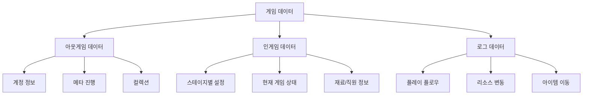
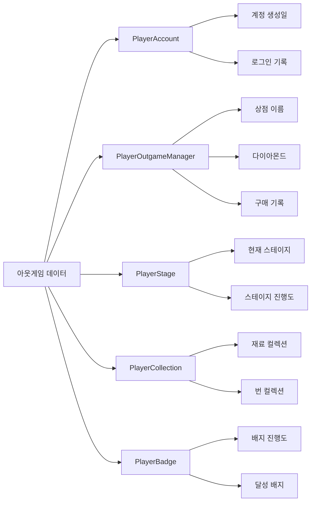

# 게임 데이터 저장

츄츄버거의 게임 데이터 저장 시스템은 플레이어의 모든 게임 진행상황과 설정을 안전하게 보관하는 핵심 시스템입니다. 아웃게임과 인게임 데이터를 분리하여 관리하며, 포괄적인 로깅 시스템을 통해 플레이어 행동 데이터를 수집합니다.

## 1. 데이터 저장 시스템 개요

### 1.1 데이터 분류 구조

게임 데이터는 다음과 같이 분류되어 관리됩니다:



## 2. 데이터베이스 관리자 (PlayerDBManager)

### 2.1 핵심 기능

`PlayerDBManager`는 모든 플레이어 데이터의 저장과 로드를 총괄하는 중앙 관리자입니다.

**관련 파일:**
- `RootDesk/MyDesk/00. Player/PlayerDBManager.mlua`

**주요 메서드:**  
method void SaveToDB(boolean isWait)  
→ 아웃게임 데이터와 인게임 데이터를 각각 분리하여 저장하며, 스테이지 진행 상태에 따라 선택적으로 인게임 데이터를 저장합니다.

<details>
<summary>관련 코드</summary>

```lua
@ExecSpace("ServerOnly")
method void SaveToDB(boolean isWait)
    -- 아웃게임 데이터 저장
    local outgameSaveData = {}
    self.Entity.PlayerAccount:SaveToDB(outgameSaveData)
    self.Entity.PlayerOutgameManager:SaveToDB(outgameSaveData)
    
    -- 인게임 데이터 저장 (스테이지 진행 중일 때만)
    if self.IsOnStage == true then
        local ingameSaveData = {}
        self.Entity.PlayerIngameManager:SaveToDB(ingameSaveData)
        -- ... (기타 인게임 컴포넌트들)
    end
end
```
</details>

### 2.2 데이터 저장 주기

- **자동 저장**: 5분마다 자동으로 데이터베이스에 저장
- **수동 저장**: 중요한 게임 이벤트 시점에 즉시 저장
- **로그아웃 저장**: 플레이어 로그아웃 시 모든 데이터 저장

### 2.3 DB 버전 관리

각 플레이어의 데이터는 `사용자ID_버전` 형식의 고유 키로 관리되어 데이터 구조 변경 시에도 안전하게 마이그레이션할 수 있습니다.

## 3. 아웃게임 데이터 관리

### 3.1 저장되는 정보

아웃게임 데이터는 게임 세션과 무관하게 유지되어야 하는 메타 정보들입니다.

**관련 파일:**
- `RootDesk/MyDesk/00. Player/PlayerOutgameManager.mlua`
- `RootDesk/MyDesk/00. Player/PlayerAccount.mlua`
- `RootDesk/MyDesk/00. Player/PlayerStage.mlua`
- `RootDesk/MyDesk/00. Player/PlayerCollection.mlua`

**저장 항목:**
- **계정 정보**: 가입일, 최근 로그인, 로그아웃 시간
- **상점 정보**: 상점 이름, 관리 레벨, 평판
- **재화**: 다이아몬드, 전략 포인트, 구매 기록
- **컬렉션**: 재료, 번, 스킨, 사이드메뉴, 전략 컬렉션
- **배지**: 달성한 배지 목록
- **직원**: 보유 직원 및 승급 정보

### 3.2 아웃게임 데이터 구조



## 4. 인게임 데이터 관리

### 4.1 스테이지별 데이터 분리

인게임 데이터는 각 스테이지별로 독립적으로 관리되어, 플레이어가 여러 스테이지를 동시에 진행할 수 있도록 지원합니다.

**관련 파일:**
- `RootDesk/MyDesk/00. Player/PlayerIngameManager.mlua`
- `RootDesk/MyDesk/00. Player/PlayerRecipe.mlua`
- `RootDesk/MyDesk/00. Player/PlayerInventory.mlua`

**인게임 데이터 저장:**  
method void SaveToDB(table saveData)  
→ 스테이지별 인게임 설정들을 문자열로 변환하여 데이터베이스에 저장합니다.

<details>
<summary>관련 코드</summary>

```lua
@ExecSpace("ServerOnly")
method void SaveToDB(table saveData)
    local total = {}
    total["StageIngredient"] = _UtilLogic:TableToString(self.StageIngredient)
    total["StageStartingEmployee"] = _UtilLogic:TableToString(self.StageStartingEmployee)
    total["StageStrategy"] = _UtilLogic:TableToString(self.StageStrategy)
    total["StageSideMenu"] = self.StageSideMenu
    saveData["PlayerIngameData"] = total
end
```
</details>

### 4.2 인게임 설정 관리

각 스테이지에 대해 플레이어가 설정할 수 있는 요소들:
- **재료 카드**: 스테이지에서 사용할 재료 선택
- **직원 배치**: 시작 시 배치될 직원 선택
- **전략 카드**: 적용할 전략과 레벨
- **사이드 메뉴**: 판매할 사이드 메뉴

### 4.3 임시 설정 시스템

플레이어가 스테이지 설정을 변경했지만 아직 적용하지 않은 경우, 임시 설정으로 저장하여 실수로 설정을 잃지 않도록 보호합니다.

## 5. 로깅 시스템

### 5.1 로그 분류

`PlayerLog` 컴포넌트는 게임의 모든 중요한 활동을 기록합니다.

**관련 파일:**
- `RootDesk/MyDesk/00. Player/PlayerLog.mlua`

**로그 유형:**
1. **플레이 플로우 로그**: 레시피 사용, 출장, VIP 주문 등의 게임 활동
2. **리소스 플로우 로그**: 골드, 하트, 아케인심볼 등 재화 변동
3. **아이템 플로우 로그**: 아이템 획득/사용 내역

### 5.2 플레이 플로우 로깅

**플레이 플로우 로깅:**  
method void PlayflowLog(string category, string flowType)  
→ 게임 활동과 플레이어 상태를 JSON 형태로 기록하여 분석 데이터로 활용합니다.

<details>
<summary>관련 코드</summary>

```lua
@ExecSpace("ServerOnly")
method void PlayflowLog(string category, string flowType)
    -- 플레이어 현재 상태 정보 수집
    local manageLv = string.format("%d", self.Entity.PlayerManagement.ManagementLevel)
    local money = string.format("%d",self.Entity.PlayerInventory.Money)
    -- ... (기타 재화 정보)
    
    _LogStorageLogic:LogValue(userId, logName, 
        _HttpService:JSONEncode({
            money = money,
            clover = arcaneSymbol,
            heart = heart,
            -- ... (재화 정보)
        }),
        {
            category = category,
            flowType = flowType,
            deviceType = deviceType,
            playerLevel = playerLevel
        })
end
```
</details>

### 5.3 리소스 변동 로깅

모든 재화 변동은 상세히 기록되어 게임 밸런스 분석과 부정행위 탐지에 활용됩니다:
- **변동 전후 수량**
- **변동 원인** (구매, 보상, 소비 등)
- **관련 맵/기능**
- **플레이어 현재 레벨**

## 6. 데이터 무결성 보장

### 6.1 오류 처리

데이터 로드/저장 과정에서 발생할 수 있는 오류를 체계적으로 처리:
- **DB 연결 실패**: 재시도 로직 및 사용자 알림
- **데이터 손상**: 백업 데이터 복구 시스템
- **버전 불일치**: 자동 마이그레이션 처리

### 6.2 동기화 메커니즘

클라이언트-서버 간 데이터 동기화:
- **@TargetUserSync**: 특정 플레이어에게만 동기화되는 개인 데이터
- **실시간 동기화**: 중요한 데이터 변경 시 즉시 클라이언트에 반영
- **충돌 해결**: 동시 수정 시 서버 데이터 우선 정책

### 6.3 백업 및 복구

- **정기 백업**: 일정 주기로 플레이어 데이터 백업 생성
- **점진적 백업**: 변경된 데이터만 백업하여 효율성 향상
- **복구 시스템**: 데이터 손실 시 최근 백업으로 복구

## 7. 성능 최적화

### 7.1 비동기 처리

대용량 데이터 처리 시 게임 플레이에 영향을 주지 않도록 비동기 처리를 활용합니다.

### 7.2 데이터 압축

- **JSON 인코딩**: 복잡한 데이터 구조를 효율적으로 저장
- **문자열 압축**: 반복되는 데이터의 크기 최소화
- **선택적 저장**: 기본값과 다른 데이터만 저장

### 7.3 캐싱 전략

자주 접근하는 데이터는 메모리에 캐시하여 DB 접근 횟수를 최소화합니다.

## 8. 개발자 도구

### 8.1 디버그 모니터링

개발 단계에서 데이터 저장/로드 상태를 실시간으로 모니터링할 수 있는 도구를 제공합니다.

### 8.2 데이터 분석

수집된 로그 데이터를 분석하여:
- **게임 밸런스 조정**
- **플레이어 행동 패턴 분석**
- **수익화 최적화**
- **버그 및 익스플로잇 탐지**

이러한 포괄적인 데이터 저장 시스템을 통해 츄츄버거는 안전하고 신뢰할 수 있는 게임 경험을 제공하며, 지속적인 게임 개선을 위한 데이터 기반 의사결정을 가능하게 합니다.
