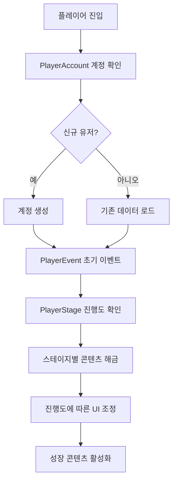

# 게임 진행과 성장

츄츄버거 게임 진행과 성장 시스템은 플레이어의 전체적인 게임 여정을 관리하는 핵심 메커니즘입니다. 이 시스템은 계정 관리, 스테이지 진행, 이벤트 추적을 통해 플레이어가 단계적으로 성장하며 새로운 콘텐츠를 경험할 수 있도록 설계되었습니다.

## 시스템 개요

게임 진행 시스템은 크게 **계정 정보 관리**, **스테이지 진행도 추적**, **이벤트 상태 관리**로 구성됩니다. 이들은 서로 유기적으로 연결되어 플레이어의 성장 경험을 일관되게 제공합니다.



## 계정 관리 시스템

### PlayerAccount

플레이어의 기본적인 계정 정보와 접속 기록을 관리하는 컴포넌트입니다.

**핵심 데이터:**
- `Date_Create`: 계정 생성 날짜 (Unix timestamp)
- `Date_Login`: 마지막 로그인 날짜
- `Date_Logout`: 마지막 로그아웃 날짜

**계정 생성 과정:**  
method void OnCreated()  
→ 새 계정 생성 시 현재 시간을 UTC 기준으로 저장하여 정확한 생성 시점을 기록합니다.

- **타임스탬프 저장**: Unix timestamp 형태로 생성일 보관  
- **UTC 기준**: 시간대 독립적인 정확한 시간 기록

<details>
<summary>관련 코드</summary>

```lua
-- PlayerAccount.mlua :: OnCreated()
method void OnCreated()
    self.Date_Create = os.time(os.date("!*t"))
end
```
</details>

**로그인/로그아웃 처리:**  
method void OnLogin()  
→ 모든 접속 정보를 서버에서만 처리하며, 클라이언트와 동기화하여 접속 패턴을 분석합니다.

- **서버 전용 처리**: 클라이언트 조작 방지를 위한 보안 설계  
- **패턴 분석**: 접속 이력을 통한 플레이어 행동 분석

<details>
<summary>관련 코드</summary>

```lua
-- PlayerAccount.mlua :: OnLogin()
method void OnLogin()
    self.Date_Login = os.time(os.date("!*t"))
end
```
</details>

### 데이터베이스 관리

**PlayerDBManager**가 모든 플레이어 데이터의 저장과 로드를 총괄합니다:

**자동 저장 시스템:**  
method void OnBeginPlay()  
→ 5분마다 자동으로 플레이어 데이터를 데이터베이스에 저장하여 데이터 손실을 방지합니다.

- **주기적 저장**: 5분 간격으로 반복 실행되는 타이머 설정  
- **안전성 보장**: 예기치 못한 종료 상황에 대비한 데이터 보호

<details>
<summary>관련 코드</summary>

```lua
-- PlayerDBManager.mlua :: OnBeginPlay()  
local period = 60 * 5  -- 5분마다 자동 저장
self._T.saveTimer = _TimerService:SetTimerRepeat(function()
    self:SaveToDB(false)
end, period, period)
```
</details>

**컴포넌트 초기화 순서:**  
method void InitComponents()  
→ 게임 시작 시 모든 플레이어 컴포넌트들을 체계적으로 초기화하여 의존성 문제를 방지합니다.

- **순차적 초기화**: 컴포넌트 간 의존성을 고려한 초기화 순서  
- **상태 동기화**: 모든 컴포넌트가 일관된 상태로 시작

<details>
<summary>관련 코드</summary>

```lua
-- PlayerDBManager.mlua :: InitComponents()
self.Entity.PlayerEvent:InitComponent()
self.Entity.PlayerStage:InitComponent()  
self.Entity.PlayerAchievement:InitComponent()
self.Entity.PlayerInventory:InitComponent()
```
</details>

## 스테이지 진행 시스템

### PlayerStage

게임의 스테이지별 진행도를 관리하는 핵심 컴포넌트입니다.

**진행도 관리:**
- `NowStage`: 현재 플레이 중인 스테이지
- `StageProgress`: 스테이지별 진행도 (0-6 범위)
- `ClearedStageData`: 스테이지별 클리어 여부

**진행도 설정과 보상:**  
method void SetStageProgress(number stageId, number progress)  
→ 스테이지 진행도를 업데이트하고 배지 시스템과 연동하여 보상을 자동 지급합니다.

- **배지 연동**: 진행도 변경 시 자동으로 배지 진행도 업데이트  
- **자동 보상**: 클리어 조건 달성 시 즉시 보상 지급

<details>
<summary>관련 코드</summary>

```lua
-- PlayerStage.mlua :: SetStageProgress()
self.StageProgress[stageId] = progress
if progress >= _StageDataSetLogic:GetStageClearProgress(stageId) then
    self:GetStageClearReward(stageId)
end
```
</details>

**츄스타 레벨 계산:**  
method number GetChustarLevel()  
→ 클리어한 스테이지 수를 기반으로 플레이어의 츄스타(전체 진행도) 레벨을 계산합니다.

- **누적 계산**: 모든 스테이지의 클리어 상태를 확인하여 레벨 산정  
- **진행도 기준**: 각 스테이지에 설정된 클리어 기준단계 비교

<details>
<summary>관련 코드</summary>

```lua
-- PlayerStage.mlua :: GetChustarLevel()
for id, progress in pairs(self.StageProgress) do	
    if progress >= _StageDataSetLogic:GetStageClearProgress(id) then
        level += 1
    end
end
```
</details>

**스테이지 클리어 보상:**
스테이지를 클리어하면 다양한 보상이 자동으로 지급됩니다:

- **다이아몬드**: `stageData.StageClearRewardDiamond`
- **전략 포인트(SP)**: 설정된 SP 보상량
- **사이드메뉴 해금**: 조건에 맞는 새로운 사이드메뉴 
- **전략 해금**: 해당 스테이지에서 해금되는 전략

### 스테이지 이동 시스템

**로딩 시스템:**  
method void MoveToLoadingMap()  
→ 스테이지 간 이동 시 전용 로딩 맵을 거쳐 부드러운 전환과 UI 정리를 제공합니다.

- **UI 정리**: 기존 UI를 모두 정리한 후 로딩 UI 활성화  
- **맵 전환**: 전용 로딩 맵으로 이동하여 데이터 로딩 처리

<details>
<summary>관련 코드</summary>

```lua
-- PlayerStage.mlua :: MoveToLoadingMap()
self:ClearUI(self.Entity.PlayerComponent.UserId)
_UIGroupManager:EnableStageLoadingGroup(true, self.Entity.PlayerComponent.UserId)
_TeleportService:TeleportToEntityPath(self.Entity, "/maps/DataLoading/TeleportPoint")
```
</details>

**데이터 동기화:**  
method void OnSyncProperty(string name)  
→ 스테이지 정보가 변경되면 관련 UI와 이벤트 시스템을 자동으로 업데이트합니다.

- **UI 업데이트**: 로비 HUD의 스테이지 이동 버튼 상태 갱신  
- **이벤트 발생**: 스테이지 변경 이벤트를 전체 시스템에 다중 방송

<details>
<summary>관련 코드</summary>

```lua
-- PlayerStage.mlua :: OnSyncProperty()
if name == "NowStage" then
    _LobbyHUDService:UpdateMoveNextStageBtn()
    local e = PlayerNowStageChangedEvent()
    self.Entity:SendEvent(e)
end
```
</details>

## 이벤트 추적 시스템

### PlayerEvent

게임 진행 상황을 세밀하게 추적하고 관리하는 시스템입니다.

**이벤트 상태 관리:**
- `Events`: 발생한 이벤트들의 상태 맵
- `EventQueue`: 순차적으로 실행할 이벤트 큐
- `DayEventQueue`: 하루 단위로 관리되는 이벤트 큐
- `EventReferKey`: 이벤트 참조 키 데이터

**이벤트 발생 확인:**  
method boolean IsEventOccured(string eventGroupId)  
→ 튜토리얼 이벤트와 일반 이벤트를 구분하여 발생 여부를 확인합니다.

- **타입 구분**: "T" 접두사로 튜토리얼과 일반 이벤트 분리  
- **상태 조회**: 각 이벤트 타입에 맞는 컴포넌트에서 상태 확인

<details>
<summary>관련 코드</summary>

```lua
-- PlayerEvent.mlua :: IsEventOccured()
if string.sub(eventGroupId, 1, 1) == "T" then
    return self.Entity.PlayerTutorialEvent:IsEventOccured(eventGroupId)
end
return self.Events[eventGroupId] == true
```
</details>

**이벤트 큐 시스템:**  
method void AddToEventQueue(string eventGroupId)  
→ 이벤트 중복 실행을 방지하고 순서대로 실행되도록 큐 시스템을 관리합니다.

- **중복 방지**: 이미 발생한 이벤트는 큐에 추가하지 않음  
- **순차 실행**: 큐 순서대로 이벤트를 처리하여 일관성 보장

<details>
<summary>관련 코드</summary>

```lua
-- PlayerEvent.mlua :: AddToEventQueue()
if self:IsEventOccured(eventGroupId) == true then
    return  -- 이미 발생한 이벤트는 큐에 추가하지 않음
end
table.insert(self.EventQueue, eventGroupId)
```
</details>

**ToDo 비서 시스템 연동:**  
method void OnSyncProperty(string name)  
→ 이벤트 발생 상태가 변경되면 ToDo 비서와 UI 잔금해제 시스템을 자동 업데이트합니다.

- **UI 해금**: 이벤트 진행에 따른 버튼 및 기능 해금  
- **ToDo 갱신**: 비서 시스템의 할 일 목록 자동 업데이트

<details>
<summary>관련 코드</summary>

```lua
-- PlayerEvent.mlua :: OnSyncProperty()
if name == "Events" then
    _UIButtonUnlockLogic:SetButtonsUnlock()
    _ToDoManager:RefreshToDoList()
end
```
</details>

### PlayerEventFunction

이벤트에서 실행되는 다양한 기능들을 관리하는 컴포넌트입니다.

**함수 등록 시스템:**  
method void OnBeginPlay()  
→ 이벤트 데이터에서 호출 가능한 함수들을 미리 등록하여 동적 실행을 준비합니다.

- **사전 등록**: 이벤트에서 사용할 모든 함수를 시작 시 등록  
- **동적 처리**: 문자열 키로 함수를 찾아 실행할 수 있도록 설계

<details>
<summary>관련 코드</summary>

```lua
-- PlayerEventFunction.mlua :: OnBeginPlay()
self:RegisterFunc("GetItem", self.GetItem)
self:RegisterFunc("AddSubscription", self.AddSubscription)
self:RegisterFunc("GetStoreRankingReward", self.GetStoreRankingReward)
```
</details>

**동적 함수 실행:**  
method void CommandFunc(table eventGroupData)  
→ 이벤트 그룹 데이터에 정의된 함수들을 동적으로 실행하여 유연한 이벤트 처리를 구현합니다.

- **함수-파라미터 쌍**: 데이터에서 함수명과 매개변수를 찾아 실행  
- **반복 처리**: 여러 함수를 순차적으로 실행하여 복합 효과 처리

<details>
<summary>관련 코드</summary>

```lua
-- PlayerEventFunction.mlua :: CommandFunc()
local rewardData = eventGroupData.funcRewardPairs
for k, v in pairs(rewardData) do
    local funcName = v[1]
    local commandFunc = self.commandToFunc[string.lower(funcName)]
    commandFunc(self, v[2])
end
```
</details>

## UI 버튼 해금 시스템

**진행도 기반 UI 제어:**  
method SetButtonsUnlock()  
→ 게임 진행 상황에 따라 UI 버튼들을 단계적으로 해금하여 점진적 기능 공개를 제어합니다.

- **단계별 해금**: 진행도에 따라 기능들을 순차적으로 해금  
- **자동 제어**: 이벤트 상태 변경 시 자동으로 UI 상태 업데이트

<details>
<summary>관련 코드</summary>

```lua
-- PlayerEvent.mlua :: OnSyncProperty()
if name == "Events" then
    _UIButtonUnlockLogic:SetButtonsUnlock()
end
```
</details>

**튜토리얼 연동:**
튜토리얼 진행도와 연동하여 기능들이 점진적으로 공개됩니다:

- 초기 단계: 기본 요리 기능만
- 중간 단계: 직원 고용, 업그레이드
- 고급 단계: 특수 기능, 고급 콘텐츠

## 성장 콘텐츠 활성화

### 단계별 콘텐츠 해금

**스테이지 기반 해금:**
- **스테이지 1-2**: 기본 메뉴 제작과 직원 관리
- **스테이지 3-5**: 업그레이드와 확장 콘텐츠
- **스테이지 6+**: 고급 경영 요소와 특수 시스템

**이벤트 기반 해금:**
특정 이벤트 달성 시 새로운 기능이 활성화됩니다:

- 첫 번째 수익 달성: 업그레이드 시스템
- 첫 번째 고객 서빙: 평판 시스템
- 특정 수익 목표: VIP 주문 시스템

### 진행도 시각화

**레드 닷 시스템:**
새로운 콘텐츠나 미완료 작업이 있을 때 시각적 알림을 제공합니다:

- 새로운 업그레이드 가능
- 미확인 보상 존재
- 튜토리얼 진행 가능

**진행도 표시:**
플레이어의 전체적인 진행 상황을 다양한 방법으로 표시합니다:

- 츄스타 레벨 (전체 진행도)
- 스테이지별 별점 (0-6점)
- 컬렉션 완성도 퍼센트

## 데이터 일관성 보장

### 동기화 시스템

중요한 진행도 데이터는 클라이언트와 서버 간 실시간으로 동기화됩니다:

- `@TargetUserSync`: 해당 사용자에게만 동기화
- `@Sync`: 모든 클라이언트에 동기화

### 백업 및 복구

**자동 백업:**
5분마다 자동으로 모든 진행 데이터를 데이터베이스에 저장합니다.

**데이터 검증:**
로드 시 데이터 무결성을 검증하고, 누락된 데이터는 기본값으로 초기화합니다.

---

## 코드 참조

**핵심 파일들:**
- `RootDesk/MyDesk/00. Player/PlayerAccount.mlua :: OnLogin()` — 로그인/로그아웃 기록 관리
- `RootDesk/MyDesk/00. Player/PlayerDBManager.mlua :: InitComponents()` — 데이터베이스 총괄 관리  
- `RootDesk/MyDesk/00. Player/PlayerStage.mlua :: SetStageProgress()` — 스테이지 진행도 관리
- `RootDesk/MyDesk/00. Player/PlayerStage.mlua :: GetChustarLevel()` — 츄스타 레벨 계산
- `RootDesk/MyDesk/00. Player/PlayerEvent.mlua :: RequestCallEvent()` — 이벤트 발생 처리
- `RootDesk/MyDesk/00. Player/PlayerEventFunction.mlua :: CommandFunc()` — 이벤트 함수 실행
