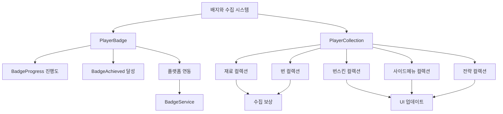

# 배지와 수집

츄츄버거 배지와 수집 시스템은 플레이어의 성취를 시각적으로 표현하고, 다양한 콘텐츠 수집을 통해 장기적인 플레이 목표를 제공하는 시스템입니다. 배지 시스템은 외부 플랫폼과 연동되어 공식적인 인증을 제공하며, 수집 시스템은 게임 내 다양한 콘텐츠에 대한 완성도를 추적합니다.

## 시스템 개요

배지와 수집 시스템은 크게 **배지 시스템**과 **컬렉션 시스템**으로 구성됩니다. 배지는 특정 성취에 대한 공식적인 인증을 제공하며, 컬렉션은 게임 내 다양한 요소들의 수집 현황을 관리합니다.



## 배지 시스템 (PlayerBadge)

### 배지 상태 관리

배지 시스템은 2단계 상태로 구성됩니다:

**1. BadgeProgress (진행도)**  
method void ChangeProgress(number typeId, number typeValue)  
→ 배지별 진행도를 추적하며, 역행하지 않도록 보장하고 달성 여부를 자동 확인합니다.

<details>
<summary>관련 코드</summary>

```lua
-- PlayerBadge.mlua :: ChangeProgress()
if self.BadgeProgress[typeId] >= typeValue then
    return  -- 현재 진행도보다 작거나 같으면 무시
end

self.BadgeProgress[typeId] = typeValue
self:CheckBadgeAchieved(typeId, typeValue)
```
</details>

**2. BadgeAchieved (달성)**
배지 달성 여부를 관리하며, 외부 플랫폼과 동기화됩니다.

### 배지 달성 과정

**진행도 기반 확인:**  
method void CheckBadgeAchieved(number typeId, number typeValue)  
→ 동일한 타입의 모든 배지를 확인하여 달성 조건을 체크하고 자동으로 달성 처리를 수행합니다.

<details>
<summary>관련 코드</summary>

```lua
-- PlayerBadge.mlua :: CheckBadgeAchieved()
local badgeList = _BadgeDataSetLogic:GetBadgeListByTypeId(typeId)

for _, badgeId in pairs(badgeList) do
    local badgeData = _BadgeDataSetLogic:GetBadgeData(badgeId)
    if badgeData.TypeValue <= typeValue then
        self:SetBadgeAchieved(badgeId)
    end
end
```
</details>

**플랫폼 배지 시스템 연동:**  
method void SetBadgeAchieved(string badgeId)  
→ MapleStory Worlds 플랫폼의 BadgeService를 통해 공식 배지를 수여하고 달성 로그 및 사운드 효과를 처리합니다.

<details>
<summary>관련 코드</summary>

```lua
-- PlayerBadge.mlua :: SetBadgeAchieved()
local result = _BadgeService:AwardBadgeAndWait(self.Entity.PlayerComponent.UserId, badgeId)
if result == true then
    self.BadgeAchieved[badgeId] = true
    self:BadgeLog(badgeId)
    _SoundService:PlaySound(_ResourceManager.SFXTable["System_AttendGift_Stamp_01"], 1, self.Entity.PlayerComponent.UserId)
end
```
</details>

### 배지 데이터 구조

**BadgeData 구조:**  
배지는 BadgeId, TypeId, TypeValue, IsProgressVisible, IsHideOnUI, Grade 등의 속성으로 구성되며, 플랫폼 연동과 UI 표시를 제어합니다.

<details>
<summary>관련 코드</summary>

```lua
-- BadgeData.mlua
property string BadgeId = ""         -- 플랫폼 배지 ID
property integer TypeId = 0          -- 배지 타입 
property integer TypeValue = 0       -- 달성 목표값
property boolean IsProgressVisible = false  -- 진행도 표시 여부
property boolean IsHideOnUI = true   -- UI 숨김 처리
property integer Grade = 0           -- 배지 등급 (Normal/Rare/Epic)
```
</details>

**배지 등급 시스템:**
- **Normal (0)**: 기본 등급
- **Rare (1)**: 희귀 등급  
- **Epic (2)**: 영웅 등급

### 플랫폼 동기화

method void GetBadgeAchievedFromPlatform()  
→ 게임 시작 시 플랫폼에서 이미 달성된 배지들을 동기화하여 다른 기기에서의 배지 달성 상황도 반영합니다.

<details>
<summary>관련 코드</summary>

```lua
-- PlayerBadge.mlua :: GetBadgeAchievedFromPlatform()
_BadgeService:UserHasBadgeAsync(self.Entity.PlayerComponent.UserId, badgeId, function(userId, badgeId, isAchieved)
    self.BadgeAchieved[badgeId] = isAchieved
end)
```
</details>

### 스테이지 진행과 배지 연동

method void SetStageProgress()  
→ 스테이지 진행도 변경 시 자동으로 배지 시스템도 업데이트하며, 스테이지 ID 기반의 배지 타입 ID로 체계적인 관리를 수행합니다.

<details>
<summary>관련 코드</summary>

```lua
-- PlayerStage.mlua :: SetStageProgress()
self.StageProgress[stageId] = progress
local enum = tonumber(string.format("1000%d", stageId))
self.Entity.PlayerBadge:ChangeProgress(enum, progress)
```
</details>

## 컬렉션 시스템 (PlayerCollection)

### 다양한 컬렉션 타입

PlayerCollection은 5가지 주요 컬렉션을 관리합니다:

**1. 재료 컬렉션 (IngredientCollection)**  
method void AddIngredientCollection(number ingreId)  
→ 중복 수집 방지 및 스테이지별 제한을 확인하여 재료를 컬렉션에 추가합니다.

<details>
<summary>관련 코드</summary>

```lua
-- PlayerCollection.mlua :: AddIngredientCollection()
if self.IngredientCollection[ingreId] == true then
    return  -- 이미 수집된 재료는 스킵
end

if ingreData.RelatedStage ~= 0 and ingreData.RelatedStage ~= self.Entity.PlayerStage.NowStage then
    return  -- 스테이지별 제한 확인
end

self.IngredientCollection[ingreId] = true
```
</details>

**2. 번 컬렉션 (BunCollection)**
버거의 기본 재료인 번의 수집 상태를 관리합니다.

**3. 번 스킨 컬렉션 (BunSkinCollection)**
번의 시각적 커스터마이징 요소들을 수집합니다.

**4. 사이드메뉴 컬렉션 (SideMenuCollection)**
게임의 전략적 요소인 사이드메뉴들을 수집합니다.

**5. 전략 컬렉션 (StrategyCollection)**
다양한 게임 전략들의 수집 상태를 추적합니다.

### 컬렉션 보상 시스템

**보상 수령 상태 관리:**  
property SyncTable<integer, boolean> IngredientCollectionGetReward  
→ 각 컬렉션 항목별로 보상 수령 여부를 별도로 관리합니다.

<details>
<summary>관련 코드</summary>

```lua
-- PlayerCollection.mlua (속성들)
property SyncTable<integer, boolean> IngredientCollectionGetReward
property SyncTable<integer, boolean> BunCollectionGetReward
```
</details>

**수집 완성도 계산:**  
method number GetIngredientCollectionPercentage()  
→ 수집 가능한 재료 중 수집된 비율을 계산하여 완성도를 제공합니다.

<details>
<summary>관련 코드</summary>

```lua
-- PlayerCollection.mlua :: GetIngredientCollectionPercentage()
local collectedCnt = 0
local totalCnt = 0

for ingreId, data in pairs(_IngredientDataSetLogic.IngredientData) do
    if self:CheckCanCollectIngre(ingreId) == 0 then
        totalCnt += 1
        if self.IngredientCollection[ingreId] == true then
            collectedCnt += 1
        end
    end
end

return math.floor((collectedCnt / math.max(totalCnt, 1)) * 100)
```
</details>

### 실시간 UI 연동

method void OnSyncProperty(string name)  
→ 컬렉션 상태 변경 시 관련 UI들이 자동으로 업데이트되어 일관된 사용자 경험을 제공합니다.

<details>
<summary>관련 코드</summary>

```lua
-- PlayerCollection.mlua :: OnSyncProperty()
if name == "BunSkinCollection" then
    -- 번 스킨 컬렉션 UI 갱신
    _UICollectionLogic.uiIngreBunCollection:RefreshList()
    _UILobbyManager:RefreshMenuInfo()
    
elseif name == "IngredientCollectionGetReward" then
    -- 보상 수령 상태 UI 갱신
    _UICollectionLogic.uiIngreBunCollection:CheckCanGetReward()
    _UICollectionLogic:SetIngreBunCollectionMenuBtnRedDot()
end
```
</details>

**연동되는 UI 요소들:**
- 컬렉션 목록 UI
- 레시피 제작 UI
- 메뉴 정보 UI
- Red Dot 알림 시스템

## 배지 UI 시스템

### 배지 목록 관리 (UIBadgeList)

**필터링 시스템:**  
method void SetFilter(number filterType)  
→ 배지 목록을 전체/미완료/완료별로 필터링하여 표시합니다.

<details>
<summary>관련 코드</summary>

```lua
-- UIBadgeList.mlua :: SetFilter()
self.NowFilter = filterType
-- 0: 전체, 1: 미완료, 2: 완료
```
</details>

**정렬 옵션:**
- 달성 상태별
- 등급별
- 진행도별

**진행도 표시:**  
method void UpdateProgress()  
→ 달성된 배지 수와 전체 배지 수를 기반으로 슬라이더와 퍼센트 텍스트를 업데이트합니다.

<details>
<summary>관련 코드</summary>

```lua
-- UIBadgeList.mlua :: UpdateProgress()
self.ProgressSlider.Value = (achievedCount / math.max(totalCount, 1))
self.ProgressText.Text = string.format("%d / %d", achievedCount, totalCount)
self.ProgressPercentText.Text = string.format("%.1f%%", (achievedCount / math.max(totalCount, 1)) * 100)
```
</details>

### 배지 슬롯 표시 (UIBadgeSlot)

각 배지는 전용 슬롯으로 표시되며, 다음 정보들을 포함합니다:

- 배지 아이콘
- 등급 표시
- 달성 여부
- 진행도 (해당되는 경우)

## 컬렉션 UI 시스템

### 컬렉션 목록 (UIIngreBunCollection)

**탭 시스템:**
- 재료 컬렉션 탭
- 번 컬렉션 탭  
- 번 스킨 컬렉션 탭

**보상 효과:**  
method void DropDiamondAndMoveToMoneyBar()  
→ 컬렉션 보상 수령 시 다이아몬드가 머니바로 이동하는 시각적 효과를 제공합니다.

<details>
<summary>관련 코드</summary>

```lua
-- UICollectionLogic.mlua :: DropDiamondAndMoveToMoneyBar()
local moveTargetPos = _UIMoneyBarLogic.DiamondUI:GetChildByName("Icon").UITransformComponent.WorldPosition
icon.UITweenPop:StartPop(Vector3(targetPosX, targetPosY, startPos.z), 0.3, true, 0.15, moveTargetPos, 0.55)
```
</details>

### 컬렉션 슬롯 (UIIngreBunCollectionSlot)

**수집 상태 표시:**  
method void RefreshIngre()  
→ 수집 여부에 따라 아이콘의 머티리얼을 변경하여 미수집 항목은 흑백으로 표시합니다.

<details>
<summary>관련 코드</summary>

```lua
-- UIIngreBunCollectionSlot.mlua :: RefreshIngre()
local collected = player.PlayerCollection.IngredientCollection[ingreId]
local materialId = collected and _IconRuidEnum.EmptyMaterial or _IconRuidEnum.GrayScaleMaterial
self.Icon.SpriteGUIRendererComponent:ChangeMaterial(materialId)
```
</details>

**Red Dot 시스템:**

<details>
<summary>관련 코드</summary>

```lua
-- UIIngreBunCollectionSlot.mlua :: RefreshIngre()
local isRedDotEnable = function()	
    local getReward = player.PlayerCollection.IngredientCollectionGetReward[ingreId]
    return collected and not getReward	-- 수집했지만 보상을 받지 않은 경우
end
self.RewardDot.Enable = isRedDotEnable()
```
</details>

## Red Dot 관리 시스템

### 메뉴 버튼 Red Dot

<details>
<summary>관련 코드</summary>

```lua
-- UICollectionLogic.mlua :: SetIngreBunCollectionMenuBtnRedDot()
local isRedDotEnable = self.uiIngreBunCollection:ReturnCanGetReward(1) or self.uiIngreBunCollection:ReturnCanGetReward(2)
_MainMenuRedDotManager:EnableIngreBunCollectionRedDot(isRedDotEnable)
```
</details>

수령 가능한 컬렉션 보상이 있을 때 메인 메뉴에 Red Dot이 표시됩니다.

### 전략 관련 Red Dot

사이드메뉴 컬렉션과 전략 설정 UI가 연동됩니다:

<details>
<summary>관련 코드</summary>

```lua
-- PlayerCollection.mlua :: OnSyncProperty()
elseif name == "SideMenuChecked" then
    _StrategyDataSetLogic.UIStageSettingStrategy:RefreshSideMenuTabRedDot()
```
</details>

## 로깅 시스템

### 배지 달성 로그

<details>
<summary>관련 코드</summary>

```lua
-- PlayerBadge.mlua :: BadgeLog()
_LogStorageLogic:LogValue(userId, _LogEnumType.BadgeFlow, _HttpService:JSONEncode({
    badgeTypeValue = tostring(badgeData.TypeValue),
    badgeName = badgeData.Name
}), {
    badgeId = badgeId,
    badgeTypeId = tostring(badgeData.TypeId),
    badgeGrade = tostring(badgeData.Grade),
    playerLevel = self.Entity.PlayerStage:GetPlayerLastStageProgress()
})
```
</details>

### 컬렉션 로그

<details>
<summary>관련 코드</summary>

```lua
-- PlayerCollection.mlua :: IngreCollectionFlowLog()
_LogStorageLogic:LogValue(userId, _LogEnumType.CollectionFlow, ...)
```
</details>

모든 컬렉션 활동이 분석을 위해 기록됩니다.

## 데이터 버전 관리

<details>
<summary>관련 코드</summary>

```lua
-- PlayerCollection.mlua :: OnLoadedDataFromDB()
if collectionTable["Version"] == self.Version then
    -- 현재 버전 데이터 처리
else
    -- 구 버전 데이터 마이그레이션
end
```
</details>

시스템 업데이트 시에도 기존 컬렉션 데이터의 호환성을 보장합니다.

---

## 코드 참조

**핵심 파일들:**
- `RootDesk/MyDesk/00. Player/PlayerBadge.mlua :: ChangeProgress()` — 배지 진행도 관리
- `RootDesk/MyDesk/00. Player/PlayerBadge.mlua :: SetBadgeAchieved()` — 플랫폼 배지 수여
- `RootDesk/MyDesk/00. Player/PlayerCollection.mlua :: AddIngredientCollection()` — 재료 컬렉션 추가
- `RootDesk/MyDesk/18. Badge/BadgeData.mlua :: Load()` — 배지 데이터 구조
- `RootDesk/MyDesk/18. Badge/UIBadgeList.mlua :: Open()` — 배지 UI 관리
- `RootDesk/MyDesk/17. Collection/UICollectionLogic.mlua :: SetIngreBunCollectionMenuBtnRedDot()` — 컬렉션 Red Dot 관리
