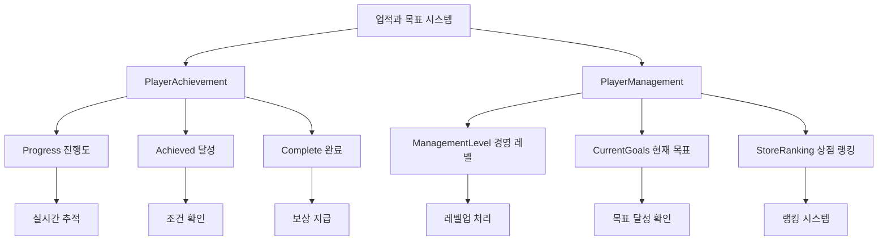

# 업적과 목표

츄츄버거 업적과 목표 시스템은 플레이어의 성취를 추적하고 보상하는 핵심 메커니즘입니다. 이 시스템은 다양한 게임 활동에 대한 명확한 목표를 제시하고, 달성 시 적절한 보상을 제공하여 지속적인 플레이 동기를 유발합니다.

## 시스템 개요

업적과 목표 시스템은 크게 **업적 시스템**과 **경영 목표 시스템**으로 구성됩니다. 업적 시스템은 개별적인 성취를 추적하고, 경영 목표 시스템은 체계적인 경영 레벨 진행을 관리합니다.



## 업적 시스템 (PlayerAchievement)

### 업적 상태 관리

업적 시스템은 3단계 상태로 구성됩니다:

**1. Progress (진행도)**  
method void ChangeProgress(number type, number value)  
→ 모든 게임 활동의 누적 진행도를 실시간으로 추적하고 달성 여부를 자동 확인합니다.

<details>
<summary>관련 코드</summary>

```lua
-- PlayerAchievement.mlua :: ChangeProgress()
self.Progress[type] = value
_AchievementLogic:CheckAchievementAchieved(self.Entity, type)
```
</details>

**2. Achieved (달성)**
조건을 충족한 업적들의 상태를 관리합니다. 달성되면 보상 수령이 가능해집니다.

**3. Complete (완료)**
보상을 수령한 업적들의 상태를 관리합니다. Red Dot 시스템과 연동됩니다.

### 업적 처리 과정

**진행도 업데이트:**  
method void ChangeProgress(number type, number value)  
→ 업적 진행도 변경 시 달성 조건 확인 및 경영 목표와의 연동을 자동 처리합니다.

<details>
<summary>관련 코드</summary>

```lua
-- PlayerAchievement.mlua :: ChangeProgress()
self.Progress[type] = value
_AchievementLogic:CheckAchievementAchieved(self.Entity, type)
self.Entity.PlayerManagement:SetCurrentGoalsProgress()
self.Entity.PlayerManagement:CheckGoalsAchieved()
```
</details>

**보상 지급:**  
method void SetComplete(number id)  
→ 달성된 업적의 보상을 자동 지급하고 관련 UI를 업데이트합니다.

<details>
<summary>관련 코드</summary>

```lua
-- PlayerAchievement.mlua :: SetComplete()
local rewardDataTable = _AchievementDataSetLogic:GetAchievementData(id).RewardData
self.Entity.PlayerInventory:AddItems(rewardDataTable, "Achievement Reward", "Achievement popup")
```
</details>

### 업적 타입별 관리

**튜토리얼 업적:**  
method boolean IsEventOccured(string eventGroupId)  
→ 튜토리얼 업적("T" 시작)을 별도 시스템에서 관리하도록 버링합니다.

<details>
<summary>관련 코드</summary>

```lua
-- PlayerAchievement.mlua :: IsEventOccured()
if string.sub(eventGroupId, 1, 1) == "T" then
    return self.Entity.PlayerTutorialEvent:IsEventOccured(eventGroupId)
end
```
</details>

**일반 업적:**
- 매출 달성
- 고객 수 달성
- 직원 고용
- 레시피 개발
- 시설 업그레이드

### 실시간 UI 연동

method void OnSyncProperty(string name)  
→ 업적 상태 변경 시 관련 UI들을 자동으로 업데이트하여 일관된 사용자 경험을 제공합니다.

<details>
<summary>관련 코드</summary>

```lua
-- PlayerAchievement.mlua :: OnSyncProperty()
if name == "Complete" then
    self:RequestUpdateUIAchievement()
    self:SetAchievementRedDot()
elseif name == "Achieved" then
    _UIButtonUnlockLogic:SetButtonsUnlock()
    _ToDoManager:RefreshToDoList()
end
```
</details>

**연동되는 시스템:**
- Red Dot 알림 시스템
- 버튼 해금 시스템
- ToDo 관리 시스템
- HUD 업데이트

## 경영 목표 시스템 (PlayerManagement)

### 경영 레벨 관리

경영 레벨은 플레이어의 전체적인 경영 능력을 나타내는 지표입니다.

**레벨별 목표 구조:**  
method void SetCurrentGoalsProgress()  
→ 각 경영 레벨마다 달성해야 할 세부 목표들의 현재 진행도를 계산합니다.

<details>
<summary>관련 코드</summary>

```lua
-- PlayerManagement.mlua :: SetCurrentGoalsProgress()
local nextLevel = self.ManagementLevel + 1
local levelData = _ManagementDataSetLogic:GetManagementGoalData(self.Entity.PlayerStage.NowStage, nextLevel)

local indexDatas = levelData.IndexData
for k, v in pairs(indexDatas) do
    local achiType = indexData.AchievementType
    local achiCurrValue = self.Entity.PlayerAchievement:ReturnAchievementProgress(achiType)
    local achiGoalValue = _AchievementLogic:GetFixedTypeValue(self.Entity, achiType, indexData.TypeValue)
end
```
</details>

### 경영 레벨업 과정

**1. 목표 달성 확인**  
method void ManagementLevelUp()  
→ 모든 목표가 달성되어야 레벨업이 가능하도록 검증합니다.

<details>
<summary>관련 코드</summary>

```lua
-- PlayerManagement.mlua :: ManagementLevelUp()
self:SetCurrentGoalsProgress()
for k, v in pairs(self.CurrentGoals) do
    if v == false then
        return  -- 미달성 목표가 있으면 레벨업 불가
    end
end
```
</details>

**2. 레벨 증가 및 보상**  
method void SetManagementLevel(number managementLevel)  
→ 레벨업 시 다이아몬드 보상 지급 및 관련 시스템 업데이트를 수행합니다.

<details>
<summary>관련 코드</summary>

```lua
-- PlayerManagement.mlua :: SetManagementLevel()
self.ManagementLevel = managementLevel
self.Entity.PlayerAchievement:ChangeProgress(_AchievementTypeEnum.ManagementLevel, self.ManagementLevel)

if 0 < managementLevel and managementLevel < 6 then
    local diamondReward = _GetConfigDataLogic:GetConfigNumDataByKey("DiamondRewardManagementLevel"..managementLevel)
    self.Entity.PlayerOutgameManager:ModifyDiamond(diamondReward, false, "Management Level Up", "Management Level Up")
end
```
</details>

### 목표 데이터 구조

**경영 목표 데이터:**  
struct ManagementGoalData
→ 각 경영 레벨별 목표 정보와 세부 달성 조건을 관리하는 데이터 구조입니다.

**목표 인덱스 데이터:**  
struct ManagementGoalIndexData  
→ 개별 목표의 업적 타입과 달성해야 할 수치를 정의하는 구조입니다.

<details>
<summary>관련 코드</summary>

```lua
-- ManagementGoalData.mlua
property integer Level = 0
property table IndexData = {}

-- ManagementGoalIndexData.mlua  
property integer AchievementType = 0  -- 업적 타입
property integer TypeValue = 0        -- 목표 수치
```
</details>

각 경영 레벨은 여러 개의 세부 목표(IndexData)로 구성됩니다.

### 목표 달성 추적

**실시간 목표 확인:**  
method void CheckGoalsAchieved()  
→ 현재 진행도와 목표 수치를 비교하여 달성 여부를 확인하고 즉시 리포트를 생성합니다.

<details>
<summary>관련 코드</summary>

```lua
-- PlayerManagement.mlua :: CheckGoalsAchieved()
local achiCurrValue = self.Entity.PlayerAchievement:ReturnAchievementProgress(achiType)
local achiGoalValue = _AchievementLogic:GetFixedTypeValue(self.Entity, achiType, indexData.TypeValue)

if achiCurrValue >= achiGoalValue then
    self.GoalsAchieved[saveId] = true
    _ManagementDataSetLogic:MakeGoalCompleteReport(achiType, achiGoalValue, self.Entity.PlayerComponent.UserId)
end
```
</details>

목표 달성 시 즉시 리포트가 생성되어 플레이어에게 알립니다.

## 상점 랭킹 시스템

### 랭킹 계산

플레이어의 경영 성과를 바탕으로 상점 랭킹이 결정됩니다:

- **StoreRanking**: 현재 랭킹
- **LastStoreRanking**: 이전 랭킹
- **Surroundings**: 주변 상점 정보

### 랭킹 발표

**랭킹 발표 시스템:**  
property string RankingAnnounceDate  
→ 정기적인 랭킹 발표 날짜를 관리하여 플레이어가 순위 변동을 확인할 수 있습니다.

<details>
<summary>관련 코드</summary>

```lua
-- PlayerManagement.mlua
property string RankingAnnounceDate = "12/10"  -- 랭킹 발표 날짜
```
</details>

### 연간 수익 추적

**연간 수익 추적:**  
property number YearlyIncome  
→ 연간 수익이 누적되어 장기적인 성과 지표로 활용됩니다.

## Red Dot 시스템

### 알림 표시

method void SetAchievementRedDot()  
→ 달성된 업적이나 완료 가능한 목표가 있을 때 Red Dot으로 알립니다.

<details>
<summary>관련 코드</summary>

```lua
-- PlayerAchievement.mlua :: SetAchievementRedDot()
local hasAchievedNotCompleted = false
for id, isAchieved in pairs(self.Achieved) do
    if isAchieved and not self:IsAchievementComplete(id) then
        hasAchievedNotCompleted = true
        break
    end
end
```
</details>

### UI 버튼 해금

method void OnSyncProperty()  
→ 업적 달성에 따라 새로운 기능들이 단계적으로 해금되어 플레이어가 점진적으로 모든 기능에 접근할 수 있도록 합니다.

<details>
<summary>관련 코드</summary>

```lua
-- PlayerAchievement.mlua :: OnSyncProperty()
_UIButtonUnlockLogic:SetButtonsUnlock()
```
</details>

## 데이터 버전 관리

method void OnLoadedDataFromDB()  
→ 업적 시스템의 데이터 버전을 관리하여 업데이트 시 호환성을 보장합니다.

<details>
<summary>관련 코드</summary>

```lua
-- PlayerAchievement.mlua :: OnLoadedDataFromDB()
if archievementTotalTable["Version"] == self.Version then
    -- 현재 버전 데이터 로드
else
    -- 구 버전 데이터 변환
end
```
</details>

## 로깅 및 분석

method void LogValue()  
→ 모든 업적 달성과 경영 레벨업을 상세하게 기록하여 분석 용도로 활용합니다.

<details>
<summary>관련 코드</summary>

```lua
-- PlayerManagement.mlua :: ManagementLevelUp()
_LogStorageLogic:LogValue(self.Entity.PlayerComponent.UserId, _LogEnumType.ManageLevel, tostring(self.ManagementLevel), {
    year = tostring(utc.Year),
    month = tostring(utc.Month),
    manageLevel = tostring(self.ManagementLevel),
    playerLevel = playerLevel,
    storeName = storeName
})
```
</details>

**기록되는 정보:**
- 달성 시간
- 플레이어 정보
- 달성 조건
- 현재 진행 상황

## 성능 최적화

### 일괄 처리

method void RequestGainAllReward()  
→ 여러 업적을 동시에 처리하여 성능을 최적화하는 일괄 처리 기능을 제공합니다.

<details>
<summary>관련 코드</summary>

```lua
-- PlayerAchievement.mlua :: RequestGainAllReward()
for id, isAchieved in pairs(self.Achieved) do
    if not self:IsAchievementComplete(id) and self:IsAchievementAchieved(id) then
        table.insert(completedIds, id)
    end
end

self:RequestSetMultipleComplete(completedIds)
```
</details>

### 초기값 설정

method void OnLoadedDataFromDB()  
→ 새로운 플레이어에게 초기 업적 진행도를 자동으로 설정하여 게임 진입을 원활하게 합니다.

<details>
<summary>관련 코드</summary>

```lua
-- PlayerAchievement.mlua :: OnLoadedDataFromDB()
self:ChangeProgress(_TutorialAchievementTypeEnum.FirstAccess, 1)
self:SetInitialTypeValue()
```
</details>

---

## 코드 참조

**핵심 파일들:**
- `RootDesk/MyDesk/00. Player/PlayerAchievement.mlua :: ChangeProgress()` — 업적 진행도 관리
- `RootDesk/MyDesk/00. Player/PlayerAchievement.mlua :: SetComplete()` — 업적 완료 처리
- `RootDesk/MyDesk/00. Player/PlayerManagement.mlua :: SetCurrentGoalsProgress()` — 경영 목표 진행도 설정
- `RootDesk/MyDesk/00. Player/PlayerManagement.mlua :: ManagementLevelUp()` — 경영 레벨업 처리
- `RootDesk/MyDesk/09. Management/ManagementGoalData.mlua :: Load()` — 경영 목표 데이터 구조
- `RootDesk/MyDesk/Common/Achievement/AchievementLogic.mlua :: CheckAchievementAchieved()` — 업적 달성 확인
