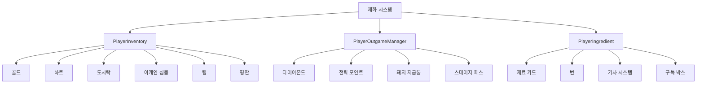

# 재화와 아이템

츄츄버거 재화와 아이템 시스템은 게임 경제의 기반이 되는 시스템으로, 다양한 리소스를 체계적으로 관리하여 플레이어의 성장과 게임 진행을 지원합니다. 이 시스템은 기본 재화, 메타 재화, 특수 재료로 구분되어 각각의 고유한 역할을 수행합니다.

## 시스템 개요

재화와 아이템 시스템은 크게 **기본 게임 재화**, **메타 게임 재화**, **재료 시스템**으로 구성됩니다. 각각은 서로 다른 저장 방식과 사용 목적을 가지며, 유기적으로 연결되어 게임의 경제 생태계를 구성합니다.



## 기본 게임 재화 (PlayerInventory)

### 골드 (Money)

게임의 주요 통화로, 가게 운영의 핵심 자원입니다.

**사용 용도:**
- 직원 급여 및 고용 비용
- 시설 유지비 및 업그레이드
- 일반 상점에서의 구매

**획득 방법:**
- 고객 서빙을 통한 수익
- 이벤트 보상
- 기타 게임 활동

**잔액 부족 처리:**  
method boolean SubMoneyUnderZero(number expense, string source, string logSource)  
→ 월말 정산 시 골드가 부족하면 긴급 자금 지원이나 해고 경고 시스템을 작동시킵니다.

- **자동 처리**: 저세대출 시스템 연동으로 잠시적 해결책 제공  
- **경고 시스템**: 지속적 자금 부족 시 직원 해고 경고

<details>
<summary>관련 코드</summary>

```lua
-- PlayerInventory.mlua :: SubMoneyUnderZero()
local result = self.Entity.PlayerInventory:SubMoneyUnderZero(expense,"Settlement store manage fee","Settlement popup")
-- 저세 대출 또는 해고 경고 처리
```
</details>

### 하트 (Heart)

직원 관련 활동에 사용되는 특별 재화입니다.

**사용 용도:**
- 직원 레벨업
- 직원 스킬 강화
- 특별 직원 고용

**특징:**
- 제한된 획득 경로로 희소성 유지
- 직원 시스템과 밀접한 연관

### 도시락 (LunchBox)

출장 시스템의 전용 재화입니다.

**관리 시스템:**  
method void ModifyLunchBox(number count)  
→ 도시락 수량을 변경하며 최대 보유량 제한을 적용하여 안전하게 관리합니다.

- **범위 제한**: 0과 최대값 사이로 제한하여 예외 상황 방지  
- **스택 관리**: 주얼 색셀 및 자동 회복 시스템 연동

<details>
<summary>관련 코드</summary>

```lua
-- PlayerInventory.mlua :: ModifyLunchBox()
self.LunchBox = math.max(0, math.min(self.LunchBox + count, self.MaxLunchBoxNum))
```
</details>

**특징:**
- 최대 보유량 제한 (`MaxLunchBoxNum`)
- 출장 입장 비용으로 소모
- 시간에 따른 자동 회복

### 아케인 심볼 (ArcaneSymbol)

재료 관련 활동에 사용되는 재화입니다.

**사용 용도:**
- 재료 가차 구매
- 재료 합성 비용
- 고급 레시피 해금

### 팁 (Tip)

고객 서빙 시 획득하는 보너스 재화입니다.

**팁 저장 시스템:**  
method void ModifyTip(number count)  
→ 팁을 추가/제거하며 업그레이드된 저장 용량 제한을 적용하여 오버플로우를 방지합니다.

- **동적 제한**: 업그레이드 레벨에 따른 저장 용량 조회  
- **자동 수준**: 최대치 초과 시 자동으로 수량 조정

<details>
<summary>관련 코드</summary>

```lua
-- PlayerInventory.mlua :: ModifyTip()
local maxTip = _UpgradeDataSetLogic:ReturnCurrentPlayerValue(self.Entity,_UpgradeTypeEnum.TipStorageLevel)
if self.Tip + count > maxTip then
    count = maxTip - self.Tip
end
```
</details>

**특징:**
- 업그레이드를 통한 저장 용량 증가
- 일정량 도달 시 자동 수령 가능
- 고객 만족도와 연동

### 평판 (Reputation)

가게의 명성을 나타내는 지표입니다.

**평판 시스템:**
- 고객 서빙 품질에 따라 증감
- 평판에 따른 고객 방문 빈도 변화
- 특정 콘텐츠 접근 조건

## 메타 게임 재화 (PlayerOutgameManager)

### 다이아몬드

게임의 프리미엄 화폐로 무료/유료로 구분됩니다.

**다이아몬드 타입:**  
method void AddDiamond(number diamond, boolean isPaid)  
→ 무료와 유료 다이아몬드를 구분하여 추가하고 각각의 누적량을 관리합니다.

- **타입 구분**: 유료/무료 다이아몬드 분리 저장  
- **사용 순서**: 소모 시 무료 다이아몬드 우선 사용

<details>
<summary>관련 코드</summary>

```lua
-- PlayerOutgameManager.mlua :: AddDiamond()
if isPaid then
    self.DiamondPaid += diamond
else
    self.DiamondFree += diamond  
end
```
</details>

**사용 우선순위:**  
method boolean SubDiamond(number diamond)  
→ 다이아몬드 소모 시 무료 다이아몬드를 우선적으로 사용하고 부족분을 유료에서 차감합니다.

- **우선순위**: 무료 다이아몬드 선사용 후 유료 다이아몬드 사용  
- **자동 계산**: 부족분을 자동으로 유료에서 차감하도록 계산

<details>
<summary>관련 코드</summary>

```lua
-- PlayerOutgameManager.mlua :: SubDiamond()
local diamondFreeUse = diamond
local diamondPaidUse = 0
if self.DiamondFree < diamond then
    diamondFreeUse = self.DiamondFree
    diamondPaidUse = diamond - diamondFreeUse
end
```
</details>

**사용 용도:**
- 프리미엄 상품 구매
- 진행 시간 단축
- 특별 콘텐츠 접근
- 상점 이름 변경

### 전략 포인트 (Strategy Point)

전략 시스템에서 사용하는 특수 재화입니다.

**획득 방법:**
- 스테이지 클리어 보상
- 특별 이벤트 완료
- 업적 달성

**사용 용도:**
- 사이드메뉴 활성화
- 전략 효과 구매
- 고급 기능 해금

### 돼지 저금통 시스템

장기적인 수익 축적 시스템입니다.

**저금통 레벨 관리:**  
method void AddPiggyBankLevel()  
→ 저금통이 가득 차면 적립된 포인트를 다이아몬드로 전환하고 다음 레벨로 진행합니다.

- **포인트 전환**: 적립 포인트를 유료 다이아몬드로 전환  
- **레벨 진행**: 레벨업과 함께 저금통 리셋 처리

<details>
<summary>관련 코드</summary>

```lua
-- PlayerOutgameManager.mlua :: AddPiggyBankLevel()
self:AddDiamond(self.PiggyBankPoint, true, source, source)
self:ResetPiggyBankPoint()
self.PiggyBankLevel += 1
```
</details>

**작동 원리:**
1. 매출 발생 시 일정 비율을 저금통에 적립
2. 저금통이 가득 차면 다이아몬드로 전환 가능
3. 레벨업을 통한 저축 효율 증가

## 재료 시스템 (PlayerIngredient)

### 재료 카드

레시피 제작에 사용되는 핵심 아이템입니다.

**재료 카드 관리:**  
method void AddIngredientCard(string ingreId, number count, string source)  
→ 재료 카드를 추가하며 스택 제한을 적용하여 과도한 축적을 방지합니다.

- **스택 제한**: 재료별 최대 보유량을 초과하지 않도록 제한  
- **컴렉션 연동**: 새로운 재료 획득 시 컴렉션 진행도 업데이트

<details>
<summary>관련 코드</summary>

```lua
-- PlayerIngredient.mlua :: AddIngredientCard()
self.IngredientCards[ingreId] += count
if self.IngredientCards[ingreId] > _IngredientDataSetLogic.IngredientMaxStack then
    self.IngredientCards[ingreId] = _IngredientDataSetLogic.IngredientMaxStack
end
```
</details>

**특징:**
- 스택 제한으로 과도한 축적 방지
- 컬렉션 시스템과 연동
- 등급별 차등 관리

### 번 시스템

버거의 기본 재료인 번(빵)을 관리합니다.

**번 관리:**
- 재료 카드와 유사한 스택 시스템
- 번 스킨을 통한 커스터마이징
- 컬렉션 효과 적용

### 가차 시스템

재료를 랜덤하게 획득하는 시스템입니다.

**가차 처리 과정:**  
method void ProcessIngredientGacha(string gachaType, table results)  
→ 가차 결과에 따라 재료 카드 또는 번을 해당 인벤토리에 추가하여 처리합니다.

- **타입별 처리**: 재료(IN)와 번(BN) 가차를 각각 다른 방식으로 처리  
- **일괄 처리**: 다중 결과를 반복문으로 일괄 처리

<details>
<summary>관련 코드</summary>

```lua
-- PlayerIngredient.mlua :: ProcessIngredientGacha()
for id, count in pairs(results) do
    if gachaType == "IN" then
        self:AddIngredientCard(id, count,"IngreGacha")
    elseif gachaType == "BN" then
        self:AddBun(id, count,"IngreGacha")
    end
end
```
</details>

**가차 타입:**
- **재료 가차 (IN)**: 재료 카드 획득
- **번 가차 (BN)**: 번 종류 획득

### 구독 박스 시스템

정기적으로 재료를 공급받는 시스템입니다.

**구독 박스 처리:**  
method void GetIngreSubscriptionBox()  
→ 구독 박스의 재료들을 인벤토리에 추가하고 보상 UI를 표시한 후 사용된 박스를 정리합니다.

- **아이템 지급**: 박스 내용물을 인벤토리에 추가  
- **UI 표시**: 보상 UI를 통해 획득 아이템 안내

<details>
<summary>관련 코드</summary>

```lua
-- PlayerIngredient.mlua :: GetIngreSubscriptionBox()
self.Entity.PlayerInventory:AddItems(self.IngreSubscriptionBox,"Get IngreMailBox","Lobby HUD")
_UIItemRewardService:SetItemRewardUI(self.IngreSubscriptionBox, "IngreSubscription", self.Entity.PlayerComponent.UserId)
table.clear(self.IngreSubscriptionBox)
```
</details>

**특징:**
- 우편함 형태로 제공
- 일정 기간마다 자동 공급
- 구독 레벨에 따른 아이템 차등

## 아이템 ID 체계

게임의 모든 아이템은 체계적인 ID로 관리됩니다:

**재화 ID:**
- `G0001`: 골드
- `G0002`: 도시락
- `G0004`: 아케인 심볼
- `G0005`: 하트
- `G1001`: 무료 다이아몬드
- `G1002`: 유료 다이아몬드

**특수 처리:**  
method void AddItem(string itemId, number count, string source)  
→ 아이템 ID에 따라 각 재화별 전용 처리 함수를 호출하여 일관된 관리를 수행합니다.

- **ID 기반 분기**: 아이템 ID를 통해 적절한 처리 함수로 분기  
- **전용 함수**: 각 재화 타입에 특화된 처리 로직 수행

<details>
<summary>관련 코드</summary>

```lua
-- PlayerInventory.mlua :: AddItem()
if itemId == "G0001" then
    self:ModifyMoney(count,source,modMapNameForNxLog)
elseif itemId == "G0002" then
    self:ModifyLunchBox(count,source,modMapNameForNxLog)
end
```
</details>

## 저장 시스템 분리

**인게임 vs 아웃게임 저장:**  
method number GetItemCount(string itemId)  
→ 아이템의 중요도와 특성에 따라 적절한 저장 위치에서 수량을 조회합니다.

- **저장 위치 결정**: 아이템 데이터의 SaveToOutgameDB 설정에 따라 분기  
- **일관된 인터페이스**: 저장 위치와 무관하게 동일한 인터페이스로 접근

<details>
<summary>관련 코드</summary>

```lua
-- PlayerInventory.mlua :: GetItemCount()
if itemData.SaveToOutgameDB == true then
    count = self.Entity.PlayerOutgameManager.OutgameInventory[itemId]
else
    count = self.Items[itemId]
end
```
</details>

아이템의 중요도와 특성에 따라 저장 위치가 결정됩니다:

- **인게임 DB**: 임시적이고 변동이 많은 아이템
- **아웃게임 DB**: 영구적이고 중요한 아이템

## 실시간 동기화

**실시간 동기화:**  
method void OnSyncProperty(string name)  
→ 모든 재화 변동을 클라이언트와 실시간으로 동기화하고 관련 이벤트를 발생시킵니다.

- **속성별 이벤트**: 변경된 속성에 따라 해당 이벤트 발생  
- **전역 알림**: 관련 시스템들이 재화 변경을 즉시 인지하도록 처리

<details>
<summary>관련 코드</summary>

```lua
-- PlayerInventory.mlua :: OnSyncProperty()
if name == "Money" then
    local moneyChangedEvent = PlayerMoneyChangedEvent()
    player:SendEvent(moneyChangedEvent)
elseif name == "Items" then
    local inventoryItemChanged = PlayerInventoryItemChangedEvent()
    player:SendEvent(inventoryItemChanged)
end
```
</details>

**이벤트 연동:**
재화 변경 시 관련 시스템들이 자동으로 업데이트됩니다:

- UI 표시 갱신
- 업적 진행도 체크
- ToDo 리스트 업데이트
- 버튼 활성화/비활성화

## 로깅 시스템

**로깅 시스템:**  
method void ResourceFlow(...)  
→ 모든 재화 변동을 분석을 위해 상세하게 기록하여 게임 밸런스와 이콘리 데이터를 수집합니다.

- **상세 로깅**: 변경 전/후 수량, 소스, 발생 위치 등 모든 정보 기록  
- **분석 지원**: 게임 경제 분석을 위한 데이터 수집

<details>
<summary>관련 코드</summary>

```lua
-- PlayerOutgameManager.mlua :: AddDiamond()
self.Entity.PlayerLog:ResourceFlow(logValue, flowType, modresourcename, modresourcechangecnt, modresourceaftcnt, modresourcemakerdefinetag, modmapname)
```
</details>

**로그 정보:**
- 변경 전/후 수량
- 변경 원인 (소스)
- 발생 위치
- 흐름 타입 (획득/소모)

## 보안 및 검증

**서버 검증:**
**서버 검증:**  
method number CanUseIngredientCard(string ingreId, number count)  
→ 모든 재화 변동을 서버에서 검증하여 부정행위와 치팅을 방지합니다.

- **수량 검증**: 사용하려는 수량이 보유량을 초과하지 않는지 확인  
- **에러 코드**: 검증 실패 시 적절한 에러 코드 반환

<details>
<summary>관련 코드</summary>

```lua
-- PlayerIngredient.mlua :: CanUseIngredientCard()
if self.IngredientCards[ingreId] < count then 
    return 3  -- 재료 부족
end
```
</details>

**최대값 제한:**
각 재화별로 최대 보유량이 설정되어 있어 과도한 축적을 방지합니다.

---

## 코드 참조

**핵심 파일들:**
- `RootDesk/MyDesk/00. Player/PlayerInventory.mlua :: AddItem()` — 기본 재화 관리
- `RootDesk/MyDesk/00. Player/PlayerOutgameManager.mlua :: ModifyDiamond()` — 메타 재화 관리
- `RootDesk/MyDesk/00. Player/PlayerIngredient.mlua :: AddIngredientCard()` — 재료 카드 관리
- `RootDesk/MyDesk/00. Player/PlayerIngredient.mlua :: ProcessIngredientGacha()` — 가차 시스템
- `RootDesk/MyDesk/00. Player/PlayerInventory.mlua :: OnSyncProperty()` — 실시간 동기화
