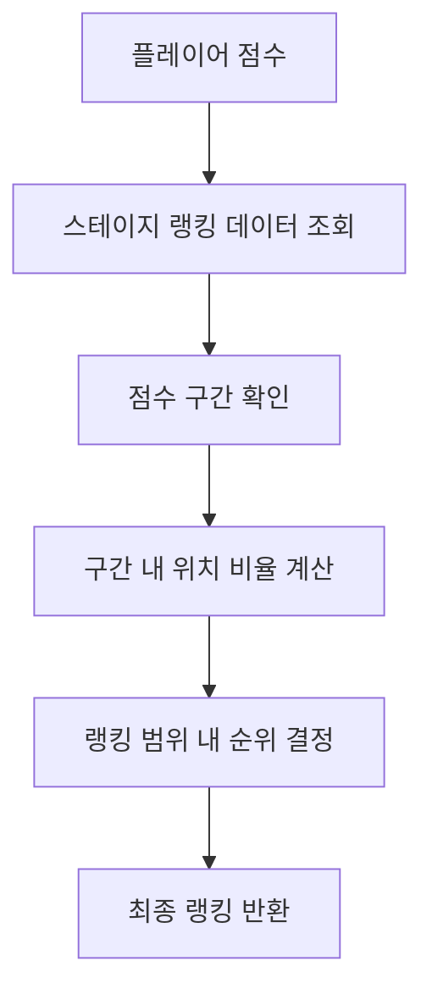

# 가게 랭킹 시스템

츄츄버거 가게 랭킹 시스템은 플레이어의 가게 운영 성과를 기준으로 전체 서버에서의 순위를 계산하고 관리하는 경쟁 시스템입니다. 플레이어의 최고 수익 기록을 바탕으로 1위부터 10,000위까지의 순위를 매기며, 정기적인 랭킹 발표와 보상 지급을 통해 지속적인 경쟁 동기를 제공합니다.

## 시스템 개요

가게 랭킹 시스템은 플레이어의 운영 성과를 객관적으로 평가하고 다른 플레이어들과 비교할 수 있는 척도를 제공합니다.

### 핵심 특징

- **점수 기반 랭킹**: 플레이어의 최고 수익 기록을 점수로 환산
- **1~10,000위 순위**: 전체 서버 규모의 대규모 랭킹 시스템
- **월간 발표**: 매월 10일 정기 랭킹 발표 및 보상 지급
- **주변 가게 시뮬레이션**: AI 가게들과의 경쟁 환경 제공
- **재평가 시스템**: 골드를 소모하여 즉시 랭킹 재계산 가능

## 랭킹 계산 시스템

### 점수 산정 기준

랭킹 점수는 다음을 기준으로 계산됩니다:
- **기본 점수**: `PlayerSettlement.BestRecipeEarnings` (최고 수익 기록)
- **스테이지별 보정**: 각 스테이지마다 다른 점수 구간 설정

### 순위 결정 알고리즘

순위는 다음 공식으로 계산됩니다:



**계산 과정:**
1. 플레이어 점수가 속하는 구간 찾기
2. 구간 내에서의 상대적 위치 계산
3. 랭킹 범위 내에서 정확한 순위 결정
4. 1~10,000위 범위 내로 클램핑

## 주요 컴포넌트

### PlayerManagement

가게 랭킹을 포함한 모든 경영 관련 데이터를 관리하는 핵심 컴포넌트입니다.

**랭킹 관련 주요 속성:**
- `StoreRanking`: 현재 가게 랭킹
- `LastStoreRanking`: 이전 랭킹 (변화 추적용)
- `Surroundings`: 현재 주변 가게 정보
- `LastSurroundings`: 이전 주변 가게 정보
- `RankingSpeech`: 1위 달성 시 입력할 수 있는 발언

**핵심 메서드:**
- `ExamStoreRanking()`: 랭킹 계산 및 업데이트
- `SetStoreRanking()`: 랭킹 설정 및 보상 지급
- `ReturnSurroundingsData()`: 주변 가게 데이터 생성
- `ReexamRanking()`: 즉시 랭킹 재평가

### StoreRankingDataSetLogic

랭킹 계산과 관련된 모든 로직을 담당하는 Logic 컴포넌트입니다.

**핵심 기능:**
- `ReturnPlayerUserRankingScore()`: 플레이어 랭킹 점수 계산
- `ReturnPlayerUserRankingByScore()`: 점수를 통한 랭킹 계산
- `ReturnRewardDataByRanking()`: 랭킹별 보상 데이터 반환
- `ReturnRandomStoreNameOfGrade()`: 등급별 랜덤 상점 이름 생성

## 랭킹 발표 시스템

### 정기 발표

매월 10일에 자동으로 랭킹이 발표됩니다:

**발표 과정:**
1. 현재 점수 기반 랭킹 계산
2. 이전 랭킹과 비교하여 변화 확인
3. 랭킹별 보상 지급
4. 랭킹 변화에 따른 이벤트 실행
5. 주변 가게 데이터 업데이트

### 랭킹 변화 이벤트

랭킹 변화에 따라 다른 이벤트가 실행됩니다:

- **1위 달성**: "Y0004" 이벤트 (특별 축하)
- **순위 상승**: "Y0001" 이벤트 (상승 축하)
- **순위 유지**: "Y0003" 이벤트 (현상 유지)
- **순위 하락**: "Y0002" 이벤트 (하락 안내)

## 보상 시스템

### 랭킹별 보상

각 랭킹 구간마다 다른 보상이 지급됩니다:
- **보상 종류**: 골드, 다이아몬드, 재료 박스 등
- **보상 규모**: 높은 랭킹일수록 더 많은 보상
- **스테이지 보정**: 스테이지에 따른 보상 조정

### 1위 특별 혜택

1위 달성 시 특별한 혜택을 받습니다:
- **발언권**: 서버 전체에 보여질 발언 입력 가능
- **특별 보상**: 최고 등급의 보상 아이템
- **업적 달성**: 1위 관련 업적 및 배지 획득

## 주변 가게 시스템

### 가상 경쟁자 생성

플레이어 주변 순위의 가상 가게들이 생성됩니다:

**생성 규칙:**
- 플레이어 랭킹 ±4위 범위의 가게들
- 랭킹별 적절한 점수 할당
- 등급에 맞는 상점 이름 선택
- 1위와의 라이벌 관계 특별 처리

### 주변 가게 데이터 구조

각 주변 가게는 다음 정보를 포함합니다:
```
랭킹: 상점이름,점수
```

예: `1위: RivalStoreName,150000`

## 재평가 시스템

### 즉시 재평가

플레이어는 골드를 소모하여 언제든지 랭킹을 재평가받을 수 있습니다:

**재평가 조건:**
- 현재 랭킹이 2위 이하여야 함
- 랭킹별로 다른 재평가 비용 소모
- 점수 향상이 있어야 의미 있는 재평가

**재평가 비용:**
- 높은 랭킹일수록 더 높은 비용
- 스테이지별로 비용 조정

## UI 시스템

### 랭킹 표시

플레이어의 랭킹 정보가 다양한 UI에서 표시됩니다:
- 메인 메뉴에서 현재 랭킹 확인
- 상세 랭킹 정보 페이지
- 주변 가게 목록 및 비교

### Red Dot 시스템

랭킹 개선 가능성이 있을 때 알림을 제공합니다:
- 1위 달성 가능한 점수 보유 시
- 현재 랭킹보다 높은 순위 달성 가능 시

## 업적 및 로그 연동

### 업적 시스템

랭킹과 관련된 다양한 업적이 있습니다:
- `_AchievementTypeEnum.Ranking`: 최고 랭킹 기록
- 1위 달성 관련 업적
- 랭킹 상승 관련 업적

### 로그 시스템

모든 랭킹 활동이 기록됩니다:
- 랭킹 변화 로그
- 보상 수령 로그
- 재평가 로그

## 데이터 관리

### 저장 데이터

다음 랭킹 관련 데이터가 DB에 저장됩니다:
- 현재 랭킹 및 이전 랭킹
- 주변 가게 정보
- 1위 발언 내용
- 연간 수익 기록

### 동기화

랭킹 정보는 클라이언트와 실시간 동기화됩니다:
- `@TargetUserSync`를 통한 자동 동기화
- 랭킹 변화 시 즉시 UI 업데이트

## 스테이지별 차등 시스템

### 스테이지별 랭킹 데이터

각 스테이지마다 다른 랭킹 기준이 적용됩니다:
- 스테이지 1: 튜토리얼 단계, 랭킹 시스템 비활성
- 스테이지 2+: 본격적인 랭킹 경쟁 시작

### 보상 스케일링

스테이지가 높아질수록:
- 더 높은 점수 요구사항
- 더 큰 보상 규모
- 더 치열한 경쟁 환경

## 전략적 요소

### 랭킹 상승 전략

- **수익 최적화**: 최고 수익 기록 갱신이 핵심
- **타이밍**: 월말 랭킹 발표 전 집중 운영
- **재평가 활용**: 적절한 시점에 재평가 실행

### 경쟁 심리

- **주변 가게 분석**: 경쟁자들의 점수 파악
- **목표 설정**: 단계적 랭킹 상승 계획
- **1위 도전**: 서버 최고의 영예를 위한 도전

## Code References

- `RootDesk/MyDesk/00. Player/PlayerManagement.mlua :: ExamStoreRanking()` — 랭킹 계산 및 업데이트
- `RootDesk/MyDesk/00. Player/PlayerManagement.mlua :: SetStoreRanking()` — 랭킹 설정 및 보상 지급
- `RootDesk/MyDesk/00. Player/PlayerManagement.mlua :: ReturnSurroundingsData()` — 주변 가게 데이터 생성
- `RootDesk/MyDesk/13. StoreRanking/StoreRankingDataSetLogic.mlua :: ReturnPlayerUserRankingByScore()` — 점수 기반 랭킹 계산
- `RootDesk/MyDesk/13. StoreRanking/StoreRankingDataSetLogic.mlua :: ReturnRewardDataByRanking()` — 랭킹별 보상 데이터
- `RootDesk/MyDesk/13. StoreRanking/StoreRankingDataSetLogic.mlua :: RefreshRankingRedDot()` — 랭킹 알림 관리
- `RootDesk/MyDesk/13. StoreRanking/UIStoreRanking.mlua` — 랭킹 UI 관리
- `RootDesk/MyDesk/13. StoreRanking/StoreRankingRewardData.mlua` — 보상 데이터 구조체
