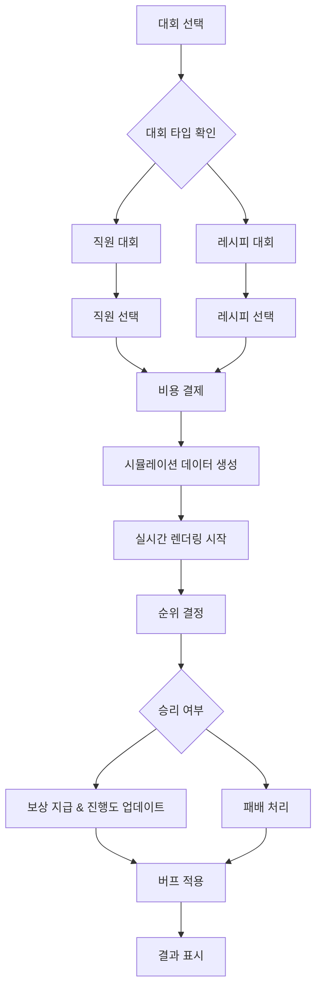

# 대회 시스템

츄츄버거 대회 시스템은 플레이어가 자신의 직원이나 레시피를 다른 AI 경쟁자들과 경쟁시켜 순위를 겨루는 PvE 경쟁 컨텐츠입니다. 실시간 애니메이션 렌더링을 통해 직관적인 시합 결과를 확인할 수 있으며, 승리 시 다양한 보상과 버프 효과를 얻을 수 있습니다.

## 시스템 개요

대회 시스템은 두 가지 유형으로 구분됩니다:

### 공식 대회 (Official Trial)
- **직원 대회**: 2개의 고정된 직원 타입 대회
- **레시피 대회**: 스테이지별로 결정되는 레시피 대회
- 단계적 진행도 시스템 (등급-난이도)
- 승리 시 레시피에 영구 버프 적용

### 비공식 대회 (Unofficial Trial)
- **직원 대회**: 1개의 랜덤 직원 타입 대회
- **레시피 대회**: 2개의 랜덤 레시피 대회  
- 일일 리셋으로 새로운 도전 과제 제공
- 일회성 보상 시스템

## 핵심 동작 흐름



## 주요 컴포넌트

### PlayerTrial

대회 시스템의 핵심 관리 컴포넌트로, 모든 대회 관련 로직을 담당합니다.

**주요 속성:**
- `SelectedTrialId`: 선택된 대회 ID
- `SelectedEmployeeId`: 선택된 직원 ID
- `SelectedRecipeId`: 선택된 레시피 ID
- `TrialProgress`: 공식 대회 진행도
- `UnofficialTrials`: 비공식 대회 목록과 완료 상태
- `ExEmployeeIds`: 공식 직원 대회에서 사용된 직원 기록

**핵심 기능:**
- `SelectTrial()`: 대회 선택 및 비용 확인
- `SetTrialData()`: 시뮬레이션 데이터 생성
- `EndTrial()`: 결과 처리 및 보상 지급
- `UpdateTrialProgress()`: 진행도 업데이트

### TrialLogic

대회의 핵심 계산 로직을 담당하는 Logic 컴포넌트입니다.

**주요 기능:**
- `ReturnUserRank()`: 플레이어 능력치 기반 순위 계산
- `ReturnTrialScore()`: 순위별 점수 계산
- `ReturnRandomRivalId()`: AI 라이벌 캐릭터 선택
- `ReturnRandomBurgerIngreList()`: 랜덤 버거 재료 생성

### 데이터 구조

#### TrialData
기본 대회 정보를 담는 구조체입니다:
- `Target`: 대회 대상 ("Employee" 또는 "Recipe")
- `TargetStat`: 대상 능력치 (직원의 경우)
- `TargetType`: 대상 타입 (레시피의 경우)
- `GradeData`: 등급별 세부 데이터

#### TrialGradeData
등급별 대회 정보를 관리합니다:
- `Grade`: 등급 (0~3)
- `MissionCount`: 미션 수량
- `DifficultyData`: 난이도별 세부 데이터

## 시뮬레이션 시스템

### 데이터 생성 과정

대회이 시작되면 다음과 같은 시뮬레이션 데이터가 생성됩니다:

1. **캐릭터 데이터**: 플레이어 직원 + AI 라이벌들
2. **순위 데이터**: 능력치 기반 순위 및 점수
3. **플레이 데이터**: 시간별 진행 상황
4. **재료 데이터**: 버거 제작용 재료 목록

### 순위 결정 알고리즘

플레이어의 순위는 다음 공식으로 결정됩니다:
- **직원 대회**: 선택된 직원의 해당 스탯 레벨
- **레시피 대회**: 선택된 레시피의 맛 점수

능력치와 요구사항을 비교하여 가중치 테이블을 통해 1~3위 중 순위를 결정합니다.

### 실시간 렌더링

TrialSimpleRenderLogic을 통해 대회 진행 상황이 실시간으로 시각화됩니다:
- 3개의 레이아웃에서 동시 진행
- 버거 제작 과정 애니메이션
- 진행률 바 및 순위 표시
- 완료 시 순위별 결과 표시

## 보상 시스템

### 공식 대회 보상
- **골드 및 아이템**: 등급과 난이도에 따른 기본 보상
- **진행도 진전**: 다음 단계 해금
- **레시피 버프**: 레시피 대회 승리 시 해당 레시피에 영구 15% 보너스 적용

### 비공식 대회 보상
- **골드 및 아이템**: 일회성 보상
- **재료 카드**: 랜덤 재료 또는 번 카드 획득

## 진행도 시스템

### 공식 대회 진행도

공식 대회은 "등급-난이도" 형식으로 진행됩니다:
```
0-1 → 0-2 → ... → 1-1 → 1-2 → ... → 3-최대
```

각 단계를 클리어해야 다음 단계가 해금됩니다.

### 해금 조건
- **직원 대회**: 해당 스탯의 최고 레벨 직원이 요구사항 충족
- **레시피 대회**: 해당 타입의 최고 맛점수 레시피가 요구사항 충족

## UI 시스템

### 대회 선택 UI
- 공식/비공식 탭 분리
- 대회별 정보 및 보상 미리보기
- 추천 표시 및 해금 상태 확인

### 직원/레시피 선택 UI
- 보유 직원/레시피 목록 표시
- 능력치 및 추천 여부 표시
- 상세 정보 팝업

### 시뮬레이션 UI
- 3개 레이아웃 동시 진행 표시
- 실시간 진행률 및 순위
- 캐릭터별 정보 표시

### 결과 UI
- 최종 순위 및 점수
- 보상 목록 표시
- 진행도 변화 안내

## 업적 및 로그 연동

### 업적 시스템
- 대회 승리 횟수
- 공식/비공식 대회 구분 승리 횟수
- 직원/레시피 대회 구분 승리 횟수

### 배지 시스템
- 대회 승리 횟수 배지

### 로그 시스템
대회의 모든 활동이 PlayerLog에 기록됩니다:
- 대회 시작/종료
- 선택한 직원/레시피 정보
- 승부 결과 및 보상

## 비용 시스템

각 대회 참여에는 골드가 소모됩니다:
- 등급과 난이도에 따라 비용 증가
- 공식/비공식 대회별 다른 비용 적용
- 비용은 정산 시스템에 기타 지출로 기록

## 일일 리셋 시스템

비공식 대회은 매일 새로운 도전 과제로 리셋됩니다:
- 직원 대회 1개 + 레시피 대회 2개
- 플레이어의 현재 능력치를 고려한 적절한 난이도 선택
- 완료 상태 초기화

## 전략적 요소

### 직원 선택 전략
- 해당 스탯이 높은 직원 우선 선택
- 공식 대회에서는 사용된 직원 재사용 불가

### 레시피 선택 전략  
- 맛점수가 높은 레시피 우선 선택
- 승리 시 영구 버프를 고려한 전략적 선택

### 진행도 관리
- 단계적 해금을 위한 체계적 도전
- 보상 효율성을 고려한 우선순위 설정

## Code References

- `RootDesk/MyDesk/00. Player/PlayerTrial.mlua :: SelectTrial()` — 대회 선택 및 비용 확인
- `RootDesk/MyDesk/00. Player/PlayerTrial.mlua :: SetTrialData()` — 시뮬레이션 데이터 생성
- `RootDesk/MyDesk/00. Player/PlayerTrial.mlua :: EndTrial()` — 결과 처리 및 보상 지급
- `RootDesk/MyDesk/10. Trial/TrialLogic.mlua :: ReturnUserRank()` — 플레이어 순위 계산
- `RootDesk/MyDesk/10. Trial/TrialLogic.mlua :: ReturnTrialScore()` — 순위별 점수 계산
- `RootDesk/MyDesk/10. Trial/Data/TrialData.mlua` — 대회 기본 정보 구조체
- `RootDesk/MyDesk/10. Trial/Data/TrialGradeData.mlua` — 등급별 대회 데이터
- `RootDesk/MyDesk/10. Trial/TrialSimpleRenderLogic.mlua :: EnterTrialRender()` — 시뮬레이션 렌더링
- `RootDesk/MyDesk/10. Trial/UIScript/UITrialSelect.mlua` — 대회 선택 UI
