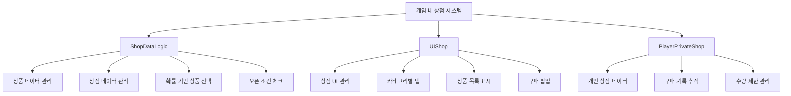
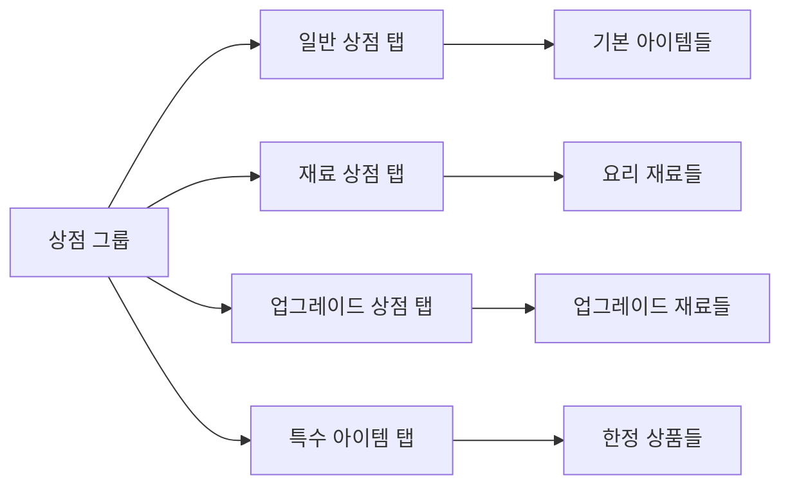
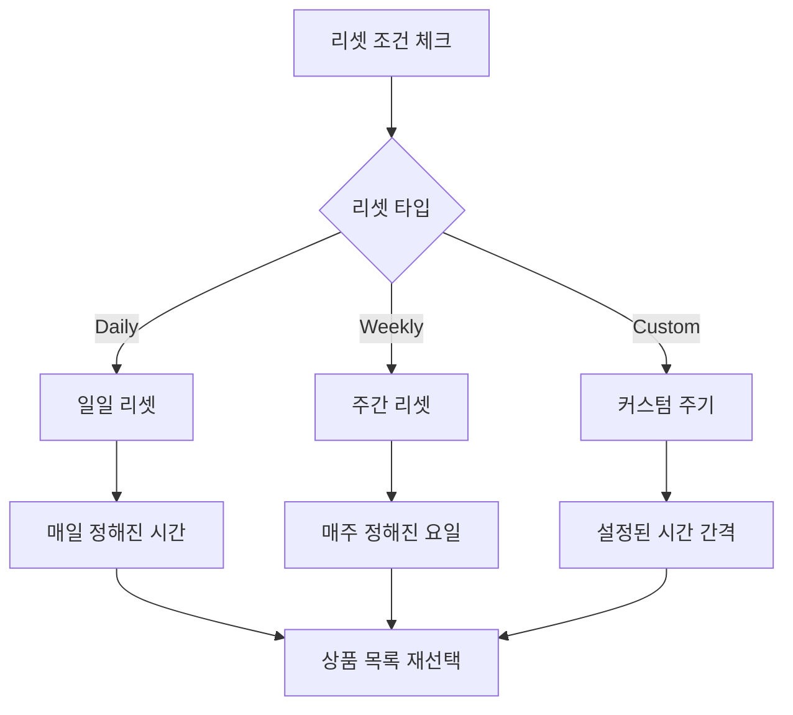
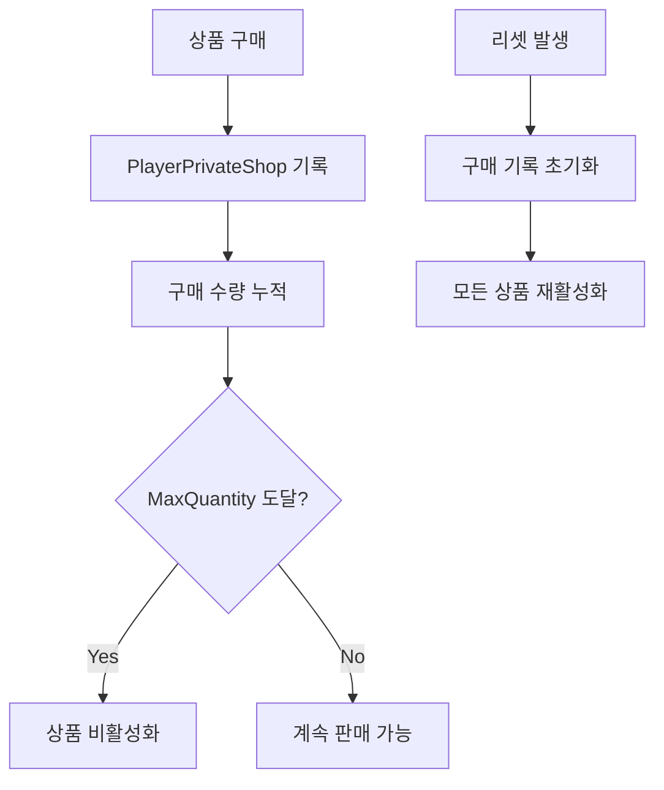

# 게임 내 상점 시스템

츄츄버거 게임 내 상점 시스템은 플레이어가 게임 진행에 필요한 다양한 아이템, 재료, 업그레이드 재료 등을 구매할 수 있는 기본 상점 시스템입니다. **ShopDataLogic**을 중심으로 상품 데이터, 상점 데이터, 구매 처리, 시스템 리셋, 수량 제한 등을 체계적으로 관리하며, 확률 기반 상품 선택과 오픈 조건을 통해 동적인 상점 운영을 제공합니다.

## 시스템 개요



## ShopDataLogic - 데이터 관리 핵심

### 데이터 구조 관리

LoadProductData() 메서드에서 CSV 데이터셋을 로드하여 메모리 구조로 변환합니다:

1. **데이터 초기화**: ProductData와 ProductIdsByShopId 테이블 클리어
2. **CSV 순회**: ShopProductDataSet에서 각 행을 ShopProductData 객체로 변환
3. **인덱싱**: 상품 ID와 상점 ID별로 분류하여 빠른 접근 지원

<details>
<summary>상품 데이터 로딩 구현</summary>

```lua
-- RootDesk/MyDesk/Shop/ShopDataLogic.mlua :: LoadProductData()
method void LoadProductData()
    table.clear(self.ProductData)
    table.clear(self.ProductIdsByShopId)
    local productDataSet = _DataService:GetTable("ShopProductDataSet")
    for i = 1, productDataSet:GetRowCount() do
        local productData = ShopProductData()
        productData:LoadFrom(productDataSet, i)
        if self.ProductData[productData.ProductId] ~= nil then
            break
        end
    
        self.ProductData[productData.ProductId] = productData
        
        if self.ProductIdsByShopId[productData.LinkedShopId] == nil then
            self.ProductIdsByShopId[productData.LinkedShopId] = {}
        end
        
        table.insert(self.ProductIdsByShopId[productData.LinkedShopId], productData.ProductId)
    end
end
```
</details>

**핵심 속성:**
- `ProductData`: 전체 상품 데이터 관리
- `ProductIdsByShopId`: 상점별 상품 ID 목록  
- `ShopData`: 상점 기본 정보
- `ShopIdsByShopGroup`: 상점 그룹별 상점 ID 목록

### 확률 기반 상품 선택 시스템

PickProductsByShopId() 메서드는 상점에서 진열할 상품을 확률적으로 선택합니다:

1. **Independent 타입**: 각 상품이 독립적인 확률로 진열 결정
2. **의존적 타입**: 같은 PutoutType 내에서 가중치 기반 선택
3. **RandomBox 활용**: 공정한 확률 계산을 위한 랜덤박스 시스템

핵심 로직: `if product.PutoutValue > randomValue then table.insert(picked, id) end`

<details>
<summary>상품 선택 알고리즘 구현</summary>

```lua
-- RootDesk/MyDesk/Shop/ShopDataLogic.mlua :: PickProductsByShopId()
method table PickProductsByShopId(string shopId)
    local candidateProduct = self.ProductIdsByShopId[shopId]
    local picked = {}
    
    local dependetCandidate = {}
    for i,id in ipairs(candidateProduct) do
        local product = self:GetShopProductData(id)
        if product == nil then
            continue
        end
        if product.PutoutType == "Independent" then
            local randomValue = _UtilLogic:RandomIntegerRange(0, 100000) 
            if product.PutoutValue > randomValue then
                table.insert(picked, id)
            end
        elseif product.PutoutType:len() > 0 then
            if dependetCandidate[product.PutoutType] == nil then
                dependetCandidate[product.PutoutType] = RandomBox()
            end 
            local randomBox = dependetCandidate[product.PutoutType]
            randomBox:AddItem(product.PutoutValue, product.ProductId)
        end
    end
    
    for k,v in pairs(dependetCandidate) do
        local pickedId = v:Pick()
        table.insert(picked, pickedId)
    end
```
</details>

**상품 선택 방식:**
- **Independent**: 개별 확률로 독립적 선택
- **의존적 선택**: 같은 타입 내에서 가중치 기반 선택
- **RandomBox 시스템**: 확률 테이블을 통한 정확한 추첨

## 데이터 구조 시스템

### ShopData - 상점 기본 정보

ShopData 구조체는 상점의 기본 설정을 정의합니다:

<details>
<summary>ShopData 구조체 정의</summary>

```lua
-- RootDesk/MyDesk/Shop/ShopData.mlua
script ShopData

property string ShopId = ""
property string ShopGroup = ""
property string CurrencyType = ""
property string SystemResetType = ""
property integer SystemResetValue = 0
property integer CustomResetCost = 0
property integer CustomResetCostAdd = 0
property string ShopIconRUID = ""
property string OpenCondition = ""
property string OpenConditionValue = ""
property string CategoryNameKey = ""
```
</details>

**주요 속성:**
- `ShopId`: 상점 고유 식별자
- `ShopGroup`: 상점 그룹 (카테고리별 탭)
- `CurrencyType`: 결제 화폐 종류
- `SystemResetType/Value`: 자동 리셋 조건
- `CustomResetCost`: 수동 리셋 비용
- `OpenCondition`: 상점 오픈 조건

### ShopProductData - 상품 정보

ShopProductData 구조체는 개별 상품의 모든 속성을 정의합니다:

<details>
<summary>ShopProductData 구조체 정의</summary>

```lua
-- RootDesk/MyDesk/Shop/ShopProductData.mlua
script ShopProductData

property string ProductId = ""
property string LinkedShopId = ""
property string PutoutType = ""
property number PutoutValue = 0
property integer SortingOrder = 0
property integer Price = 0
property string ItemId = ""
property integer ItemCount = 0
property integer MaxQuantity = 0
property string PurchaseCondition = ""
property integer PurchaseConditionValue = 0
property string UnlockCondition = ""
property integer UnlockConditionValue = 0
property number SaleRate = 0
```
</details>

**상품 속성:**
- `ProductId`: 상품 고유 ID
- `LinkedShopId`: 소속 상점 ID
- `PutoutType/Value`: 진열 확률 타입과 값
- `Price/ItemId/ItemCount`: 가격과 상품 정보
- `MaxQuantity`: 구매 수량 제한
- `PurchaseCondition`: 구매 조건
- `SaleRate`: 할인율

## UIShop - 상점 인터페이스

### 상점 오픈 시스템

Open() 메서드는 상점 그룹을 열고 접근 가능한 상점들을 필터링합니다:

1. **그룹 검색**: GetShopIdsByShopGroup()으로 해당 그룹의 상점 목록 조회
2. **접근성 확인**: CheckCanOpenShop()으로 각 상점의 오픈 조건 검증
3. **정렬**: 상점 ID 기준 역순 정렬로 최신 상점 우선 표시

핵심 필터링 로직: `if _ShopDataLogic:CheckCanOpenShop(shopId, player) then`

<details>
<summary>상점 오픈 로직 구현</summary>

```lua
-- RootDesk/MyDesk/Shop/UIShop.mlua :: Open()
method void Open(string shopGroupId, string openShopId)
    self:ClearData()    
    self.Entity.Parent.Enable = true
    
    local shopIds = _ShopDataLogic:GetShopIdsByShopGroup(shopGroupId)
    if shopIds == nil or #shopIds == 0 then
        self:Close()
        return
    end
    
    local player = _UserService.LocalPlayer
    local canOpenIds = {}
    for i, shopId in ipairs(shopIds) do
        if _ShopDataLogic:CheckCanOpenShop(shopId, player) then
            table.insert(canOpenIds, shopId)
        end
    end
    
    table.sort(canOpenIds, function(a, b) 
        return tonumber(a) > tonumber(b)
    end)
```
</details>

**오픈 과정:**
1. 상점 그룹별 상점 목록 조회
2. 플레이어 조건 확인하여 오픈 가능한 상점 필터링
3. 상점 ID 순으로 정렬
4. UI 메뉴 렌더러 생성 및 초기화
5. 시간 흐름 정지 및 UI 활성화

### 탭 기반 네비게이션

상점은 그룹별로 탭으로 구분되어 표시됩니다:



### 상품 렌더링 시스템

- **UIShopProductRenderer**: 개별 상품 표시
- **UIShopMenuRenderer**: 상점 탭 메뉴 관리  
- **UIShopPurchasePopup**: 구매 확인 팝업

## 리셋 시스템

### 자동 리셋



**SystemResetType 종류:**
- **Daily**: 매일 정해진 시간에 리셋
- **Weekly**: 매주 정해진 요일에 리셋  
- **Custom**: 설정된 간격으로 리셋
- **Manual**: 수동 리셋만 가능

### 수동 리셋

플레이어가 골드를 소모하여 즉시 상점을 리셋할 수 있습니다:

- **CustomResetCost**: 기본 리셋 비용
- **CustomResetCostAdd**: 리셋 횟수에 따른 추가 비용
- **점진적 비용 증가**: 남용 방지를 위한 비용 상승

## 구매 조건 시스템

### 잠금 해제 조건 (UnlockCondition)

상품이 상점에 표시되기 위한 조건:
- **레벨 조건**: 플레이어나 경영 레벨 제한
- **업적 조건**: 특정 업적 달성 필요
- **스테이지 조건**: 특정 스테이지 도달 필요
- **이벤트 조건**: 특정 이벤트 발생 필요

### 구매 조건 (PurchaseCondition)

상품 구매 시 추가 확인 조건:
- **재고 조건**: 플레이어 인벤토리 공간
- **전제 조건**: 다른 아이템 보유 필요
- **시간 조건**: 특정 시간대에만 구매 가능
- **횟수 조건**: 일일/주간 구매 제한

## 수량 제한 시스템

### MaxQuantity 관리

각 상품마다 구매 가능한 최대 수량을 설정:
- **0**: 무제한 구매 가능
- **양수**: 해당 수량까지만 구매 가능
- **개인별 추적**: PlayerPrivateShop에서 구매 기록 관리

### 재고 추적



## 화폐 시스템 연동

### CurrencyType 지원

다양한 게임 내 화폐로 결제 가능:
- **Gold**: 기본 게임 화폐
- **Diamond**: 프리미엄 화폐
- **Heart**: 특별 화폐
- **Clover**: 훈련 관련 화폐
- **기타 재료**: 특정 재료와의 교환

### 할인 시스템

- **SaleRate**: 상품별 할인율 설정 (0.0 ~ 1.0)
- **기간 한정 할인**: 특정 기간에만 적용
- **조건부 할인**: 특정 조건 만족 시 추가 할인

## 상점 그룹별 특화

### 일반 상점
- **기본 소모품**: 도시락, 하트, 골드 등
- **상시 판매**: 항상 이용 가능한 기본 아이템들
- **저렴한 가격**: 게임 진행을 위한 필수 아이템들

### 재료 상점
- **요리 재료**: 버거 제작용 재료들
- **번과 소스**: 다양한 번과 소스 재료
- **등급별 재료**: 1성부터 5성까지 다양한 등급

### 업그레이드 상점  
- **경험치 아이템**: 직원 레벨업용 아이템
- **업그레이드 재료**: 시설 업그레이드용 재료
- **특수 재료**: 고급 업그레이드 전용 재료

### 특수 아이템 상점
- **한정 판매**: 특정 조건에서만 등장
- **고급 아이템**: 희귀하고 강력한 효과
- **이벤트 상품**: 특별 이벤트 관련 아이템

## 성능 최적화

### 데이터 캐싱
- **상품 데이터**: 로딩 시 메모리에 캐시
- **필터링 결과**: 조건별 필터링 결과 임시 저장
- **UI 렌더링**: 동일한 상품 정보 재사용

### 동적 로딩
- **필요 시점 로딩**: 상점 오픈 시에만 데이터 처리
- **지연 렌더링**: 스크롤 시 필요한 상품만 렌더링
- **메모리 정리**: 상점 종료 시 불필요한 데이터 해제

## 로그 및 추적 시스템

### 구매 로그
- **구매 기록**: 모든 구매 내역 상세 기록
- **결제 추적**: 사용된 화폐와 수량 기록
- **패턴 분석**: 플레이어 구매 패턴 데이터 수집

### 상점 운영 데이터
- **진열 기록**: 어떤 상품이 언제 진열되었는지
- **리셋 기록**: 자동/수동 리셋 발생 기록
- **접근 통계**: 상점별 방문 빈도와 체류 시간

## 코드 참조

### 핵심 데이터 관리
- `RootDesk/MyDesk/Shop/ShopDataLogic.mlua :: LoadProductData()` — 상품 데이터 로드
- `RootDesk/MyDesk/Shop/ShopDataLogic.mlua :: LoadShopData()` — 상점 데이터 로드  
- `RootDesk/MyDesk/Shop/ShopDataLogic.mlua :: PickProductsByShopId()` — 확률 기반 상품 선택
- `RootDesk/MyDesk/Shop/ShopDataLogic.mlua :: CheckCanOpenShop()` — 상점 오픈 조건 확인

### UI 시스템
- `RootDesk/MyDesk/Shop/UIShop.mlua :: Open()` — 상점 UI 열기
- `RootDesk/MyDesk/Shop/UIShop.mlua :: OnResetButtonClicked()` — 상점 리셋 처리
- `RootDesk/MyDesk/Shop/UIShopProductRenderer.mlua` — 상품 렌더링
- `RootDesk/MyDesk/Shop/UIShopMenuRenderer.mlua` — 상점 메뉴 관리

### 데이터 구조체
- `RootDesk/MyDesk/Shop/ShopData.mlua :: LoadFrom()` — 상점 기본 데이터 구조
- `RootDesk/MyDesk/Shop/ShopProductData.mlua :: LoadFrom()` — 상품 데이터 구조
- `RootDesk/MyDesk/Shop/PlayerPrivateShop.mlua` — 개인 상점 데이터 관리

### 구매 처리 시스템  
- `RootDesk/MyDesk/Shop/UIShopPurchasePopup.mlua` — 구매 확인 팝업
- `RootDesk/MyDesk/Shop/BMCommon/PaidLogic.mlua` — 결제 처리 로직
- `RootDesk/MyDesk/Shop/BMCommon/PurchaseLogLogic.mlua` — 구매 로그 관리

---

이 문서는 츄츄버거 게임 내 기본 상점 시스템의 전체 구조와 기능을 설명합니다. 확률 기반 상품 선택, 다양한 리셋 시스템, 조건부 상품 관리, 수량 제한 등이 어떻게 통합되어 동적이고 전략적인 상점 경험을 제공하는지 이해할 수 있습니다.
