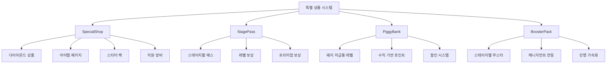
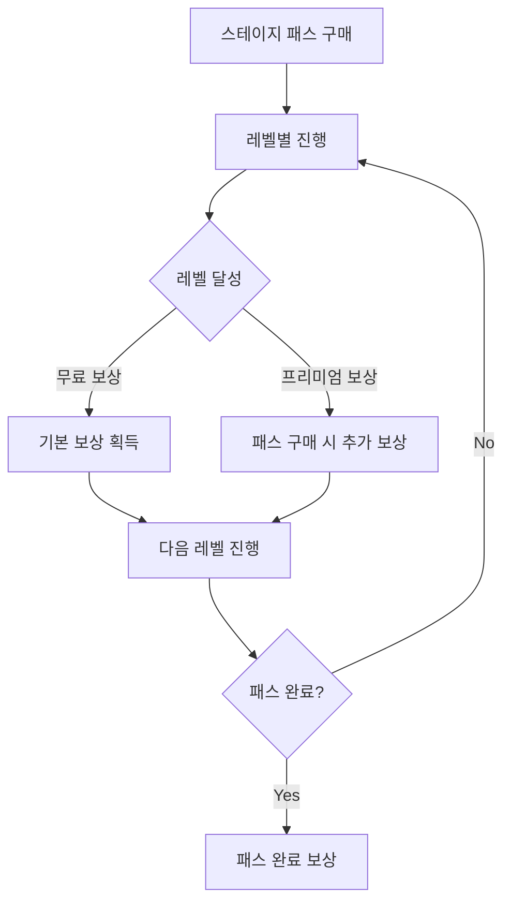
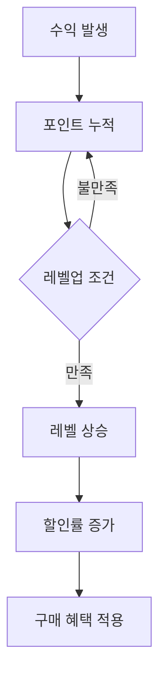

# 특별 상품 시스템

츄츄버거 특별 상품 시스템은 일반 게임 내 상점과는 별도로 운영되는 프리미엄 상품군으로, **SpecialShop**, **StagePass**, **PiggyBank**, **BoosterPack** 등 4가지 주요 시스템으로 구성됩니다. WorldCoin(유료 화폐)을 기반으로 하는 결제 시스템과 연동되어 플레이어에게 특별한 가치와 편의성을 제공합니다.

## 시스템 개요



## SpecialShop - 특별 상점 시스템

### 상점 카테고리

SpecialShopDataLogic에서 4개 카테고리의 특별 상점을 관리합니다:

<details>
<summary>특별 상점 카테고리 정의</summary>

```lua
-- RootDesk/MyDesk/Shop/SpecialShop/SpecialShopDataLogic.mlua
property string DiamondShopId = "1003"
property string ItemPackageShopId = "1002"
property string StarterPackShopId = "1001"
property string EmployeeEquipShopId = "1004"
```
</details>

**주요 카테고리:**
- **StarterPack (1001)**: 신규 플레이어 전용 스타터 패키지
- **ItemPackage (1002)**: 다양한 아이템 묶음 패키지
- **Diamond (1003)**: 다이아몬드 직접 구매
- **EmployeeEquip (1004)**: 직원 장비 특별 상품

### 데이터 구조 관리

LoadSpecialShopProductDataSet() 메서드로 특별 상점 상품 데이터를 로드하고 구조화합니다:

1. **데이터 초기화**: 기존 상품 데이터 테이블 클리어
2. **CSV 로드**: SpecialShopProductDataSet에서 각 상품 정보 로드
3. **이중 인덱싱**: ID별 접근과 상점별 그룹핑을 동시 지원

핵심 로직: `self.SpecialShopProductDataByLinkedShopId[data.LinkedShopId] = {}`

<details>
<summary>특별 상점 데이터 로딩 구현</summary>

```lua
-- RootDesk/MyDesk/Shop/SpecialShop/SpecialShopDataLogic.mlua :: LoadSpecialShopProductDataSet()
method void LoadSpecialShopProductDataSet()
    table.clear(self.SpecialShopProductData)
    table.clear(self.SpecialShopProductDataByLinkedShopId)
    
    local dataSet = _DataService:GetTable("SpecialShopProductDataSet")
    
    local ruidList = {}
    for i = 1, dataSet:GetRowCount() do
        local data = SpecialShopProductData()
        data:LoadFrom(dataSet:GetRow(i))
        if self.SpecialShopProductData[data.Id] ~= nil then
            break
        end
        self.SpecialShopProductData[data.Id] = data
        if isvalid(self.SpecialShopProductDataByLinkedShopId[data.LinkedShopId]) then
            table.insert(self.SpecialShopProductDataByLinkedShopId[data.LinkedShopId], data)
        else
            self.SpecialShopProductDataByLinkedShopId[data.LinkedShopId] = {}
            table.insert(self.SpecialShopProductDataByLinkedShopId[data.LinkedShopId], data)
        end
    end
end
```
</details>

**데이터 관리:**
- `SpecialShopProductData`: 전체 특별 상품 데이터
- `SpecialShopProductDataByLinkedShopId`: 상점별 상품 분류
- `SpecialShopProductModelData`: UI 모델 데이터

### 재고 관리 시스템

HasRemainingStock() 메서드로 상품의 구매 가능 여부를 확인합니다:

`return itemCount == -1 or purchaseCount < itemCount`

- **-1**: 무제한 구매 가능한 상품
- **양수**: 제한된 수량 내에서만 구매 가능

<details>
<summary>재고 확인 로직</summary>

```lua
-- RootDesk/MyDesk/Shop/SpecialShop/SpecialShopDataLogic.mlua :: HasRemainingStock()
method boolean HasRemainingStock(string productId, integer purchaseCount)
    local itemCount = self.SpecialShopProductData[productId].ItemCount
    return itemCount == -1 or purchaseCount < itemCount 
end
```
</details>

**재고 유형:**
- **-1**: 무제한 구매 가능
- **양수**: 제한된 수량 (개인별 구매 제한)

### WorldCoin 연동

IsCurrenyWorldCoin() 메서드로 해당 상품이 유료 화폐를 사용하는지 확인합니다:

`return self.SpecialShopData[data.LinkedShopId].UseItemId == "G2000"`

G2000 아이템 ID는 WorldCoin(유료 화폐)을 나타냅니다.

<details>
<summary>WorldCoin 연동 확인 로직</summary>

```lua
-- RootDesk/MyDesk/Shop/SpecialShop/SpecialShopDataLogic.mlua :: IsCurrenyWorldCoin()
method boolean IsCurrenyWorldCoin(string productId)
    local data = self.SpecialShopProductData[productId]
    return self.SpecialShopData[data.LinkedShopId].UseItemId == "G2000"
end
```
</details>

## StagePass - 스테이지 패스 시스템

### 패스 구조 시스템

StagePassDataLogic은 스테이지 패스의 모든 데이터를 관리합니다:

- **그룹/상품/레벨 데이터**: 패스 구조의 기본 요소들
- **보상 시스템**: 그룹/슬롯/상품별 보상 매핑 테이블
- **제한 아이템**: G0008(특별 재료) 관리

<details>
<summary>StagePassDataLogic 속성 정의</summary>

```lua
-- RootDesk/MyDesk/Shop/StagePass/StagePassDataLogic.mlua
property table StagePassGroupData = {}
property table StagePassProductData = {}
property table StagePassLevelData = {}
property table StagePassLevelId_Sorted = {}
property integer StagePassProductCount = 3
property table StagePassRewardData = {}
property table StagePassRewardIdByGroupId = {}
property table StagePassRewardIdBySlotId = {}
property table StagePassRewardIdByProductId = {}
property table StagePassGroupId_Sorted = {}
property string LimitedItemId = "G0008"
property integer SpecialRewardProgress = 6
```
</details>

**핵심 구성 요소:**
- **그룹 시스템**: 스테이지별 패스 그룹
- **레벨 시스템**: 패스 내 진행 레벨  
- **보상 시스템**: 레벨별 무료/프리미엄 보상
- **상품 시스템**: 패스 구매 옵션

### 패스 진행 시스템



### 보상 수령 시스템

RequestGetPurchaseReward_StagePass() 메서드로 스테이지 패스 구매 보상을 처리합니다:

1. **사용자 검증**: senderUserId와 userId 일치 확인
2. **구매 상태 확인**: IsPassProductPurchased()로 패스 구매 여부 검증
3. **중복 수령 방지**: GetStagePassPurchaseRewardReceived()로 기수령 여부 확인
4. **보상 지급**: ReceiveStagePassPurchaseReward()로 실제 아이템 지급

핵심 검증: `if isPurchased == false then _SpecialShopDataLogic:AbnormalLog() return end`

<details>
<summary>스테이지 패스 보상 수령 구현</summary>

```lua
-- RootDesk/MyDesk/Shop/BMCommon/PaidLogic.mlua :: RequestGetPurchaseReward_StagePass()
method void RequestGetPurchaseReward_StagePass(string productId, string userId)
    if senderUserId ~= userId then
        _SpecialShopDataLogic:AbnormalLog()
        return
    end
    
    local userEntity = _UserService:GetUserEntityByUserId(userId)
    
    local productData = _StagePassDataLogic.StagePassProductData[productId]
    
    local isPurchased = _StagePassDataLogic:IsPassProductPurchased(productId, userId)
    if isPurchased == false then
        _SpecialShopDataLogic:AbnormalLog()
        return
    end
    
    local isReceived = userEntity.PlayerOutgameManager:GetStagePassPurchaseRewardReceived(productId)
    if isReceived then
        _SpecialShopDataLogic:AbnormalLog()
        return
    end
    
    local res = userEntity.PlayerOutgameManager:ReceiveStagePassPurchaseReward(userEntity, productData)
```
</details>

## PiggyBank - 돼지 저금통 시스템

### 레벨 기반 시스템

```29:44:RootDesk/MyDesk/Shop/PiggyBank/PiggyBankDataLogic.mlua
method void LoadPiggyBankLevelDataSet()
    table.clear(self.PiggyBankLevelData)
    
    local dataSet = _DataService:GetTable("PiggyBankLevelDataSet")
    
    for i = 1, dataSet:GetRowCount() do
        local data = PiggyBankLevelData()
        data:LoadFrom(dataSet:GetRow(i))
        if self.PiggyBankLevelData[data.Level] ~= nil then
            break
        end
        table.insert(self.PiggyBankLevelData, data)
        self.PiggyBankLevelDataIdByProductId[data.ProductId] = data.Level
    end
end
```

**핵심 속성:**
- `MaxLevelDefault`: 최대 레벨 (10)
- `AddPointPerEarningRateKey`: 수익당 포인트 비율
- `PiggyBankLevelDataIdByProductId`: 상품별 레벨 매핑

### 포인트 누적 시스템

```559:564:RootDesk/MyDesk/Shop/BMCommon/PaidLogic.mlua
method void AddEarnings_PiggyBank(integer earnings, string userId)
    local userEntity = _UserService:GetUserEntityByUserId(userId)
    userEntity.PlayerSettlement:AddPiggyBankEarnings(earnings)
    
    userEntity.PlayerDBManager:SaveToDB(false)
end
```

**작동 원리:**
1. 플레이어 수익 발생
2. 설정된 비율로 포인트 누적
3. 포인트 임계치 도달 시 레벨업
4. 레벨별 할인 혜택 적용

### 할인 시스템

돼지 저금통 레벨에 따라 구매 시 할인 혜택을 제공:



## BoosterPack - 부스터 팩 시스템

### 스테이지 연동 시스템

```16:30:RootDesk/MyDesk/Shop/BoosterPack/BoosterPackDataLogic.mlua
method void LoadBoosterPackDataSet()
    table.clear(self.BoosterPackData)
    
    local dataSet = _DataService:GetTable("BoosterPackDataSet")
    
    for i = 1, dataSet:GetRowCount() do
        local data = BoosterPackData()
        data:LoadFrom(dataSet:GetRow(i))
        if self.BoosterPackData[data.StageId] ~= nil then
            break
        end
        self.BoosterPackData[data.StageId] = data
    end
end
```

**부스터 팩 특징:**
- **스테이지별 맞춤**: 각 스테이지에 특화된 부스터 팩
- **진행 가속화**: 게임 진행을 빠르게 도와주는 아이템들
- **매니지먼트 레벨 연동**: 경영 레벨에 따른 차등 혜택

### UI 색상 시스템

```8:10:RootDesk/MyDesk/Shop/BoosterPack/BoosterPackDataLogic.mlua
property table PriceColor = {Color.FromHexCode("#fa5246"), Color.FromHexCode("#ffffff")}
property table PriceOutlineColor = {Color.FromHexCode("#ffffff"), Color.FromHexCode("#c15e14")}
```

할인가 표시 시 시각적 구분을 위한 색상 시스템

## 통합 결제 시스템

### PaidLogic - 결제 처리 핵심

```422:444:RootDesk/MyDesk/Shop/BMCommon/PaidLogic.mlua
method boolean PurchaseProcessByShopType(any _Info)
    
    local purchaseInfo = _Info 
    
    local specialShopProductData = _SpecialShopDataLogic.SpecialShopProductData[purchaseInfo.ProductId]
    if specialShopProductData ~= nil then
        return self:PurchaseCallback_SpecialShop(purchaseInfo, specialShopProductData)
    end
    
    if _StagePassDataLogic:IsWorldCoinProduct(purchaseInfo.ProductId) then
        return self:PurchaseCallback_StagePass(purchaseInfo)
    end
    
    if _PiggyBankDataLogic.PiggyBankLevelDataIdByProductId[purchaseInfo.ProductId] then
        return self:PurchaseCallback_PiggyBank(purchaseInfo)
    end
    
    _PurchaseLogLogic:PurchaseFailLog_InvalidProductId(purchaseInfo)
    return false
end
```

**결제 처리 흐름:**
1. 상품 타입 식별 (특별 상점/스테이지 패스/돼지 저금통)
2. 해당 시스템별 콜백 함수 실행
3. 아이템 지급 및 기록 처리
4. 데이터베이스 저장

### WorldShop 연동

```349:368:RootDesk/MyDesk/Shop/BMCommon/PaidLogic.mlua
method void RequestPurchaseWorldShopProduct_StagePass(string productId, string userId)
    if senderUserId ~= userId then
        _SpecialShopDataLogic:AbnormalLog()
        return
    end
    
    local purchaseCount = _UserService:GetUserEntityByUserId(userId).PlayerOutgameManager:GetPurchaseCount(productId)
    if purchaseCount ~= 0 then
        _SpecialShopDataLogic:AbnormalLog()
        return
    end
    
    local worldShopProduct = _WorldShopService:GetProductAndWait(productId)
    if isvalid(worldShopProduct) then
        self:PromptPurchase(productId, userId)
    else
        _SpecialShopDataLogic:AbnormalLog()
        return
    end
end
```

## UI 통합 관리

### BMDropDownLogic - 드롭다운 메뉴

```1:44:RootDesk/MyDesk/Shop/BMCommon/BMDropDownLogic.mlua
script BMDropDownLogic extends Logic

property UISpecialShopRef UISpecialShopGroup = "786a099c-45ec-434d-a7ab-e64a59b2e925"
property UIStagePass UIStagePass = "f96cb0f0-b032-46a5-b189-a42ab5963b45"
property UIPiggyBank UIPiggyBank = "1a0e70eb-8469-4445-879d-fa2a9950d355"
property UIBoosterPack UIBoosterPack = "c4282791-0bc4-4c19-8a67-16b83b0831b0"
```

**통합 UI 접근:**
- 특별 상점 그룹 오픈
- 스테이지 패스 UI 호출  
- 돼지 저금통 관리
- 부스터 팩 구매

### Red Dot 알림 시스템

각 특별 상품 시스템은 독립적인 Red Dot 알림을 지원:
- **새로운 상품 등장**
- **구매 가능한 아이템 존재**
- **할인 이벤트 진행 중**
- **보상 수령 대기**

## 경제 시스템 연동

### 매니지먼트 레벨 연동

부스터 팩과 일부 특별 상품은 플레이어의 매니지먼트 레벨과 연동:
- **레벨별 상품 해금**
- **레벨별 할인 혜택**
- **레벨별 추가 보상**

### 수익 기반 혜택

돼지 저금통은 플레이어의 실제 게임 수익과 연동:
- **수익 비례 포인트 적립**
- **레벨업을 통한 할인 혜택**
- **장기적 투자 가치 제공**

## 성능 최적화 및 보안

### 구매 검증 시스템

```349:368:RootDesk/MyDesk/Shop/BMCommon/PaidLogic.mlua
if senderUserId ~= userId then
    _SpecialShopDataLogic:AbnormalLog()
    return
end

local purchaseCount = _UserService:GetUserEntityByUserId(userId).PlayerOutgameManager:GetPurchaseCount(productId)
if purchaseCount ~= 0 then
    _SpecialShopDataLogic:AbnormalLog()
    return
end
```

**보안 검증:**
- 사용자 ID 일치 확인
- 중복 구매 방지
- 비정상 접근 로그 기록
- 아이템 지급 전 조건 확인

### 데이터 동기화

모든 특별 상품 구매 내역은 실시간으로 동기화:
- **구매 상태 즉시 반영**
- **보상 수령 상태 추적**
- **레벨 진행도 업데이트**

## 로그 및 분석 시스템

### PurchaseLogLogic - 구매 로그

모든 특별 상품 구매는 상세히 기록:
- **구매 시각 및 사용자 정보**
- **상품 정보 및 결제 금액**
- **지급된 아이템 내역**
- **시스템별 구매 패턴 분석**

## 코드 참조

### 핵심 데이터 관리
- `RootDesk/MyDesk/Shop/SpecialShop/SpecialShopDataLogic.mlua :: LoadSpecialShopProductDataSet()` — 특별 상점 데이터 로드
- `RootDesk/MyDesk/Shop/StagePass/StagePassDataLogic.mlua :: LoadStagePassGroupDataSet()` — 스테이지 패스 데이터 로드
- `RootDesk/MyDesk/Shop/PiggyBank/PiggyBankDataLogic.mlua :: LoadPiggyBankLevelDataSet()` — 돼지 저금통 데이터 로드
- `RootDesk/MyDesk/Shop/BoosterPack/BoosterPackDataLogic.mlua :: LoadBoosterPackDataSet()` — 부스터 팩 데이터 로드

### 결제 처리 시스템
- `RootDesk/MyDesk/Shop/BMCommon/PaidLogic.mlua :: PurchaseProcessByShopType()` — 시스템별 결제 처리
- `RootDesk/MyDesk/Shop/BMCommon/PaidLogic.mlua :: PurchaseCallback_SpecialShop()` — 특별 상점 구매 콜백
- `RootDesk/MyDesk/Shop/BMCommon/PaidLogic.mlua :: PurchaseCallback_StagePass()` — 스테이지 패스 구매 콜백
- `RootDesk/MyDesk/Shop/BMCommon/PaidLogic.mlua :: PurchaseCallback_PiggyBank()` — 돼지 저금통 구매 콜백

### UI 관리 시스템
- `RootDesk/MyDesk/Shop/BMCommon/BMDropDownLogic.mlua` — 드롭다운 메뉴 통합 관리
- `RootDesk/MyDesk/Shop/SpecialShop/UISpecialShop.mlua` — 특별 상점 UI
- `RootDesk/MyDesk/Shop/StagePass/UIStagePass.mlua` — 스테이지 패스 UI
- `RootDesk/MyDesk/Shop/PiggyBank/UIPiggyBank.mlua` — 돼지 저금통 UI

### 보상 처리 시스템
- `RootDesk/MyDesk/Shop/BMCommon/PaidLogic.mlua :: RequestGetReward_StagePass()` — 스테이지 패스 보상 수령
- `RootDesk/MyDesk/Shop/BMCommon/PaidLogic.mlua :: RequestReceiveReward_PiggyBank()` — 돼지 저금통 보상 수령
- `RootDesk/MyDesk/Shop/BMCommon/PaidLogic.mlua :: AddEarnings_PiggyBank()` — 돼지 저금통 포인트 추가

---

이 문서는 츄츄버거 특별 상품 시스템의 모든 구성 요소를 포괄적으로 설명합니다. 4가지 주요 시스템이 어떻게 통합되어 플레이어에게 다양한 프리미엄 경험과 게임 진행의 편의성을 제공하는지 이해할 수 있습니다.
