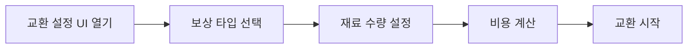
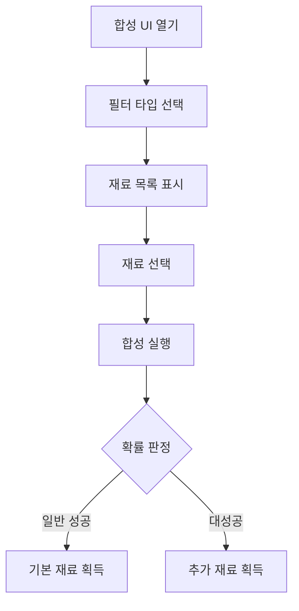

# 재료 교환과 합성 시스템

## 개요

재료 교환과 합성 시스템은 플레이어가 보유한 재료를 활용하여 새로운 자원을 획득하거나 더 나은 재료를 얻을 수 있는 핵심적인 자원 관리 시스템입니다. 교환 시스템은 재료를 소모하여 하트나 클로버와 같은 특수 화폐를 획득하는 카드 게임 방식이며, 합성 시스템은 재료를 조합하여 새로운 재료를 생성하는 시스템입니다.

## 재료 교환 시스템 (Exchange System)

### 시스템 목적

- 플레이어가 보유한 재료 카드를 활용하여 하트 또는 클로버 획득
- 운과 선택에 기반한 카드 뒤집기 미니게임 제공
- 재료 카드의 효율적인 활용 방안 제시

### 교환 프로세스

#### 1. 교환 설정 단계

플레이어는 먼저 교환 조건을 설정합니다:



**보상 타입:**
- 하트 (Heart): 직원 체력 회복에 사용
- 클로버 (Clover): 특수 효과에 사용되는 마법 재료

**수량 설정:** 1~10개의 재료 카드를 선택하여 교환

#### 2. 카드 선택 게임

교환이 시작되면 12장의 카드 중에서 플레이어가 선택합니다:

- **카드 타입**: 4가지 다른 타입의 카드가 존재
- **카드 배치**: `{1, 1, 1, 1, 1, 1, 1, 2, 2, 3, 4, 4}` 형태로 배치
- **선택 과정**: 플레이어가 순차적으로 카드를 뒤집어 확인

#### 3. 보상 계산

최종 보상은 다음 공식으로 계산됩니다:

- **최소 보상**: `기본보상 × (1 + 카드1보너스 × 3)`
- **최대 보상**: `기본보상 × (1 + 카드1보너스 × 2 + 카드2보너스 × 2 + 카드3보너스)`

### 주요 구현 파일

**핵심 메서드:**
- UIExchangeSetting.mlua :: OnClickStartBtn() — 교환 시작 처리
- UIExchangeSetting.mlua :: CalculateReward() — 보상 계산
- ExchangeManager.mlua :: GiveReward() — 최종 보상 지급

<details>
<summary>교환 시스템 주요 메서드</summary>

```lua
-- RootDesk/MyDesk/19. Exchange/UIExchangeSetting.mlua
method void OnClickStartBtn()
method number CalculateReward()
method void SetReward()

-- RootDesk/MyDesk/19. Exchange/ExchangeManager.mlua
method void GiveReward(number rewardCost, table resultTable, number ingredientCost, integer rewardType, integer ingredientCount)
```
</details>

## 재료 합성 시스템 (Synthesis System)

### 시스템 목적

- 기존 재료를 조합하여 더 높은 등급의 재료 획득
- 확률 기반 합성으로 게임의 흥미 요소 추가
- 플레이어의 전략적 재료 관리 유도

### 합성 프로세스

#### 1. 재료 필터링 및 선택



#### 2. 필터링 시스템

합성할 재료는 다음 조건으로 필터링됩니다:

- **스테이지 제한**: 플레이어의 현재 스테이지에 해당하는 재료만 표시
- **필터 타입**: 각 필터는 특정 기본 재료와 결과 재료의 조합을 의미
- **태그 분류**: 재료의 태그에 따른 분류 (예: Meat, Vegetable 등)

#### 3. 합성 확률 시스템

합성 시에는 다음과 같은 확률 시스템이 적용됩니다:

- **일반 성공**: 기본 확률로 1개의 재료 획득
- **대성공**: 설정된 확률로 추가 재료 획득 가능

### 주요 구현 파일

**핵심 메서드:**
- IngreSynthLogic.mlua :: Synth() — 합성 실행
- IngreSynthLogic.mlua :: MakeIngrePool() — 합성 재료 풀 생성
- UIIngreSynthComponent.mlua :: SelectFilterType() — 필터 타입 선택

<details>
<summary>합성 시스템 주요 메서드</summary>

```lua
-- RootDesk/MyDesk/20. IngreSynth/IngreSynthLogic.mlua
method void DrawIngreList()
method boolean IsChance()
method void Synth(Entity player, table selectedIngreIndexTable, integer filterType, string tagType)
method table MakeIngrePool(Entity player, integer filterType, string tagType)

-- RootDesk/MyDesk/20. IngreSynth/UIIngreSynthComponent.mlua
method void OpenUI()
method void SelectFilterType(integer filterType)
method void EnableNoticePanel(boolean enable, boolean isFull)
```
</details>

## 시스템 통합 및 연계

### 플레이어 재료 관리

두 시스템 모두 `PlayerIngredient` 컴포넌트와 밀접하게 연계됩니다:

- **재료 카드 추가/제거**: 교환 및 합성 결과 반영
- **재료 수량 관리**: 최대 보유량 확인 및 처리
- **재료 타입 관리**: 번과 재료의 구분 관리

### UI/UX 통합

#### 공통 UI 요소

- **재료 아이콘 표시**: 일관된 재료 이미지 시스템
- **수량 표시**: 천 단위 구분자를 통한 가독성 향상
- **색상 코딩**: 부족한 자원의 빨간색 표시
- **애니메이션**: 부드러운 트랜지션과 피드백

#### 튜토리얼 연계

두 시스템 모두 튜토리얼 시스템과 연계되어 플레이어에게 안내를 제공:

- **ExchangeEnter**: 교환 시스템 진입 시 튜토리얼
- **ExchangeSettingEnter**: 교환 설정 진입 시 튜토리얼
- **IngreSynthEnter**: 합성 시스템 진입 시 튜토리얼

### 데이터 관리

#### CSV 데이터셋

- **ExchangeBaseMoneyDataSet**: 교환 비용 기준 데이터
- **GameConfigData**: 교환 비율 및 보너스 설정
- **IngredientData**: 재료 기본 정보
- **BunData**: 번 관련 데이터

#### 동적 데이터 생성

- **재료 풀 생성**: 스테이지와 조건에 맞는 획득 가능한 재료 목록
- **확률 계산**: 실시간 성공 확률 계산
- **보상 계산**: 선택된 카드와 수량에 따른 동적 보상 산출

## 게임플레이 전략

### 교환 시스템 전략

- **카드 타입 이해**: 각 카드 타입별 보너스 효과 파악
- **수량 최적화**: 보유 골드 대비 최적의 재료 수량 선택
- **보상 타입 선택**: 현재 필요한 자원(하트 vs 클로버)에 따른 선택

### 합성 시스템 전략

- **필터 활용**: 원하는 재료가 나올 가능성이 높은 필터 선택
- **재료 조합**: 효율적인 재료 사용을 위한 계획적 접근
- **확률 관리**: 대성공 확률을 고려한 합성 타이밍 조절

## Code References

- `RootDesk/MyDesk/19. Exchange/ExchangeManager.mlua` - 교환 시스템 핵심 로직
- `RootDesk/MyDesk/19. Exchange/UIExchangeSetting.mlua` - 교환 설정 UI
- `RootDesk/MyDesk/19. Exchange/UIExchange.mlua` - 교환 게임 UI
- `RootDesk/MyDesk/20. IngreSynth/IngreSynthLogic.mlua` - 합성 시스템 핵심 로직
- `RootDesk/MyDesk/20. IngreSynth/UIIngreSynthComponent.mlua` - 합성 UI
- `RootDesk/MyDesk/00. Player/PlayerIngredient.mlua` - 플레이어 재료 관리
