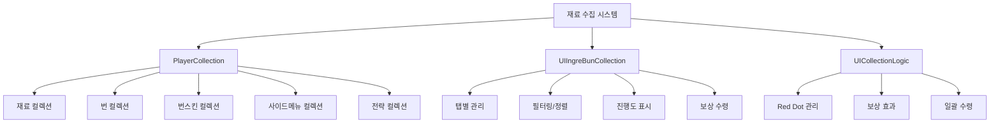
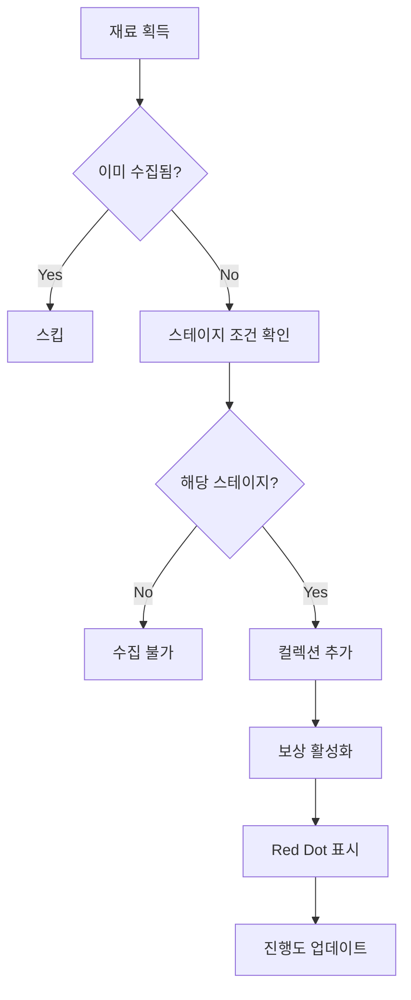
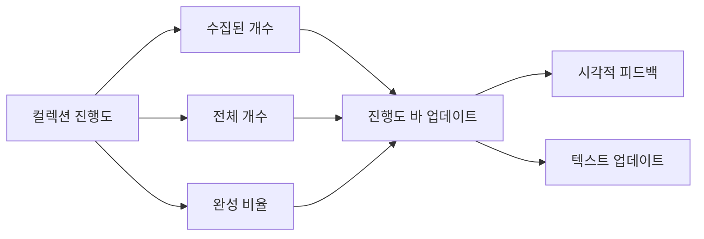
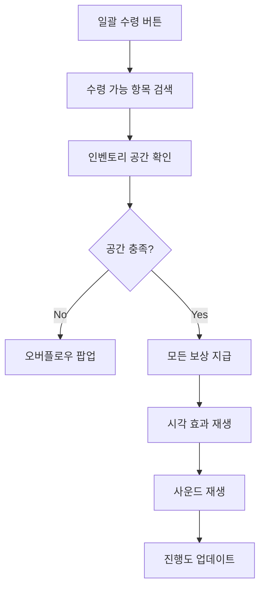

# 재료 수집 시스템

츄츄버거 재료 수집 시스템은 게임 내 다양한 요소들을 수집하고 완성도에 따른 보상을 제공하는 장기적 목표 달성 시스템입니다. **PlayerCollection**을 중심으로 **재료**, **번**, **번스킨**, **사이드메뉴**, **전략** 등 5개 카테고리의 수집을 관리하며, **UIIngreBunCollection**을 통해 진행도 추적과 보상 시스템을 제공합니다.

## 시스템 개요



## PlayerCollection - 컬렉션 데이터 관리

### 5개 주요 컬렉션 타입

PlayerCollection에서 관리하는 각 컬렉션 타입은 @TargetUserSync로 실시간 동기화됩니다:

<details>
<summary>PlayerCollection 속성 정의</summary>

```lua
-- RootDesk/MyDesk/00. Player/PlayerCollection.mlua
@TargetUserSync
property SyncTable<integer, boolean> IngredientCollection

@TargetUserSync
property SyncTable<integer, boolean> BunCollection

@TargetUserSync
property SyncTable<integer, boolean> IngredientCollectionGetReward

@TargetUserSync
property SyncTable<integer, boolean> BunCollectionGetReward

@TargetUserSync
property SyncTable<integer, boolean> BunSkinCollection

@TargetUserSync
property SyncTable<integer, boolean> SideMenuCollection

@TargetUserSync
property SyncTable<integer, boolean> SideMenuChecked

@TargetUserSync
property SyncTable<integer, boolean> StrategyCollection
```
</details>

**컬렉션 분류:**
- **IngredientCollection**: 버거 제작용 재료들
- **BunCollection**: 다양한 번(빵) 종류
- **BunSkinCollection**: 번의 시각적 커스터마이징
- **SideMenuCollection**: 게임 전략 요소
- **StrategyCollection**: 고급 전략 시스템

### 재료 컬렉션 추가 시스템

PlayerCollection의 재료 수집은 스테이지별 제한과 중복 체크를 포함합니다:



### 보상 수령 시스템

RequestGetIngredientCollectionReward() 메서드로 재료 컬렉션 보상을 처리합니다:

1. **사용자 검증**: senderUserId 일치 확인으로 보안 검증
2. **보상 계산**: 재료 개수 × 다이아몬드 보상 설정값
3. **인벤토리 체크**: 최대 보유량 초과 시 오버플로우 팝업 표시
4. **중복 방지**: 이미 수령한 보상 재수령 차단

핵심 로직: `local totalAmount = rewardConfig * #ingreIds`

<details>
<summary>재료 컬렉션 보상 수령 구현</summary>

```lua
-- RootDesk/MyDesk/00. Player/PlayerCollection.mlua :: RequestGetIngredientCollectionReward()
method void RequestGetIngredientCollectionReward(table ingreIds, boolean isTween, string source)
    if senderUserId ~= self.Entity.PlayerComponent.UserId then
        return
    end
    
    local rewardConfig = _GetConfigDataLogic:GetConfigNumDataByKey("IngreCollectionRewardDiamond")
    local totalAmount = rewardConfig * #ingreIds
    if self.Entity.PlayerInventory:IsItemOverMaxCount(_ItemDataEnum.DiaFree, totalAmount) > 0 then
        local itemData = _ItemDataSetLogic:GetItemData(_ItemDataEnum.DiaFree)
        _UIPurchasePopupLogic:OpenOverMaxCountPopup(itemData.Id, itemData.NameKey, itemData.MaxStackCount, nil, false, false, senderUserId)
        return
    end
    
    for _, ingreId in pairs(ingreIds) do
        local ingreData = _IngredientDataSetLogic:GetIngredientData(ingreId)
        if isvalid(ingreData) == false then
            return
        end
        
        if self.IngredientCollection[ingreId] == nil or self.IngredientCollection[ingreId] == false then
            return
        end
        
        if self.IngredientCollectionGetReward[ingreId] == true then
            return
        end
        
        self:GetIngredientCollectionReward(ingreId, isTween)
    end
```
</details>

**보상 처리 특징:**
- **다이아몬드 보상**: 재료당 설정된 다이아몬드 지급
- **인벤토리 체크**: 최대 보유량 초과 시 팝업 표시
- **중복 방지**: 이미 수령한 보상 재수령 차단
- **일괄 처리**: 여러 재료 동시 보상 수령 지원

## UIIngreBunCollection - 컬렉션 UI 시스템

### 탭 기반 인터페이스

UIIngreBunCollection은 탭 방식으로 각 컬렉션 카테고리를 관리하는 UI입니다:

<details>
<summary>UIIngreBunCollection 속성 정의</summary>

```lua
-- RootDesk/MyDesk/17. Collection/UIIngreBunCollection.mlua
property SyncTable<integer, Entity> Tabs
property SyncTable<integer, Entity> Slots
property Entity List = "8adcc019-7b96-48c7-91d9-5348eb340074"
property Entity Detail = "d8eb453a-b622-42ed-b2ab-054f25b80d03"
property Entity FilterSelectArea = "406e51eb-fac8-4eba-bb03-4b64b5189681"
property Entity SortSelectArea = "8808ac03-2c62-46f4-88c8-50c586311cca"
property integer SelectTab = 0
property string NowFilter = ""
property string NowSort = ""
property integer NowSelected = 0
property SyncTable<integer, Entity> DetailPages
property Entity GetAllRewardBtnDim = "0f603a0c-38e5-4925-a2ee-a8e22c7e8f52"
property Entity GetAllRewardBtn = "c7179c8b-65b0-41f2-9ec0-2541be4625f6"
property Entity ProgressSlider = "2ae361cd-23a0-44f2-9ecc-490c55e95c40"
property Entity ProgressPercentText = "4cbabff2-342c-4e79-9f4c-11f68d4b9f25"
property Entity ProgressCountText = "3b64f6ed-4043-4660-8983-9321e26167f9"
```
</details>

**UI 구성 요소:**
- **Tabs**: 컬렉션 카테고리별 탭
- **List/Detail**: 목록 보기와 상세 보기
- **FilterSelectArea**: 필터링 옵션 선택
- **SortSelectArea**: 정렬 옵션 선택
- **ProgressSlider**: 진행도 표시 바
- **GetAllRewardBtn**: 일괄 보상 수령 버튼

### 필터링 및 정렬 시스템

필터 버튼 초기화 과정에서 각 필터 옵션을 설정하고 아이콘을 적용합니다:

1. **버튼 순회**: FilterSelectArea의 모든 자식 버튼 검사
2. **이름 파싱**: 버튼 이름을 `_`로 분리하여 타입과 값 추출
3. **아이콘 설정**: Type과 Stage별로 해당하는 아이콘 RUID 적용

핵심 로직: `local split = _UtilLogic:Split(child.Name, "_")`

<details>
<summary>필터링 시스템 초기화 구현</summary>

```lua
-- RootDesk/MyDesk/17. Collection/UIIngreBunCollection.mlua :: InitializeFilters()
for i = 1, #self.FilterSelectArea:GetChildByName("Buttons").Children do
    local child = self.FilterSelectArea:GetChildByName("Buttons").Children[i]
    
    if isvalid(child.ButtonComponent) == false then
        continue
    end
    
    local split = _UtilLogic:Split(child.Name, "_")
    local key = split[1]
    local value = split[2]
    
    self.FilterOptions[child.Name] = child
    
    if key == "Type" then
        local typeData = _RecipeTagDataSetLogic:GetRecipeTagData(value)
        if isvalid(typeData) then
            local icon = child:GetChildByName("Icon")
            if isvalid(icon) then
                icon.SpriteGUIRendererComponent.ImageRUID = typeData.IconRUID
            end
        end        
        
    elseif key == "Stage" then
        local stageData = _StageDataSetLogic:GetStageData(tonumber(value))
        if isvalid(stageData) then
            local icon = child:GetChildByName("Icon")
```
</details>

**필터링 옵션:**
- **Type**: 재료 타입별 필터링 (고기, 닭고기, 해산물, 채소, 매운맛)
- **Stage**: 스테이지별 필터링
- **Grade**: 등급별 필터링
- **Status**: 수집 상태별 필터링 (수집함/미수집/보상 수령 가능)

### 진행도 표시 시스템



진행도는 실시간으로 계산되어 프로그레스 바와 텍스트로 표시됩니다.

## UICollectionLogic - 보상 효과 및 관리

### Red Dot 시스템

SetIngreBunCollectionMenuBtnRedDot() 메서드로 컬렉션 메뉴의 알림 표시를 관리합니다:

`local isRedDotEnable = self.uiIngreBunCollection:ReturnCanGetReward(1) or self.uiIngreBunCollection:ReturnCanGetReward(2)`

탭 1(재료)과 탭 2(번) 중 하나라도 수령 가능한 보상이 있으면 Red Dot을 활성화합니다.

<details>
<summary>Red Dot 관리 로직</summary>

```lua
-- RootDesk/MyDesk/17. Collection/UICollectionLogic.mlua :: SetIngreBunCollectionMenuBtnRedDot()
method void SetIngreBunCollectionMenuBtnRedDot()
    local isRedDotEnable = self.uiIngreBunCollection:ReturnCanGetReward(1) or self.uiIngreBunCollection:ReturnCanGetReward(2)
    _MainMenuRedDotManager:EnableIngreBunCollectionRedDot(isRedDotEnable)
end
```
</details>

**Red Dot 표시 조건:**
- 탭 1 (재료)에서 보상 수령 가능한 항목 존재
- 탭 2 (번)에서 보상 수령 가능한 항목 존재
- 메인 메뉴에 알림 표시로 플레이어 유도

### 보상 수령 효과

DropDiamondAndMoveToMoneyBar() 메서드로 보상 수령 시 시각적 효과를 생성합니다:

1. **다이아몬드 아이콘 생성**: 보상 개수만큼 다이아몬드 아이콘 생성
2. **위치 계산**: 현재 스크롤 위치를 고려한 정확한 시작 위치
3. **애니메이션**: 머니바로 이동하는 트윈 애니메이션
4. **사운드 효과**: 보상 획득 시 효과음 재생

핵심 로직: `icon.SpriteGUIRendererComponent.ImageRUID = _ItemDataSetLogic:GetItemData("G1001").IconRUID`

<details>
<summary>보상 시각 효과 구현</summary>

```lua
-- RootDesk/MyDesk/17. Collection/UICollectionLogic.mlua :: DropDiamondAndMoveToMoneyBar()
method void DropDiamondAndMoveToMoneyBar(integer count, Entity parent, Vector3 originWorldPos)
    if self._T.index == nil then
        self._T.index = 0
    end
    
    local selectTab = self.uiIngreBunCollection.SelectTab
    
    for i = 1, count do
        self._T.index += 1
            
        local icon = _UIEntityService:GetOrCreateEntityOfModel("Model_VIPOrderSeasonScore", self._T.index, parent)
        icon.SpriteGUIRendererComponent.ImageRUID = _ItemDataSetLogic:GetItemData("G1001").IconRUID
    
        local scrolledLength = 0
        if selectTab == 1 and count <= 1then
            local list = self.uiIngreBunCollection.Lists[selectTab]
            local listScroll = list.ScrollLayoutGroupComponent
```
</details>

**시각적 효과:**
1. **다이아몬드 아이콘 생성**: 보상 위치에서 다이아몬드 아이콘 생성
2. **움직임 애니메이션**: 화면 상단 머니 바로 이동하는 트윈 애니메이션
3. **스크롤 보정**: 현재 스크롤 위치를 고려한 정확한 시작 위치 계산
4. **사운드 효과**: 보상 획득 시 적절한 사운드 재생

## 컬렉션별 특화 기능

### 재료 컬렉션 (Ingredient Collection)

**스테이지 제한 시스템:**
- 각 재료는 특정 스테이지에서만 수집 가능
- 스테이지 진행에 따른 단계적 해금
- 다양성과 희귀성 기반 보상 차등

**수집 조건:**
- 해당 스테이지 도달 필요
- 재료를 실제로 획득해야 수집 등록
- 중복 수집 불가 (한 번만 등록)

### 번/번스킨 컬렉션 (Bun/BunSkin Collection)

**시각적 커스터마이징:**
- 다양한 번의 외형 수집
- 번스킨을 통한 개성화 요소
- 컬렉션 완성도에 따른 추가 옵션 해금

**획득 방법:**
- 게임 진행 중 자연스러운 획득
- 특별 이벤트를 통한 한정 번스킨
- 업적 달성 보상으로 획득

### 사이드메뉴/전략 컬렉션

**게임플레이 연동:**
- 실제 게임 전략과 직결된 수집 요소
- 사용 경험을 통한 자연스러운 학습
- 고급 전략의 단계적 해금

## 보상 시스템

### 개별 보상

각 컬렉션 항목마다 개별 보상이 설정되어 있습니다:
- **다이아몬드**: 기본 보상 화폐
- **특별 아이템**: 희귀 재료나 특수 효과
- **해금 요소**: 새로운 기능이나 컨텐츠 접근

### 완성도 보상

컬렉션 카테고리별 완성도에 따른 단계별 보상:
- **25% 완성**: 소량 보상
- **50% 완성**: 중간 보상  
- **75% 완성**: 고급 보상
- **100% 완성**: 최고 보상 + 특별 타이틀/효과

### 일괄 수령 시스템



## 성능 최적화

### 데이터 동기화

모든 컬렉션 데이터는 클라이언트와 실시간 동기화:
- `@TargetUserSync` 속성을 통한 자동 동기화
- 변경 시에만 네트워크 전송으로 효율성 확보
- 클라이언트 사이드 즉시 반영으로 반응성 향상

### UI 최적화

- **가상화 스크롤**: 대량의 컬렉션 아이템 효율적 표시
- **지연 로딩**: 필요한 시점에만 상세 정보 로드
- **캐싱 시스템**: 자주 참조되는 데이터의 메모리 캐싱

## 코드 참조

### 핵심 데이터 관리
- `RootDesk/MyDesk/00. Player/PlayerCollection.mlua :: AddIngredientCollection()` — 재료 컬렉션 추가
- `RootDesk/MyDesk/00. Player/PlayerCollection.mlua :: RequestGetIngredientCollectionReward()` — 재료 컬렉션 보상 수령
- `RootDesk/MyDesk/00. Player/PlayerCollection.mlua :: GetIngredientCollectionPercentage()` — 진행도 계산
- `RootDesk/MyDesk/00. Player/PlayerCollection.mlua :: SaveToDB()` — DB 저장

### UI 시스템
- `RootDesk/MyDesk/17. Collection/UIIngreBunCollection.mlua :: SetSelectTab()` — 탭 전환
- `RootDesk/MyDesk/17. Collection/UIIngreBunCollection.mlua :: RefreshList()` — 목록 갱신
- `RootDesk/MyDesk/17. Collection/UIIngreBunCollection.mlua :: SetFilter()` — 필터링 적용
- `RootDesk/MyDesk/17. Collection/UIIngreBunCollection.mlua :: ReturnCanGetReward()` — 보상 수령 가능 여부 확인

### 효과 및 피드백
- `RootDesk/MyDesk/17. Collection/UICollectionLogic.mlua :: DropDiamondAndMoveToMoneyBar()` — 보상 시각 효과
- `RootDesk/MyDesk/17. Collection/UICollectionLogic.mlua :: SetIngreBunCollectionMenuBtnRedDot()` — Red Dot 관리
- `RootDesk/MyDesk/17. Collection/UICollectionLogic.mlua :: EnableIngreBunCollectionSlotRewardDot()` — 슬롯별 알림 표시

### 상세 UI 컴포넌트
- `RootDesk/MyDesk/17. Collection/UIIngreBunCollectionSlot.mlua` — 컬렉션 슬롯 UI 관리
- `RootDesk/MyDesk/17. Collection/UIIngreBunCollectionDetailIngre.mlua` — 재료 상세 정보 표시
- `RootDesk/MyDesk/17. Collection/UIIngreBunCollectionDetailBun.mlua` — 번 상세 정보 표시
- `RootDesk/MyDesk/17. Collection/UIIngreBunCollectionDetailBunSkin.mlua` — 번스킨 상세 정보 표시

---

이 문서는 츄츄버거 재료 수집 시스템의 모든 측면을 포괄적으로 설명합니다. 5개 컬렉션 카테고리가 어떻게 체계적으로 관리되고, 플레이어에게 장기적인 목표와 성취감을 제공하는지 이해할 수 있습니다.
