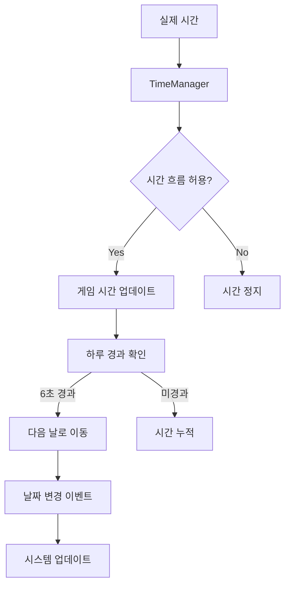
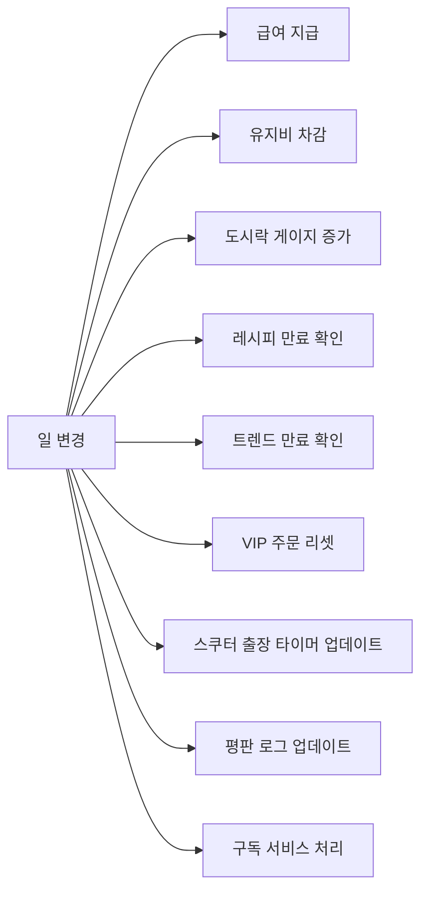

# 시간 시스템 (Time System)

## 개요

시간 시스템은 츄츄버거 핵심적인 게임플레이 요소로, 게임 내에서 날짜와 시간의 흐름을 관리하고 이에 따른 다양한 이벤트와 시스템을 동작시키는 역할을 담당합니다. 실제 시간과는 다른 가속된 게임 시간을 운영하며, 일/월/년 단위의 변화에 따라 급여, 정산, 트렌드, 출장 등 다양한 시스템이 자동으로 동작합니다.

## 시스템 구조

### 시간 흐름 메커니즘



**핵심 특징:**
- **가속 시간**: 실제 6초가 게임 내 하루에 해당
- **조건부 흐름**: 특정 상황에서 시간 흐름 일시정지 가능
- **이벤트 기반**: 날짜 변화에 따른 자동 시스템 처리

### 주요 구성 요소

#### 1. TimeManager

게임 시간의 핵심 관리자로, 시간 흐름과 변화 이벤트를 총괄합니다.

**주요 속성:**
- `GameTimeSec = 6`: 게임 내 하루의 실제 초 단위 길이
- `canTimeFlows`: 시간 흐름 허용 여부
- `Utc`: UTC 기반 게임 내 현재 시간

**핵심 메서드:**
- OnUpdate() — 실시간 시간 업데이트 처리
- UpdateTime() — 게임 시간 변경 및 이벤트 발생
- OnDayChanged() — 일일 시스템 처리 (급여, 유지비 등)

<details>
<summary>TimeManager 핵심 메서드</summary>

```lua
-- RootDesk/MyDesk/01. Lobby/TimeManager.mlua
method void OnUpdate(number delta)
method void UpdateTime(any updateTime)
method void OnDayChanged(number changedDay)
method void OnMonthChanged(number changedMonth)
method void OnYearChanged(number changedYear)
```
</details>

#### 2. DateTimeLogic

실제 UTC 시간과 게임 시간의 동기화를 담당합니다.

**핵심 메서드:**
- GetUtcNow() — 현재 UTC 시간 반환
- GetUtcNowText() — UTC 시간 문자열 변환  
- GetUtc9Elapsed() — UTC+9 기준 경과 시간

#### 3. TimeUIService

시간 정보를 UI에 표시하는 서비스로, UpdateUI() 메서드를 통해 날짜 변경 시 UI를 갱신합니다.

<details>
<summary>시간 관련 유틸리티 메서드</summary>

```lua
-- RootDesk/MyDesk/Common/DateTimeLogic.mlua
method any GetUtcNow()
method string GetUtcNowText()
method integer GetUtc9Elapsed()

-- RootDesk/MyDesk/01. Lobby/TimeUIService.mlua
method void UpdateUI(integer day, integer month, integer year)
```
</details>

## 시간 기반 이벤트 시스템

### 일일 이벤트 (OnDayChanged)

매일 자동으로 실행되는 시스템들:



**핵심 처리 과정:**
1. **급여 계산**: EmployeeManager::ReturnDailySalary()로 직원 급여 산정
2. **유지비 계산**: ManagementDataSetLogic::ReturnMaintenance()로 시설 유지비 계산
3. **정산 반영**: PlayerSettlement에 일일 수입/지출 누적

<details>
<summary>일일 이벤트 처리 구현</summary>

```lua
-- RootDesk/MyDesk/01. Lobby/TimeManager.mlua :: OnDayChanged()
method void OnDayChanged(number changedDay)
    -- 급여 및 유지비 처리
    local salary = self.Entity.EmployeeManager:ReturnDailySalary()
    local maintenanceCost = _ManagementDataSetLogic:ReturnMaintenance(self.Entity, self.Entity.PlayerComponent.UserId)
    
    -- 정산 시스템에 값 추가
    self.Entity.PlayerSettlement:AddValueForSettlement(_SettlementPropertyEnum.M_AccumSalary, salary)
    self.Entity.PlayerSettlement:AddValueForSettlement(_SettlementPropertyEnum.M_AccumMaintenance, maintenanceCost)
end
```
</details>

### 월간 이벤트 (OnMonthChanged)

매월 자동으로 실행되는 시스템들:

- **정산 시스템**: 월말 정산 및 수익 계산
- **트렌드 시스템**: 새로운 트렌드 시작 및 기존 트렌드 종료
- **출장 시스템**: 출장 가능 횟수 리셋
- **랭킹 시스템**: 가게 랭킹 재평가

### 연간 이벤트 (OnYearChanged)

매년 초기화되는 시스템들:

- **연간 수입**: 연간 누적 수입 초기화
- **장기 목표**: 연간 목표 리셋

## 시간 흐름 제어

### 시간 정지 조건

다음 상황에서 시간 흐름이 일시정지됩니다:

- **UI 팝업 활성화**: 중요한 UI나 설정 화면 진입 시
- **미니게임 진행**: 출장, 교환 등의 미니게임 실행 중
- **이벤트 진행**: 스토리 이벤트나 다이얼로그 진행 중
- **맵 이동**: 로비가 아닌 다른 맵으로 이동 시

### 시간 흐름 복구

RequestTimeFlowClient() 메서드로 시간 흐름을 재개합니다:

`if _UIGroupManager:IsOnLobby(true) then self:TimeFlowsChange(true) end`

로비 상태일 때만 시간 흐름을 활성화하여 게임플레이 상황을 고려합니다.

<details>
<summary>시간 흐름 복구 로직</summary>

```lua
-- RootDesk/MyDesk/01. Lobby/TimeManager.mlua :: RequestTimeFlowClient()
method void RequestTimeFlowClient()
    if _UIGroupManager:IsOnLobby(true) then
        self:TimeFlowsChange(true)
    end
end
```
</details>

## 데이터 관리

### DB 저장/로드

시간 데이터는 플레이어별로 개별 저장되며, 게임 재접속 시 복원됩니다:

SaveToDB() 메서드로 현재 게임 시간을 데이터베이스에 저장합니다:

`timeData["Day"] = tostring(self.Utc.Day)` 형태로 각 시간 요소를 문자열로 변환하여 저장합니다.

<details>
<summary>시간 데이터 저장 구현</summary>

```lua
-- RootDesk/MyDesk/01. Lobby/TimeManager.mlua :: SaveToDB()
method void SaveToDB(table saveData)
    local timeData = {}
    timeData["Day"] = tostring(self.Utc.Day)
    timeData["Month"] = tostring(self.Utc.Month)
    timeData["Year"] = tostring(self.Utc.Year)
    saveData["TimeData"] = timeData
end
```
</details>

### 최초 입장 시간 기록

플레이어의 최초 게임 시작 시간을 기록하여 다양한 계산의 기준점으로 활용:

```lua
property SyncTable<string, integer> FirstEnterUtc
```

## 시간 기반 시스템 연동

### 1. 정산 시스템 연동

- 일일 급여 및 유지비 자동 계산
- 월말 정산 자동 실행
- 수익 분석 데이터 누적

### 2. 직원 시스템 연동

- 직원 급여 자동 지급
- 직원 피로도 관리
- 직원 출장 스케줄 관리

### 3. 레시피 시스템 연동

- 트렌드 시작/종료 자동 처리
- 연간 계획 진행도 확인
- VIP 주문 시즌 관리

### 4. 출장 시스템 연동

- 출장 가능 횟수 일일/월간 리셋
- 스쿠터 출장 타이머 관리
- 축제 기간 특별 혜택 적용

## 성능 최적화

### 델타 시간 기반 업데이트

OnUpdate() 메서드는 델타 시간 기반으로 효율적인 시간 업데이트를 수행합니다:

1. **조건 확인**: CheckCanTimeFlows()로 시간 흐름 허용 상태 검증
2. **시간 누적**: 델타 시간을 RealTimeSec에 누적
3. **일 변경**: GameTimeSec(6초) 도달 시 다음 날로 이동

핵심 로직: `if self.RealTimeSec >= self.GameTimeSec then`

<details>
<summary>시간 업데이트 최적화 구현</summary>

```lua
-- RootDesk/MyDesk/01. Lobby/TimeManager.mlua :: OnUpdate()
method void OnUpdate(number delta)
    if self:CheckCanTimeFlows() == false then return end
    if not isvalid(self.Utc) then return end
    
    self.RealTimeSec = self.RealTimeSec + delta
    
    if self.RealTimeSec >= self.GameTimeSec then
        self.RealTimeSec = 0
        local updateTime = self.Utc + TimeSpan.FromDays(1)
        self:UpdateTime(updateTime)
    end
end
```
</details>

### 조건부 실행

불필요한 연산을 방지하기 위해 시간 흐름 허용 상태를 먼저 확인합니다.

## 게임플레이 전략

### 시간 관리의 중요성

- **효율적 운영**: 제한된 시간 내 최대 수익 창출
- **계획적 확장**: 정산 주기를 고려한 투자 타이밍
- **직원 관리**: 급여일을 고려한 직원 고용/해고 계획

### 시간 기반 최적화

- **트렌드 예측**: 월간 트렌드 변화 패턴 파악
- **정산 준비**: 월말 정산을 대비한 자금 관리
- **이벤트 활용**: 시간 기반 이벤트 최대 활용

## UI 표시

### 시간 정보 UI

게임 화면 상단에 현재 게임 시간이 표시됩니다:

- **년도 표시**: 현재 게임 연도
- **월/일 표시**: 현재 월과 일
- **다국어 지원**: 플레이어 언어 설정에 따른 형식 변경

### 디버그 시간 표시

개발자를 위한 디버그 정보:

- **실시간 시간 흐름 표시**
- **시간 흐름 강제 조절 기능**
- **시간 기반 이벤트 모니터링**

## Code References

- `RootDesk/MyDesk/01. Lobby/TimeManager.mlua` - 게임 시간 핵심 관리자
- `RootDesk/MyDesk/Common/DateTimeLogic.mlua` - UTC 시간 동기화
- `RootDesk/MyDesk/01. Lobby/TimeUIService.mlua` - 시간 UI 서비스
- `RootDesk/MyDesk/Admin/DebugTimer/DebugTimer.mlua` - 디버그 시간 도구
