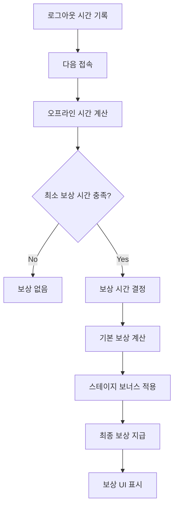
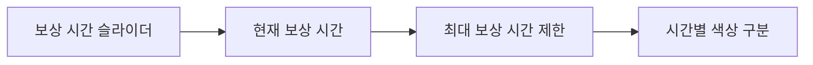

# 오프라인 보상 시스템

## 개요

오프라인 보상 시스템은 플레이어가 게임에 접속하지 않은 동안의 시간을 보상으로 변환하여 제공하는 시스템입니다. 플레이어의 이전 게임 성과와 클리어한 스테이지를 기반으로 적절한 수준의 골드 보상을 계산하며, 최대 보상 시간 제한을 통해 게임 밸런스를 유지합니다.

## 시스템 구조

### 보상 계산 메커니즘



### 핵심 구성 요소

#### 1. OfflineRewardLogic

오프라인 보상 시스템의 핵심 로직을 담당합니다.

**주요 메서드:**
- GetOfflineRewardAmount() — 최종 보상 금액 계산
- GetRewardTimeSec() — 보상 대상 시간 산정
- GetMaxRewardTime() — 최대 보상 시간 제한 조회

<details>
<summary>OfflineRewardLogic 핵심 메서드</summary>

```lua
-- RootDesk/MyDesk/01. Lobby/OfflineRewardLogic.mlua
method integer GetOfflineRewardAmount(integer rewardTimeSec, Entity player, table clearedStageList)
method integer GetRewardTimeSec(integer logoutElapsed, integer lobbyEnterElapsed, integer maxRewardTime)
method integer GetMaxRewardTime()
```
</details>

#### 2. UIGetOfflineRewardPopup

오프라인 보상을 시각적으로 표시하고 사용자 상호작용을 처리합니다.

**주요 기능:**
- 보상 시간 슬라이더 표시
- 클리어한 스테이지 목록 표시
- 보상 금액 및 보너스 정보 표시
- 애니메이션 효과 제공

## 보상 계산 시스템

### 기본 보상 공식

오프라인 보상은 다음 공식으로 계산됩니다:

```
최종 보상 = (보상 시간 × 초당 수익) × 기본 비율 × (1 + 스테이지 보너스)

여기서:
- 초당 수익 = 월별 최고 수익 ÷ (30일 × 하루의 초)
- 기본 비율 = 5% (0.05)
- 스테이지 보너스 = 클리어한 스테이지별 보너스의 합
```

### 보상 시간 계산

GetRewardTimeSec() 메서드로 실제 보상 대상 시간을 계산합니다:

1. **시간 차이 계산**: 로그인 시간과 로그아웃 시간의 차이 산정
2. **단위 변환**: 밀리초를 초 단위로 변환 (`math.floor(elapsedGap / 1000)`)
3. **제한 적용**: maxRewardTime을 초과하지 않도록 상한선 적용

<details>
<summary>보상 시간 계산 구현</summary>

```lua
-- RootDesk/MyDesk/01. Lobby/OfflineRewardLogic.mlua :: GetRewardTimeSec()
method integer GetRewardTimeSec(integer logoutElapsed, integer lobbyEnterElapsed, integer maxRewardTime)
    local elapsedGap = lobbyEnterElapsed - logoutElapsed
    local rewardTimeSec = math.floor(elapsedGap / 1000)
    
    -- 최대 보상 시간 제한 적용
    if rewardTimeSec > maxRewardTime then
        rewardTimeSec = maxRewardTime
    end
    
    return rewardTimeSec
end
```
</details>

### 스테이지 보너스 시스템

클리어한 각 스테이지마다 추가 보너스가 적용됩니다:

스테이지 보너스는 클리어한 모든 스테이지의 OfflineRewardBonusPercent를 합산하여 계산합니다:

`stagePercent += stageConfig.OfflineRewardBonusPercent`

각 스테이지마다 설정된 고유 보너스 비율이 누적되어 최종 보상에 반영됩니다.

<details>
<summary>스테이지 보너스 계산 구현</summary>

```lua
-- RootDesk/MyDesk/01. Lobby/OfflineRewardLogic.mlua :: GetOfflineRewardAmount()
local stagePercent = 0
for i = 1, #clearedStageList do
    local stageId = clearedStageList[i]
    local stageConfig = _BalanceDataSetLogic:GetStageConfigData(stageId)
    if stageConfig ~= nil then
        stagePercent += stageConfig.OfflineRewardBonusPercent
    end
end
```
</details>

## UI 시스템

### 보상 표시 인터페이스

#### 시간 정보 표시



**시간 표시 기능:**
- **시간 슬라이더**: 보상 시간을 시각적으로 표시
- **시간 제한**: 최대 보상 시간까지만 표시
- **색상 코딩**: 시간대별 다른 색상으로 구분

#### 보상 정보 표시

- **총 보상 금액**: 천 단위 구분자로 가독성 향상
- **클리어 스테이지**: 보너스를 제공하는 스테이지 목록
- **보너스 퍼센트**: 스테이지별 보너스 비율 표시
- **직원 일러스트**: 보상 상황에 맞는 직원 캐릭터 표시

### 애니메이션 시스템

#### 보상 수령 애니메이션

PlayAnimOnClickGetRewardButton() 메서드로 보상 금액에 따른 차등 이펙트를 생성합니다:

1. **이펙트 레벨 결정**: 보상 금액 구간별로 1~3단계 이펙트 레벨 설정
2. **파티클 이름 생성**: `"Model_OfflineGetRewardParticle" + rewardIndex` 형태
3. **UI 엔티티 생성**: GetOrCreateEntityOfModel()로 파티클 엔티티 생성

핵심 로직: `local particleName = "Model_OfflineGetRewardParticle"..rewardIndex`

<details>
<summary>보상 애니메이션 구현</summary>

```lua
-- RootDesk/MyDesk/01. Lobby/UIGetOfflineRewardPopup.mlua :: PlayAnimOnClickGetRewardButton()
method void PlayAnimOnClickGetRewardButton(Vector3 worldPos, integer rewardAmount)
    -- 보상 금액에 따른 이펙트 레벨 결정
    local rewardIndex = 0
    if rewardAmount < 1000000 then
        rewardIndex = 1
    elseif rewardAmount < 10000000 then
        rewardIndex = 2
    else
        rewardIndex = 3
    end
    
    -- 파티클 및 머니 애니메이션 생성
    local particleName = "Model_OfflineGetRewardParticle"..rewardIndex
    local particle = _UIEntityService:GetOrCreateEntityOfModel(particleName, 1, _UIGroupManager.LobbyHUDGroup)
end
```
</details>

**애니메이션 단계:**
1. **파티클 이펙트**: 보상 금액에 따른 차등 이펙트
2. **머니 드롭**: 화폐 아이콘이 머니바로 이동하는 애니메이션
3. **사운드 이펙트**: 보상 수령 시 효과음 재생

## 밸런스 시스템

### 최소/최대 보상 시간

최소/최대 보상 시간은 설정 데이터에서 동적으로 로드됩니다:

- **최소 시간 확인**: `if rewardTimeSec < minRewardTime then return 0 end`
- **최대 시간 제한**: GetConfigNumDataByKey("OfflineRewardMaxTimeDefault")로 상한선 설정

<details>
<summary>보상 시간 제한 구현</summary>

```lua
-- RootDesk/MyDesk/01. Lobby/OfflineRewardLogic.mlua :: GetOfflineRewardAmount()
-- 최소 보상 시간 확인
local minRewardTime = _GetConfigDataLogic:GetConfigNumDataByKey("OfflineRewardMinTime")
if rewardTimeSec < minRewardTime then
    return 0
end

-- 최대 보상 시간 제한
local maxRewardTime = _GetConfigDataLogic:GetConfigNumDataByKey("OfflineRewardMaxTimeDefault")
```
</details>

**밸런스 요소:**
- **최소 시간**: 너무 짧은 오프라인 시간에는 보상 없음
- **최대 시간**: 장기간 방치에 대한 보상 제한
- **기본 비율**: 전체 수익의 5%만 오프라인 보상으로 제공

### 수익 기반 계산

오프라인 보상은 플레이어의 실제 게임 성과를 기반으로 계산됩니다:

수익 기반 계산은 플레이어의 월별 최고 수익 기록을 활용합니다:

`local moneyPerSec = monthlyRecord / (30 * player.TimeManager.GameTimeSec)`

월별 최고 수익을 30일과 하루의 초 단위 시간으로 나누어 초당 수익을 산정합니다.

<details>
<summary>초당 수익 계산 구현</summary>

```lua
-- RootDesk/MyDesk/01. Lobby/OfflineRewardLogic.mlua :: GetOfflineRewardAmount()
-- 월별 최고 수익을 기반으로 초당 수익 계산
local monthlyRecord = player.PlayerSettlement.BestRecipeEarnings
local moneyPerSec = monthlyRecord / (30 * player.TimeManager.GameTimeSec)
```
</details>

이를 통해 높은 수익을 내는 플레이어에게는 더 많은 오프라인 보상을, 초보 플레이어에게는 적절한 수준의 보상을 제공합니다.

## 시스템 연동

### PlayerSettlement 연동

오프라인 보상은 정산 시스템과 밀접하게 연관됩니다:

- **최고 수익 기록**: 월별 최고 수익을 보상 계산 기준으로 사용
- **보상 지급**: 정산 시스템을 통해 실제 골드 지급 처리

### 스테이지 시스템 연동

클리어한 스테이지 정보를 활용한 보너스 시스템:

- **스테이지 진행도**: 플레이어의 게임 진행 상황 반영
- **보너스 비율**: 스테이지별 고유 보너스 비율 적용
- **동기 부여**: 더 많은 스테이지 클리어 유도

### 시간 시스템 연동

TimeManager와 연계하여 정확한 시간 계산:

- **로그아웃 시간**: 마지막 접속 종료 시간 기록
- **접속 시간**: 새로운 접속 시간과 비교
- **시간 흐름**: 게임 내 시간 단위 고려

## 사용자 경험 (UX)

### 접속 시 자동 표시

Open() 메서드로 오프라인 보상 UI를 표시합니다:

1. **보상 검증**: rewardAmount가 0이면 UI를 바로 닫기
2. **UI 활성화**: Entity.Enable = true로 UI 표시
3. **시간 정지**: TimeFlowsChange(false)로 게임 시간 일시정지

핵심 로직: `if rewardAmount == 0 then self:Close() return end`

<details>
<summary>오프라인 보상 UI 오픈 구현</summary>

```lua
-- RootDesk/MyDesk/01. Lobby/UIGetOfflineRewardPopup.mlua :: Open()
method void Open(integer rewardTimeSec, integer rewardAmount, table clearedStageList, integer maxRewardTime)
    if rewardAmount == 0 then
        self:Close()
        return
    end
    
    self.Entity.Enable = true
    _UserService.LocalPlayer.TimeManager:TimeFlowsChange(false)
end
```
</details>

**UX 설계 원칙:**
- **즉시 표시**: 로비 진입 시 자동으로 보상 UI 표시
- **시간 정지**: 보상 확인 중 게임 시간 흐름 일시정지
- **선택적 수령**: 플레이어가 원할 때 보상 수령 가능

### 시각적 피드백

- **직원 캐릭터**: 보유 직원 수에 따른 캐릭터 표시
- **보상 등급**: 보상 금액에 따른 시각적 차별화
- **진행 상황**: 슬라이더를 통한 직관적 시간 표시

## 게임 경제 영향

### 긍정적 효과

1. **이탈 방지**: 장시간 미접속 플레이어의 복귀 동기 부여
2. **진행 보장**: 바쁜 플레이어도 지속적인 진행 가능
3. **균형 유지**: 과도한 보상 방지를 통한 게임 밸런스 유지

### 밸런스 관리

1. **수익 기반**: 플레이어의 실제 성과를 기반으로 한 적정 보상
2. **시간 제한**: 최대 보상 시간을 통한 무제한 누적 방지
3. **비율 조정**: 전체 수익의 일정 비율로 제한

## Code References

- `RootDesk/MyDesk/01. Lobby/OfflineRewardLogic.mlua` - 오프라인 보상 핵심 로직
- `RootDesk/MyDesk/01. Lobby/UIGetOfflineRewardPopup.mlua` - 오프라인 보상 UI
- `RootDesk/MyDesk/00. Player/PlayerSettlement.mlua` - 정산 시스템 연동
- `RootDesk/MyDesk/01. Lobby/LobbyHUDService.mlua` - 로비 HUD 관리
