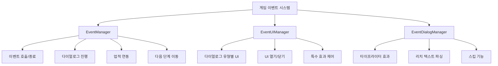
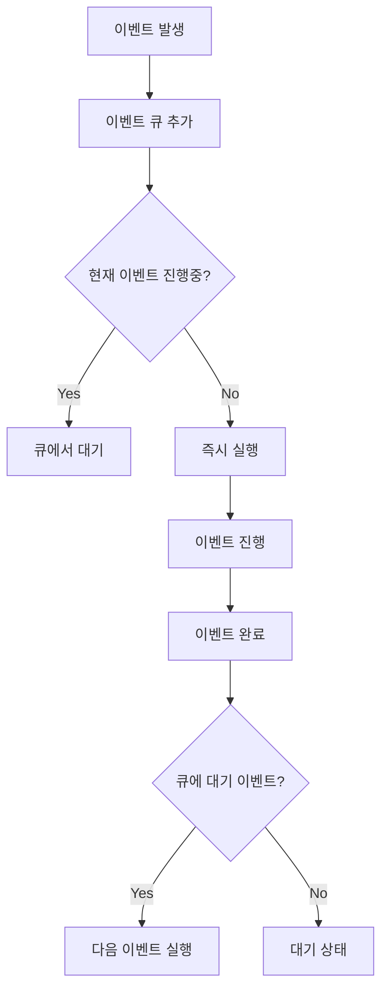

# 게임 이벤트 시스템

츄츄버거 게임 이벤트 시스템은 플레이어의 게임 진행에 따라 발생하는 모든 스토리, 축하, 안내 등을 체계적으로 관리하는 종합적인 이벤트 처리 시스템입니다. **EventManager**를 중심으로 **EventUIManager**와 **EventDialogManager**가 연동되어 다양한 이벤트 타입별로 특화된 UI와 연출을 제공합니다.

## 시스템 개요



## EventManager - 이벤트 시스템 총괄

### 핵심 속성

```28:27:RootDesk/MyDesk/08. Event/EventManager.mlua
property string CurrentEventGroupId = ""
property integer CurrentEventIndex = 0
property boolean CanMoveNext = false
property any CallbackAfterEndEvent = nil
```

**상태 관리:**
- `CurrentEventGroupId`: 현재 진행 중인 이벤트 그룹 ID
- `CurrentEventIndex`: 현재 다이얼로그 인덱스 
- `CanMoveNext`: 다음 단계 진행 가능 여부
- `CallbackAfterEndEvent`: 이벤트 종료 후 콜백 함수

### 이벤트 호출 시스템

```28:42:RootDesk/MyDesk/08. Event/EventManager.mlua
method void CallEvent(string eventGroupId)
    local player = _UserService.LocalPlayer
    local eventGroupData = _EventDataSetLogic:GetEventGroupData(eventGroupId)
    
    player.TimeManager:TimeFlowsChange(false)
    
    self.CurrentEventGroupId = eventGroupId
    self.CurrentEventIndex = 1
    
    _UIGroupManager:EnableBackToLobbyBtn(false)
    
    self:CallDialog(self.CurrentEventGroupId, self.CurrentEventIndex)
end
```

**이벤트 시작 과정:**
1. 시간 흐름 정지
2. 이벤트 그룹 ID와 인덱스 설정
3. 로비 복귀 버튼 비활성화
4. 첫 번째 다이얼로그 호출

### 이벤트 종료 처리

```44:110:RootDesk/MyDesk/08. Event/EventManager.mlua
method void EndEvent()
    _UserService.LocalPlayer.PlayerEvent:RequestClearEventData(self.CurrentEventGroupId)
    
    local eventQueue = _UserService.LocalPlayer.PlayerEvent.EventQueue
    if #eventQueue > 0 then
        if eventQueue[1] == self.CurrentEventGroupId then
            _UserService.LocalPlayer.PlayerEvent:RequestRemoveFromEventQueue(eventQueue[1])
        end
            
        _TimerService:SetTimerOnce(function()
            _UserService.LocalPlayer.PlayerEvent:RequestRemoveAndCallEventFromEventQueue(eventQueue[1])
        end, 2)
        
    end
```

**이벤트 종료 과정:**
1. 이벤트 데이터 정리
2. 이벤트 큐에서 제거
3. 다음 이벤트 자동 호출 예약
4. 스테이지 보상 큐 처리
5. 특수 효과 정리 및 UI 복원

### 다이얼로그 진행 제어

```133:152:RootDesk/MyDesk/08. Event/EventManager.mlua
method void MoveNextDialog()
    if self.CanMoveNext == false then
        if _EventDialogManager.IsTyping == true then
            _EventDialogManager:SkipTypeWriter()
        end
        return
    end
    
    _SoundService:StopSound(_ResourceManager.SFXTable["Firework"])
    _EventUIManager.ConfettiSpawner.UIEventConfettiSpawner:EndSpawnConfetties()
    _LobbyEntityLogic.ExpansionParticles.Enable = false
    _EventUIManager:ResetEntitiesRUID()
    
    wait(0.02)
    
    self.CurrentEventIndex = self.CurrentEventIndex + 1
    self:CallDialog(self.CurrentEventGroupId, self.CurrentEventIndex)
end
```

## EventUIManager - UI 관리 및 제어

### 다양한 이벤트 타입 지원

EventUIManager는 다음과 같은 다양한 이벤트 타입별로 특화된 UI를 제공합니다:

```47:104:RootDesk/MyDesk/08. Event/EventUIManager.mlua
method void SetDialogUI(EventDialogData dialogData)
    local dialogType = dialogData.EventDialogType
    local dialogEntity = self.DialogEntity[dialogType]
    
    if dialogType == _EventDialogTypeEnum.Congrats then
        dialogEntity.UIEventCongrats:Refresh(dialogData)
    elseif dialogType == _EventDialogTypeEnum.Fail then
        dialogEntity.UIEventFail:Refresh(dialogData)
    elseif dialogType == _EventDialogTypeEnum.InfoDialog then
        dialogEntity.UIEventInfoDialog:Refresh(dialogData)
    elseif dialogType == _EventDialogTypeEnum.GetItem then
        dialogEntity.UIEventGetItem:Refresh(dialogData)
    elseif dialogType == _EventDialogTypeEnum.NewEmployee then
        dialogEntity.UIEventNewEmployee:Refresh(dialogData)
    elseif dialogType == _EventDialogTypeEnum.OpenFunction then
        dialogEntity.UIEventOpenFunction:Refresh(dialogData)
    elseif dialogType == _EventDialogTypeEnum.StartTrend then
        dialogEntity.UIEventStartTrend:Refresh(dialogData)
    elseif dialogType == _EventDialogTypeEnum.EndTrend then
        dialogEntity.UIEventEndTrend:Refresh(dialogData)
    elseif dialogType == _EventDialogTypeEnum.TalkDialog then
        dialogEntity.UIEventTalkDialog:Refresh(dialogData)
    elseif dialogType == _EventDialogTypeEnum.RankingAnnounce then
        dialogEntity.UIEventRankingAnnounce:StartRender()
    elseif dialogType == _EventDialogTypeEnum.Tutorial then
        self.Dim.Enable = false
        local tutorialId = dialogData.TitleInfo[1]
        _TutorialManager:PlayTutorial(tutorialId)
    end
```

### 주요 이벤트 타입별 기능

#### 축하 이벤트 (Congrats)
- **UIEventCongrats**: 업적 달성, 레벨업 등 성취 상황
- 축하 애니메이션 및 시각 효과
- 보상 정보 표시

#### 실패/안내 이벤트 (Fail/InfoDialog) 
- **UIEventFail**: 실패나 문제 상황 안내
- **UIEventInfoDialog**: 일반적인 정보 전달
- 명확한 상황 설명과 해결 방안 제시

#### 아이템 획득 (GetItem)
- **UIEventGetItem**: 새로운 아이템이나 재료 획득
- 시각적 아이템 표시
- 획득량 및 효과 안내

#### 직원 관련 (NewEmployee/ResignEmployee)
- **UIEventNewEmployee**: 신규 직원 영입
- **UIEventResignEmployee**: 직원 퇴사 처리
- 직원 정보 및 스탯 표시

#### 기능 해금 (OpenFunction)
- **UIEventOpenFunction**: 새로운 기능이나 UI 해금
- 기능 아이콘 및 설명 표시
- 사용 방법 안내

#### 트렌드 시스템 (StartTrend/EndTrend)
- **UIEventStartTrend**: 새로운 트렌드 시작
- **UIEventEndTrend**: 트렌드 종료
- 트렌드 효과 및 기간 안내

#### 랭킹 발표 (RankingAnnounce)
- **UIEventRankingAnnounce**: 월간 랭킹 발표
- 순위 변화 애니메이션
- 보상 및 축하 연출

## EventDialogManager - 텍스트 처리 및 연출

### 타이프라이터 효과

```85:140:RootDesk/MyDesk/08. Event/EventDialogManager.mlua
method void TypeWriter(table plainText, table richMap, table richInfo, number interval, any outputCallback)
    local typedText = ""
    local currentIndex = 1
    
    local function step()
        if currentIndex > #table.keys(plainText) then 
            self:EndTypeWriter()
            return 
        end
        
        local drawData = plainText[table.keys(plainText)[currentIndex]]
        local drawIdx = drawData[1]
        local char = drawData[2]
```

**타이프라이터 특징:**
- 한 글자씩 점진적 출력
- 리치 텍스트 태그 지원
- 스킵 기능 내장
- 커스텀 출력 속도 설정

### 리치 텍스트 파싱 시스템

```19:83:RootDesk/MyDesk/08. Event/EventDialogManager.mlua
method table ParseDialog(string richText)
    local richInfo = {} 
    
    local richIdx = 1
    local isRichFormat = false
    local nowRichFormat = ""
    
    local isRichText = false
    local isRichEnd = false
    
    local index = 1
    local plainText = {} 
    local richMap = {} 
    
    local convertedText, _ = string.gsub(richText, "\\n", "\n")
```

**리치 텍스트 기능:**
- HTML 스타일 태그 지원 (`<color>`, `<size>`, `<b>` 등)
- 일반 텍스트와 태그 분리 처리
- 타이프라이터 효과와 조화로운 연동
- 줄바꿈 문자 처리

## 데이터 구조 시스템

### EventDataSetLogic - 데이터 관리

```18:44:RootDesk/MyDesk/08. Event/Data/EventDataSetLogic.mlua
method void LoadDataSet()
    table.clear(self.EventGroupData)
    local eGroupDataSet = _DataService:GetTable("EventGroupData")
    for i = 1, eGroupDataSet:GetRowCount() do
        local eGroupData = EventGroupData()
        eGroupData:Load(eGroupDataSet, i)
        
        if self.EventGroupData[eGroupData.Id] ~= nil then
            break
        end
    
        self.EventGroupData[eGroupData.Id] = eGroupData
    end
```

**데이터 로딩:**
- CSV 데이터를 구조체로 변환
- 이벤트 그룹별 데이터 관리
- NPC 데이터 연동

### EventDialogData 구조

```1:34:RootDesk/MyDesk/08. Event/Data/EventDialogData.mlua
script EventDialogData

property string EventGroupId = ""
property integer Index = 0
property string EventDialogType = ""
property table TitleInfo = {}
property table Arguments = {}
property boolean IsReferKey = false
property string DialogInfoKey = ""

method void Load(any rowData, string eventGroupId)
    self.EventGroupId = eventGroupId
    
    self.Index = tonumber(rowData:GetItem("Index"))
    self.EventDialogType = rowData:GetItem("EventDialogType")
    self.TitleInfo = _UtilLogic:Split(rowData:GetItem("TitleInfo"), ",")
    self.DialogInfoKey = rowData:GetItem("DialogInfoKey")
```

**다이얼로그 데이터 구성:**
- 이벤트 그룹 및 순서 정보
- 다이얼로그 타입별 분류
- 제목 정보 및 인수 관리
- 다국어 키 및 참조 키 처리

## 이벤트 큐 시스템

### 순차적 이벤트 처리

이벤트 시스템은 여러 이벤트가 동시에 발생할 때 큐를 통해 순차적으로 처리합니다:



## 특수 효과 및 연출 시스템

### 시각적 효과

- **콘페티 효과**: 축하 이벤트 시 색종이 효과
- **파티클 시스템**: 확장이나 업그레이드 시 파티클 효과  
- **사운드 효과**: 상황별 맞춤 사운드 재생
- **카메라 제어**: 특정 이벤트에서 카메라 이동

### 애니메이션 연출

- **UI 트윈 애니메이션**: 부드러운 UI 전환
- **스케일/페이드 효과**: 강조 효과 및 등장/퇴장
- **바운스 효과**: 중요한 정보 강조

## 다국어 지원

### 지역화 시스템 연동

```72:102:RootDesk/MyDesk/08. Event/Data/EventDataSetLogic.mlua
method string ReturnDialogText(EventDialogData dialogData)
    local dialogInfo = _GetLocalizationTextLogic:GetText(dialogData.DialogInfoKey)
    
    if dialogData.IsReferKey == true then
        local referKey = _UserService.LocalPlayer.PlayerEvent.EventReferKey[dialogData.EventGroupId]
        if _UtilLogic:IsNilorEmptyString(referKey) == false then
            dialogInfo = _LocalizationService:GetTranslatorForLocale(_LocalizationService.CurrentLocaleId):GetTextFormat(dialogData.DialogInfoKey, referKey)
        end
        
    else
        if #dialogData.Arguments > 0 then
            local arguments = {}
            for i, argument in pairs(dialogData.Arguments) do
                local referKeyText
                if argument == "RankingIndex" then
                    referKeyText = _UserService.LocalPlayer.PlayerEvent.EventReferKey[dialogData.EventGroupId]
                elseif argument == "RivalStoreName" then
                    local stageData = _StageDataSetLogic:GetStageData(_UserService.LocalPlayer.PlayerStage.NowStage)
                    referKeyText = _GetLocalizationTextLogic:GetText(stageData.RivalStoreNameKey)
                else
                    referKeyText = _GetLocalizationTextLogic:GetReferKeyText(argument)
                end
```

**다국어 기능:**
- 키 기반 텍스트 관리
- 동적 인수 교체 (플레이어 이름, 점수 등)
- 참조 키를 통한 컨텍스트별 텍스트
- 실시간 언어 전환 지원

## 업적 및 진행 연동

### PlayerEvent 연동

이벤트 시스템은 플레이어의 진행 상황과 밀접하게 연동됩니다:

- **업적 달성 체크**: 특정 조건 달성 시 축하 이벤트 발생
- **튜토리얼 연계**: 게임 진행에 따른 튜토리얼 이벤트
- **스테이지 진행**: 스테이지 클리어 및 이동 시 관련 이벤트
- **기능 해금**: 새로운 기능 사용 가능 시 안내 이벤트

## 성능 최적화

### 효율적인 리소스 관리

- **지연 로딩**: 필요한 시점에만 이벤트 리소스 로드
- **엔티티 재활용**: UI 엔티티의 효율적 재사용
- **메모리 정리**: 이벤트 종료 후 불필요한 리소스 해제
- **타이머 관리**: 정확한 타이머 해제로 메모리 누수 방지

## 코드 참조

### 핵심 이벤트 관리
- `RootDesk/MyDesk/08. Event/EventManager.mlua :: CallEvent()` — 이벤트 호출 및 시작
- `RootDesk/MyDesk/08. Event/EventManager.mlua :: EndEvent()` — 이벤트 종료 처리
- `RootDesk/MyDesk/08. Event/EventManager.mlua :: MoveNextDialog()` — 다음 다이얼로그 진행
- `RootDesk/MyDesk/08. Event/EventManager.mlua :: CallDialog()` — 다이얼로그 호출

### UI 관리 시스템
- `RootDesk/MyDesk/08. Event/EventUIManager.mlua :: SetDialogUI()` — 다이얼로그 유형별 UI 설정
- `RootDesk/MyDesk/08. Event/EventUIManager.mlua :: Open()` — 이벤트 UI 열기
- `RootDesk/MyDesk/08. Event/EventUIManager.mlua :: Close()` — 이벤트 UI 닫기

### 텍스트 처리
- `RootDesk/MyDesk/08. Event/EventDialogManager.mlua :: TypeWriter()` — 타이프라이터 효과
- `RootDesk/MyDesk/08. Event/EventDialogManager.mlua :: ParseDialog()` — 리치 텍스트 파싱
- `RootDesk/MyDesk/08. Event/EventDialogManager.mlua :: SkipTypeWriter()` — 텍스트 출력 스킵

### 데이터 관리
- `RootDesk/MyDesk/08. Event/Data/EventDataSetLogic.mlua :: LoadDataSet()` — 이벤트 데이터 로드
- `RootDesk/MyDesk/08. Event/Data/EventDataSetLogic.mlua :: ReturnDialogText()` — 다이얼로그 텍스트 반환
- `RootDesk/MyDesk/08. Event/Data/EventDialogData.mlua :: Load()` — 다이얼로그 데이터 구조체

### 이벤트 타입별 UI
- `RootDesk/MyDesk/08. Event/DialogTypeModel/UIEventCongrats.mlua` — 축하 이벤트 UI
- `RootDesk/MyDesk/08. Event/DialogTypeModel/UIEventGetItem.mlua` — 아이템 획득 UI
- `RootDesk/MyDesk/08. Event/DialogTypeModel/UIEventOpenFunction.mlua` — 기능 해금 UI
- `RootDesk/MyDesk/08. Event/DialogTypeModel/UIEventRankingAnnounce.mlua` — 랭킹 발표 UI

---

이 문서는 츄츄버거 게임 이벤트 시스템의 포괄적인 구조와 기능을 설명합니다. 다양한 이벤트 타입별 특화된 처리, 시각적 연출, 다국어 지원 등이 어떻게 통합되어 플레이어에게 몰입감 있는 스토리 경험을 제공하는지 이해할 수 있습니다.