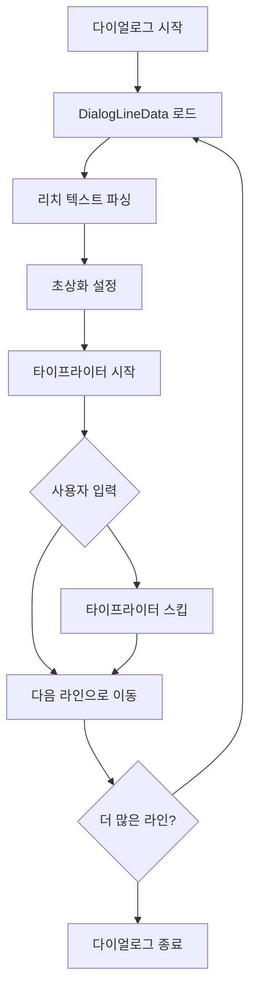

# 다이얼로그와 스토리 시스템

츄츄버거 다이얼로그 시스템은 게임의 스토리텔링을 담당하는 핵심 시스템으로, 리치 텍스트 파싱, 타이프라이터 효과, 캐릭터별 감정 표현, 선택지 분기 등을 통해 몰입감 있는 스토리 경험을 제공합니다. 인트로 시퀀스부터 게임 내 이벤트까지 모든 텍스트 기반 상호작용을 관리합니다.

## 시스템 개요

다이얼로그 시스템은 단순한 텍스트 표시를 넘어서 시각적, 청각적 효과를 통합한 종합적인 스토리텔링 플랫폼입니다.

### 핵심 특징

- **타이프라이터 효과**: 한 글자씩 등장하는 자연스러운 텍스트 애니메이션
- **리치 텍스트 지원**: HTML 스타일 태그를 통한 텍스트 스타일링
- **캐릭터 시스템**: 다양한 초상화 타입과 감정 표현
- **선택지 분기**: 사용자 선택에 따른 다이얼로그 흐름 제어
- **커스텀 아바타**: 게임 내 캐릭터들의 개성 있는 시각적 표현

## 핵심 동작 흐름



## 주요 컴포넌트

### EventDialogManager

타이프라이터 효과와 리치 텍스트 파싱을 담당하는 핵심 컴포넌트입니다.

**주요 속성:**
- `IsTyping`: 타이핑 진행 중 여부
- `OriginText`: 원본 텍스트
- `interval`: 타이핑 간격 (0.02초)
- `TargetTextComp`: 대상 텍스트 컴포넌트

**핵심 기능:**
- `ParseDialog()`: 리치 텍스트 파싱 (태그와 일반 텍스트 분리)
- `TypeWriter()`: 타이프라이터 효과 구현
- `PlayTypeWriter()`: 타이프라이터 재생 시작
- `SkipTypeWriter()`: 타이프라이터 스킵 처리

### UIDialogLogic

다이얼로그의 생명주기와 흐름을 관리하는 Logic 컴포넌트입니다.

**주요 기능:**
- `MakeDialog()`: 다이얼로그 시작 및 초기화
- `GetNextLine()`: 다음 라인으로 이동
- `EndDialog()`: 다이얼로그 종료 및 콜백 처리

### DialogDataLogic

다이얼로그 데이터의 로딩과 관리를 담당합니다.

**데이터 관리:**
- `TableData`: 다이얼로그별 라인 데이터
- `FirstLineId`: 각 다이얼로그의 첫 라인 ID
- `CustomAvatarData`: 커스텀 아바타 정보

## 데이터 구조

### DialogLineData

개별 다이얼로그 라인의 모든 정보를 담는 구조체입니다.

**주요 속성:**
- `Id`: 라인 고유 식별자
- `PortraitType`: 초상화 타입 (스프라이트, MSW 아바타, 커스텀)
- `PortraitArgs`: 초상화 관련 인수들
- `Name`: 화자 이름
- `Content`: 다이얼로그 내용
- `ChildIds`: 다음 라인/선택지 ID들
- `AvatarReactionType`: 아바타 감정/반응 타입
- `SoundRuid`: 음성/효과음 RUID
- `IsPhoneCall`: 전화 통화 여부

### 초상화 시스템

다양한 초상화 타입을 지원합니다:

#### Sprite Type
- 정적 스프라이트 이미지 사용
- 크기별 자동 스케일링
- 플립(좌우 반전) 지원

#### MSW Avatar Type
- MapleStory Worlds 아바타 시스템 연동
- 실시간 감정 표현
- 얼굴 장식품 지원

#### Custom Avatar Type
- 게임 전용 커스텀 캐릭터
- 다양한 표정과 포즈
- 특수 효과 및 애니메이션

## 리치 텍스트 시스템

### 태그 파싱

HTML 스타일 태그를 지원하여 텍스트 스타일링이 가능합니다:

**지원 태그:**
- `<color=#RRGGBB>`: 텍스트 색상 변경
- `<b>`: 굵은 텍스트
- `<i>`: 기울임 텍스트
- `<size=XX>`: 텍스트 크기 변경

**파싱 과정:**
1. 태그와 일반 텍스트 분리
2. 태그 정보를 인덱스별로 매핑
3. 타이프라이터 재생 시 태그 적용

### 특수 문자 처리

- `\\n`: 개행 문자 자동 변환
- 유니코드 문자 지원
- 다국어 텍스트 처리

## 타이프라이터 효과

### 구현 원리

타이프라이터 효과는 다음과 같이 구현됩니다:

1. **텍스트 분해**: 리치 텍스트를 문자 단위로 분해
2. **태그 매핑**: 각 문자에 해당하는 리치 태그 정보 저장  
3. **순차적 표시**: 타이머를 통한 일정 간격 문자 표시
4. **태그 적용**: 문자 표시 시 해당 리치 태그 함께 적용

### 사용자 상호작용

- **클릭으로 스킵**: 타이핑 중 클릭하면 전체 텍스트 즉시 표시
- **자동 완료**: 타이핑 완료 후 다음 단계 진행 가능
- **음성 효과**: 타이핑과 함께 키보드 타이핑 사운드

## 선택지 시스템

### 분기 구조

다이얼로그는 선택지를 통한 분기를 지원합니다:

```
DialogLine A
├── Choice 1 → DialogLine B
├── Choice 2 → DialogLine C  
└── Choice 3 → DialogLine D
```

### 선택지 처리

- `ChildIds`: 선택 가능한 다음 라인들
- `ChildContents`: 각 선택지의 표시 텍스트
- 선택 결과에 따른 스토리 분기
- 선택 기록 및 콜백 처리

## 감정 표현 시스템

### 아바타 반응

캐릭터의 감정과 상황을 시각적으로 표현합니다:

- **표정 변화**: 기쁨, 슬픔, 놀람, 화남 등
- **포즈 변경**: 상황에 맞는 자세와 동작
- **특수 효과**: 이펙트와 파티클을 통한 감정 강조

### 상황별 연출

- **전화 통화**: 특별한 UI 레이아웃
- **중요한 순간**: 확대/축소 효과
- **감정 고조**: 화면 흔들림이나 색상 변화

## 사운드 시스템

### 음성 지원

- **캐릭터별 음성**: 각 화자에 맞는 음성 톤
- **감정 표현**: 상황에 맞는 음성 연출
- **타이핑 사운드**: 타이프라이터 효과와 동기화

### 효과음

- **환경음**: 상황에 맞는 배경음
- **액션 효과음**: 특별한 동작이나 이벤트 시
- **UI 사운드**: 선택지 클릭, 페이지 이동 등

## 특수 기능

### 인트로 시스템 연동

게임 시작 시 특별한 인트로 시퀀스:

- **YouTube 비디오 재생**: 외부 비디오 콘텐츠 삽입
- **카메라 시퀀스**: 게임 내 카메라 연출
- **페이드 효과**: 자연스러운 화면 전환
- **스킵 기능**: 사용자가 원할 때 건너뛰기

### 튜토리얼 연동

게임 진행에 따른 튜토리얼 다이얼로그:

- **상황별 가이드**: 게임 상황에 맞는 설명
- **인터랙티브 요소**: 실제 게임 요소와 연동
- **진행도 추적**: 튜토리얼 완료 상태 관리

## 지역화 지원

### 다국어 시스템

- **지역화 키**: 다국어 지원을 위한 키 기반 텍스트
- **동적 텍스트**: 게임 상황에 따른 실시간 텍스트 생성
- **폰트 지원**: 언어별 적절한 폰트 적용

### 텍스트 포맷팅

- **매개변수 삽입**: 플레이어 이름, 수치 등 동적 삽입
- **조건부 텍스트**: 게임 상황에 따른 텍스트 변화
- **하이라이트**: 중요한 단어나 구문 강조

## 성능 최적화

### 리소스 관리

- **동적 로딩**: 필요한 다이얼로그만 선택적 로드
- **캐싱**: 자주 사용되는 다이얼로그 데이터 캐시
- **언로딩**: 사용 완료된 리소스 자동 해제

### 렌더링 최적화

- **배칭**: 리치 텍스트 렌더링 최적화
- **프레임률**: 타이프라이터 효과의 부드러운 재생
- **메모리**: 효율적인 문자열 처리

## 개발자 도구

### 다이얼로그 에디터

개발 시 다이얼로그 작성과 테스트를 위한 도구:

- **시각적 편집**: 분기 구조 시각화
- **실시간 미리보기**: 수정 내용 즉시 확인
- **데이터 검증**: 누락된 링크나 오류 자동 감지

### 디버깅 기능

- **로그 시스템**: 다이얼로그 진행 상황 추적
- **상태 확인**: 현재 다이얼로그 상태 모니터링
- **성능 측정**: 타이프라이터 성능 분석

## Code References

- `RootDesk/MyDesk/08. Event/EventDialogManager.mlua :: ParseDialog()` — 리치 텍스트 파싱
- `RootDesk/MyDesk/08. Event/EventDialogManager.mlua :: TypeWriter()` — 타이프라이터 효과 구현  
- `RootDesk/MyDesk/15. Intro/Dialog/UIDialogLogic.mlua :: MakeDialog()` — 다이얼로그 시작
- `RootDesk/MyDesk/15. Intro/Dialog/UIDialogLogic.mlua :: GetNextLine()` — 다음 라인 처리
- `RootDesk/MyDesk/15. Intro/Dialog/DialogDataLogic.mlua :: GetDialogTable()` — 다이얼로그 데이터 로드
- `RootDesk/MyDesk/15. Intro/Data/DialogLineData.mlua` — 다이얼로그 라인 데이터 구조체
- `RootDesk/MyDesk/15. Intro/Dialog/UIDialogPanel.mlua` — 다이얼로그 UI 패널
- `RootDesk/MyDesk/15. Intro/Dialog/IntroOpeningCaption.mlua` — 오프닝 캡션 시스템
- `RootDesk/MyDesk/15. Intro/Data/CustomAvatarData.mlua` — 커스텀 아바타 데이터
