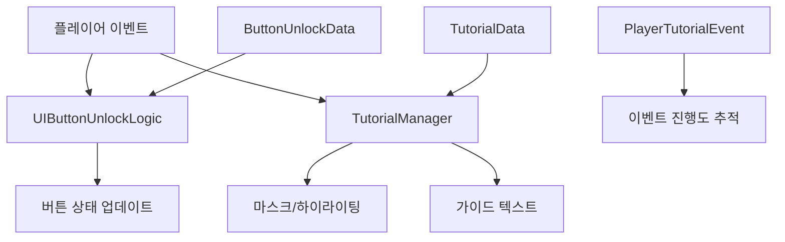

# 튜토리얼 가이드 시스템

츄츄버거 튜토리얼 시스템은 신규 플레이어가 게임의 핵심 기능을 단계별로 학습할 수 있도록 가이드하는 포괄적인 시스템입니다.

## 시스템 개요

튜토리얼 시스템은 크게 두 가지 핵심 구성요소로 나뉩니다:
1. **TutorialManager**: 튜토리얼 진행 및 UI 마스킹/하이라이팅 제어
2. **UIButtonUnlockLogic**: 게임 진행에 따른 UI 버튼 잠금/해제 관리

### 시스템 구조



## TutorialManager

튜토리얼의 시각적 가이드를 담당하는 핵심 컴포넌트입니다.

### 주요 기능

#### 1. 타겟 엔티티 찾기
특정 UI 요소나 게임 오브젝트를 대상으로 하는 정확한 엔티티를 찾습니다.

#### 2. UI 미러링
- 화면을 4개 영역(TopLeft, TopRight, BottomLeft, BottomRight)으로 분할
- 대상 UI 요소를 제외한 나머지 영역을 마스킹하여 집중도 향상

#### 3. 마스크/하이라이팅
- **마스크**: 대상이 아닌 영역을 어둡게 처리
- **하이라이팅**: 대상 요소를 시각적으로 강조

#### 4. 가이드 텍스트 표시
- 다국어 지원되는 가이드 텍스트
- 정렬 옵션: ScreenTopCenter, TopLeft, TopRight, BottomLeft, BottomRight
- 오프셋을 통한 세밀한 위치 조정

#### 5. 강제 액션 처리
- 플레이어가 특정 행동을 완료할 때까지 진행 차단
- 콜백 함수를 통한 자동 다음 단계 진행

### 튜토리얼 데이터 구조

TutorialData 구조체는 각 튜토리얼 단계의 설정을 정의합니다:

**주요 속성:**
- `Highlight`: 하이라이팅 여부
- `Mask`: 마스킹 여부  
- `TargetPath`: 대상 UI 경로
- `AutoNext`: 자동 다음 단계 진행
- `TouchAnywhere`: 화면 전체 터치 허용
- `ForceTo/funcCallback`: 강제 액션 및 콜백 처리

<details>
<summary>TutorialData 구조체 상세</summary>

```lua
-- RootDesk/MyDesk/08. Event/Tutorial/TutorialData.mlua
property string ForceTo = ""
property string funcCallback = ""
property table callbackParams = {}
property boolean FuncOnTouch = false
```
</details>

### 튜토리얼 진행 방식

PlayTutorial() 메서드를 통해 튜토리얼이 순차적으로 실행됩니다:

1. **데이터 검증**: TutorialDataSetLogic에서 해당 ID의 튜토리얼 데이터 로드
2. **대상 확인**: GetTargetEntity()로 하이라이팅할 UI 엔티티 검색  
3. **마스킹 적용**: 대상 외 영역 어둡게 처리

<details>
<summary>PlayTutorial 메서드 구현</summary>

```lua
-- RootDesk/MyDesk/08. Event/Tutorial/TutorialManager.mlua :: PlayTutorial()
method void PlayTutorial(string id)
    local tutorialData = _TutorialDataSetLogic:GetTutorialData(id)
    if tutorialData == nil then 
        self:HideMask()
        return
    end
    
    if self.target ~= nil then 
        return
    end
    
    local target = self:GetTargetEntity(tutorialData)
    if isvalid(target) == false then 
        self:HideMask()
        return
    end
```
</details>

## UIButtonUnlockLogic

게임 진행도에 따라 UI 버튼의 활성화/비활성화를 관리하는 시스템입니다.

### 잠금 해제 조건 유형

#### 1. 이벤트 기반 잠금해제

IsButtonUnlocked() 메서드에서 특정 이벤트 발생 여부를 확인하여 버튼을 활성화합니다:

`return player.PlayerEvent:IsEventOccured(unlockData.EventCondition)`

<details>
<summary>이벤트 기반 잠금해제 로직</summary>

```lua
-- RootDesk/MyDesk/08. Event/UIButtonUnlockLogic.mlua :: IsButtonUnlocked()
local unlockData = self:GetButtonUnlockData(id)
if unlockData.ConditionType == "Event" then
    if _UtilLogic:IsNilorEmptyString(unlockData.EventCondition) then
        return true
    end
    
    return player.PlayerEvent:IsEventOccured(unlockData.EventCondition)
```
</details>

#### 2. 업적 기반 잠금해제
특정 업적 달성 시 버튼 활성화

#### 3. 업그레이드 기반 잠금해제
특정 업그레이드 레벨 도달 시 버튼 활성화

### 특별 조건 처리

스테이지 1 이후의 특별한 잠금해제 조건들:

- **VIP 주문**: 매니지먼트 레벨 1 이상 필요
- **스쿠터 출장**: AutoTrainingOpen 업그레이드 레벨 1 이상
- **재료 교환**: T6003 튜토리얼 이벤트 완료 
- **재료 합성**: T7001 튜토리얼 이벤트 완료

<details>
<summary>스테이지별 특수 조건 로직</summary>

```lua
-- RootDesk/MyDesk/08. Event/UIButtonUnlockLogic.mlua :: IsButtonUnlocked()
if player.PlayerStage.NowStage > 1 then
    if id == _ButtonUnlockEnum.MainMenuVIPOrder then
        return player.PlayerManagement.ManagementLevel >= 1 
        
    elseif id == _ButtonUnlockEnum.MainMenuAutoTraining then
        return _UpgradeDataSetLogic:ReturnCurrentPlayerLevel(player, _UpgradeTypeEnum.AutoTrainingOpen) >= 1 
    
    elseif id == _ButtonUnlockEnum.MainMenuExchange then
        return  player.PlayerEvent:IsEventOccured("T6003") 
        
    elseif id == _ButtonUnlockEnum.MainMenuIngreSynth then
        return player.PlayerEvent:IsEventOccured("T7001")
```
</details>

### 버튼 상태 업데이트

SetButtonsUnlock() 메서드는 모든 등록된 버튼들을 순회하며 잠금해제 상태를 갱신합니다:

1. **조건 확인**: IsButtonUnlocked()로 각 버튼의 활성화 조건 검사
2. **엔티티 가져오기**: EntityPath로 실제 UI 버튼 엔티티 참조
3. **상태 적용**: IsFull 옵션에 따라 전체 엔티티 또는 ButtonComponent만 활성화

<details>
<summary>버튼 상태 업데이트 로직</summary>

```lua
-- RootDesk/MyDesk/08. Event/UIButtonUnlockLogic.mlua :: SetButtonsUnlock()
method void SetButtonsUnlock()
    local player = _UserService.LocalPlayer
    for id, _ in pairs(self.ButtonUnlockData) do
        local unlockData = self:GetButtonUnlockData(id)
        local isUnlock = self:IsButtonUnlocked(id, player)
        
        local entity = _EntityService:GetEntityByPath(unlockData.EntityPath)
        
        if unlockData.IsFull then
            entity.Enable = isUnlock
        else
            if isvalid(entity.ButtonComponent) then
                entity.ButtonComponent.Enable = isUnlock
            end
```
</details>

## 플레이어 튜토리얼 이벤트

플레이어의 튜토리얼 진행 상태를 관리하는 컴포넌트입니다.

### 주요 속성

PlayerTutorialEvent는 튜토리얼 진행 상태를 동기화하여 관리합니다:

- **TutorialEvents**: 각 튜토리얼 이벤트 ID별 완료 상태 테이블
- **IsSkipTutorial**: 튜토리얼 전체 스킵 여부 플래그

<details>
<summary>PlayerTutorialEvent 속성 정의</summary>

```lua
-- RootDesk/MyDesk/00. Player/PlayerTutorialEvent.mlua
@TargetUserSync
property SyncTable<string, boolean> TutorialEvents

@TargetUserSync
property boolean IsSkipTutorial = false
```
</details>

### 스킵 기능

SetIsSkipTutorial() 메서드로 튜토리얼 전체를 스킵할 수 있습니다:

`if bool == true then self:ForceSetTutorialEventsOccured() end`

스킵 활성화 시 ForceSetTutorialEventsOccured()가 호출되어 모든 튜토리얼 이벤트를 완료 상태로 설정합니다.

<details>
<summary>튜토리얼 스킵 로직</summary>

```lua
-- RootDesk/MyDesk/00. Player/PlayerTutorialEvent.mlua :: SetIsSkipTutorial()
method void SetIsSkipTutorial(boolean bool)
    if self.IsSkipTutorial == bool then
        return
    end
    
    self.IsSkipTutorial = bool
    
    if bool == true then
        self:ForceSetTutorialEventsOccured()
    end
end
```
</details>

## 튜토리얼 이벤트 카테고리

### 기본 게임플레이 튜토리얼
- `T1003`: 첫 고객 구매 처리
- `T1004`: 팁 획득 시스템
- `T1005`: 팁 저장고 업그레이드

### 메뉴 제작 튜토리얼
- `T1101`: 고객 피드백 (치킨 태그)
- `T1102`: 레시피 만들기 시작
- `T1103`: 레시피 만들기 완료

### 직원 관리 튜토리얼
- `T1006`: 직원 고용 시스템
- `T1301`: 평판 시스템 소개
- `T1701`: 직원 스탯 부족 상황
- `T1702`: 직원 업그레이드 시스템

### 출장 시스템 튜토리얼
- `T1302`: 출장 설정 진입
- `T1303`: 출장 시스템 진입
- `T1304`: 출장 힌트 획득
- `T1305`: 출장 스팟 선택

### 고급 기능 튜토리얼
- `T1501`: 대회 시스템
- `T1601`: VIP 주문 시스템
- `T6003`: 재료 교환 시스템
- `T7001`: 재료 합성 시스템

## 구현 특징

### 단계적 가이드
각 튜토리얼은 여러 단계로 나뉘어져 있으며, 순차적으로 진행됩니다.
- 예: `T1101_1` → `T1101_2` → ... → `T1101_12`

### 스킵 기능
개발 환경이나 플레이어 선택에 따라 튜토리얼을 건너뛸 수 있습니다.

### 진행도 추적
모든 튜토리얼 이벤트는 데이터베이스에 저장되어 지속적으로 관리됩니다.

## 코드 참조

**핵심 파일들:**
- `RootDesk/MyDesk/08. Event/Tutorial/TutorialManager.mlua` — 튜토리얼 UI 제어
- `RootDesk/MyDesk/08. Event/UIButtonUnlockLogic.mlua` — 버튼 잠금해제 로직
- `RootDesk/MyDesk/08. Event/Tutorial/TutorialDataSetLogic.mlua :: LoadDataSet()` — 튜토리얼 데이터 로드
- `RootDesk/MyDesk/00. Player/PlayerTutorialEvent.mlua :: SetIsSkipTutorial()` — 튜토리얼 스킵 처리
- `RootDesk/MyDesk/08. Event/Tutorial/TutorialData.mlua` — 튜토리얼 데이터 구조체
- `RootDesk/MyDesk/08. Event/Data/ButtonUnlockData.mlua` — 버튼 잠금해제 데이터 구조체
- `RootDesk/MyDesk/08. Event/Tutorial/TutorialEventEnum.mlua` — 튜토리얼 이벤트 ID 정의
- `RootDesk/MyDesk/08. Event/Data/ButtonUnlockEnum.mlua` — 버튼 ID 정의

**데이터 파일들:**
- `RootDesk/MyDesk/08. Event/Tutorial/TutorialData.csv` — 튜토리얼 시나리오 데이터
- `RootDesk/MyDesk/08. Event/Data/ButtonUnlockData.csv` — 버튼 잠금해제 조건 데이터
