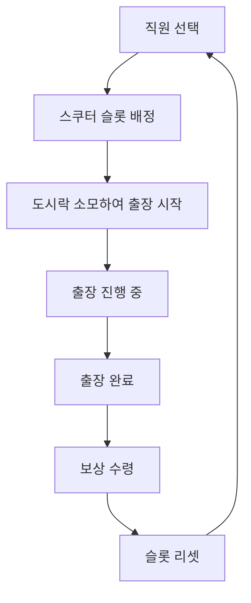

# 스쿠터 출장 시스템

츄츄버거 스쿠터 출장 시스템은 플레이어가 직원(츄츄)들을 스쿠터에 태워 일정 시간 동안 자동으로 출장을 보낸 뒤, 출장이 완료되면 경험치, 골드, 클로버, 재료 박스 등의 보상을 받을 수 있는 기능입니다. 플레이어가 게임을 하지 않는 동안에도 수익과 직원 성장을 위한 리소스를 얻을 수 있는 AFK(Away From Keyboard) 시스템의 핵심 요소입니다.

## 시스템 개요

스쿠터 출장 시스템은 3개의 스쿠터 슬롯을 통해 운영됩니다. 각 슬롯에는 하나의 직원을 배정할 수 있으며, 도시락을 소모하여 출장을 시작하고 일정 시간 후에 보상을 수령할 수 있습니다.

### 핵심 동작 흐름



## 주요 컴포넌트

### PlayerAutoTrainingManager

스쿠터 출장 시스템의 핵심 관리자 컴포넌트로, 모든 스쿠터 출장 로직을 담당합니다.

**주요 속성:**
- `OpenSlotNum`: 열린 슬롯 개수 (업그레이드로 확장)
- `MaxSlotCount`: 최대 슬롯 개수 (3개)
- `RequireLunchBoxNum`: 출장 시작에 필요한 도시락 개수 (3개)
- `TrainingTime`: 출장 소요 시간 (분 단위)
- `AutoTrainingSlotInfoTable`: 슬롯별 출장 데이터 저장

**주요 기능:**
- `StartTraining()`: 출장 시작 처리
- `CalcResult()`: 보상 계산 및 결과 생성
- `GiveReward()`: 보상 지급
- `UpdateTimer()`: 출장 시간 진행 관리

### AutoTrainingSlotData

각 스쿠터 슬롯의 상태와 데이터를 관리하는 구조체입니다.

**주요 속성:**
- `State`: 출장 상태 (Default/OnProgress/WaitingReward)
- `ChuchuId`: 배치된 직원 ID
- `SlotNum`: 슬롯 번호
- `RemainDay`: 남은 출장 시간
- `ResultMoney`: 결과로 얻는 골드
- `ResultClover`: 결과로 얻는 클로버
- `RewardBoxes`: 보상 박스 목록

### AutoTrainingTruckSlot

개별 스쿠터 슬롯의 UI와 상태 관리를 담당하는 컴포넌트입니다.

**상태별 UI 변화:**
- `Default`: 기본 상태, 직원 배치 및 출발 준비
- `OnProgress`: 출장 진행 중, 타이머 표시 및 스쿠터 숨김
- `WaitingReward`: 출장 완료, 도착 알림 및 보상 수령 가능
- `Locked`: 슬롯 잠금 상태

## 시스템 특징

### 슬롯 확장 시스템

기본적으로 1개의 슬롯만 사용 가능하며, 업그레이드를 통해 최대 3개까지 확장할 수 있습니다:

```
- 슬롯 1: 기본 제공
- 슬롯 2: 스쿠터 출장 개방 업그레이드 필요
- 슬롯 3: 추가 스쿠터 출장 개방 업그레이드 필요
```

### 보상 시스템

출장 완료 시 다음과 같은 보상을 받을 수 있습니다:

#### 기본 보상
- **골드**: 고객 수 × 버거 가격 × 설정 배율 × 스테이지 보정
- **클로버**: 경영 레벨에 따른 기본 클로버 + 컬렉션 보너스
- **평판**: 출장 업그레이드 레벨에 따른 평판

#### 재료 박스
- 재료 박스 1~3등급: 가중치에 따른 랜덤 드롭
- 번 박스: 확률에 따른 드롭

#### 경험치 아이템
- 요리 경험치 아이템
- 서빙 경험치 아이템

### 직원 스킬 시스템 연동

출장에 참여하는 직원이 출장 타입 스킬을 보유한 경우 추가 보너스를 받을 수 있습니다:

- `TotalMoneyBonus`: 골드 보너스
- `ArcaneBonus`: 클로버 보너스  
- `CookExpBonus`: 요리 경험치 보너스
- `ServingExpBonus`: 서빙 경험치 보너스

### 시각적 피드백

#### 로비 연동
스쿠터 출장 진행 상황이 실제 로비의 주차장 영역에 시각적으로 반영됩니다:
- 스쿠터 표시/숨김
- 주차금지 표시
- 남은 시간 또는 도착 알림 표시

#### HUD 표시
메인 HUD에서도 스쿠터 출장 상태를 확인할 수 있습니다:
- 각 슬롯별 진행 상황
- 남은 시간 표시
- 완료 알림

## UI 시스템

### UITrainingAuto

스쿠터 출장의 메인 UI를 관리하는 컴포넌트입니다.

**주요 기능:**
- 스쿠터 슬롯 표시 및 관리
- 직원 선택 팝업
- 결과 팝업 표시
- 일괄 보상 수령

### 직원 선택 시스템

플레이어가 보유한 직원 중에서 스쿠터 출장에 참여할 직원을 선택할 수 있습니다:
- 직원 목록 스크롤
- 직원별 상세 정보 표시
- 출장 스킬 보유 여부 표시
- 현재 배치 상태 확인

## 경제 시스템 연동

### 비용 시스템
- **도시락 소모**: 출장 시작 시 3개의 도시락이 소모됩니다
- **단축 기능**: 아케인 심볼을 소모하여 출장을 즉시 완료할 수 있습니다

### 보상 계산
보상 계산은 다양한 요소를 고려하여 이루어집니다:
- 플레이어의 현재 스테이지
- 경영 레벨
- 출장 업그레이드 레벨  
- 직원의 스킬
- 전략 효과
- 컬렉션 보너스

## 데이터 관리

### 저장 시스템
스쿠터 출장 데이터는 다음과 같이 관리됩니다:
- `AutoTrainingSlotInfoTable`: 슬롯별 출장 상태
- `OpenSlotNum`: 열린 슬롯 개수
- `ChuchuIds`: 선택된 직원 목록

### 로그 시스템
스쿠터 출장의 모든 활동은 PlayerLog에 기록됩니다:
- 출장 시작 로그
- 출장 완료 로그  
- 보상 수령 로그

## 업적 및 배지 연동

스쿠터 출장 시스템은 다양한 업적과 배지 시스템과 연동됩니다:
- 스쿠터 출장 수입 업적
- 스쿠터 출장 누적 수입 업적
- 스쿠터 출장 횟수 업적
- 출장 횟수 배지

## Code References

- `RootDesk/MyDesk/06. Training/PlayerAutoTrainingManager.mlua :: CalcResult()` — 보상 계산 로직
- `RootDesk/MyDesk/06. Training/PlayerAutoTrainingManager.mlua :: StartTraining()` — 출장 시작 처리
- `RootDesk/MyDesk/06. Training/PlayerAutoTrainingManager.mlua :: UpdateTimer()` — 시간 진행 관리
- `RootDesk/MyDesk/06. Training/AutoTrainingSlotData.mlua :: ConvertToTable()` — DB 저장용 데이터 변환
- `RootDesk/MyDesk/06. Training/AutoTrainingTruckSlot.mlua :: ChangeUIOnState()` — 상태별 UI 변경
- `RootDesk/MyDesk/06. Training/UITrainingAuto.mlua :: SetTruckSlot()` — 스쿠터 슬롯 UI 설정
- `RootDesk/MyDesk/06. Training/AutoTrainingUIStateEnum.mlua` — 출장 상태 열거형 정의
