# 직원 출장 시스템

## 시스템 개요

츄츄버거 직원 출장 시스템은 플레이어의 직원들이 실제 현장 경험을 통해 성장할 수 있는 고급 시스템입니다. **PlayerTrainingManager**를 중심으로 운영되며, 스팟 선택, 룰렛 미니게임, 힌트 시스템이 복합적으로 연동되어 흥미롭고 전략적인 출장 경험을 제공합니다.

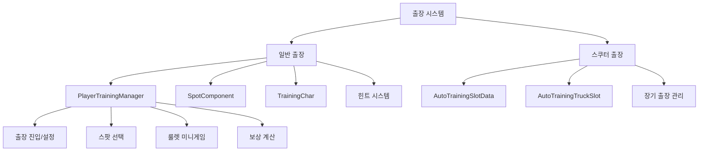

## PlayerTrainingManager - 출장 시스템 핵심 관리

### 핵심 데이터 구조
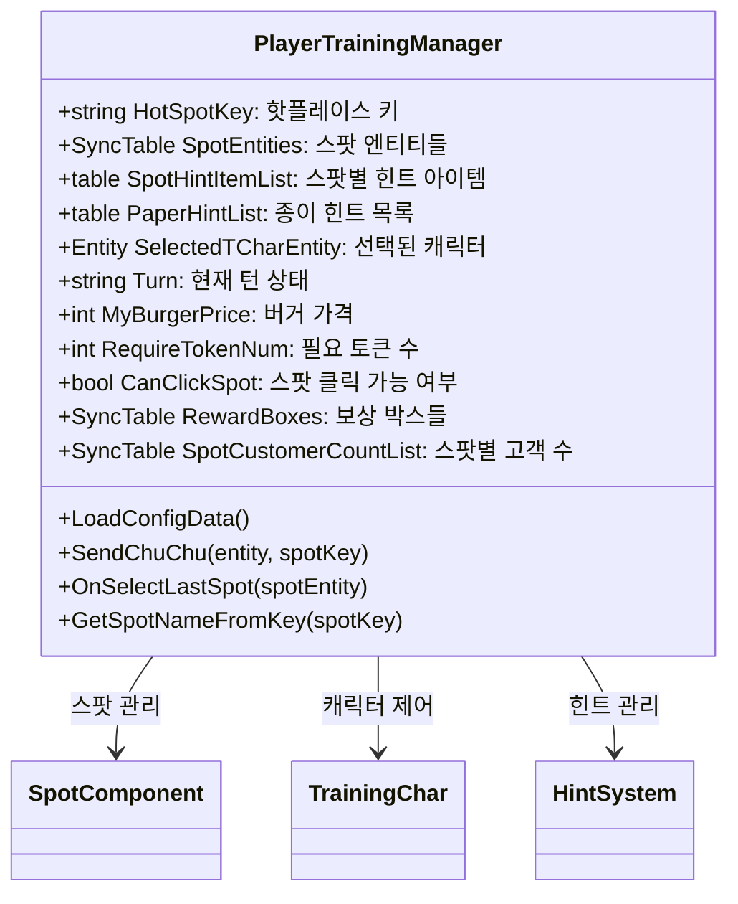

### 출장 진행 시스템

**턴 기반 시스템:**
```lua
-- PlayerTrainingManager.mlua
property string Turn = ""    -- "FirstMorning", "SecondMorning" 등
```

**출장 단계:**
1. **준비 단계**: 캐릭터 선택 및 초기 설정
2. **첫 번째 오전**: 스팟 탐색 및 힌트 수집
3. **두 번째 오전**: 최종 스팟 선택 및 버거 판매
4. **보상 단계**: 성과에 따른 보상 지급

### 스팟 선택 메커니즘

**스팟별 특성:**
- **HotSpotKey**: 현재 인기 있는 핫플레이스
- **SpotHintItemList**: 각 스팟에서 발견 가능한 힌트들
- **SpotCustomerCountList**: 스팟별 예상 고객 수

**선택 조건:**
```lua
-- PlayerTrainingManager.mlua :: CanClickSpot
if _UserService.LocalPlayer.PlayerTrainingManager.CanClickSpot == false then
    return  -- 스팟 클릭 불가 상태
end
```

## SpotComponent - 출장 장소 관리

### 스팟 시스템

**SpotComponent 구조:**
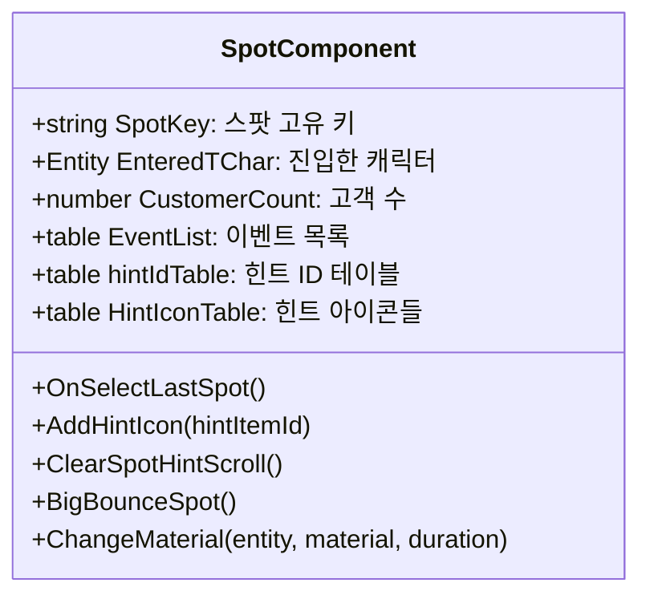

### 힌트 시스템 연동

**힌트 아이콘 관리:**
```lua
-- SpotComponent.mlua :: OnBeginPlay()
local hintScrollView = _EntityService:GetEntityByPath(self.Entity.Path.."/HintScroll")
for i = 1, 3 do
    local hintIconEntity = hintScrollView:GetChildByName("HintIcon".._StringUtilLogic:NumToString(i))
    table.insert(self.HintIconTable, hintIconEntity)
    hintIconEntity:ConnectEvent(ButtonClickEvent, function() 
        _SoundService:PlaySound(_ResourceManager.SFXTable["Eff_FindItemHint"], 1)
        self:OnClickHintIcon(i) 
    end)
end
```

**시각적 피드백:**
```lua
-- SpotComponent.mlua :: BigBounceSpot()
self:ChangeMaterial(self.Entity, _IconRuidEnum.ChuChuMovementMaterial, 5)
```

스팟에 중요한 정보나 이벤트가 있을 때 바운스 애니메이션으로 시각적 강조를 제공합니다.

### 스팟 상호작용

**클릭 이벤트 처리:**
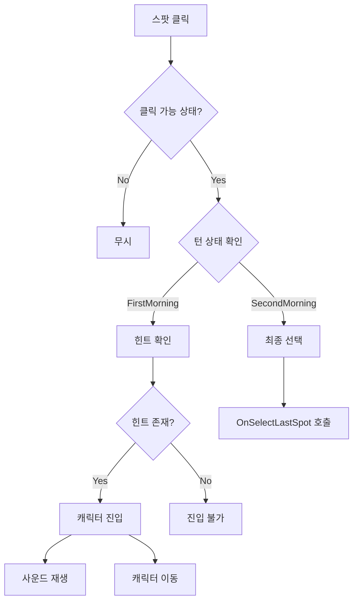

## TrainingChar - 캐릭터 관리

### 캐릭터 상태 시스템

**TrainingChar 구조:**
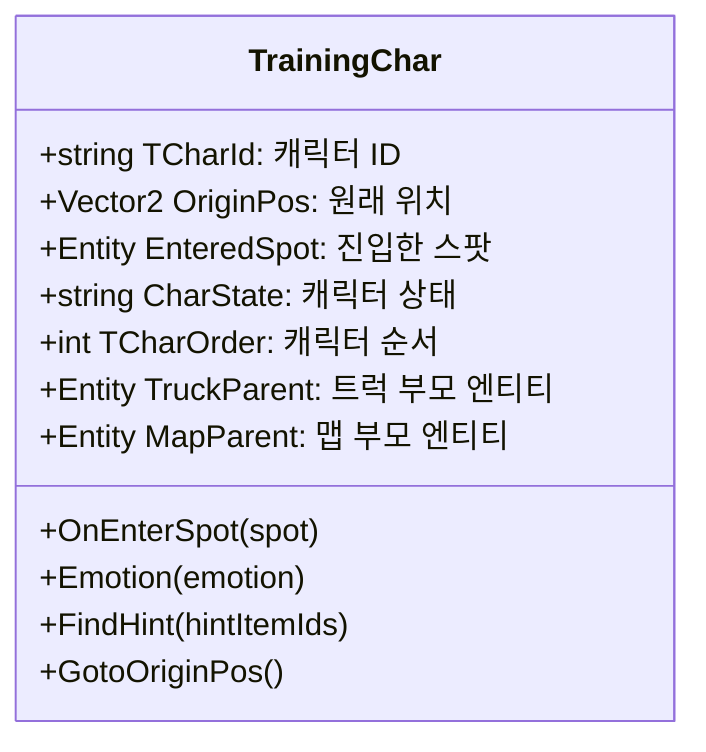

### 스팟 진입 시스템

**OnEnterSpot 처리:**
```lua
-- TrainingChar.mlua :: OnEnterSpot()
if isvalid(self.EnteredSpot) then
    self.EnteredSpot.SpotComponent:ClearEnteredTChar()  -- 기존 스팟 정리
end

self.EnteredSpot = spot

if isvalid(self.EnteredSpot) then
    self.Entity:AttachTo(self.EnteredSpot)  -- 스팟에 부착
    self.Entity.UITransformComponent.anchoredPosition = Vector2(0, 160)
    local player = _UserService.LocalPlayer
    player.PlayerTrainingManager:SendChuChu(self.Entity, self.EnteredSpot.SpotComponent.SpotKey)
else
    self:GotoOriginPos()  -- 원래 위치로 복귀
end
```

### 감정 애니메이션 시스템

**멀티 뷰 감정 표현:**
```lua
-- TrainingChar.mlua :: Emotion()
local img1 = _EntityService:GetEntityByPath("/ui/TrainingGroup/PlacePanel/Foothold/Foot/Truck/CharImage".._StringUtilLogic:NumToString(self.TCharOrder))
local img2 = _EntityService:GetEntityByPath("/ui/TrainingGroup/PlacePanel/Foothold_HotPlace/Foot/Truck/CharImage".._StringUtilLogic:NumToString(self.TCharOrder))

_TrialLogic:PlayUIEmployeeAnim(self.Entity, self.TCharId, emotion, true, _UserService.LocalPlayer)
_TrialLogic:PlayUIEmployeeAnim(img1, self.TCharId, emotion, true, _UserService.LocalPlayer)
_TrialLogic:PlayUIEmployeeAnim(img2, self.TCharId, emotion, true, _UserService.LocalPlayer)
```

**감정 종류:**
- **기쁨**: 좋은 힌트 발견 시
- **놀람**: 특별한 이벤트 발생 시  
- **집중**: 힌트 탐색 중
- **만족**: 출장 완료 시

## TrainingCustomerComponent - 출장 고객 시스템

### 가상 고객 관리

출장 환경에서 실제와 같은 상황을 시뮬레이션하기 위한 고객 시스템입니다.

**주요 기능:**
- **핫플레이스 위치 설정**: 인기 장소에 따른 고객 분포
- **걷기 애니메이션**: 자연스러운 고객 움직임
- **랜덤 의상과 감정**: 다양한 고객 시각화
- **액션 애니메이션**: 주문, 대기, 만족 등 다양한 반응

**고객 분포 시스템:**
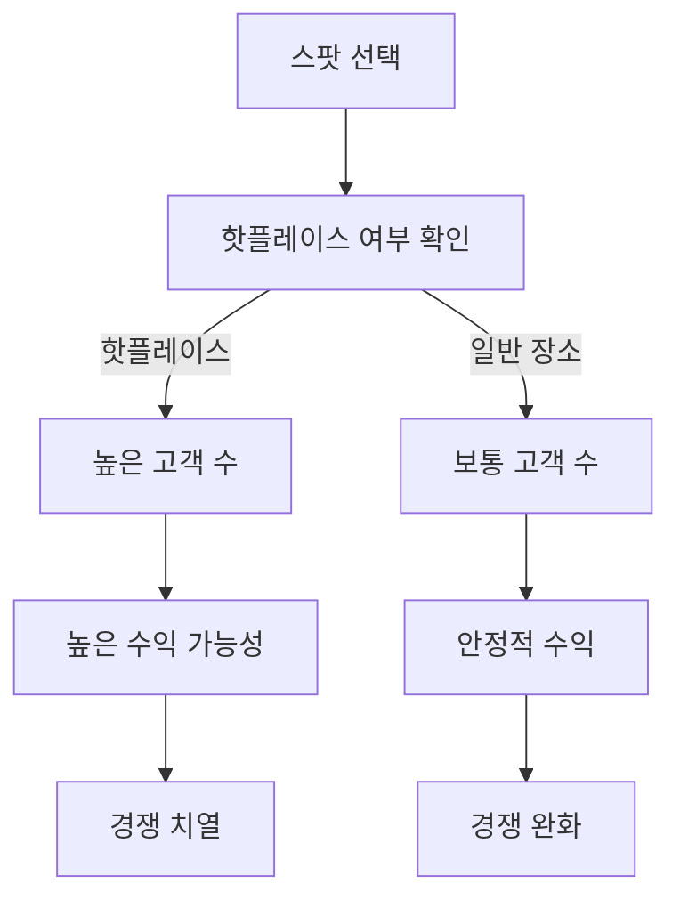

## 힌트 시스템

### HintItemData - 힌트 아이템 관리

**힌트 분류 시스템:**
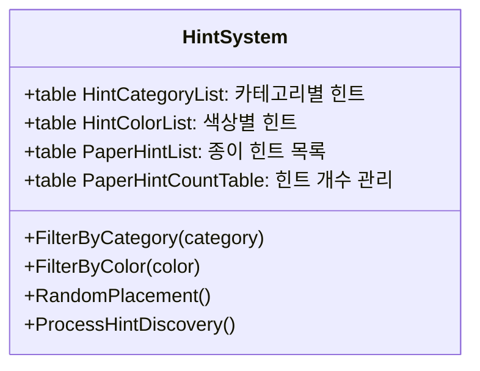

### 힌트 발견 메커니즘

**PaperHintComponent 처리:**
- **색상별 필터링**: 특정 색상 힌트만 표시
- **카테고리별 필터링**: 요리/서빙 관련 힌트 구분
- **랜덤 배치**: 각 세션마다 다른 힌트 배치
- **발견 처리**: 힌트 터치 시 수집 및 정보 제공

**힌트 활용 전략:**
1. **정보 수집**: 각 스팟의 특성 파악
2. **위험 회피**: 문제가 있는 스팟 식별
3. **기회 포착**: 숨겨진 보너스 발견
4. **최적화**: 최고 효율 스팟 찾기

## 룰렛 미니게임 시스템

### 미니게임 구조

**게임플레이 흐름:**
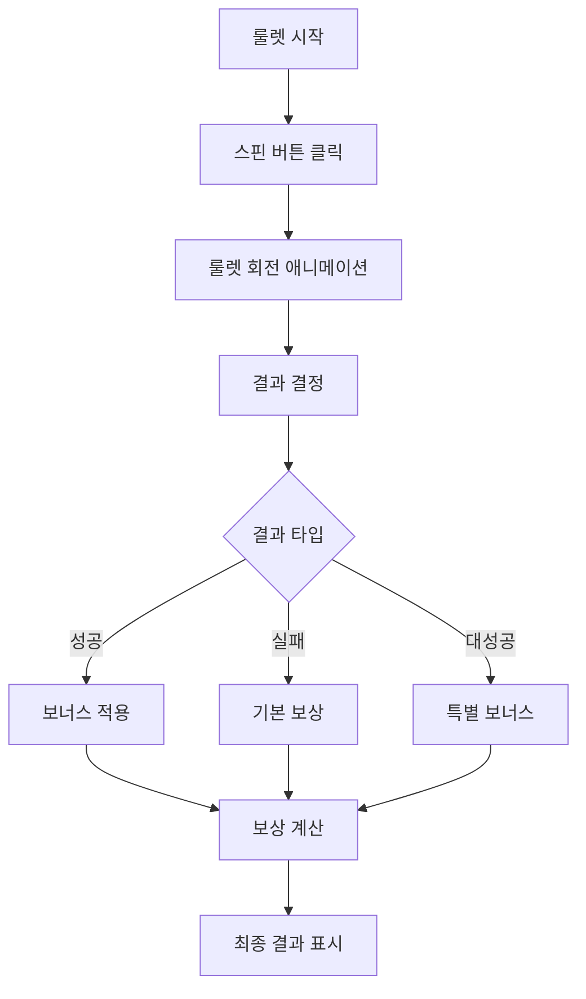

### 확률 시스템

**결과 가중치:**
```lua
-- PlayerTrainingManager.mlua
property bool IsSpinning = false              -- 스핀 진행 중 방지
property table BurgerPriceBonusTable         -- 가격 보너스 테이블
```

**보상 계산 요소:**
- **기본 버거 가격**: MyBurgerPrice 기준
- **업그레이드 보너스**: UpgradeBurgerPrice 적용
- **룰렛 결과**: 배수 효과 적용
- **스팟 보너스**: 선택한 스팟의 특별 효과

## 스쿠터 출장 시스템

### AutoTrainingSlotData - 슬롯 관리

**스쿠터 출장 구조:**
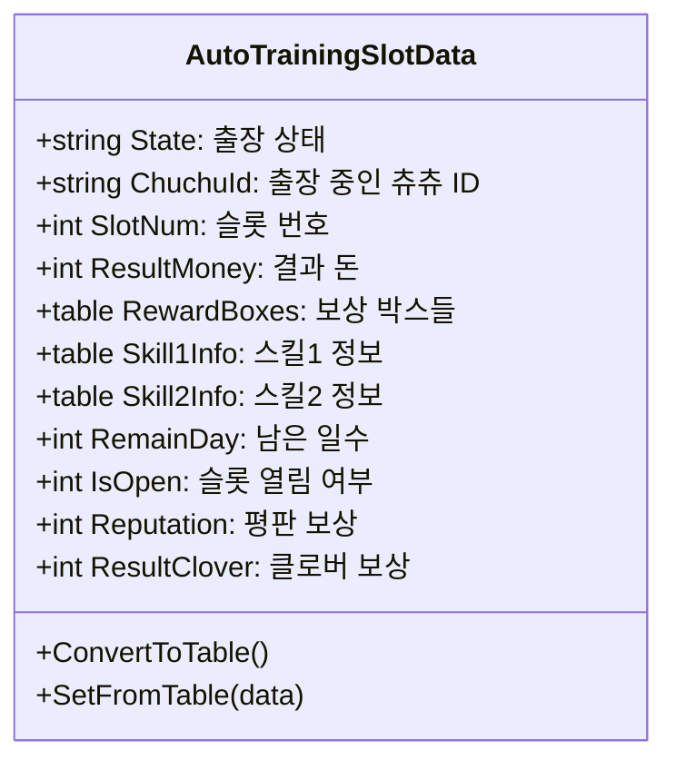

### AutoTrainingTruckSlot - UI 관리

**상태별 UI 시스템:**
```lua
-- AutoTrainingTruckSlot.mlua :: ChangeUIOnState()
if state == _AutoTrainingUIStateEnum.OnProgress then
    -- 출장 진행 중 UI
    btnDim.Enable = true
    dimText.Enable = true
    timerPanel.Enable = true
    noParkingSign.Enable = true
    
elseif state == _AutoTrainingUIStateEnum.WaitingReward then
    -- 보상 대기 상태 UI
    buttonText.TextComponent.Text = _LocalizationService:GetText("Receive")
    
elseif state == _AutoTrainingUIStateEnum.Locked then
    -- 잠긴 슬롯 UI
    lockIcon.Enable = true
    coverSprite.Enable = true
end
```

### 스쿠터 출장 특징

**장기 출장 시스템:**
- **시간 기반**: 실시간으로 진행되는 장기 출장
- **다중 슬롯**: 여러 직원 동시 출장 가능
- **오프라인 진행**: 게임 종료 후에도 지속 진행
- **다양한 보상**: 경험치, 골드, 평판, 클로버 등

**스쿠터 시각화:**
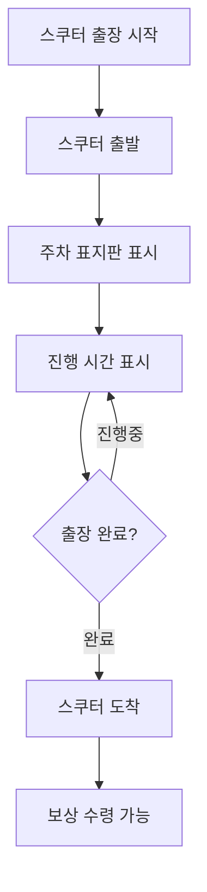

## UI 시스템 통합

### TrainingUIStateEnum - 상태 관리

**UI 상태 정의:**
```lua
-- TrainingUIStateEnum.mlua
property string Default = "Default"              -- 기본 상태
property string OnProgress = "OnProgress"        -- 진행 중
property string WaitingReward = "WaitingReward"  -- 보상 대기
property string Locked = "Locked"                -- 잠금 상태
property string List_Selected = "List_Selected"  -- 목록 선택됨
```

### 통합 UI 경험

**UITraining 메인 인터페이스:**
- **캐릭터 선택**: 출장에 참여할 직원 선택
- **스팟 지도**: 이용 가능한 출장 장소 표시
- **힌트 정보**: 수집한 힌트들의 정보 표시
- **진행 상황**: 현재 출장 단계와 남은 시간
- **보상 미리보기**: 예상 획득 보상 확인

**UITrainingSetting 설정:**
- **난이도 조절**: 출장 강도 설정
- **목표 설정**: 특정 스킬 집중 출장
- **시간 관리**: 출장 일정 계획
- **비용 설정**: 출장 투자 비용 결정

## 보상 시스템

### TrainingExpRewardData - 경험치 보상

**스테이지별 차등 보상:**
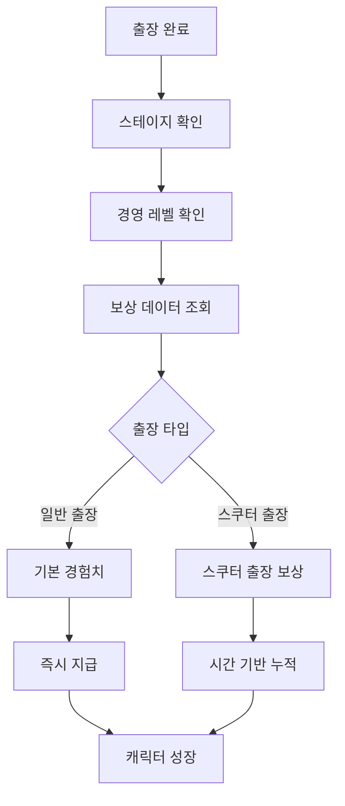

**TrainingRewardLogic 보상 관리:**
- **스테이지별 조정**: 현재 스테이지에 맞는 적절한 보상
- **경영 레벨 보정**: 높은 경영 레벨일수록 더 좋은 보상
- **출장 타입별**: 일반/스쿠터 출장에 따른 차등 보상
- **스킬별 특화**: 요리/서빙 스킬에 맞는 전용 보상

### 종합 성과 지표

**출장 성과 측정:**
- **스킬 향상도**: 출장 전후 스킬 레벨 비교
- **경험치 효율**: 투자 대비 획득 경험치  
- **시간 효율**: 소요 시간 대비 성장률
- **비용 효과**: 투자 비용 대비 장기 수익성

## 전략적 가치

### 직원 성장 가속화

**체계적 성장 관리:**
- **맞춤형 출장**: 직원 개별 특성에 맞는 출장 선택
- **균형 잡힌 발전**: 요리/서빙 스킬의 조화로운 성장  
- **전문화 지원**: 특정 분야의 심화 출장 가능
- **팀 시너지**: 다양한 스킬 조합으로 팀 효율 극대화

### 게임플레이 깊이 증가

**전략적 의사결정:**
- **리소스 관리**: 한정된 토큰의 효율적 활용
- **위험 관리**: 안전한 출장 vs 고위험 고수익
- **시간 계획**: 단기 성장 vs 장기 투자 전략
- **정보 활용**: 힌트 시스템을 통한 정보 우위 확보

## 성능 최적화 및 기술적 고려사항

### 실시간 처리

**스쿠터 출장 타이머:**
- **서버 기반**: 정확한 시간 계산을 위한 서버 처리
- **동기화**: 클라이언트-서버 간 시간 동기화
- **오프라인 보상**: 접속하지 않은 시간의 보상 정산
- **성능 최적화**: 불필요한 업데이트 최소화

### 데이터 일관성

**출장 진행 상태 관리:**
```lua
-- AutoTrainingSlotData.mlua :: ConvertToTable()
result["State"] = self.State
result["RemainDay"] = self.RemainDay
result["ResultMoney"] = self.ResultMoney
result["RewardBoxes"] = _UtilLogic:TableToString(self.RewardBoxes)
```

**백업 및 복구:**
- **주기적 저장**: 출장 진행 상황 자동 백업
- **데이터 검증**: 로드 시 데이터 무결성 확인
- **복구 메커니즘**: 데이터 손실 시 자동 복구

## 코드 참조

### 핵심 출장 관리
- `RootDesk/MyDesk/06. Training/PlayerTrainingManager.mlua :: SendChuChu()` — 캐릭터 스팟 진입 처리
- `RootDesk/MyDesk/06. Training/PlayerTrainingManager.mlua :: OnSelectLastSpot()` — 최종 스팟 선택
- `RootDesk/MyDesk/06. Training/PlayerTrainingManager.mlua :: LoadConfigData()` — 설정 데이터 로드

### 스팟 및 환경 관리
- `RootDesk/MyDesk/06. Training/SpotComponent.mlua :: OnBeginPlay()` — 스팟 초기화
- `RootDesk/MyDesk/06. Training/SpotComponent.mlua :: AddHintIcon()` — 힌트 아이콘 추가
- `RootDesk/MyDesk/06. Training/SpotComponent.mlua :: BigBounceSpot()` — 스팟 강조 효과

### 캐릭터 제어
- `RootDesk/MyDesk/06. Training/TrainingChar.mlua :: OnEnterSpot()` — 스팟 진입 처리
- `RootDesk/MyDesk/06. Training/TrainingChar.mlua :: Emotion()` — 감정 애니메이션
- `RootDesk/MyDesk/06. Training/TrainingChar.mlua :: FindHint()` — 힌트 발견 처리

### 스쿠터 출장 시스템
- `RootDesk/MyDesk/06. Training/AutoTrainingSlotData.mlua :: ConvertToTable()` — 데이터 직렬화
- `RootDesk/MyDesk/06. Training/AutoTrainingTruckSlot.mlua :: ChangeUIOnState()` — 상태별 UI 변경
- `RootDesk/MyDesk/06. Training/AutoTrainingTruckSlot.mlua :: SwitchLockPanel()` — 잠금 상태 처리

### 보상 시스템
- `RootDesk/MyDesk/06. Training/TrainingExpRewardData.mlua :: Load()` — 보상 데이터 로드
- `RootDesk/MyDesk/06. Training/TrainingRewardLogic.mlua` — 보상 로직 관리

### UI 관리
- `RootDesk/MyDesk/06. Training/UITraining.mlua` — 메인 출장 UI
- `RootDesk/MyDesk/06. Training/UITrainingSetting.mlua` — 출장 설정 UI
- `RootDesk/MyDesk/06. Training/TrainingUIStateEnum.mlua` — UI 상태 열거형

### 고객 시뮬레이션
- `RootDesk/MyDesk/06. Training/TrainingCustomerComponent.mlua` — 출장 고객 관리

---

이 문서는 츄츄버거 직원 출장 시스템의 모든 측면을 상세히 다룹니다. 일반 출장과 스쿠터 출장 시스템이 어떻게 연동되어 플레이어의 직원들을 체계적으로 성장시키고, 전략적 깊이와 재미를 동시에 제공하는지 이해할 수 있습니다.
