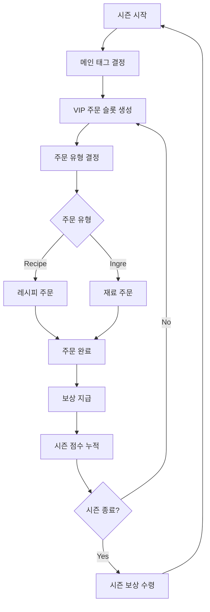
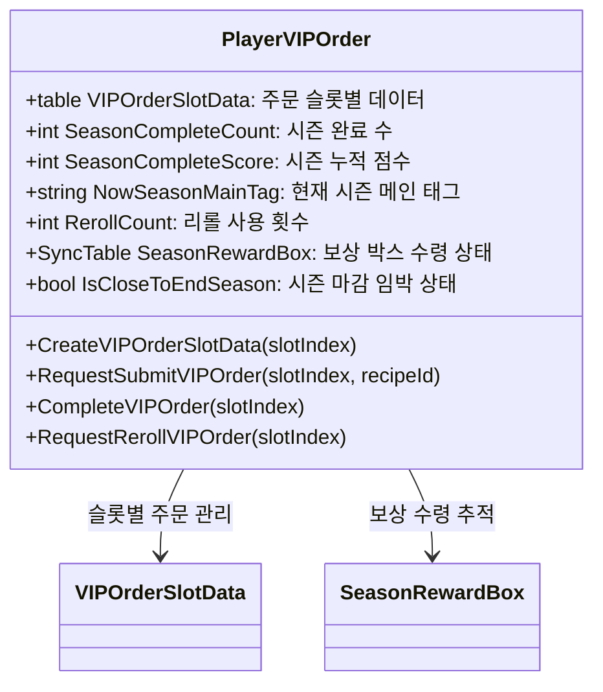

# VIP 주문 시스템

## 시스템 개요

츄츄버거 VIP 주문 시스템은 시즌별로 운영되는 고급 콘텐츠로, 플레이어가 특별한 레시피나 재료 요구사항을 만족시켜 높은 보상을 획득할 수 있는 시스템입니다. 이 시스템은 `PlayerVIPOrder` 컴포넌트를 중심으로 관리되며, 정기적으로 새로운 시즌이 시작되어 지속적인 도전과 목표를 제공합니다.

## 시즌 기반 운영 시스템

### 시즌 구조


### 시즌 일정 관리
```lua
-- VIPOrderDataSetLogic.mlua
property table SeasonStartMonths = {3, 9}  -- 3월, 9월 시즌 시작
```

**시즌 특징:**
- **시작 시기**: 매년 3월, 9월에 새로운 시즌 시작
- **메인 태그**: 각 시즌마다 특정 재료 태그가 주요 테마로 설정
- **기간 제한**: 시즌별로 정해진 기간 내에 목표 달성 필요
- **누적 진행**: 시즌 내에서 완료한 주문 수와 점수가 누적

## PlayerVIPOrder 관리 시스템

### 핵심 데이터 구조


### 주요 속성 설명

**VIPOrderSlotData**: 3개 슬롯의 주문 정보 저장
```lua
-- PlayerVIPOrder.mlua :: CreateVIPOrderSlotData()
property table VIPOrderSlotData = {}  -- 슬롯별 주문 데이터
```

**시즌 진행 추적**:
- `SeasonCompleteCount`: 완료한 VIP 주문 수량
- `SeasonCompleteScore`: 보상 수령을 위한 점수 누적
- `NowSeasonMainTag`: 시즌의 주요 재료 태그

**상태 관리**:
- `IsCloseToEndSeason`: 시즌 마감 임박 알림
- `IsFirstEnterUI`: 초회 진입 튜토리얼 처리
- `RerollCount`: 주문 재생성 사용 횟수

## 주문 유형 시스템

### VIP 주문 타입
```lua
-- VIPOrderTypeEnum.mlua
property string Recipe = "Recipe"    -- 레시피 주문
property string Ingre = "Ingre"      -- 재료 주문  
property string Waiting = "Waiting"  -- 대기 상태
property string Complete = "Complete" -- 완료 상태
```

### 레시피 주문 (Recipe Order)

플레이어가 특정 조건을 만족하는 레시피를 제작하여 제출하는 주문입니다.

**주문 생성 과정:**
```lua
-- PlayerVIPOrder.mlua :: CreateVIPOrderSlotData()
local getOrderType = function()
    local recipeWeight = 1
    local ingreWeight = 2
    -- 재료 주문이 2배 더 자주 등장
end
```

**레시피 주문 조건:**
- **메인 태그 포함**: 시즌 메인 태그가 반드시 포함되어야 함
- **재료 개수**: 3-4개의 특정 재료 사용 요구
- **맛 등급**: 최소 맛 등급 이상 달성 필요
- **밸런스 조건**: 특정 밸런스 범위 충족

**추가 보상 시스템:**
```lua
-- PlayerVIPOrder.mlua :: RequestSubmitVIPOrder()
if orderTasteGrade < recipeTasteGrade then
    local gap = math.floor(recipeTasteGrade - orderTasteGrade)
    if gap > 3 then gap = 3 end
    self.SeasonCompleteScore += _GetConfigDataLogic:GetConfigNumDataByKey("VIPOrderScoreExtraReward"..gap)
end
```

요구 등급보다 높은 품질의 레시피 제출 시 추가 점수 획득이 가능합니다.

### 재료 주문 (Ingredient Order)

특정 재료를 일정 수량 제출하는 단순한 주문입니다.

**재료 주문 특징:**
- **주요 태그 우선**: 시즌 메인 태그 재료가 주로 요구됨
- **등급별 차등**: 높은 등급 재료일수록 적은 수량 요구
- **즉시 완료**: 재료 소모 후 바로 보상 지급

**재료 선택 로직:**
```lua
-- VIPOrderDataSetLogic.mlua :: ReturnIngreType()
local mainTagWeight = 1    -- 메인 태그 가중치
local otherTagWeight = 0   -- 다른 태그는 거의 선택되지 않음
```

## 보상 시스템

### 개별 주문 보상
각 VIP 주문 완료 시 지급되는 기본 보상입니다.

**보상 계산:**
```lua
-- PlayerVIPOrder.mlua :: CompleteVIPOrder()
local rewardTable = _VIPOrderDataSetLogic:ReturnVIPOrderReward(self.VIPOrderSlotData[slotIndex], self.Entity)
self.Entity.PlayerInventory:AddItems(rewardTable, "VIPOrder Complete", "VIPOrder Panel")
```

**보상 유형:**
- **평판 포인트**: 가게 평판 상승
- **점수**: 시즌 보상 해금용 점수
- **재화**: 골드, 하트 등 기본 재화
- **특별 아이템**: 시즌별 특수 보상

### 시즌 보상 시스템

시즌 기간 동안 누적한 완료 수와 점수에 따라 단계별 보상을 제공합니다.

**시즌 보상 구조:**
```lua
-- VIPOrderSeasonRewardData.mlua
property integer ManagementLevel = 0     -- 경영 레벨별 차등
property table SeasonRewardData = {}     -- 완료 수별 보상 데이터
```

**보상 단계:**
1. **5개 완료**: 기본 보상
2. **10개 완료**: 중간 보상  
3. **15개 완료**: 고급 보상
4. **20개 완료**: 최고 보상

**경영 레벨 연동:**
플레이어의 경영 레벨에 따라 동일한 완료 수라도 더 좋은 보상을 받을 수 있습니다.

### 추가 점수 시스템

요구 조건보다 높은 품질의 레시피 제출 시 보너스 점수를 획득합니다.

**점수 계산:**
- **1등급 차이**: 소량 보너스 점수
- **2등급 차이**: 중간 보너스 점수  
- **3등급 이상**: 최대 보너스 점수

## 리롤 및 리셋 시스템

### 주문 리롤 (Reroll)

마음에 들지 않는 주문을 새로운 주문으로 바꿀 수 있는 기능입니다.

**리롤 처리:**
```lua
-- PlayerVIPOrder.mlua :: RequestRerollVIPOrder()
self.RerollCount += 1
self:CreateVIPOrderSlotData(slotIndex, true, "2")  -- 기존 데이터 참고하여 새 주문 생성
```

**리롤 특징:**
- **비용 증가**: 리롤 횟수에 따라 비용 점증
- **차별화**: 기존 주문과 다른 조건의 새 주문 생성
- **제한**: 시즌당 리롤 사용 횟수 제한

### 시즌 리셋

시즌 종료 시 모든 진행도가 초기화되고 새로운 시즌이 시작됩니다.

**리셋 항목:**
- 주문 슬롯 데이터 초기화
- 완료 수 카운터 리셋
- 점수 누적치 리셋  
- 새로운 메인 태그 설정

## UI 시스템

### UIVIPOrderPanel - 메인 UI

VIP 주문의 전체적인 상태를 표시하는 메인 인터페이스입니다.

**주요 구성 요소:**
```lua
-- UIVIPOrderPanel.mlua
property SyncTable<integer, Entity> VIPOrderSlot  -- 3개 주문 슬롯
property UIVIPOrderSeasonInfo SeasonInfo          -- 시즌 정보
property TextComponent VIPOrderCountText          -- 완료 수 표시
```

**기능:**
- **주문 슬롯 표시**: 3개 슬롯의 주문 상태 시각화
- **시즌 정보**: 현재 시즌 진행도 및 남은 시간
- **완료 통계**: 총 완료 수와 획득 점수
- **보상 미리보기**: 다음 단계 보상 확인

### 주문 슬롯 UI

각 개별 주문의 상세 정보를 표시하는 UI입니다.

**표시 정보:**
- **주문 타입**: 레시피 vs 재료 아이콘
- **요구 조건**: 구체적인 재료나 조건 표시  
- **진행 상태**: 완료/대기/진행중 상태
- **보상 미리보기**: 완료 시 획득 가능한 보상

### 시즌 정보 UI

**UIVIPOrderSeasonInfo** 컴포넌트가 시즌별 정보를 관리합니다:

- **시즌 테마**: 메인 태그에 따른 시각적 테마
- **진행도**: 현재 완료 수 / 목표 수  
- **타이머**: 시즌 종료까지 남은 시간
- **보상 상태**: 수령 가능한 시즌 보상 표시

## 게임플레이 전략

### 효율적인 VIP 주문 공략

**1. 시즌 메인 태그 파악**
- 시즌 시작 시 메인 태그를 확인하여 해당 재료 중심으로 준비
- 메인 태그 재료를 충분히 보유하여 재료 주문에 대비

**2. 레시피 주문 대응**
- 다양한 등급의 재료 조합으로 고품질 레시피 제작
- 요구 조건보다 높은 등급 달성으로 보너스 점수 획득

**3. 리롤 활용**
- 완료하기 어려운 주문은 적절히 리롤 활용
- 비용 대비 효율을 고려한 선택적 리롤 사용

## 성능 최적화 및 기술적 고려사항

### 데이터 동기화

VIP 주문 시스템의 중요한 데이터는 클라이언트와 실시간 동기화됩니다:

**동기화 데이터:**
```lua
@TargetUserSync property integer SeasonCompleteCount
@TargetUserSync property integer SeasonCompleteScore  
@TargetUserSync property string NowSeasonMainTag
@TargetUserSync property SyncTable<integer, boolean> SeasonRewardBox
```

### 로깅 시스템

모든 VIP 주문 활동은 상세하게 기록됩니다:

```lua
-- PlayerVIPOrder.mlua :: CompleteVIPOrder()
self.Entity.PlayerLog:VIPOrderFlow(orderType, slotIndex, rewardData)
```

**기록 내용:**
- 주문 유형 및 완료 시간
- 제출한 레시피 또는 재료 정보  
- 획득한 보상 내역
- 보너스 점수 획득 여부

### 튜토리얼 연동

신규 플레이어를 위한 단계별 안내가 제공됩니다:

```lua  
-- UIVIPOrderPanel.mlua :: Open()
_TutorialManager:SendTutorialTriggerEvent(_TutorialEventEnum.VIPOrderEnter)
_UserService.LocalPlayer.PlayerAchievement:RequestChangeProgress(_TutorialAchievementTypeEnum.VIPOrderUIEnter, 1)
```

## 경제적 영향

### 게임 경제에서의 역할

**1. 고급 재료 소비처**
- 높은 등급의 재료에 대한 지속적인 수요 창출
- 재료 가차 시스템과 연동하여 과금 유도

**2. 장기적 목표 제공**  
- 시즌별 보상을 통한 지속적인 플레이 동기 부여
- 경영 레벨과 연동하여 성장 실감 제공

**3. 전략적 깊이 증가**
- 단순한 매출 추구를 넘어선 품질 경쟁 유도
- 리소스 관리의 전략적 중요성 강화

## 코드 참조

### 핵심 시스템
- `RootDesk/MyDesk/00. Player/PlayerVIPOrder.mlua :: CreateVIPOrderSlotData()` — VIP 주문 생성 로직
- `RootDesk/MyDesk/00. Player/PlayerVIPOrder.mlua :: RequestSubmitVIPOrder()` — 주문 제출 처리
- `RootDesk/MyDesk/00. Player/PlayerVIPOrder.mlua :: CompleteVIPOrder()` — 주문 완료 및 보상 지급
- `RootDesk/MyDesk/00. Player/PlayerVIPOrder.mlua :: RequestRerollVIPOrder()` — 주문 리롤 처리

### 데이터 관리
- `RootDesk/MyDesk/04. Recipe/VIPOrder/VIPOrderDataSetLogic.mlua :: ReturnRecipeOrderData()` — 레시피 주문 데이터 생성
- `RootDesk/MyDesk/04. Recipe/VIPOrder/VIPOrderDataSetLogic.mlua :: ReturnIngreOrderData()` — 재료 주문 데이터 생성
- `RootDesk/MyDesk/04. Recipe/VIPOrder/VIPOrderSeasonRewardData.mlua :: Load()` — 시즌 보상 데이터 로드

### UI 시스템
- `RootDesk/MyDesk/04. Recipe/VIPOrder/UIVIPOrderPanel.mlua :: Open()` — VIP 주문 UI 열기
- `RootDesk/MyDesk/04. Recipe/VIPOrder/UIVIPOrderPanel.mlua :: Refresh()` — UI 갱신
- `RootDesk/MyDesk/04. Recipe/VIPOrder/UIVIPOrderSeasonInfo.mlua` — 시즌 정보 UI 관리
- `RootDesk/MyDesk/04. Recipe/VIPOrder/UIVIPOrderSlot.mlua` — 개별 주문 슬롯 UI

### 보상 및 결과 처리
- `RootDesk/MyDesk/04. Recipe/VIPOrder/VIPOrderResultRenderLogic.mlua` — 결과 렌더링 로직
- `RootDesk/MyDesk/04. Recipe/VIPOrder/UIVIPOrderScoreExtraReward.mlua` — 보너스 점수 UI 표시

---

이 문서는 츄츄버거 VIP 주문 시스템의 모든 측면을 포괄적으로 다룹니다. 시즌 기반의 진행, 다양한 주문 유형, 보상 시스템, 그리고 전략적 게임플레이 요소가 어떻게 연동되어 플레이어에게 지속적인 도전과 성취감을 제공하는지 이해할 수 있습니다.
