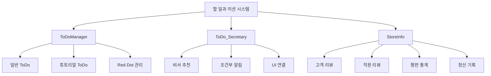
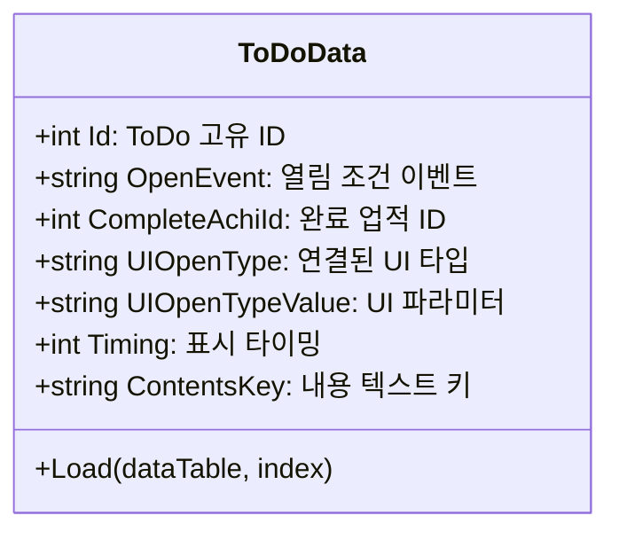
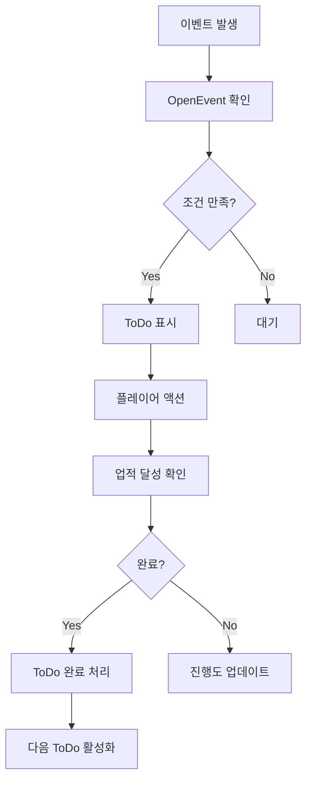
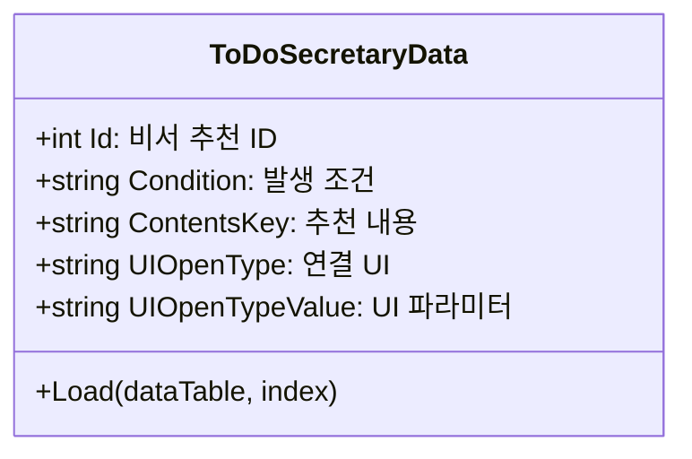
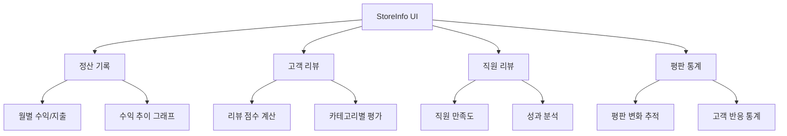
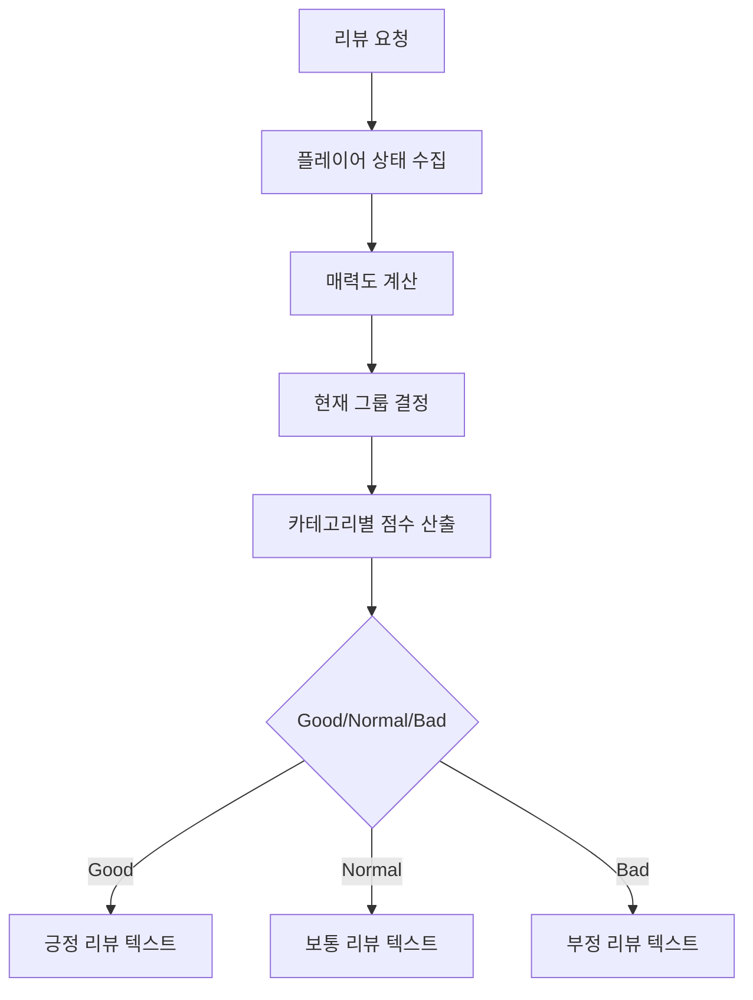
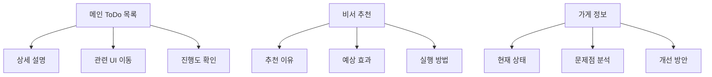

# 할 일과 미션 시스템

## 시스템 개요

츄츄버거 할 일과 미션 시스템은 플레이어에게 명확한 목표와 방향을 제시하는 가이드 시스템입니다. 이 시스템은 **ToDo 시스템**과 **ToDo_Secretary(비서 추천) 시스템**으로 구성되어 있으며, **StoreInfo 시스템**과 연동하여 플레이어의 가게 운영 상태를 종합적으로 모니터링하고 피드백을 제공합니다.



## ToDo 시스템

### ToDoManager - 할 일 목록 관리

할 일 목록의 생성, 갱신, 완료 상태를 총괄 관리하는 핵심 컴포넌트입니다.

**핵심 데이터 구조:**
```lua
-- ToDoManager.mlua
property table ToDoData = {}              -- 일반 ToDo 데이터
property table ToDoSecretaryData = {}     -- 비서 ToDo 데이터
property integer NowToDo = 0              -- 현재 활성 ToDo
property Entity RedDot                    -- Red Dot 알림 표시
```

### 일반 ToDo 시스템

**ToDoData 구조체:**


**ToDo 처리 흐름:**


### 튜토리얼 ToDo 처리

**RefreshTutorialToDoList 로직:**
```lua
-- ToDoManager.mlua :: RefreshTutorialToDoList()
for i = 1, #self.ToDoData do
    local toDoData = self:GetData(i)
    local openEvent = toDoData.OpenEvent
    
    local isEventOccured = _UserService.LocalPlayer.PlayerEvent:IsEventOccured(openEvent)
    if isEventOccured == false then
        continue -- 조건 미만족 시 스킵
    end
        
    local isCompleted = _UserService.LocalPlayer.PlayerAchievement:IsAchievementAchieved(toDoData.CompleteAchiId)
    if isCompleted then
        table.insert(completed, toDoData)    -- 완료된 ToDo
    else
        table.insert(notCompleted, toDoData)  -- 미완료 ToDo
    end
end
```

**표시 우선순위:**
1. **미완료 ToDo**: 상단에 우선 표시
2. **완료된 ToDo**: 하단에 회색으로 표시  
3. **조건 미만족**: 비표시

### Red Dot 알림 시스템

**RedDotManager와 연동:**
```lua
-- ToDoManager.mlua :: SetRedDot()
local hasNewToDo = self:HasNewToDo()
self.RedDot.Enable = hasNewToDo
_MainMenuRedDotManager:EnableToDoRedDot(hasNewToDo)
```

**Red Dot 표시 조건:**
- 새로운 ToDo 등장
- 완료 가능한 ToDo 존재  
- 비서 추천 신규 항목 발생
- 중요한 알림 업데이트

## ToDo_Secretary - 비서 추천 시스템

### 지능형 추천 시스템

비서 시스템은 플레이어의 현재 상태를 분석하여 적절한 행동을 추천하는 AI 기반 가이드입니다.

**ToDoSecretaryData 구조:**


### 조건별 비서 추천

**추천 발생 조건 (IsToDoSecretaryOccured 함수):**

**1. 업그레이드 추천 (RecommendedUpgrade)**
```lua
-- ToDoManager.mlua :: IsToDoSecretaryOccured()
if secData.Condition == "RecommendedUpgrade" then
    local upgradeList = _UpgradeDataSetLogic:ReturnTabDatas(0, player)
    if #upgradeList > 0 then
        for i = 1, #upgradeList do
            local upgradeLevel = _UpgradeDataSetLogic:ReturnCurrentPlayerLevel(player, upgradeId)
            local levelData = _UpgradeDataSetLogic:GetLevelData(upgradeId, upgradeLevel+1)
            if player.PlayerInventory.Money >= levelData:GetUpgradeCost(player) then
                return true -- 구매 가능한 업그레이드 존재
            end
        end
    end
end
```

**2. 직원 관련 추천 (Employment/EmployeeDeploy)**
- **Employment**: 신규 직원 고용 추천
- **EmployeeDeploy**: 직원 배치 최적화 추천

**3. 기타 상황별 추천:**
- **VIPOrderCount**: VIP 주문 완료 수 관련
- **VIPOrderSeasonReward**: VIP 시즌 보상 수령 
- **TrialParticipation**: 대회 참여 권장
- **ResourceManagement**: 재료/재화 관리 조언

### 비서 UI 연동

**RefreshSecretary 처리:**
```lua
-- UIToDoItemRenderer.mlua :: RefreshSecretary()
self.Id = secData.Id
self.Contents.Text = _GetLocalizationTextLogic:GetText(secData.ContentsKey)
self.New.Enable = not isChecked           -- 미확인 시 NEW 표시
local menuData = _MainMenuDataSetLogic:GetMenuBtnData(secData.UIOpenType)
self.MenuIcon.ImageRUID = menuData.IconRUID  -- 관련 UI 아이콘 표시
```

**기능:**
- **내용 표시**: 구체적인 추천 사항과 이유
- **UI 연결**: 터치 시 관련 화면으로 바로 이동  
- **상태 관리**: 확인/미확인 상태 추적
- **아이콘 표시**: 연결된 기능의 아이콘 시각화

## StoreInfo - 가게 정보 시스템

### 종합 정보 대시보드

가게의 전반적인 상태와 성과를 다각도로 분석하여 제공하는 정보 센터입니다.

**UIStoreInfo 구조:**


### 고객 리뷰 시스템

**CustomerReviewData 기반 평가:**
```lua
-- StoreInfoDataSetLogic.mlua :: ReturnPlayerScoreByCustomerReviewId()
-- 매력도 계산: 레시피 + 시설
local recipeAttractive = player.CustomerManager:CalcAttractiveRecipe()
local storeAttractiveExpansion = player.CustomerManager:CalcAttractiveExpension()
local storeAttractiveInterior = player.CustomerManager:CalcAttractiveInterior() 
local storeAttractiveDeco = player.CustomerManager:CalacAttractiveDeco()

local playerTotalAttractive = recipeAttractive + storeAttractive
```

**리뷰 카테고리:**
- **Store**: 가게 시설 및 환경 평가
- **Recipe**: 메뉴 품질 및 다양성 평가  
- **Service**: 서비스 속도 및 품질 평가
- **Price**: 가격 대비 만족도 평가

**리뷰 점수 계산:**


### 직원 리뷰 시스템

**UIEmployeeReview 기능:**
- **개별 직원 평가**: 각 직원의 성과와 만족도
- **팀 전체 분석**: 직원 구성의 효율성 검토
- **개선 제안**: 직원 관리 최적화 방안 제시

**직원 평가 지표:**
- **작업 효율성**: 작업 완료 시간 및 품질
- **성장 가능성**: 레벨업 및 스킬 발전 정도  
- **팀워크**: 다른 직원들과의 협력도
- **고객 만족**: 직원별 고객 피드백

### 평판 통계 시스템

**UIReputationReview 분석:**
```lua
-- UIReputationStat.mlua
property SyncTable<integer, Entity> StatSlots  -- 통계 슬롯들
property Entity GraphContainer                  -- 그래프 컨테이너
```

**평판 분석 항목:**
- **평판 변화 추이**: 일간/주간/월간 평판 변화 그래프
- **원인 분석**: 평판 상승/하락의 주요 원인 파악
- **고객 분포**: 방문 고객의 만족도 분포  
- **개선 포인트**: 평판 향상을 위한 구체적 방안

## 연동 시스템

### PlayerEvent 연동

**이벤트 기반 갱신:**
```lua
-- PlayerEvent.mlua :: OnSyncProperty()  
if name == "Events" then
    _ToDoManager:RefreshToDoList()      -- 이벤트 변화 시 ToDo 갱신
    _UIButtonUnlockLogic:SetButtonsUnlock()  -- 버튼 해금 처리
end
```

### Red Dot 통합 관리

**MainMenuRedDotManager와 연동:**
- **ToDo 알림**: 새로운 할 일 등장 시  
- **Secretary 알림**: 비서 추천 업데이트 시
- **StoreInfo 알림**: 중요한 리뷰나 통계 변화 시
- **Achievement 연동**: 업적 달성과 연계된 ToDo 활성화

### 업적 시스템 연동

**AchievementLogic 연계:**
```lua
-- ToDoManager.mlua :: RefreshToDoList()
local isCompleted = _UserService.LocalPlayer.PlayerAchievement:IsAchievementAchieved(toDoData.CompleteAchiId)
if isCompleted then
    -- ToDo 완료 처리
else  
    -- 진행중 ToDo로 표시
end
```

## UI/UX 설계

### 접근성 및 사용성

**직관적 네비게이션:**
- **원클릭 이동**: ToDo 항목 터치 시 관련 UI로 바로 이동
- **상태 구분**: 완료/진행중/신규 상태를 색상과 아이콘으로 구분
- **우선순위 표시**: 중요도에 따른 배치 및 강조

**정보 계층화:**


### 피드백 시스템

**즉시 반응:**
- **완료 시 애니메이션**: ToDo 완료 시 만족감을 주는 시각 효과
- **진행도 표시**: 복잡한 목표의 단계별 진행 상황 시각화
- **성과 하이라이트**: 특별한 달성이나 개선사항 강조

**지속적 개선:**
- **패턴 학습**: 플레이어의 행동 패턴을 분석하여 추천 정확도 향상
- **개인화**: 플레이어의 플레이 스타일에 맞는 맞춤형 조언
- **적응형 난이도**: 플레이어 수준에 맞는 적절한 목표 제시

## 성능 최적화

### 데이터 관리

**효율적 로딩:**
```lua
-- ToDoManager.mlua :: LoadDataSet()
table.clear(self.ToDoData)
local dataSet = _DataService:GetTable("EventToDoData")
-- CSV 데이터를 구조화된 객체로 변환
```

**메모리 사용 최적화:**
- **지연 로딩**: 필요한 시점에 상세 데이터 로드
- **캐싱 전략**: 자주 참조되는 데이터의 메모리 캐싱
- **가비지 컬렉션**: 사용 완료된 데이터의 적절한 해제

### 실시간 업데이트

**이벤트 기반 갱신:**
- **조건부 체크**: 변화가 있는 경우만 재계산 실행  
- **배치 처리**: 여러 변경사항을 한 번에 처리
- **우선순위 큐**: 중요도에 따른 업데이트 순서 관리

## 전략적 가치

### 플레이어 가이드

**학습 곡선 완화:**
- **단계별 안내**: 복잡한 시스템을 단계적으로 소개
- **맥락적 도움**: 현재 상황에 맞는 구체적인 조언
- **실수 방지**: 일반적인 실수나 비효율적 행동에 대한 경고

### 장기적 참여 유도

**목표 제시:**
- **단기 목표**: 즉시 달성 가능한 작은 성취감 제공
- **중기 목표**: 몇 일에서 일주일 정도의 진행 목표  
- **장기 비전**: 게임의 최종 목표와 연결된 큰 그림 제시

**성장 실감:**
- **성과 추적**: 플레이어의 발전 상황을 객관적 지표로 제시
- **비교 분석**: 과거 자신과의 비교를 통한 성장 확인
- **마일스톤 표시**: 중요한 발전 단계 도달 시 특별한 피드백

## 코드 참조

### 핵심 ToDo 시스템
- `RootDesk/MyDesk/01. Lobby/ToDo/ToDoManager.mlua :: RefreshToDoList()` — ToDo 목록 갱신
- `RootDesk/MyDesk/01. Lobby/ToDo/ToDoManager.mlua :: RefreshTutorialToDoList()` — 튜토리얼 ToDo 처리
- `RootDesk/MyDesk/01. Lobby/ToDo/ToDoManager.mlua :: RefreshSecretaryToDoList()` — 비서 추천 갱신
- `RootDesk/MyDesk/01. Lobby/ToDo/ToDoData.mlua :: Load()` — ToDo 데이터 구조체

### 비서 추천 시스템
- `RootDesk/MyDesk/01. Lobby/ToDo/ToDoManager.mlua :: IsToDoSecretaryOccured()` — 비서 추천 조건 확인
- `RootDesk/MyDesk/01. Lobby/ToDo_Secretary/ToDoSecretaryData.mlua` — 비서 데이터 구조체
- `RootDesk/MyDesk/01. Lobby/ToDo/UIToDoItemRenderer.mlua :: RefreshSecretary()` — 비서 UI 갱신

### 가게 정보 시스템
- `RootDesk/MyDesk/01. Lobby/StoreInfo/StoreInfoDataSetLogic.mlua :: ReturnPlayerScoreByCustomerReviewId()` — 리뷰 점수 계산
- `RootDesk/MyDesk/01. Lobby/StoreInfo/UIStoreInfo.mlua :: Open()` — 가게 정보 UI 열기
- `RootDesk/MyDesk/01. Lobby/StoreInfo/UICustomerReview.mlua :: Refresh()` — 고객 리뷰 갱신
- `RootDesk/MyDesk/01. Lobby/StoreInfo/UIEmployeeReview.mlua` — 직원 리뷰 관리

### 리뷰 데이터 관리
- `RootDesk/MyDesk/01. Lobby/StoreInfo/CustomerReviewData.mlua :: Load()` — 고객 리뷰 데이터 로드
- `RootDesk/MyDesk/01. Lobby/StoreInfo/UIReputationReview.mlua` — 평판 리뷰 UI
- `RootDesk/MyDesk/01. Lobby/StoreInfo/UIReputationStat.mlua` — 평판 통계 표시

### Red Dot 및 알림
- `RootDesk/MyDesk/01. Lobby/ToDo/ToDoManager.mlua :: SetRedDot()` — Red Dot 상태 관리
- `RootDesk/MyDesk/Common/UI/MainMenuRedDotManager.mlua` — 메인 메뉴 알림 통합 관리

---

이 문서는 츄츄버거 할 일과 미션 시스템의 포괄적인 구조와 기능을 설명합니다. ToDo 시스템, 비서 추천 시스템, 가게 정보 시스템이 어떻게 연동되어 플레이어에게 지속적인 가이드와 피드백을 제공하는지 이해할 수 있습니다.
