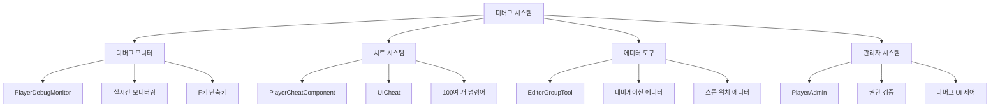

# 디버그와 치트

츄츄버거는 개발 및 테스트 효율성을 극대화하기 위해 포괄적인 디버그 도구와 치트 시스템을 제공합니다. 이 시스템은 실시간 모니터링, 100여 개의 치트 명령어, 에디터 확장 도구, 관리자 권한 시스템으로 구성되어 있습니다.

## 디버그 시스템 개요

### 핵심 디버그 아키텍처



## PlayerDebugMonitor 실시간 모니터링

### F키 기반 디버그 모니터

개발자가 F키를 사용하여 각종 게임 시스템의 실시간 상태를 모니터링할 수 있는 시스템입니다.

```lua
-- PlayerDebugMonitor.mlua :: HandleKeyDownEvent()
@ExecSpace("ClientOnly")
@EventSender("Service", "InputService")
handler HandleKeyDownEvent(KeyDownEvent event)
    local key = event.key
    
    -- 관리자 권한 확인
    if not _UserService.LocalPlayer.PlayerCheatComponent:HasAuthority() then
        return
    end
    
    if key == KeyboardKey.F3 then
        -- 디버그 타이머 토글
        if isvalid(self.DebugTimer) then
            if self.DebugTimer.Enable ~= true then
                self.DebugTimer.DebugTimer:Init()
            else
                self.DebugTimer.Enable = false
            end	
        end
        
    elseif key == KeyboardKey.F4 then
        -- 레시피 모니터 토글 (레시피 제작 중일 때만)
        if isvalid(self.RecipeInfoMonitor) then
            if not (_UIGroupManager.RecipeGroup.Enable == true and 
                    _UIEntityLogic_RecipeGroup.UIRecipeMaking.Enable == true) then
                return
            end
            
            self.RecipeInfoMonitor.Enable = not self.RecipeInfoMonitor.Enable
            if self.RecipeInfoMonitor.Enable == true then
                self.RecipeInfoMonitor.UIRecipeDebug:OpenTab("Making")
            end
        end
        
    elseif key == KeyboardKey.F5 then
        -- 상점 정보 모니터 토글
        if isvalid(self.StoreInfoMonitor) then
            if self.StoreInfoMonitor.Enable == false then
                self:EnableStoreInfoMonitor(true)
            else
                self:EnableStoreInfoMonitor(false)
            end
        end
        
    elseif key == KeyboardKey.F6 then
        -- 고객 정보 모니터 토글
        if isvalid(self.CustomerInfoMonitor) then
            if self.CustomerInfoMonitor.Enable == false then
                self:EnableCustomerInfoMonitor(true)
            else
                self:EnableCustomerInfoMonitor(false)
            end
        end
        
    elseif key == KeyboardKey.F9 then
        -- 직원 정보 모니터 토글
        if isvalid(self.EmployeeInfoMonitor) then
            if self.EmployeeInfoMonitor.Enable == false then
                self:EnableEmployeeInfoMonitor(true)
            else
                self:EnableEmployeeInfoMonitor(false)
            end
        end
    end
end
```

#### 디버그 모니터 단축키 맵

| 키 | 모니터 | 기능 |
|---|---|---|
| **F3** | DebugTimer | 개발자용 타이머 |
| **F4** | RecipeInfoMonitor | 레시피 제작 정보 (제작 중일 때만) |
| **F5** | StoreInfoMonitor | 상점 정보 |
| **F6** | CustomerInfoMonitor | 고객 정보 |
| **F7** | (예약됨) | |
| **F8** | (예약됨) | |
| **F9** | EmployeeInfoMonitor | 직원 정보 |
| **Comma (,)** | MaintainInfoMonitor | 유지비 정보 |
| **Period (.)** | SpawnPoolMonitor | 스폰 풀 정보 |

### 레시피 디버그 모니터

레시피 제작 중에 실시간으로 밸런스 정보를 표시하는 시스템입니다.

```lua
-- UIRecipeDebug.mlua :: 실시간 레시피 정보 표시
method void UpdateRecipeInfo()
    local currentRecipe = _PlayerRecipe.CurrentRecipe
    if currentRecipe == nil then
        return
    end
    
    -- 밸런스 정보 표시
    local balance = currentRecipe:GetBalance()
    local spiciness = currentRecipe:GetSpiciness()
    local taste = currentRecipe:GetTasteScore()
    local price = currentRecipe:GetPrice()
    
    -- UI 업데이트
    self.BalanceText.text = string.format("Balance: %.2f", balance)
    self.SpicinessText.text = string.format("Spiciness: %.2f", spiciness)
    self.TasteText.text = string.format("Taste: %.2f", taste)
    self.PriceText.text = string.format("Price: %d", price)
    
    -- 태그 정보
    local tags = currentRecipe:GetTags()
    local tagText = table.concat(tags, ", ")
    self.TagText.text = "Tags: " .. tagText
    
    -- 콤보 정보
    local combos = currentRecipe:GetCombos()
    local comboText = table.concat(combos, ", ")
    self.ComboText.text = "Combos: " .. comboText
end
```

### 고객 정보 모니터

현재 가게에 있는 모든 고객의 상태를 실시간으로 표시합니다.

```lua
-- DebugMonitorUICustomer.mlua :: 고객 정보 업데이트
method void UpdateCustomerInfo()
    local customers = _CustomerManager.ActiveCustomers
    
    for i, customer in ipairs(customers) do
        local customerInfo = string.format(
            "Customer %d: State=%s, Order=%s, Wait=%.1fs, Patience=%.1f%%",
            i,
            customer.State,
            customer.OrderName or "None",
            customer.WaitTime,
            customer.Patience * 100
        )
        
        self:SetCustomerInfoText(i, customerInfo)
    end
end
```

### 직원 정보 모니터

모든 직원의 작업 상태와 효율성을 모니터링합니다.

```lua
-- DebugMonitorUIEmployee.mlua :: 직원 정보 업데이트
method void UpdateEmployeeInfo()
    local employees = _EmployeeManager.ActiveEmployees
    
    for i, employee in ipairs(employees) do
        local employeeInfo = string.format(
            "Employee %d: Type=%s, State=%s, Level=%d, Efficiency=%.2f",
            i,
            employee.Type,
            employee.CurrentState,
            employee.Level,
            employee:GetEfficiency()
        )
        
        self:SetEmployeeInfoText(i, employeeInfo)
    end
end
```

### 스폰 풀 모니터

고객 스폰 데이터를 페이지네이션으로 표시하는 모니터입니다.

```lua
-- DebugMonitorSpawnPool.mlua :: 스폰 풀 정보 표시
method void UpdateSpawnPoolInfo()
    local spawnData = _CustomerManager.SpawnPool
    local currentPage = self.CurrentPage
    local itemsPerPage = 10
    
    local startIndex = (currentPage - 1) * itemsPerPage + 1
    local endIndex = math.min(startIndex + itemsPerPage - 1, #spawnData)
    
    for i = startIndex, endIndex do
        local data = spawnData[i]
        local info = string.format(
            "Group:%s Orders:%d Attractive:%d Tags:%s Tip:%d ID:%s",
            data.Group,
            data.OrderCount,
            data.RequiredAttractive,
            data.TargetTags,
            data.Tip,
            data.UniqueId
        )
        
        self:SetSpawnInfoText(i - startIndex + 1, info)
    end
end
```

## PlayerCheatComponent 치트 시스템

### 치트 명령어 등록 시스템

100여 개의 치트 명령어를 체계적으로 관리하는 시스템입니다.

```lua
-- PlayerCheatComponent.mlua :: OnBeginPlay()
method void OnBeginPlay()
    self.UserId = self.Entity.PlayerComponent.UserId
    
    -- 재화 관련 치트들
    self:RegisterCheat("GainDiamondFree", "무료 다이아를 획득합니다. 첫번째 인자에 해당 값을 입력합니다. 음수의 경우 무료+유료 다이아를 소모합니다.", self.GainDiamondFree)
    self:RegisterCheat("GainDiamondPaid", "유료 다이아를 획득합니다. 첫번째 인자에 해당 값을 입력합니다. 음수의 경우 유료 다이아를 소모합니다.", self.GainDiamondPaid)
    self:RegisterCheat("GainMeso", "돈을 획득합니다. 첫번째 인자에 해당 메소를 입력합니다. 음수의 경우 메소를 소모합니다.", self.GainMeso)
    self:RegisterCheat("GainClover", "크로버를 획득합니다. 첫번째 인자에 해당 아케인 심볼을 입력합니다. 음수의 경우 아케인 심볼을 소모합니다.", self.GainClover)
    self:RegisterCheat("GainHeart", "하트를 획득합니다. 첫번째 인자에 해당 하트를 입력합니다. 음수의 경우 하트를 소모합니다.", self.GainHeart)
    self:RegisterCheat("GainTip", "Tip을 획득합니다. 첫번째 인자에 해당 팁을 입력합니다. 음수의 경우 팁을 소모합니다. 팁 보관함이 1레벨 이상이어야 합니다.", self.GainTip)
    
    -- 아이템 관련 치트들
    self:RegisterCheat("GainItem", "아이템을 획득합니다. 첫번째 인자에 itemID, 두번재 인자에 count 를 입력합니다.", self.GainItem)
    self:RegisterCheat("ClearInventory", "나의 Inventory 를 초기화 합니다.", self.ClearInventory)
    
    -- 직원 관련 치트들
    self:RegisterCheat("AddEmployee", "직원을 추가합니다. 첫번째 인자에 직원 ID를 입력합니다.", self.AddEmployee)
    self:RegisterCheat("RemoveEmployee", "직원을 제거합니다. 첫번째 인자에 직원 ID를 입력합니다.", self.RemoveEmployee)
    self:RegisterCheat("LevelUpEmployee", "직원 레벨을 올립니다. 첫번째 인자에 직원 ID, 두번째 인자에 레벨을 입력합니다.", self.LevelUpEmployee)
    
    -- 레시피 관련 치트들
    self:RegisterCheat("UnlockAllRecipes", "모든 레시피를 해금합니다.", self.UnlockAllRecipes)
    self:RegisterCheat("AddIngredient", "재료를 추가합니다. 첫번째 인자에 재료 ID, 두번째 인자에 수량을 입력합니다.", self.AddIngredient)
    
    -- 게임 상태 조작
    self:RegisterCheat("SetStage", "스테이지를 설정합니다. 첫번째 인자에 스테이지 번호를 입력합니다.", self.SetStage)
    self:RegisterCheat("CompleteAchievement", "업적을 완료합니다. 첫번째 인자에 업적 ID를 입력합니다.", self.CompleteAchievement)
    
    -- 이벤트 및 트렌드 조작
    self:RegisterCheat("StartEvent", "이벤트를 시작합니다. 첫번째 인자에 이벤트 ID를 입력합니다.", self.StartEvent)
    self:RegisterCheat("SetTrend", "트렌드를 설정합니다. 첫번째 인자에 트렌드 ID를 입력합니다.", self.SetTrend)
    
    -- 대회 관련
    self:RegisterCheat("CompleteTrialInstantly", "대회을 즉시 완료합니다.", self.CompleteTrialInstantly)
    self:RegisterCheat("SetTrialScore", "대회 점수를 설정합니다. 첫번째 인자에 점수를 입력합니다.", self.SetTrialScore)
    
    -- 데이터베이스 관련
    self:RegisterCheat("ReloadData", "데이터를 다시 로드합니다.", self.ReloadData)
    self:RegisterCheat("SaveDataNow", "현재 데이터를 즉시 저장합니다.", self.SaveDataNow)
    
    -- 테스트 프리셋
    self:RegisterCheat("ApplyTestPreset", "테스트용 프리셋을 적용합니다. 첫번째 인자에 프리셋 이름을 입력합니다.", self.ApplyTestPreset)
end
```

#### 치트 등록 메커니즘

```lua
-- PlayerCheatComponent.mlua :: RegisterCheat()
method void RegisterCheat(string cheatName, string desc, any func)
    if self:IsClient() then
        -- 클라이언트: UI용 설명 저장
        self.commandToDesc[cheatName] = desc
    else
        -- 서버: 실행용 함수 저장
        local cheatLower = string.lower(cheatName)	
        self.commandToFunc[cheatLower] = func
    end
end
```

### 치트 실행 시스템

```lua
-- PlayerCheatComponent.mlua :: GoCheat()
@ExecSpace("ServerOnly")
method void GoCheat(string command, string op1, string op2, string op3)
    -- 권한 확인
    if self:HasAuthority() == false then
        return
    end
    
    -- 명령어 검색 (대소문자 무시)
    local commandLower = string.lower(command)
    local commandFunc = self.commandToFunc[commandLower]
    
    if commandFunc == nil then
        _UIToast:ShowMessage("There is no cheat", self.UserId)
        return
    end
    
    -- 치트 실행
    commandFunc(self, op1, op2, op3)
end

-- 채팅 메시지 파싱
@ExecSpace("Server")
method void SendCheat(string message)
    local cheatString = {}
    for word in string.gmatch(message, "[^%s/]+") do
        table.insert(cheatString, word)
    end
    
    local header = (#cheatString >= 1) and cheatString[1] or nil
    local param1 = (#cheatString >= 2) and cheatString[2] or nil
    local param2 = (#cheatString >= 3) and cheatString[3] or nil
    local param3 = (#cheatString >= 4) and cheatString[4] or nil
    
    self:GoCheat(header, param1, param2, param3)
end
```

### 주요 치트 명령어 구현

#### 재화 조작 치트

```lua
-- PlayerCheatComponent.mlua :: GainMeso()
@ExecSpace("ServerOnly")
method void GainMeso(string mesoString)
    if _UtilLogic:IsNilorEmptyString(mesoString) then
        _UIToast:ShowMessage("Please input meso amount", self.UserId)
        return
    end
    
    local meso = tonumber(mesoString)
    if meso == nil then
        _UIToast:ShowMessage("Invalid meso amount", self.UserId)
        return
    end
    
    local success = self.Entity.PlayerInventory:ModifyMoney(meso, "Cheat", "CheatSystem")
    if success then
        _UIToast:ShowMessage(string.format("Added %d meso", meso), self.UserId)
    else
        _UIToast:ShowMessage("Failed to modify meso", self.UserId)
    end
end

-- 다이아몬드 조작
@ExecSpace("ServerOnly") 
method void GainDiamondFree(string diamondString)
    local diamond = tonumber(diamondString)
    if diamond == nil then
        _UIToast:ShowMessage("Invalid diamond amount", self.UserId)
        return
    end
    
    self.Entity.PlayerOutgameManager:ModifyDiamond(diamond, false, "Cheat", "CheatSystem")
    _UIToast:ShowMessage(string.format("Added %d free diamond", diamond), self.UserId)
end
```

#### 아이템 조작 치트

```lua
-- PlayerCheatComponent.mlua :: GainItem()
@ExecSpace("ServerOnly")
method void GainItem(string itemId, string countString)
    if _UtilLogic:IsNilorEmptyString(itemId) then
        _UIToast:ShowMessage("Please input item ID", self.UserId)
        return
    end
    
    local count = tonumber(countString) or 1
    
    local result = self.Entity.PlayerInventory:AddItem(itemId, count, "Cheat", "CheatSystem")
    if result == 0 then
        _UIToast:ShowMessage(string.format("Added %d x %s", count, itemId), self.UserId)
    else
        _UIToast:ShowMessage(string.format("Failed to add item: %d", result), self.UserId)
    end
end

-- 인벤토리 초기화
@ExecSpace("ServerOnly")
method void ClearInventory()
    self.Entity.PlayerInventory:ClearItems()
    _UIToast:ShowMessage("Inventory cleared", self.UserId)
end
```

#### 직원 조작 치트

```lua
-- 직원 추가
@ExecSpace("ServerOnly")
method void AddEmployee(string employeeId)
    if _UtilLogic:IsNilorEmptyString(employeeId) then
        _UIToast:ShowMessage("Please input employee ID", self.UserId)
        return
    end
    
    local success = self.Entity.EmployeeManager:AddEmployee(employeeId, 1, "Cheat")
    if success then
        _UIToast:ShowMessage(string.format("Added employee: %s", employeeId), self.UserId)
    else
        _UIToast:ShowMessage("Failed to add employee", self.UserId)
    end
end

-- 직원 레벨업
@ExecSpace("ServerOnly")
method void LevelUpEmployee(string employeeId, string levelString)
    local targetLevel = tonumber(levelString)
    if targetLevel == nil or targetLevel < 1 then
        _UIToast:ShowMessage("Invalid level", self.UserId)
        return
    end
    
    local employee = self.Entity.EmployeeManager:GetEmployee(employeeId)
    if employee == nil then
        _UIToast:ShowMessage("Employee not found", self.UserId)
        return
    end
    
    employee.Level = targetLevel
    _UIToast:ShowMessage(string.format("Employee %s level set to %d", employeeId, targetLevel), self.UserId)
end
```

### 테스트 프리셋 시스템

개발자가 특정 상황을 빠르게 재현할 수 있는 프리셋들입니다.

```lua
-- PlayerCheatComponent.mlua :: ApplyTestPreset()
@ExecSpace("ServerOnly")
method void ApplyTestPreset(string presetName)
    if presetName == "rich_player" then
        -- 부유한 플레이어 프리셋
        self.Entity.PlayerInventory:ModifyMoney(1000000, "TestPreset", "CheatSystem")
        self.Entity.PlayerOutgameManager:ModifyDiamond(10000, false, "TestPreset", "CheatSystem")
        self.Entity.PlayerInventory:ModifyArcaneSymbol(5000, "TestPreset", "CheatSystem")
        
    elseif presetName == "max_level" then
        -- 최대 레벨 프리셋
        local employees = self.Entity.EmployeeManager.EmployeeDetailTable
        for _, employee in ipairs(employees) do
            employee.Level = 50
        end
        
    elseif presetName == "all_recipes" then
        -- 모든 레시피 해금 프리셋
        self:UnlockAllRecipes()
        
    elseif presetName == "debug_materials" then
        -- 디버그용 재료 프리셋
        local materialIds = {"IN0001", "IN0002", "IN0003", "BN0001", "BN0002"}
        for _, materialId in ipairs(materialIds) do
            self.Entity.PlayerIngredient:AddIngredientCard(materialId, 99, "TestPreset")
        end
        
    else
        _UIToast:ShowMessage("Unknown preset: " .. presetName, self.UserId)
    end
end

-- 사용 예시
-- 채팅에 "/ApplyTestPreset rich_player" 입력
```

## UICheat 치트 UI 시스템

### 치트 UI 활성화

슬래시(/) 키로 치트 UI를 토글할 수 있습니다.

```lua
-- UICheat.mlua :: HandleKeyDownEvent()
@ExecSpace("ClientOnly")
@EventSender("Service", "InputService")
handler HandleKeyDownEvent(KeyDownEvent event)
    if event.key == KeyboardKey.Slash then
        if not _UserService.LocalPlayer.PlayerCheatComponent:HasAuthority() then
            return
        end
        
        if self.Entity.Enable then
            self:CloseCheatUI()
        else
            self:OpenCheatUI()
        end
    end
end
```

### 치트 명령어 검색 및 자동완성

```lua
-- UICheat.mlua :: 명령어 검색
method void OnSearchTextChanged(string searchText)
    local matchingCommands = {}
    local allCommands = _UserService.LocalPlayer.PlayerCheatComponent.commandToDesc
    
    for commandName, description in pairs(allCommands) do
        if string.lower(commandName):find(string.lower(searchText), 1, true) then
            table.insert(matchingCommands, {
                name = commandName,
                description = description
            })
        end
    end
    
    -- 검색 결과 정렬
    table.sort(matchingCommands, function(a, b)
        return a.name < b.name
    end)
    
    self:UpdateCommandList(matchingCommands)
end

-- 명령어 자동완성
method void OnCommandClick(string commandName)
    self.InputField.text = commandName .. " "
    self.InputField:SetCaretPosition(string.len(self.InputField.text))
end
```

### 치트 명령어 실행

```lua
-- UICheat.mlua :: 명령어 실행
method void ExecuteCheat()
    local input = self.InputField.text
    if _UtilLogic:IsNilorEmptyString(input) then
        return
    end
    
    -- 서버로 치트 명령 전송
    _UserService.LocalPlayer.PlayerCheatComponent:SendCheat(input)
    
    -- 입력 필드 초기화
    self.InputField.text = ""
    
    -- UI 닫기 (선택적)
    self:CloseCheatUI()
end
```

## EditorGroupTool 에디터 확장

### 네비게이션 노드 에디터

A* 경로찾기용 네비게이션 노드를 편집하고 CSV로 저장하는 도구입니다.

```lua
-- NaviNodeEditorLogic.mlua :: Function1()
method void Function1()
    local stageString = self.SelectedStage.Text
    local dataSetName = "DataSet_NaviGroup_Stage"..stageString
    local parent = _EntityService:GetEntityByPath("/maps/Lobby/Model_NaviGroup")
    
    local nodes = parent.Children 
    
    for row, v in pairs(nodes) do
        local x = v.TransformComponent.Position.x
        local y = v.TransformComponent.Position.y
        local jump = v.NaviPoint.jump
        
        _EditorService:DataSetInsertRow(dataSetName)
        _EditorService:DataSetSetCell(dataSetName, row, "x", tostring(x))
        _EditorService:DataSetSetCell(dataSetName, row, "y", tostring(y))
        _EditorService:DataSetSetCell(dataSetName, row, "jump", tostring(jump))
    end
end

-- 네비게이션 노드 그리드 생성
@EventSender("Entity", "d95e5ab3-a137-4a1b-908c-382e606eabd2")
handler HandleButtonClickEditorEvent2(ButtonClickEditorEvent event)
    local startEntity = _EntityService:GetEntityByPath("/maps/Lobby/Model_NaviGroup/1")
    local startPos = startEntity.TransformComponent.Position
    
    local col = tonumber(self.Col_Count.Text)
    local row = tonumber(self.Row_Count.Text)
    
    if col > 0 and row > 0 then
        for i=1, row do
            for j=1, col do
                local entityName = tostring(math.tointeger(col * (i - 1) + j))
                local position = Vector3(startPos.x + (j-1) * 1, startPos.y - (i-1) * 0.8, 0)
                _SpawnService:SpawnByEntity(startEntity, entityName, position)
            end
        end
    end
end
```

### 스폰 위치 에디터

맵 상의 다양한 스폰 위치를 추출하고 관리하는 도구입니다.

```lua
-- SpawnPosEditorLogic.mlua :: CustomerWaitSeatGroup()
method void CustomerWaitSeatGroup()
    local dataSetName = "CustomerWaitSeatGroupDataSet"
    local parent = _EntityService:GetEntityByPath("/maps/Lobby_Stage_1/CustomerWaitSeatGroup")
    
    local posEntites = parent.Children 
    
    for i, v in pairs(posEntites) do
        local row = math.tointeger((i-1) / 6 + 1)
        local col = math.tointeger((i-1) % 6 + 1)
        local x = v.TransformComponent.Position.x
        local y = v.TransformComponent.Position.y
        
        -- CSV 데이터로 저장
        _EditorService:DataSetInsertRow(dataSetName, i)
        _EditorService:DataSetSetCell(dataSetName, i, "row", tostring(row))
        _EditorService:DataSetSetCell(dataSetName, i, "col", tostring(col))
        _EditorService:DataSetSetCell(dataSetName, i, "x", tostring(x))
        _EditorService:DataSetSetCell(dataSetName, i, "y", tostring(y))
    end
end

-- 직원 주방기기 사용 위치 추출
method void EmployeeUseKitchenAppPosGroup()
    local dataSetName = "EmployeeUseKitchenAppPosGroupDataSet"
    local parent = _EntityService:GetEntityByPath("/maps/Lobby_Stage_1/EmployeeUseKitchenAppPosGroup")
    
    local posEntites = parent.Children
    
    for i, v in pairs(posEntites) do
        local kitchenAppId = v.Name  -- 주방기기 ID
        local x = v.TransformComponent.Position.x
        local y = v.TransformComponent.Position.y
        
        _EditorService:DataSetInsertRow(dataSetName, i)
        _EditorService:DataSetSetCell(dataSetName, i, "kitchenAppId", kitchenAppId)
        _EditorService:DataSetSetCell(dataSetName, i, "x", tostring(x))
        _EditorService:DataSetSetCell(dataSetName, i, "y", tostring(y))
    end
end
```

## PlayerAdmin 관리자 권한 시스템

### 관리자 권한 확인

```lua
-- PlayerAdmin.mlua :: 관리자 권한 확인
method boolean IsAdmin()
    local userId = self.Entity.PlayerComponent.UserId
    
    -- 개발자 계정 목록 (예시)
    local adminUsers = {
        "developer1@company.com",
        "developer2@company.com",
        "tester@company.com"
    }
    
    for _, adminUserId in ipairs(adminUsers) do
        if userId == adminUserId then
            return true
        end
    end
    
    return false
end

-- 권한 확인 (PlayerCheatComponent에서 사용)
method boolean HasAuthority()
    local player = self.Entity
    if player.PlayerAdmin.IsAdmin then
        return true
    end
    
    return false
end
```

### 디버그 UI 활성화

```lua
-- PlayerAdmin.mlua :: 디버그 UI 설정
@ExecSpace("ClientOnly")
method void OnBeginPlay()
    if self:IsAdmin() then
        -- 관리자일 경우 디버그 UI 활성화
        _UIGroupManager.UIDebugGroup.Enable = true
        
        -- 모바일에서 치트 버튼 표시
        if Environment:IsMobilePlatform() then
            self:ShowMobileCheatButton(true)
        end
        
        -- 인트로 스킵 가능
        self.CanSkipIntro = true
    else
        -- 일반 사용자는 디버그 UI 비활성화
        _UIGroupManager.UIDebugGroup.Enable = false
    end
end
```

### 모바일 치트 버튼

모바일 환경에서 관리자가 쉽게 치트를 사용할 수 있도록 하는 UI입니다.

```lua
-- PlayerAdmin.mlua :: 모바일 치트 버튼
method void ShowMobileCheatButton(boolean show)
    if not Environment:IsMobilePlatform() then
        return
    end
    
    local cheatButton = _EntityService:GetEntityByPath("/UI/MobileCheatButton")
    if isvalid(cheatButton) then
        cheatButton.Enable = show
    end
end

-- 모바일 치트 버튼 클릭 처리
@EventSender("Entity", "mobile_cheat_button")
handler HandleMobileCheatButtonClick(ButtonClickEvent event)
    if not self:IsAdmin() then
        return
    end
    
    -- 간단한 치트 메뉴 표시
    local cheatMenu = _EntityService:GetEntityByPath("/UI/MobileCheatMenu")
    if isvalid(cheatMenu) then
        cheatMenu.Enable = not cheatMenu.Enable
    end
end
```

## CheatButtonMacroLogic 매크로 시스템

### 멀티클릭 매크로

F10 키로 활성화할 수 있는 자동 클릭 매크로입니다.

```lua
-- CheatButtonMacroLogic.mlua :: F10 키 처리
@ExecSpace("ClientOnly")
@EventSender("Service", "InputService")
handler HandleKeyDownEvent(KeyDownEvent event)
    if event.key == KeyboardKey.F10 then
        if not _UserService.LocalPlayer.PlayerCheatComponent:HasAuthority() then
            return
        end
        
        self.IsMultiClickEnabled = not self.IsMultiClickEnabled
        
        if self.IsMultiClickEnabled then
            _UIToast:ShowMessage("Multi-click enabled")
        else
            _UIToast:ShowMessage("Multi-click disabled")
        end
    end
end

-- 자동 클릭 처리
@EventSender("Service", "InputService")
handler HandleButtonClickEvent(ButtonClickEvent event)
    if not self.IsMultiClickEnabled then
        return
    end
    
    local clickCount = _UtilLogic:RandomIntegerRange(3, 10)
    
    for i = 1, clickCount do
        -- 약간의 지연을 두고 연속 클릭
        wait(0.1 * i)
        event.Entity.ButtonComponent:SimulateClick()
    end
    
    _UIToast:ShowMessage(string.format("Auto-clicked %d times", clickCount))
end
```

## DebugTimer 개발자 타이머

### 정밀한 시간 측정

개발 과정에서 성능 측정이나 특정 작업의 소요 시간을 측정하는 도구입니다.

```lua
-- DebugTimer.mlua :: 타이머 기능
@Component
script DebugTimer extends Component

property number StartTime = 0
property number ElapsedTime = 0
property boolean IsRunning = false
property table Records = {}

method void Init()
    self.StartTime = 0
    self.ElapsedTime = 0
    self.IsRunning = false
    table.clear(self.Records)
    
    self.Entity.Enable = true
    _UIToast:ShowMessage("Debug Timer Initialized")
end

method void Start()
    if self.IsRunning then
        return
    end
    
    self.StartTime = _UtilLogic.ElapsedSeconds
    self.IsRunning = true
    _UIToast:ShowMessage("Timer Started")
end

method void Stop()
    if not self.IsRunning then
        return
    end
    
    self.ElapsedTime = _UtilLogic.ElapsedSeconds - self.StartTime
    self.IsRunning = false
    
    -- 기록 저장
    table.insert(self.Records, {
        duration = self.ElapsedTime,
        timestamp = os.date("%H:%M:%S")
    })
    
    _UIToast:ShowMessage(string.format("Timer Stopped: %.3fs", self.ElapsedTime))
end

method void Reset()
    self.StartTime = 0
    self.ElapsedTime = 0
    self.IsRunning = false
    _UIToast:ShowMessage("Timer Reset")
end

-- 실시간 업데이트
@ExecSpace("ClientOnly")
method void OnUpdate()
    if not self.IsRunning then
        return
    end
    
    local currentElapsed = _UtilLogic.ElapsedSeconds - self.StartTime
    self:UpdateTimerDisplay(currentElapsed)
end
```

## PacketDelayCheckComponent 네트워크 모니터링

### 패킷 지연 검사

클라이언트-서버 간 통신 지연을 모니터링하는 도구입니다.

```lua
-- PacketDelayCheckComponent.mlua :: 패킷 지연 모니터링
@Component
script PacketDelayCheckComponent extends Component

property number LastPingTime = 0
property number PingInterval = 1.0  -- 1초마다 핑
property number AverageLatency = 0
property table LatencyHistory = {}
property boolean ClientPaused = false

@ExecSpace("ClientOnly")
method void OnBeginPlay()
    self.LastPingTime = _UtilLogic.ElapsedSeconds
end

@ExecSpace("ClientOnly")
method void OnUpdate()
    local currentTime = _UtilLogic.ElapsedSeconds
    
    if currentTime - self.LastPingTime > self.PingInterval then
        self:SendPing(currentTime)
        self.LastPingTime = currentTime
    end
end

-- 핑 전송
@ExecSpace("Client")
method void SendPing(number timestamp)
    self:ReceivePing(timestamp)
end

-- 핑 응답 처리
@ExecSpace("Server")
method void ReceivePing(number clientTimestamp)
    -- 즉시 응답 전송
    self:SendPongToClient(clientTimestamp, _UtilLogic.ServerElapsedSeconds)
end

-- 핑 응답 받기
@ExecSpace("Client")
method void SendPongToClient(number clientTimestamp, number serverTimestamp)
    local currentTime = _UtilLogic.ElapsedSeconds
    local roundTripTime = currentTime - clientTimestamp
    
    -- 지연시간 기록
    table.insert(self.LatencyHistory, roundTripTime)
    
    -- 최근 10개 기록만 유지
    if #self.LatencyHistory > 10 then
        table.remove(self.LatencyHistory, 1)
    end
    
    -- 평균 지연시간 계산
    local sum = 0
    for _, latency in ipairs(self.LatencyHistory) do
        sum = sum + latency
    end
    self.AverageLatency = sum / #self.LatencyHistory
    
    -- 높은 지연시간 경고
    if roundTripTime > 0.5 then  -- 500ms 이상
        print(string.format("High latency detected: %.3fs", roundTripTime))
        
        if roundTripTime > 2.0 then  -- 2초 이상
            self.ClientPaused = true
            print("Client may be paused or experiencing severe network issues")
        end
    end
    
    -- UI 업데이트 (개발자 모드일 때만)
    if _UserService.LocalPlayer.PlayerAdmin.IsAdmin then
        self:UpdateLatencyDisplay(roundTripTime, self.AverageLatency)
    end
end
```

## 실제 사용 예시

### 개발 워크플로우에서의 활용

```lua
-- 일반적인 개발자 워크플로우 예시

-- 1. 게임 시작 후 관리자 권한으로 로그인
-- 2. F5 키로 상점 모니터 활성화
-- 3. 테스트 환경 설정
_UserService.LocalPlayer.PlayerCheatComponent:SendCheat("/ApplyTestPreset rich_player")

-- 4. 특정 아이템 추가로 테스트
_UserService.LocalPlayer.PlayerCheatComponent:SendCheat("/GainItem M4001 100")

-- 5. F4 키로 레시피 디버그 모니터 활성화하여 밸런스 확인
-- 6. F3 키로 타이머 시작하여 특정 작업 성능 측정

-- 7. 슬래시(/) 키로 치트 UI 열어서 추가 명령어 실행
-- 8. 테스트 완료 후 모든 모니터 비활성화
```

### 버그 재현 및 디버깅

```lua
-- 버그 재현 시나리오 설정 예시

-- 1. 특정 상황 재현
_UserService.LocalPlayer.PlayerCheatComponent:SendCheat("/SetStage 3")
_UserService.LocalPlayer.PlayerCheatComponent:SendCheat("/AddEmployee EMP001")
_UserService.LocalPlayer.PlayerCheatComponent:SendCheat("/LevelUpEmployee EMP001 25")

-- 2. 모니터 활성화로 상태 확인
-- F6 (고객 모니터), F9 (직원 모니터) 활성화

-- 3. 타이머로 성능 측정
-- F3으로 타이머 시작 후 특정 동작 실행

-- 4. 문제 상황 발생 시 즉시 상태 캡처
_UserService.LocalPlayer.PlayerCheatComponent:SendCheat("/SaveDataNow")
```

## 개발자를 위한 가이드

### 새로운 치트 명령어 추가

1. **PlayerCheatComponent.mlua의 OnBeginPlay()에 등록**:
```lua
self:RegisterCheat("MyNewCheat", "새로운 치트 설명", self.MyNewCheat)
```

2. **치트 함수 구현**:
```lua
@ExecSpace("ServerOnly")
method void MyNewCheat(string param1, string param2, string param3)
    -- 치트 로직 구현
    _UIToast:ShowMessage("My new cheat executed", self.UserId)
end
```

### 새로운 디버그 모니터 추가

1. **PlayerDebugMonitor.mlua에 키 이벤트 추가**
2. **모니터 UI 컴포넌트 생성**
3. **실시간 업데이트 로직 구현**

### 보안 고려사항

1. **권한 검사**: 모든 치트와 디버그 기능에 권한 검사 필수
2. **릴리즈 빌드**: 프로덕션 환경에서는 디버그 기능 비활성화
3. **로그 관리**: 치트 사용 내역 로깅 및 모니터링

## 코드 참조

### 치트 시스템
- `RootDesk/MyDesk/Admin/Cheat/PlayerCheatComponent.mlua :: RegisterCheat(), GoCheat()` — 치트 명령어 등록 및 실행
- `RootDesk/MyDesk/Admin/Cheat/UICheat.mlua :: OnSearchTextChanged(), ExecuteCheat()` — 치트 UI 및 검색
- `RootDesk/MyDesk/Admin/CheatButtonMacroLogic.mlua :: HandleKeyDownEvent()` — F10 매크로 시스템

### 디버그 모니터
- `RootDesk/MyDesk/Admin/DebugMonitor/PlayerDebugMonitor.mlua :: HandleKeyDownEvent()` — F키 디버그 모니터 토글
- `RootDesk/MyDesk/Admin/DebugMonitor/UIRecipeDebug.mlua :: UpdateRecipeInfo()` — 레시피 실시간 디버깅
- `RootDesk/MyDesk/Admin/DebugMonitor/DebugMonitorSpawnPool.mlua :: UpdateSpawnPoolInfo()` — 스폰 풀 모니터링

### 에디터 도구
- `RootDesk/MyDesk/EditorGroupTool/NaviNode/NaviNodeEditorLogic.mlua :: Function1()` — 네비게이션 노드 에디터
- `RootDesk/MyDesk/EditorGroupTool/SpawnPos/SpawnPosEditorLogic.mlua :: CustomerWaitSeatGroup()` — 스폰 위치 에디터

### 관리자 시스템
- `RootDesk/MyDesk/Admin/PlayerAdmin.mlua :: IsAdmin(), HasAuthority()` — 관리자 권한 관리
- `RootDesk/MyDesk/Admin/DebugTimer/DebugTimer.mlua :: Start(), Stop()` — 개발자 타이머
- `RootDesk/MyDesk/Admin/PacketDelayCheckComponent.mlua :: SendPing()` — 네트워크 지연 모니터링

### 핵심 인터페이스
```lua
-- PlayerCheatComponent 주요 메소드
method void RegisterCheat(string cheatName, string desc, any func)
method void GoCheat(string command, string op1, string op2, string op3)
method boolean HasAuthority()
method void SendCheat(string message)

-- PlayerDebugMonitor 주요 메소드
method void EnableStoreInfoMonitor(boolean enable)
method void EnableCustomerInfoMonitor(boolean enable)
method void EnableEmployeeInfoMonitor(boolean enable)

-- NaviNodeEditorLogic 주요 메소드
method void Function1()  -- 네비게이션 데이터 저장
method void HandleButtonClickEditorEvent2()  -- 노드 그리드 생성

-- DebugTimer 주요 메소드
method void Start()
method void Stop() 
method void Reset()
method void Init()
```
