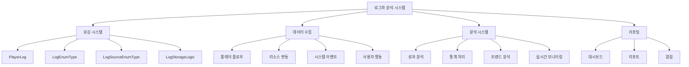

# 로그와 분석 시스템

츄츄버거 로그와 분석 시스템은 게임 내 모든 플레이어 행동과 게임 상태 변화를 체계적으로 기록하고, 이를 바탕으로 게임 운영과 개선을 위한 데이터 분석을 수행하는 핵심 시스템입니다. 포괄적인 로깅 체계와 실시간 분석 기능을 통해 게임 밸런스, 사용자 경험, 수익 최적화 등 다양한 측면에서의 데이터 기반 의사결정을 지원합니다.

## 시스템 개요



## 1. 로깅 시스템

### 1.1 PlayerLog - 중앙 로깅 컴포넌트

`PlayerLog`는 게임의 모든 주요 활동을 기록하는 중앙 집중식 로깅 시스템입니다.

**관련 파일:**
- `RootDesk/MyDesk/00. Player/PlayerLog.mlua`

**주요 속성:**
```lua
-- 카테고리별 플로우 타입 관리
property string Recipe = "2"
property string Training = "2"
property string AutoTraining = "2"
property string VipOrder = "2"
property string Trial = "2"
property table CategoryFlowType = {}
property string CurCategory = ""
```

### 1.2 플레이 플로우 로깅

게임의 주요 활동들에 대한 상세한 기록을 남깁니다.

**핵심 메서드:**
```23:121:RootDesk/MyDesk/00. Player/PlayerLog.mlua
@ExecSpace("ServerOnly")
method void PlayflowLog(string category, string flowType)
    if not isvalid(self.Entity) then return end 
    
    self.CurCategory = category 
    self.CategoryFlowType[category] = flowType
    
    local userId = self.Entity.PlayerComponent.UserId
    local logName = _LogEnumType.PlayFlow
    
    local manageLv = string.format("%d", self.Entity.PlayerManagement.ManagementLevel)
    local manageIdx = self.Entity.PlayerManagement:GetGoalCount()
    local money = string.format("%d",self.Entity.PlayerInventory.Money)
    local arcaneSymbol = string.format("%d",self.Entity.PlayerInventory.ArcaneSymbol)
    local heart = string.format("%d",self.Entity.PlayerInventory.Heart)
    local lunchBox = string.format("%d",self.Entity.PlayerInventory.LunchBox)
    local diamond = string.format("%d",self.Entity.PlayerOutgameManager:GetDiamondCount(userId))
```

**로깅 데이터 포함 항목:**
- **플레이어 정보**: 사용자 ID, 닉네임, 프로필 코드
- **게임 상태**: 경영 레벨, 스테이지 진행도, 현재 재화량
- **디바이스 정보**: PC/모바일 구분
- **타임스탬프**: UTC 시간 기록
- **플랫폼 정보**: 실행 환경 구분

### 1.3 리소스 플로우 로깅

모든 재화(골드, 하트, 아케인심볼 등)의 변동 사항을 상세히 기록합니다.

**핵심 메서드:**
```124:165:RootDesk/MyDesk/00. Player/PlayerLog.mlua
@ExecSpace("ServerOnly")
method void ItemFlow(string logValue, string resourceFlowType, string resourceName, string resourceChangeCnt, string resourceAfterCnt, string resourceMakerDefineTag, string mapName, string targetChuchuId)
    local userId = self.Entity.PlayerComponent.UserId
    local logName = _LogEnumType.ResourceFlow
    local nickname = self.Entity.PlayerComponent.Nickname
    local profileCode = self.Entity.PlayerComponent.ProfileCode
    local itemTarget = "empty" 
    if not _UtilLogic:IsNilorEmptyString(targetChuchuId) then
        itemTarget = targetChuchuId
    end
    
    local playerStageId = tostring(self.Entity.PlayerStage.NowStage)
    local logFail, value = pcall(
```

**리소스 로그 데이터:**
- **변동 전후 수량**: 리소스 변화량 추적
- **변동 원인**: 구매, 보상, 소모 등 분류
- **관련 대상**: 직원, 아이템, 시설 등
- **발생 위치**: 맵, 기능 단위 구분
- **플레이어 컨텍스트**: 현재 진행 상황

## 2. 로그 분류 체계

### 2.1 LogEnumType - 로그 유형 정의

게임 내 모든 로그를 체계적으로 분류하는 열거형입니다.

**관련 파일:**
- `RootDesk/MyDesk/Log/LogEnumType.mlua`

**주요 로그 유형:**
```4:96:RootDesk/MyDesk/Log/LogEnumType.mlua
property string ConnectFlow = "!ConnectFlow"
property string ConnectFlowLobby = "!ConnectFlow.Lobby"
property string ResourceFlow = "!ResourceFlow"
property string PurchaseSuccess = "!Purchase.Success"
property string PurchaseFail = "!Purchase.Fail"
property string PlayFlow = "!PlayFlow"
property string ManageLevel = "!ManageLevel"
property string ManageIndex = "!ManageIndex"
property string EmployeeFlow = "!EmployeeFlow"
property string EmployeeUpgradeFlow = "!EmployeeUpgradeFlow"
property string EmployeeOverLimitFlow = "!EmployeeOverLimitFlow"
property string EmploymentFlow = "!EmploymentFlow"
property string EmployeeLocation = "!EmployeeLocation"
property string RecipeSkillFlow = "!RecipeSkillFlow"
property string AutoTrainingFlow = "!AutoTrainingFlow"
property string TrainingFlow = "!TrainingFlow"
property string RecipeFlow = "!RecipeFlow"
property string MenuFlow = "!MenuFlow"
property string AchievementFlow = "!AchievementFlow"
property string RankFlow = "!RankFlow"
property string SettlementFlow = "!SettlementFlow"
property string UpgradeFlow = "!UpgradeFlow"
property string TrialEmployee = "!Trial.Employee"
property string VIPOrderRecipe = "!VIPOrder.Recipe"
property string VIPOrderIngre = "!VIPOrder.Ingre"
property string TutorialStart = "!Tutorial.Start"
property string TutorialEnd = "!Tutorial.End"
property string MonthlySnap = "!MonthlySnap"
property string MonthlyResource = "!MonthlyResource"
property string StageFlowEnter = "!StageFlow.Enter"
property string StageFlowSetting = "!StageFlow.Setting"
property string BadgeFlow = "!BadgeFlow"
property string StoreNameFlow = "!StoreNameFlow"
property string IngreCollectionFlow = "!IngreCollectionFlow"
property string EmployeeCollectionFlow = "!EmployeeCollectionFlow"
property string EmployeeEquipBuy = "!EmployeeEquip.Buy"
property string EmployeeEquipUpgrade = "!EmployeeEquip.Upgrade"
property string StagePassComplete = "!StagePassComplete"
property string PiggyBankLevelUpReward = "!PiggyBank.LevelUpReward"
property string IngreFlow = "!IngreFlow"
property string IngreSynthResult = "!IngreSynthResult"
property string TrialRecipe = "!Trial.Recipe"
property string StorageFlow = "!StorageFlow"
property string PiggyBankFlow = "!PiggyBankFlow"
property string OfflineRewardFlow = "!OfflineRewardFlow"
property string CheckCanTimeFlows = "!CheckCanTimeFlows"
property string EquipUpgradeGachaLog = "!EquipUpgrade.GachaLog"
```

### 2.2 LogSourceEnumType - 로그 소스 분류

로그가 발생한 시스템이나 기능을 분류합니다.

**관련 파일:**
- `RootDesk/MyDesk/Log/LogSourceEnumType.mlua`

**주요 소스 분류:**
```4:43:RootDesk/MyDesk/Log/LogSourceEnumType.mlua
property string Training = "Training"
property string AutoTraining = "AutoTraining"
property string EmployeeUpgrade = "EmployeeUpgrade"
property string Achievement = "Achievement"
property string Trial = "Trial"
property string IngreGacha = "IngreGacha"
property string Rank = "Rank"
property string VipOrder = "VipOrder"
property string Event = "Event"
property string Cheat = "Cheat"
property string CustomerTip = "CustomerTip"
property string StoreManage = "StoreManage"
property string RecipeReroll = "RecipeReroll"
property string DayPerLunchBox = "DayPerLunchBox"
property string Transfer = "Transfer"
property string playerUpgrade = "playerUpgrade"
property string BurgerSales = "BurgerSales"
property string Employment = "Employment"
property string Recipe = "Recipe"
property string Exchange = "Exchange"
```

### 2.3 LogStorageLogic - 로그 저장 처리

실제 로그 데이터를 저장소에 기록하는 핵심 로직입니다.

**관련 파일:**
- `RootDesk/MyDesk/Log/LogStorageLogic.mlua`

**핵심 메서드:**
```4:7:RootDesk/MyDesk/Log/LogStorageLogic.mlua
@ExecSpace("ServerOnly")
method void LogValue(string player, string name, string value, any extras)
    
end
```

## 3. 특화된 로깅 시스템

### 3.1 메뉴 변경 로깅

메뉴 설정 변경 시 상세한 로그를 기록합니다.

**핵심 기능:**
```330:354:2. 핵심 시스템/레시피 시스템/메뉴 설정과 관리.md
@ExecSpace("ServerOnly")
method void MenuFlow(SyncTable<integer, integer> lastMenu, SyncTable<integer, integer> CurMenu)
    local recipeTable = {}
    for k, v in pairs(CurMenu) do
        local recipeData = self.Entity.PlayerRecipe.Recipes[v]
        table.insert(recipeTable, {
            recipeId = tostring(recipeData.UniqueId),
            recipeName = recipeData.Name,
            price = tostring(recipeData.Cost),
            tag = recipeData.Tag,
            grade = tostring(_TasteGradeDataSetLogic:ReturnGradeDataByScore(recipeData.TasteScore).Index)
        })
    end
    
    -- 메뉴 변경 유형 결정
    local flowType = ""
    if #table.keys(lastMenu) < #table.keys(CurMenu) then
        flowType = "1" -- 메뉴 추가
    elseif #table.keys(lastMenu) > #table.keys(CurMenu) then
        flowType = "2" -- 메뉴 제거
    elseif #table.keys(lastMenu) == #table.keys(CurMenu) then
        flowType = "3" -- 메뉴 교체
    end
end
```

### 3.2 배지 달성 로깅

플레이어의 배지 달성을 상세히 기록합니다.

**로깅 데이터:**
```313:323:2. 핵심 시스템/플레이어 진행/배지와 수집.md
_LogStorageLogic:LogValue(userId, _LogEnumType.BadgeFlow, _HttpService:JSONEncode({
    badgeTypeValue = tostring(badgeData.TypeValue),
    badgeName = badgeData.Name
}), {
    badgeId = badgeId,
    badgeTypeId = tostring(badgeData.TypeId),
    badgeGrade = tostring(badgeData.Grade),
    playerLevel = self.Entity.PlayerStage:GetPlayerLastStageProgress()
})
```

### 3.3 컬렉션 로깅

모든 컬렉션 활동을 추적합니다.

**기록 항목:**
- **컬렉션 유형**: 재료, 번, 번스킨, 사이드메뉴, 전략
- **달성 시점**: UTC 타임스탬프
- **플레이어 진행도**: 현재 스테이지와 레벨
- **보상 수령**: 컬렉션 보상 획득 여부

## 4. 분석 시스템

### 4.1 실시간 통계 처리

게임 데이터를 실시간으로 분석하여 즉각적인 인사이트를 제공합니다.

**통계 처리 영역:**
- **플레이어 행동 패턴**: 플레이 시간, 선호 기능 분석
- **경제 시스템 건전성**: 재화 인플레이션/디플레이션 모니터링
- **콘텐츠 소비 속도**: 스테이지 진행, 업적 달성 분포
- **수익화 효율성**: 결제 전환률, LTV 분석

### 4.2 성과 분석 시스템

각 게임 요소의 성과를 체계적으로 분석합니다.

**분석 대상:**
```367:382:2. 핵심 시스템/레시피 시스템/메뉴 설정과 관리.md
### 7.1 수익성 계산

각 레시피의 수익성을 실시간으로 계산합니다:
- **판매량 × 단가**: 총 매출 계산
- **재료비 대비 수익률**: 순이익 분석
- **판매 속도**: 시간당 판매량
- **고객 만족도**: 평점 및 리뷰

### 7.2 트렌드 영향 분석

트렌드에 따른 판매 성과 변화를 추적합니다:
- **트렌드 보너스**: 해당하는 레시피의 매출 증가
- **트렌드 페널티**: 맞지 않는 레시피의 매출 감소
- **시즌 효과**: 특정 시기의 판매 패턴 분석
```

### 4.3 평판 통계 시스템

가게 평판의 변화를 다각도로 분석합니다.

**분석 기능:**
```263:275:3. 고급 기능/특별 주문/할 일과 미션.md
**UIReputationReview 분석:**
```lua
-- UIReputationStat.mlua
property SyncTable<integer, Entity> StatSlots  -- 통계 슬롯들
property Entity GraphContainer                  -- 그래프 컨테이너
```

**평판 분석 항목:**
- **평판 변화 추이**: 일간/주간/월간 평판 변화 그래프
- **원인 분석**: 평판 상승/하락의 주요 원인 파악
- **고객 분포**: 방문 고객의 만족도 분포  
- **개선 포인트**: 평판 향상을 위한 구체적 방안
```

## 5. 데이터 저장과 관리

### 5.1 로그 데이터 보관

모든 로그는 체계적으로 분류되어 장기간 보관됩니다.

**보관 정책:**
- **실시간 로그**: 즉시 저장, 24시간 고속 액세스
- **일별 집계**: 일단위 통계 데이터 생성
- **월별 아카이브**: 상세 데이터의 압축 보관
- **연도별 요약**: 핵심 지표만 선별 보관

### 5.2 데이터 무결성

로그 데이터의 정확성과 일관성을 보장합니다.

**검증 메커니즘:**
- **중복 제거**: 동일 이벤트의 중복 기록 방지
- **데이터 검증**: 로그 내용의 유효성 검사
- **타임스탬프 정합성**: 시간 순서의 논리적 일치성
- **참조 무결성**: 관련 데이터간의 연관성 유지

### 5.3 프라이버시 보호

플레이어 개인정보를 보호하면서도 의미있는 분석을 수행합니다.

**보호 조치:**
- **데이터 익명화**: 개인 식별 정보 제거/암호화
- **집계 기반 분석**: 개별 플레이어가 아닌 그룹 단위 분석
- **접근 권한 제어**: 분석 담당자만 로그 접근 가능
- **보관 기간 제한**: 개인정보 포함 로그의 자동 삭제

## 6. 모니터링과 알림

### 6.1 실시간 모니터링

게임 운영 상 중요한 지표들을 실시간으로 감시합니다.

**모니터링 대상:**
- **접속자 수**: 동시 접속자 및 신규 가입자
- **서버 성능**: 응답 시간, 에러율
- **게임 밸런스**: 비정상적 재화 증감
- **사용자 이탈**: 급격한 이탈률 변화

### 6.2 이상 상황 감지

자동화된 알고리즘으로 비정상적 패턴을 조기 감지합니다.

**감지 항목:**
- **치트 의심 행위**: 비현실적인 게임 진행
- **시스템 오류**: 예상치 못한 로그 패턴
- **밸런스 파괴**: 게임 경제의 급격한 변화
- **사용자 불만**: 부정적 피드백 급증

### 6.3 대응 시스템

감지된 이상 상황에 대한 자동/수동 대응 체계입니다.

**대응 방식:**
- **자동 차단**: 명백한 부정행위의 즉시 차단
- **알림 발송**: 운영팀에 즉시 알림 전달  
- **임시 조치**: 시스템 안정성 확보를 위한 긴급 조치
- **상세 분석**: 근본 원인 파악을 위한 심층 분석

---

## 코드 참조

**핵심 파일들:**
- `RootDesk/MyDesk/00. Player/PlayerLog.mlua :: PlayflowLog()` — 플레이 플로우 로깅
- `RootDesk/MyDesk/00. Player/PlayerLog.mlua :: ItemFlow()` — 리소스 변동 로깅
- `RootDesk/MyDesk/Log/LogEnumType.mlua` — 로그 유형 정의
- `RootDesk/MyDesk/Log/LogSourceEnumType.mlua` — 로그 소스 분류
- `RootDesk/MyDesk/Log/LogStorageLogic.mlua :: LogValue()` — 로그 저장 처리
- `Environment/NativeScripts/Service/LogStorageService.d.mlua` — 네이티브 로그 서비스
- `RootDesk/MyDesk/01. Lobby/StoreInfo/UIReputationReview.mlua` — 평판 분석 시스템
