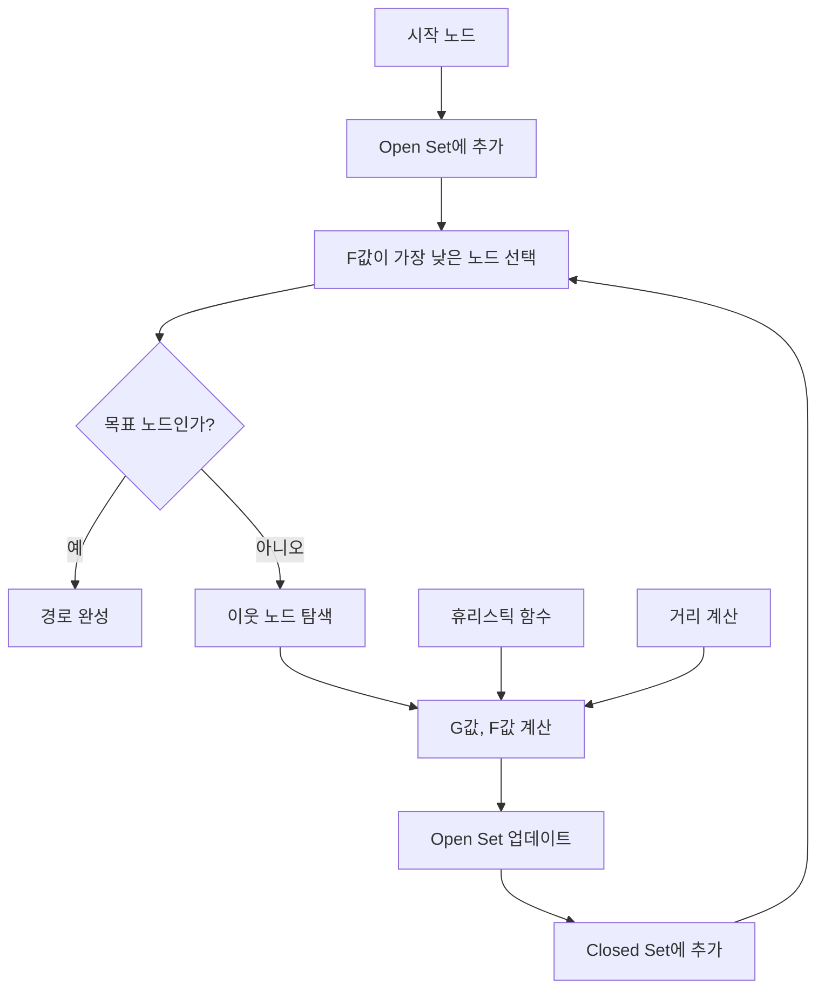

# 경로찾기와 이동

츄츄버거는 직원과 고객의 자연스러운 이동을 위해 A* 알고리즘 기반의 경로찾기 시스템을 구현하고 있습니다. 이 시스템은 복잡한 가게 레이아웃에서도 효율적이고 자연스러운 이동 경로를 계산합니다.

## PathFinder 시스템

### A* 알고리즘 구현

PathFinder는 게임의 핵심 경로찾기 엔진으로, 표준 A* 알고리즘을 구현합니다.

#### 핵심 구성요소

A* 알고리즘의 핵심 거리 계산 함수들:

- **dist()**: 두 점 사이의 유클리드 거리 계산
- **heuristic_cost_estimate()**: 휴리스틱 비용 추정
- **dist_between()**: 인접 노드 사이 실제 비용

<details>
<summary>핵심 거리 계산 함수 구현</summary>

```lua
-- RootDesk/MyDesk/PathFinder/PathFinder.mlua :: 핵심 함수들
self._T.dist = function ( x1, y1, x2, y2 )
    return math.sqrt ( ( x2 - x1)^2 + (y2 - y1)^2 )
end

self._T.heuristic_cost_estimate = function ( nodeA, nodeB )
    return self._T.dist ( nodeA.x, nodeA.y, nodeB.x, nodeB.y )
end

self._T.dist_between = function ( nodeA, nodeB )
    return self._T.dist ( nodeA.x, nodeA.y, nodeB.x, nodeB.y )
end
```
</details>

#### A* 알고리즘 메인 로직

```lua
-- PathFinder.mlua :: a_star 함수
self._T.a_star = function ( start, goal, nodes )
    local closedset = {}
    local openset = { start }
    local came_from = {}

    local g_score, f_score = {}, {}
    g_score [ start ] = 0
    f_score [ start ] = g_score [ start ] + self._T.heuristic_cost_estimate ( start, goal )

    while #openset > 0 do
        local current = self._T.lowest_f_score ( openset, f_score )
        if current == goal then
            local path = self._T.unwind_path ( {}, came_from, goal )
            table.insert ( path, goal )
            return path
        end

        self._T.remove_node ( openset, current )
        table.insert ( closedset, current )
        
        local neighbors = self._T.neighbor_nodes( current, nodes )
        for _, neighbor in ipairs ( neighbors ) do 
            if self._T.not_in ( closedset, neighbor ) then
                local tentative_g_score = g_score [ current ] + self._T.dist_between ( current, neighbor )
                 
                if self._T.not_in ( openset, neighbor ) or tentative_g_score < g_score [ neighbor ] then 
                    came_from [ neighbor ] = current
                    g_score [ neighbor ] = tentative_g_score
                    f_score [ neighbor ] = g_score [ neighbor ] + self._T.heuristic_cost_estimate ( neighbor, goal )
                    if self._T.not_in ( openset, neighbor ) then
                        table.insert ( openset, neighbor )
                    end
                end
            end
        end
    end
    return nil 
end
```

### 맵 데이터 관리

PathFinder는 맵의 네비게이션 노드 정보를 관리하고 초기화합니다.

#### 노드 초기화

InitNodes() 메서드로 맵 데이터를 초기화합니다:

`self.nowLevel = level` — 현재 레벨 설정 후 스테이지별 데이터 로드

<details>
<summary>맵 데이터 초기화 구현</summary>

```lua
-- RootDesk/MyDesk/PathFinder/PathFinder.mlua :: InitNodes()
method void InitNodes(number level)
    -- 맵 데이터 초기화 로직
    self.nowLevel = level
    -- 스테이지별 네비게이션 데이터 로드
end
```
</details>

#### 이웃 노드 계산

```lua
-- PathFinder.mlua :: neighbor_nodes 함수
self._T.neighbor_nodes = function( theNode, nodes )
    local neighbors = {}
    local row = math.floor((theNode.id - 1) / self.col) + 1
    local col = (theNode.id - 1) % self.col + 1

    for i = row - 1, row + 1 do
        for j = col - 1, col + 1 do
            if (i >= 1 and i <= self.row and j >= 1 and j <= self.col) and not (i == row and j == col) then
                local adjacentIndex = (i - 1) * self.col + j
                if nodes[adjacentIndex].jump == false then
                    table.insert(neighbors, nodes[adjacentIndex])
                end
            end
        end
    end
    return neighbors
end
```

### 경로 캐싱 시스템

성능 최적화를 위해 계산된 경로를 캐싱합니다.

#### 캐시 관리

```lua
-- PathFinder.mlua :: path 함수 (캐시 시스템 포함)
self._T.path = function ( start, goal, nodes, ignore_cache )
    if not self._T.cachedPaths [ start ] then
        self._T.cachedPaths [ start ] = {}
    elseif self._T.cachedPaths [ start ] [ goal ] and not ignore_cache then
        return self._T.cachedPaths [ start ] [ goal ]
    end

    local resPath = self._T.a_star ( start, goal, nodes )

    if not self._T.cachedPaths [ start ] [ goal ] and not ignore_cache then
        self._T.cachedPaths [ start ] [ goal ] = resPath
    end

    return resPath
end
```

#### 캐시 초기화

```lua
-- PathFinder.mlua :: clear_cached_paths 함수
self._T.clear_cached_paths = function ()
    self._T.cachedPaths = nil
end
```

## EmployeeMoveScript 시스템

직원의 이동을 담당하는 컴포넌트로, PathFinder와 연동하여 실제 이동을 처리합니다.

### A* 이동 초기화

```lua
-- EmployeeMoveScript.mlua :: InitForAstar()
method void InitForAstar()
    self._T.targetPos = self.Entity.TransformComponent.Position
    self._T.path = nil
    self._T.arriveLastNode = false
    self._T.currentNode = 1
    self._T.flipCoolTime = 0.5
    self._T.needToRefreshPath = false
    
    -- 경로 새로고침 함수 정의
    self._T.refreshPath = function()
        -- 경로 계산 로직
    end
    
    if self:InitGraph() then
        self._T.refreshPath()
        self.useAstar = true
    end
end
```

### 그래프 초기화

```lua
-- EmployeeMoveScript.mlua :: InitGraph()
method boolean InitGraph()
    if #self.graph > 0 then
        table.clear(self.graph)
    end
    
    if _PathFinder.nowLevel < 3 then
        return false
    end
    
    if isvalid(self.Entity.ServingEmployeeAIScript) then
        return false  -- 서빙 직원은 A* 사용 안함
    end
    
    local i = 1
    for k,v in pairs(_PathFinder.mapData) do
        self.graph [ i ] = {}
        self.graph [ i ].id = i
        self.graph [ i ].x = v.x
        self.graph [ i ].y = v.y
        self.graph [ i ].jump = v.jump
        i = i + 1
    end
    
    return true
end
```

### 경로 새로고침

```lua
-- EmployeeMoveScript.mlua :: refreshPath 함수
self._T.refreshPath = function()
    self._T.needToRefreshPath = false
    local pos = self.Entity.TransformComponent.Position

    if isvalid(self.targetPosition) then        
        local targetPos = self.targetPosition
        self._T.targetPos = targetPos        
        local monsterPos = self.Entity.TransformComponent.Position
        self._T.preTargetPos = targetPos:Clone()
        
        local maxMonster = 9999
        local maxTarget = 9999
        local startIndex = 1
        local goalIndex = 1
        
        -- 시작점과 목표점에 가장 가까운 노드 찾기
        for k, v in pairs(self.graph) do
            local dist = (v.x - monsterPos.x) * (v.x - monsterPos.x) + (v.y - monsterPos.y) * (v.y - monsterPos.y)
            if dist < maxMonster then
                maxMonster = dist
                startIndex = v.id
            end
            local distTarget = (v.x - targetPos.x) * (v.x - targetPos.x) + (v.y - targetPos.y) * (v.y - targetPos.y)
            if distTarget < maxTarget then
                maxTarget = distTarget
                goalIndex = v.id
            end
        end
        
        -- A* 경로 계산
        local newPath = _PathFinder:path( self.graph [startIndex], self.graph [goalIndex], self.graph, false )

        if newPath ~= nil then
            self._T.path = newPath
            self._T.arriveLastNode = false
            self._T.currentNode = 1
            
            local length = #newPath
            if #newPath > 2 then
                self._T.currentNode = 2
            elseif #newPath <= 2 then
                self._T.arriveLastNode = true
            end
        end
    end
end
```

### 이동 처리

```lua
-- EmployeeMoveScript.mlua :: OnUpdate()
method void OnUpdate(number delta)
    if not self.CanMove then 
        return
    end 
    
    if not isvalid(self.targetPosition) then
        return
    end
    
    if self.useAstar then
        self:MoveByAstar(delta)
    else
        self:MoveByLinear(delta)
    end
end
```

### 타겟 변경 처리

```lua
-- EmployeeMoveScript.mlua :: ChangeTarget()
method void ChangeTarget(string location)
    if string.find(self.Entity.Name,"Customer") then 
        -- 고객은 랜덤 위치로 이동
        self.targetPosition = _EntityService:GetEntityByPath(_UserService.LocalPlayer.CurrentMap.Path.."/SpawnPosGroup/Customer/CustomerCreate".._UtilLogic:RandomIntegerRange(1,3)).TransformComponent.Position
    elseif isvalid(self.Entity.CookEmployeeAIScript) or isvalid(self.Entity.ServingEmployeeAIScript)  then
        -- 직원은 지정된 위치로 이동
        self.targetPosition = _LobbyEntityLogic:GetEmployeeSpawnPostion(location).TransformComponent.Position
        self:InitForAstar() 
    end
end
```

## 알고리즘 상세 분석

### A* 알고리즘의 핵심 요소



### 비용 계산

#### G 비용 (시작점부터의 실제 거리)
```lua
local tentative_g_score = g_score [ current ] + self._T.dist_between ( current, neighbor )
```

#### H 비용 (목표점까지의 추정 거리)
```lua
self._T.heuristic_cost_estimate = function ( nodeA, nodeB )
    return self._T.dist ( nodeA.x, nodeA.y, nodeB.x, nodeB.y )
end
```

#### F 비용 (G + H)
```lua
f_score [ neighbor ] = g_score [ neighbor ] + self._T.heuristic_cost_estimate ( neighbor, goal )
```

### 경로 복원

```lua
-- PathFinder.mlua :: unwind_path 함수
self._T.unwind_path = function ( flat_path, map, current_node )
    if map [ current_node ] then
        table.insert ( flat_path, 1, map [ current_node ] ) 
        return self._T.unwind_path ( flat_path, map, map [ current_node ] )
    else
        return flat_path
    end
end
```

## 최적화 기법

### 1. 경로 캐싱
- 동일한 시작점-도착점 조합의 경로는 캐시에서 재사용
- 맵 변경 시 캐시 초기화로 일관성 유지

### 2. 조건부 A* 사용
- 레벨 3 이상에서만 A* 알고리즘 활성화
- 서빙 직원은 단순 이동 사용 (복잡도 감소)

### 3. 그리드 기반 노드 관리
- 맵을 그리드로 분할하여 노드 수 최소화
- 이웃 노드 계산 최적화

### 4. 점프 가능 노드 필터링
```lua
if nodes[adjacentIndex].jump == false then
    table.insert(neighbors, nodes[adjacentIndex])
end
```

## 충돌 회피 및 동적 장애물

### 1. 정적 장애물 처리
- 네비게이션 노드에서 장애물 영역 제외
- `jump` 속성으로 이동 불가능한 노드 표시

### 2. 동적 경로 재계산
- 타겟 변경 시 경로 자동 재계산
- 경로 실패 시 대체 경로 탐색

### 3. 경로 검증
- 경로 계산 실패 시 null 반환
- 안전한 폴백 메커니즘 제공

## 사용 패턴

### 직원 이동
```lua
-- 요리 직원: A* 경로찾기 사용
if isvalid(self.Entity.CookEmployeeAIScript) then
    self:InitForAstar() 
end

-- 서빙 직원: 단순 직선 이동
if isvalid(self.Entity.ServingEmployeeAIScript) then
    self:MoveByLinear(delta)
end
```

### 고객 이동
```lua
-- 고객: 단순 랜덤 위치 이동
if string.find(self.Entity.Name,"Customer") then 
    self.targetPosition = GetRandomCustomerPosition()
end
```

## 성능 고려사항

### 1. 계산 복잡도
- 시간 복잡도: O((V + E) log V) (V: 노드 수, E: 간선 수)
- 공간 복잡도: O(V) (노드 수에 비례)

### 2. 메모리 사용량
- 그래프 데이터: 노드당 약 32바이트
- 캐시 데이터: 경로당 가변 크기
- 주기적 캐시 정리로 메모리 관리

### 3. 실시간 성능
- 프레임당 최대 1개 경로 계산
- 긴급하지 않은 경로는 다음 프레임으로 연기
- 캐시 히트율 향상으로 계산 횟수 감소

## 개발자를 위한 가이드

### PathFinder 사용법

1. **노드 초기화**: `InitNodes(level)`로 맵 데이터 로딩
2. **경로 계산**: `path(start, goal, nodes, ignore_cache)`로 경로 구하기
3. **캐시 관리**: 필요시 `clear_cached_paths()`로 캐시 초기화

### EmployeeMoveScript 설정

1. **A* 활성화**: `InitForAstar()`로 A* 이동 초기화
2. **타겟 설정**: `ChangeTarget(location)`로 목표 지점 변경
3. **이동 제어**: `CanMove` 플래그로 이동 활성화/비활성화

### 디버깅 팁

1. **경로 시각화**: 계산된 경로를 화면에 그려서 확인
2. **노드 상태 체크**: 각 노드의 G, H, F 값 로깅
3. **캐시 상태 모니터링**: 캐시 히트율과 메모리 사용량 추적

## 코드 참조

### PathFinder 핵심
- `RootDesk/MyDesk/PathFinder/PathFinder.mlua :: a_star(), path(), neighbor_nodes()` — A* 알고리즘 핵심 구현
- `RootDesk/MyDesk/PathFinder/PathFinder.mlua :: heuristic_cost_estimate(), dist_between()` — 비용 계산 함수들

### EmployeeMoveScript 이동 시스템
- `RootDesk/MyDesk/PathFinder/EmployeeMoveScript.mlua :: InitForAstar(), refreshPath()` — A* 이동 시스템 초기화
- `RootDesk/MyDesk/PathFinder/EmployeeMoveScript.mlua :: InitGraph(), ChangeTarget()` — 그래프 관리 및 타겟 변경

### 핵심 인터페이스
```lua
-- PathFinder 주요 메소드
method table path(any start, any goal, any nodes, any ignore_cache)
method number distance(Vector2 x1, Vector2 y1, Vector2 x2, Vector2 y2)
method void InitNodes(number level)

-- EmployeeMoveScript 주요 메소드
method void InitForAstar()
method boolean InitGraph()
method void ChangeTarget(string location)
method void MoveByAstar(number delta)

-- A* 핵심 함수들
self._T.a_star = function ( start, goal, nodes )
self._T.heuristic_cost_estimate = function ( nodeA, nodeB )
self._T.neighbor_nodes = function( theNode, nodes )
```
