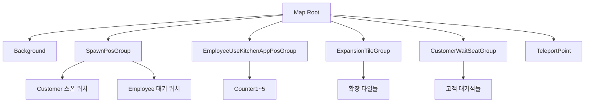
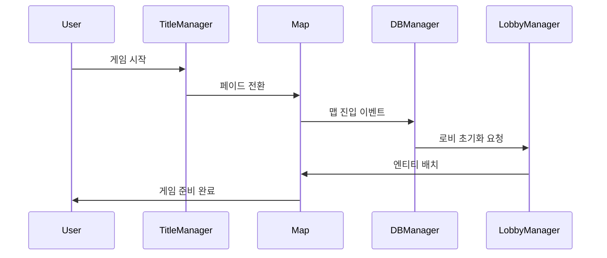

# 맵 구조와 배치

츄츄버거는 체계적인 맵 구조와 정밀한 엔티티 배치 시스템을 통해 게임 환경을 구성합니다. 각 맵은 고유한 목적과 구조를 가지며, 개발 도구를 통해 효율적으로 관리됩니다.

## 맵 폴더 구조

### 기본 맵 구성

츄츄버거는 다음과 같은 핵심 맵들로 구성됩니다:

#### 1. DataLoading.map
게임 진입 시 데이터 로딩을 담당하는 전환 맵으로, 다음과 같은 구조를 가집니다:

- **EntryKey**: "map://dataloading" 경로로 접근
- **MapComponent**: 기본 맵 기능과 FootholdComponent 제공  
- **BackgroundComponent**: 로딩 화면 배경 처리

<details>
<summary>DataLoading.map 구조</summary>

```json
{
  "EntryKey": "map://dataloading",
  "Entities": [
    {
      "path": "/maps/DataLoading",
      "componentNames": "MOD.Core.MapComponent,MOD.Core.FootholdComponent"
    },
    {
      "path": "/maps/DataLoading/Background", 
      "componentNames": "MOD.Core.BackgroundComponent"
    }
  ]
}
```
</details>

#### 2. TitleMap.map
타이틀 화면과 메인 메뉴를 제공하는 맵입니다.
- 게임 시작 버튼
- 데이터 리셋 기능
- 장식용 캐릭터 애니메이션
- 각종 설정 UI

#### 3. IntroMap.map
게임 인트로와 튜토리얼을 진행하는 맵입니다.
- 인트로 다이얼로그 시스템
- 튜토리얼 가이드
- 스토리 연출용 카메라 앵글

#### 4. 로비 맵 시리즈
실제 게임플레이가 진행되는 핵심 맵들입니다:
- **Lobby_Stage_1.map**: 1스테이지 로비
- **Lobby_Stage_2.map**: 2스테이지 로비  
- **Lobby_Stage_3.map**: 3스테이지 로비
- **기타 스테이지별 맵들**

### 맵별 엔티티 구조



## 스폰 위치 관리 시스템

### EditorGroupTool 시스템

개발 시 맵의 다양한 위치를 체계적으로 관리하기 위한 에디터 도구입니다.

#### SpawnPosEditorLogic

맵 상의 위치 데이터를 CSV로 추출하는 에디터 도구입니다.

**주요 기능:**
- 고객 대기석 위치 추출
- 직원 주방기기 사용 위치 추출  
- 고객 입장/퇴장 경로 위치 추출
- 확장 타일 그룹 위치 추출

CustomerWaitSeatGroup() 메서드로 고객 대기석 위치를 CSV로 추출합니다:

1. **엔티티 수집**: parent.Children으로 모든 대기석 위치 엔티티 수집
2. **좌표 계산**: row/col 구조로 2D 그리드 인덱스 계산  
3. **위치 저장**: TransformComponent.Position을 CSV 데이터로 저장

핵심 로직: `local row = math.tointeger((i-1) / 6 + 1)` — 6개씩 한 행으로 구성

<details>
<summary>고객 대기석 위치 추출 구현</summary>

```lua
-- RootDesk/MyDesk/EditorGroupTool/SpawnPos/SpawnPosEditorLogic.mlua :: CustomerWaitSeatGroup()
method void CustomerWaitSeatGroup()
    local dataSetName = "CustomerWaitSeatGroupDataSet"
    local parent = _EntityService:GetEntityByPath("/maps/Lobby_Stage_1/CustomerWaitSeatGroup")
    
    local posEntites = parent.Children 
    
    for i,v in pairs(posEntites) do
        local row = math.tointeger((i-1) / 6 + 1)
        local col = math.tointeger((i-1) % 6 + 1)
        local x = v.TransformComponent.Position.x
        local y = v.TransformComponent.Position.y
        -- CSV 데이터로 저장
        _EditorService:DataSetSetCell(dataSetName, i, "x", tostring(x))
        _EditorService:DataSetSetCell(dataSetName, i, "y", tostring(y))
    end
end
```
</details>

#### LobbySpawnPositionLogic

런타임에서 스폰 위치 데이터를 로드하고 관리하는 시스템입니다.

**관리하는 위치 그룹들:**
- `CustomerWaitSeatGroup`: 고객 대기석 (행/열 구조)
- `CustomerExitTempGroup`: 고객 퇴장 임시 위치
- `CustomerEnterGroup`: 고객 입장 위치
- `EmployeeUseKitchenAppPosGroup`: 직원 주방기기 사용 위치
- `DisplayOffset`: 디스플레이 오프셋 정보
- `ExpansionTileGroup`: 확장 타일 그룹

LoadRowColDataSet() 메서드로 CSV 데이터를 2차원 테이블로 변환합니다:

1. **데이터 로드**: _DataService:GetTable()로 CSV 데이터셋 로드
2. **2D 구조 생성**: row/col을 키로 하는 2차원 테이블 구성
3. **Vector3 변환**: x, y 좌표를 FastVector3로 변환하여 저장

핵심 로직: `targetTable[row][col] = FastVector3(x, y, 0)`

<details>
<summary>런타임 위치 데이터 로딩 구현</summary>

```lua
-- RootDesk/MyDesk/EditorGroupTool/SpawnPos/LobbySpawnPositionLogic.mlua :: LoadRowColDataSet()
method void LoadRowColDataSet(table targetTable, string dataSetName)
    local dataset = _DataService:GetTable(dataSetName)
    local rows = dataset:GetAllRow()
    
    for i, v in pairs(rows) do
        local row = math.tointeger(tonumber(v:GetItem("row")))
        local col = math.tointeger(tonumber(v:GetItem("col")))
        local x = tonumber(v:GetItem("x"))
        local y = tonumber(v:GetItem("y"))
        
        if targetTable[row] == nil then
            targetTable[row] = {}
        end
        
        targetTable[row][col] = FastVector3(x, y, 0)
    end
end
```
</details>

### 네비게이션 시스템

#### NaviNodeEditorLogic

AI 경로찾기를 위한 네비게이션 노드를 관리하는 에디터 도구입니다.

**기능:**
- 네비게이션 노드 위치 추출
- 점프 가능 여부 설정
- 스테이지별 네비게이션 데이터 생성

Function1() 메서드로 네비게이션 노드 데이터를 추출합니다:

1. **스테이지별 데이터셋**: "DataSet_NaviGroup_Stage" + stageString 형태로 스테이지별 분리
2. **노드 정보 수집**: TransformComponent.Position과 NaviPoint.jump 속성 수집
3. **CSV 저장**: x, y 좌표와 점프 가능 여부를 CSV로 저장

핵심 로직: `local jump = v.NaviPoint.jump` — 점프 가능 여부로 이동 제한 설정

<details>
<summary>네비게이션 노드 추출 구현</summary>

```lua
-- RootDesk/MyDesk/EditorGroupTool/NaviNode/NaviNodeEditorLogic.mlua :: Function1()
method void Function1()
    local stageString = self.SelectedStage.Text
    local dataSetName = "DataSet_NaviGroup_Stage"..stageString
    local parent = _EntityService:GetEntityByPath("/maps/Lobby/Model_NaviGroup")
    
    local nodes = parent.Children 
    
    for row,v in pairs(nodes) do
        local x = v.TransformComponent.Position.x
        local y = v.TransformComponent.Position.y
        local jump = v.NaviPoint.jump
        -- 네비게이션 데이터 저장
        _EditorService:DataSetSetCell(dataSetName, row, "x", tostring(x))
        _EditorService:DataSetSetCell(dataSetName, row, "y", tostring(y))
        _EditorService:DataSetSetCell(dataSetName, row, "jump", tostring(jump))
    end
end
```
</details>

## 타이틀 화면 시스템

### TitleManager

타이틀 화면의 전반적인 관리를 담당하는 핵심 컴포넌트입니다.

#### 맵 전환 관리
OnMapEnter() 메서드로 타이틀 맵 진입을 처리합니다:

`if enteredMap.Name == "TitleMap" then` — 타이틀 맵 진입 감지 후 UI 초기화

<details>
<summary>맵 전환 관리 구현</summary>

```lua
-- RootDesk/MyDesk/Title/TitleManager.mlua :: OnMapEnter()
method void OnMapEnter(Entity enteredMap)
    if enteredMap.Name == "TitleMap" then
        self.UserPlayType = "1"
        local userId = self.Entity.PlayerComponent.UserId
        
        self:PassCheckServer()
        self:OpenTitleUI(userId)
    end
end
```
</details>

#### 게임 시작 처리
ReadyForEnterToWorld() 메서드로 다음 맵으로의 전환을 처리합니다:

1. **맵 결정**: 인트로 여부에 따라 로비 또는 인트로 맵 선택
2. **다국어 설정**: 지역화 텍스트 서버 요청
3. **페이드 전환**: 부드러운 화면 전환 효과

<details>
<summary>게임 시작 처리 구현</summary>

```lua
-- RootDesk/MyDesk/Title/TitleManager.mlua :: ReadyForEnterToWorld()
method void ReadyForEnterToWorld(boolean isIntroMap)
    local userId = self.Entity.PlayerComponent.UserId
    local nextMapName = "Lobby"
    
    if isIntroMap then
        nextMapName = "Lobby"
    elseif self:PassCheckServer() == false then 
        nextMapName = self.Entity.PlayerDialog.IntroMapName
    end
    
    _GetLocalizationTextLogic:RequestSetLocalizedTextServer(userId)
    self:ShowFade(nextMapName, userId)
end
```
</details>

#### 리소스 프리로드
OpenTitleUI() 메서드에서 게임 진입을 위한 리소스를 미리 로딩합니다:

- **UI 활성화**: UITitle:TitleUIOn()으로 타이틀 UI 표시
- **HUD 비활성화**: 로비 HUD 그룹 비활성화
- **타일셋 프리로드**: 3개 주요 타일셋을 비동기 로딩

<details>
<summary>리소스 프리로드 구현</summary>

```lua
-- RootDesk/MyDesk/Title/TitleManager.mlua :: OpenTitleUI()
method void OpenTitleUI()
    _UIGroupManager.TitleUIGroup.UITitle:TitleUIOn()
    _UIGroupManager:EnableLobbyHUDGroup(false)
    
    -- 타일셋 프리로드
    _ResourceService:PreloadTileSetAsync("tileset://9c83666b-7388-4664-a444-3ee19e1e7980", function()  end)
    _ResourceService:PreloadTileSetAsync("tileset://660f086b-019f-4423-8d9a-874099926c53", function()  end)
    _ResourceService:PreloadTileSetAsync("tileset://362cff79-7315-493d-bf04-1656dfb05207", function()  end)
end
```
</details>

### UITitle

타이틀 화면의 UI 요소들을 관리하는 컴포넌트입니다.

#### 주요 UI 요소들
- `GameStartButton`: 게임 시작 버튼
- `ResetDataButton`: 데이터 리셋 버튼
- `InfoButton`: 정보 버튼
- `FixDataButton`: 데이터 수정 버튼
- `ResetPopup`: 리셋 확인 팝업
- `InfoPopup`: 정보 팝업

#### 타이틀 UI 활성화
```lua
-- UITitle.mlua :: TitleUIOn()
method void TitleUIOn()
    self:CloseAllPopup()
    _UIGroupManager:EnableMoneyBarGroup(false)
    
    self.Entity.Enable = true
    self:ToggelToastAlpha()
    self:SpawnDeco()
    self:TweenDecoCharacter()
end
```

### TitleEmployee 장식 시스템

타이틀 화면의 분위기를 연출하는 장식용 직원 시스템입니다.

#### 랜덤 직원 생성
```lua
-- TitleEmployee.mlua :: OnBeginPlay()
method void OnBeginPlay()
    local dataSet = _DataService:GetTable("EmployeeDataSet")
    local index = _UtilLogic:RandomIntegerRange(1, dataSet:GetRowCount())
    
    local rowEmployee = dataSet:GetRow(index)
    local data = _EmployeeService:GetData(rowEmployee:GetItem("Id"))
    
    self.Entity.SpriteGUIRendererComponent.ImageRUID = data.MoveRUID
    
    -- 랜덤 버거 생성
    local burger = self.Entity:GetChildByName("Burger")
    local burgerTagDataSet = _DataService:GetTable("RecipeTagData")
    
    local randomIndex = _UtilLogic:RandomIntegerRange(1,burgerTagDataSet:GetRowCount())
    local row = burgerTagDataSet:GetRow(randomIndex)
    local burgerTag = row:GetItem("Type")
    
    -- 버거 개수 랜덤 결정
    local randomNum = _UtilLogic:RandomIntegerRange(1,12)
    local burgerCount = 0
    if randomNum > 10 then
        burgerCount = randomNum 
    elseif randomNum > 5 then
        burgerCount = math.floor(randomNum % 5)
    else
        burgerCount = randomNum
    end
    
    -- 버거 스택 시각화
    burger.SpriteGUIRendererComponent.ImageRUID = burgerTagDataSet:FindRow("Type",burgerTag):GetItem("SmallPackRUID")
    burger.UITransformComponent.RectSize.y = 30 + 10 * (burgerCount - 1)
    burger.UITransformComponent.Position.y = 45 + 10 * (burgerCount - 1)
end
```

#### 이동 애니메이션
```lua
-- TitleEmployee.mlua :: MoveStart()
method void MoveStart(boolean flipX, integer posY)
    local burger = self.Entity:GetChildByName("Burger")
    self.Entity.SpriteGUIRendererComponent.FlipX = flipX
    burger.SpriteGUIRendererComponent.FlipX = flipX
    
    math.randomseed(os.time()) 
    if flipX then
        _TweenLogic:MoveTo(self.Entity, Vector2(1300, posY), math.random(15,25) , EaseType.Linear )
    else
        _TweenLogic:MoveTo(self.Entity, Vector2(-1300, posY), math.random(15,25)  , EaseType.Linear )
    end
    
    -- 자동 삭제
    local selfDistroy = function()
        _EntityService:Destroy(self.Entity)
    end
    _TimerService:SetTimer(self, selfDistroy, 25, false )
end
```

#### 장식 스폰 시스템
```lua
-- UITitle.mlua :: SpawnDeco()
method void SpawnDeco()
    local spawnPos = Vector3.zero
    local floor1 = self.Entity:GetChildByName("TitleMapUI"):GetChildByName("TitleBg_Floor") :GetChildByName("TitleSpawner1") 
    local floor2 = self.Entity:GetChildByName("TitleMapUI"):GetChildByName("TitleBg_Floor") :GetChildByName("TitleSpawner2") 
    
    local modelId = _EntryService:GetModelIdByName("Model_Title_Employee")
    
    local callback = function()
        local randomNum = _UtilLogic:RandomIntegerRange(1,4)
        
        -- 랜덤 스폰 위치 결정
        if randomNum == 1 then
            spawnPos = Vector3(1300, -440, 0)
        elseif randomNum == 2 then
            spawnPos = Vector3(1300, -350, 0)  
        elseif randomNum == 3 then
            spawnPos = Vector3(-1300, -430, 0)
        elseif randomNum == 4 then
            spawnPos = Vector3(-1300, -360, 0)
        end
        
        local decoEmployee
        
        -- 층별 스폰
        if randomNum == 1 or randomNum == 3 then
            decoEmployee = _SpawnService:SpawnByModelId(modelId, "Deco", spawnPos, floor1)
        elseif randomNum == 2 or randomNum == 4 then
            decoEmployee = _SpawnService:SpawnByModelId(modelId, "Deco", spawnPos, floor2)
        end
            
        -- 이동 시작 (방향 결정)
        if randomNum >= 3 then
            decoEmployee.TitleEmployee:MoveStart(true, spawnPos.y)
        else
            decoEmployee.TitleEmployee:MoveStart(false, spawnPos.y)
        end
    end
    
    -- 3~8초 간격으로 반복 스폰
    _TimerService:SetTimer(self,callback, _UtilLogic:RandomIntegerRange(3,8), true )
end
```

## 맵 데이터 관리

### 맵 로딩 시퀀스



### 스테이지별 맵 전환

```lua
-- TitleManager.mlua :: MoveToNextMap()
method void MoveToNextMap(string nextMapName)
    local destPath = ""
    if nextMapName == "Lobby" then
        local nowStage = self.Entity.PlayerStage.NowStage
        local mapName = self.Entity.PlayerStage:ReturnMapName(nowStage)
        destPath = string.format("/maps/%s/SpawnPosGroup/EmployeeWaitCook", mapName)
        
    elseif nextMapName == self.Entity.PlayerDialog.IntroMapName then
        destPath = self.Dest_IntroEntityPath
    elseif nextMapName == "Title" then
        destPath = self.Dest_TitleEntityPath
    end
    
    _TeleportService:TeleportToEntityPath(self.Entity, destPath)
    _FadeService:HideFade(self.Entity.PlayerComponent.UserId)
end
```

## 개발 워크플로우

### 맵 제작 과정

1. **기본 맵 구조 생성**: MapComponent, Background 설정
2. **스폰 위치 배치**: 에디터에서 수동 배치  
3. **데이터 추출**: EditorGroupTool로 CSV 데이터 생성
4. **런타임 로딩**: SpawnPositionLogic으로 데이터 로드
5. **테스트 및 조정**: 게임 내에서 위치 확인 및 수정

### 에디터 도구 활용

```lua
-- 고객 대기석 위치 추출 예제
self:CustomerWaitSeatGroup()  -- 위치 데이터를 CSV로 추출
self:LoadRowColDataSet(self.CustomerWaitSeatGroup, "CustomerWaitSeatGroupDataSet")  -- 런타임 로드
```

### 확장 타일 시스템

```lua
-- ExpansionTileGroup 데이터 구조
method void ExpansionTileGroup()
    for i,v in pairs(posEntites) do
        local _type = math.tointeger((i-1) / 12 + 1)
        local index = math.tointeger(((i-1) / 2) % 6) + 1
        local _dir = math.tointeger((i-1) % 2 + 1)
        
        local type = "Cash"
        if _type == 2 then
            type = "Kitchen"
        end
        
        local dir = "Bottom"
        if _dir == 2 then
            dir = "Top"
        end
        
        -- 확장 타일 정보 저장
        _EditorService:DataSetSetCell(dataSetName, i, "type", type)
        _EditorService:DataSetSetCell(dataSetName, i, "index", tostring(index))
        _EditorService:DataSetSetCell(dataSetName, i, "dir", dir)
    end
end
```

## 성능 고려사항

### 엔티티 관리
- 화면에 보이지 않는 엔티티는 비활성화
- 스폰된 장식 캐릭터는 자동 삭제 타이머 적용
- 대량의 위치 데이터는 CSV로 외부화

### 메모리 최적화
- 맵별로 필요한 리소스만 로딩
- 타일셋 프리로드로 로딩 시간 단축
- 사용하지 않는 맵 데이터는 언로드

## 코드 참조

### 맵 관리 시스템
- `RootDesk/MyDesk/Title/TitleManager.mlua :: OnMapEnter(), ReadyForEnterToWorld(), MoveToNextMap()` — 타이틀 화면 및 맵 전환 관리
- `RootDesk/MyDesk/Title/UITitle.mlua :: TitleUIOn(), SpawnDeco(), OnGameStartButton()` — 타이틀 UI 및 장식 시스템

### 스폰 위치 관리
- `RootDesk/MyDesk/EditorGroupTool/SpawnPos/SpawnPosEditorLogic.mlua :: CustomerWaitSeatGroup(), ExpansionTileGroup()` — 에디터 위치 추출 도구
- `RootDesk/MyDesk/EditorGroupTool/SpawnPos/LobbySpawnPositionLogic.mlua :: LoadRowColDataSet(), LoadKitchenAppDataSet()` — 런타임 위치 데이터 로딩

### 네비게이션 시스템
- `RootDesk/MyDesk/EditorGroupTool/NaviNode/NaviNodeEditorLogic.mlua :: Function1()` — 네비게이션 노드 에디터

### 장식 시스템
- `RootDesk/MyDesk/Title/TitleEmployee.mlua :: OnBeginPlay(), MoveStart()` — 타이틀 장식 직원 시스템

### 핵심 인터페이스
```lua
-- TitleManager 주요 메소드
method void OnMapEnter(Entity enteredMap)
method void ReadyForEnterToWorld(boolean isIntroMap)
method void MoveToNextMap(string nextMapName)

-- UITitle 주요 메소드
method void TitleUIOn()
method void SpawnDeco()
method void OnGameStartButton(boolean isIntroMap)

-- TitleEmployee 주요 메소드  
method void OnBeginPlay()  -- 랜덤 직원/버거 생성
method void MoveStart(boolean flipX, integer posY)  -- 이동 애니메이션

-- LobbySpawnPositionLogic 주요 메소드
method void LoadRowColDataSet(table targetTable, string dataSetName)
method void LoadKitchenAppDataSet(table targetTable, string dataSetName)
```
