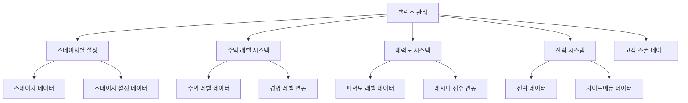
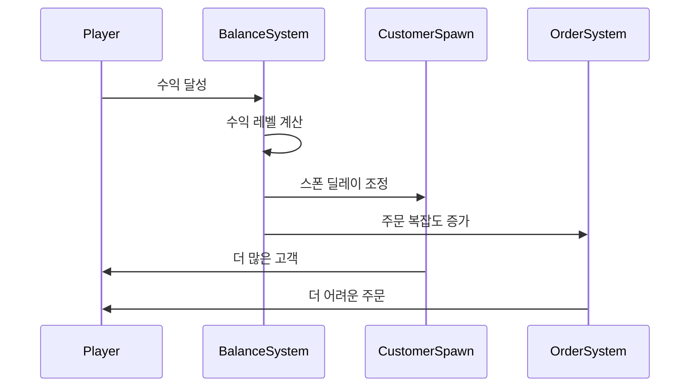

# 밸런스 관리

츄츄버거는 복잡하고 정교한 밸런스 시스템을 통해 플레이어에게 지속적인 도전과 성장의 즐거움을 제공합니다. 이 시스템은 스테이지별 난이도 조절, 수익 레벨 관리, 매력도 시스템, 전략적 선택 등 다층적 구조로 구성되어 있습니다.

## 밸런스 시스템 개요

### 핵심 밸런스 요소



## BalanceDataSetLogic 핵심 시스템

### 밸런스 데이터 로딩

BalanceDataSetLogic은 게임의 모든 밸런스 관련 데이터를 중앙 집중식으로 관리합니다.

```lua
-- BalanceDataSetLogic.mlua :: LoadDataSet()
method void LoadDataSet()
    table.clear(self.StageConfigData)
    local scDataSet = _DataService:GetTable("StageConfigData")
    for i = 1, scDataSet:GetRowCount() do
        local scData = StageConfigData()
        scData:Load(scDataSet, i)
        
        if self.StageConfigData[scData.StageId] ~= nil then
            break
        end
        
        self.StageConfigData[scData.StageId] = scData
    end
    
    self.IsLoadConfigData = true
    
    -- 가게 매력도 레벨 데이터 로딩
    table.clear(self.StoreAttractiveLevelData)
    local aDataSet = _DataService:GetTable("StoreAttractiveLevelData")
    for i = 1, aDataSet:GetRowCount() do
        local aData = StoreAttractiveLevelData()
        aData:Load(aDataSet, i)
        self.StoreAttractiveLevelData[aData.StoreAttractiveLevel] = aData
    end
end
```

### 수익 레벨 설정

```lua
-- BalanceDataSetLogic.mlua :: SetEarningLevelByEarningRecord()
@ExecSpace("Server")
method void SetEarningLevelByEarningRecord(Entity player)
    -- 플레이어의 수익 기록을 바탕으로 수익 레벨 결정
    local currentEarnings = player.PlayerSettlement.BestRecipeEarnings
    local stageId = player.PlayerStage.NowStage
    local stageData = _StageDataSetLogic:GetStageData(stageId)
    
    -- 스테이지별 수익 레벨 데이터에서 적절한 레벨 찾기
    for level, earningData in pairs(stageData.StageEarningLevelData) do
        if currentEarnings >= earningData.BestRecipeEarnings then
            player.PlayerStage.EarningLevel = level
        end
    end
end
```

## 스테이지 시스템

### StageData 구조

각 스테이지는 고유한 특성과 밸런스 설정을 가집니다.

```lua
-- StageData.mlua :: 주요 속성들
struct StageData
    property integer StageId                    -- 스테이지 ID
    property string RecipeTrialId               -- 레시피 대회 ID
    property integer StageClearRewardDiamond    -- 클리어 보상 다이아몬드
    property table StageEarningLevelData        -- 수익 레벨 데이터
    property table StageRankingData             -- 랭킹 데이터
    property integer EmployeeInitLevel          -- 초기 직원 레벨
    property table LessThen1YearCustomerOrderTags -- 신규 고객 주문 태그
    property string Bgm                         -- 배경음악
end
```

#### 스테이지별 수익 레벨 로딩

```lua
-- StageData.mlua :: Load() 중 수익 레벨 데이터 로딩
local seDataSet = _DataService:GetTable("EarningLevelStage"..self.StageId)
if isvalid(seDataSet) then
    for i = 1, seDataSet:GetRowCount() do
        local seData = StageEarningLevelData()
        seData:Load(seDataSet, i)
        
        if self.StageEarningLevelData[seData.EarningLevel] ~= nil then
            break
        end
        
        self.StageEarningLevelData[seData.EarningLevel] = seData
    end
end
```

### StageEarningLevelData 상세

수익 레벨별로 세밀한 밸런스 조정이 가능합니다.

```lua
-- StageEarningLevelData.mlua :: 주요 속성들
struct StageEarningLevelData
    property integer EarningLevel               -- 수익 레벨
    property integer BestRecipeEarnings        -- 최고 레시피 수익 기준
    property integer ServingEmployeeWarningLevel -- 서빙 직원 경고 레벨
    property integer BurgerOrderCountMin       -- 버거 주문 수 최소값
    property integer BurgerOrderCountMax       -- 버거 주문 수 최대값
    property number ExpectedRecipeAttractive   -- 기대 레시피 매력도
    property integer AccumEarnings             -- 누적 수익
    property integer ManagementLevel           -- 연동 경영 레벨
    property integer StoreAttractiveLevel      -- 연동 매력도 레벨
end
```

#### 레벨별 밸런스 조정

```lua
-- StageEarningLevelData.mlua :: Load()
method void Load(any dataTable, integer index)
    local row = dataTable:GetRow(index)
    
    self.EarningLevel = tonumber(row:GetItem("EarningLevel"))
    
    -- 개발 환경에서의 특수 처리
    if Environment:IsMakerPlay() then
        if self.EarningLevel < 1 then
            -- 개발자용 밸런스 조정
        end
    end
    
    self.BestRecipeEarnings = tonumber(row:GetItem("BestRecipeEarnings"))
    self.AccumEarnings = tonumber(row:GetItem("AccumEarnings"))
    self.ServingEmployeeWarningLevel = tonumber(row:GetItem("ServingEmployeeWarningLevel"))
    self.BurgerOrderCountMin = tonumber(row:GetItem("BurgerOrderCountMin"))
    self.BurgerOrderCountMax = tonumber(row:GetItem("BurgerOrderCountMax"))
    self.ExpectedRecipeAttractive = tonumber(row:GetItem("ExpectedRecipeAttractive"))
    self.ManagementLevel = tonumber(row:GetItem("ManagementLevel"))
    self.StoreAttractiveLevel = tonumber(row:GetItem("StoreAttractiveLevel"))
end
```

## 매력도 시스템

### StoreAttractiveLevelData

가게의 매력도는 고객 스폰과 직결되는 중요한 밸런스 요소입니다.

```lua
-- StoreAttractiveLevelData.mlua :: 주요 속성들  
struct StoreAttractiveLevelData
    property integer StoreAttractiveLevel      -- 매력도 레벨
    property number CustomerSpawnDelayMin      -- 고객 스폰 최소 딜레이
    property number CustomerSpawnDelayMax      -- 고객 스폰 최대 딜레이
    property integer MaxCustomerCount          -- 최대 동시 고객 수
    property number CustomerWaitTimeMax        -- 고객 대기 시간 최대값
end
```

#### 매력도 기반 고객 스폰 조절

```lua
-- 매력도에 따른 고객 스폰 딜레이 계산
method number GetCustomerSpawnDelay(integer attractiveLevel)
    local attractiveData = _BalanceDataSetLogic.StoreAttractiveLevelData[attractiveLevel]
    if attractiveData == nil then
        return 5.0  -- 기본값
    end
    
    local minDelay = attractiveData.CustomerSpawnDelayMin
    local maxDelay = attractiveData.CustomerSpawnDelayMax
    
    return _UtilLogic:RandomNumberRange(minDelay, maxDelay)
end
```

## 전략 및 사이드메뉴 시스템

### StrategyData 전략 시스템

플레이어가 선택할 수 있는 다양한 전략적 옵션을 제공합니다.

```lua
-- StrategyData.mlua :: 주요 속성들
struct StrategyData
    property integer Id                        -- 전략 ID
    property string NameKey                    -- 이름 키
    property string DescKey                    -- 설명 키  
    property table LevelEffect                 -- 레벨별 효과
    property table SPCost                      -- SP 비용
    property table RecommendStage              -- 추천 스테이지
    property string OpenCondition             -- 해제 조건
end
```

#### 전략 효과 계산

```lua
-- StrategyEnum.mlua :: GetPlayerStrategyEffect()
method number GetPlayerStrategyEffect(Entity player, integer enum, integer stageId)
    local stLevel = player.PlayerIngameManager.StageStrategy[enum]
    local stEffect = 0
    if stLevel ~= nil then
        local stData = _StrategyDataSetLogic:GetStrategyData(enum)
        if isvalid(stData.LevelEffect[stLevel]) then
            stEffect = stData:GetLevelEffect(stLevel, stageId)
        end    
    end
    
    return stEffect
end
```

### SideMenuData 사이드메뉴 시스템

레시피에 추가적인 효과를 부여하는 사이드메뉴 시스템입니다.

```lua
-- SideMenuData.mlua :: 주요 속성들
struct SideMenuData
    property integer Id                        -- 사이드메뉴 ID
    property string DescKey                    -- 설명 키
    property string IconRUID                   -- 아이콘 RUID
    property table Effect                      -- 주 효과
    property table SubEffect                   -- 부 효과
    property string GetCondition              -- 획득 조건
    property string OpenCondition             -- 해제 조건
    property boolean HideSlot                 -- 슬롯 숨김 여부
end
```

#### 사이드메뉴 효과 적용

```lua
-- StrategyEnum.mlua :: GetSideMenuEffect()
method number GetSideMenuEffect(integer sidemenuId, string effectKey, string effectValue)
    local sideMenuData = _StrategyDataSetLogic:GetSideMenuData(sidemenuId)
    if sideMenuData == nil then
        return 0
    end
    
    -- 효과 키에 따른 값 반환
    for i, effect in ipairs(sideMenuData.Effect) do
        if effect == effectKey then
            return tonumber(sideMenuData.SubEffect[i]) or 0
        end
    end
    
    return 0
end
```

## 난이도 조절 메커니즘

### 동적 난이도 조절

플레이어의 실력과 진행도에 따라 난이도가 자동 조절됩니다.

#### 수익 기반 난이도 조절



#### 매력도 기반 조절

```lua
-- 매력도에 따른 주문 복잡도 계산
method integer CalculateOrderComplexity(Entity player)
    local attractiveLevel = player.PlayerStage.StoreAttractiveLevel
    local earningLevel = player.PlayerStage.EarningLevel
    local stageId = player.PlayerStage.NowStage
    
    local stageData = _StageDataSetLogic:GetStageData(stageId)
    local earningData = stageData:GetStageEarningLevelData(earningLevel)
    
    if earningData == nil then
        return 1  -- 기본 복잡도
    end
    
    local minCount = earningData.BurgerOrderCountMin
    local maxCount = earningData.BurgerOrderCountMax
    
    return _UtilLogic:RandomIntegerRange(minCount, maxCount)
end
```

### 진행도 기반 조절

#### 스테이지별 기준 설정

```lua
-- StageConfigData.mlua :: 스테이지별 설정
struct StageConfigData
    property integer StageId                   -- 스테이지 ID
    property integer BaseCustomerCount        -- 기본 고객 수
    property number BaseCustomerSpawnDelay    -- 기본 스폰 딜레이
    property number BaseOrderComplexity       -- 기본 주문 복잡도
    property number DifficultyMultiplier      -- 난이도 배수
end
```

#### 경영 레벨 연동

```lua
-- 경영 레벨에 따른 유지비 증가
method integer CalculateMaintenanceCost(Entity player)
    local managementLevel = player.PlayerManagement.ManagementLevel
    local baseCost = _ManagementDataSetLogic.MaintenanceCostData["Store"]
    
    -- 경영 레벨이 올라갈수록 유지비 증가
    local multiplier = 1.0 + (managementLevel * 0.1)
    
    return math.floor(baseCost * multiplier)
end
```

## 보상 스케일링 시스템

### 수익 기반 보상

수익 레벨에 따라 보상이 스케일링됩니다.

```lua
-- 수익 레벨 기반 보상 계산
method integer CalculateRewardByEarningLevel(integer baseReward, integer earningLevel)
    local multiplier = 1.0
    
    -- 수익 레벨별 보상 배수
    if earningLevel >= 10 then
        multiplier = 2.0
    elseif earningLevel >= 5 then
        multiplier = 1.5
    elseif earningLevel >= 3 then
        multiplier = 1.2
    end
    
    return math.floor(baseReward * multiplier)
end
```

### 스테이지별 보상 차등

```lua
-- StageData.mlua :: 스테이지 클리어 보상
property integer StageClearRewardDiamond    -- 스테이지 클리어 시 다이아몬드 보상

-- 스테이지가 높을수록 더 많은 보상
-- Stage 1: 100 다이아몬드
-- Stage 2: 200 다이아몬드  
-- Stage 3: 300 다이아몬드
```

## UI 연동 시스템

### UIStageInfo 정보 표시

```lua
-- UIStageInfoStrategy.mlua :: Refresh()
method void Refresh(integer stageId, boolean isStageSetting)
    local player = _UserService.LocalPlayer
    local stageSettingData = {}
    
    if _UtilLogic:IsNilorEmptyString(player.PlayerStage.StageSettingData[stageId]) == false then
        stageSettingData = _HttpService:JSONDecode(player.PlayerStage.StageSettingData[stageId])
    end
    
    local sideMenuId = 0
    if stageId == player.PlayerStage.NowStage then
        sideMenuId = player.PlayerIngameManager.StageSideMenu
    else
        if isvalid(stageSettingData[_StageSettingEnum.SideMenu]) then
            sideMenuId = stageSettingData[_StageSettingEnum.SideMenu]
        end
    end
    
    -- 사이드메뉴 데이터 표시
    local sideMenuData = _StrategyDataSetLogic:GetSideMenuData(sideMenuId)
    -- UI 업데이트 로직...
end
```

### 전략 선택 UI

```lua
-- UIStageSettingStrategy.mlua :: Apply()
method void Apply(integer selectTab)
    local player = _UserService.LocalPlayer
    
    if selectTab == 1 then
        -- 전략 목록 표시
        table.clear(self.OpenedStrategy)
        for id, bool in pairs(player.PlayerCollection.StrategyCollection) do
            if bool == true then
                table.insert(self.OpenedStrategy, id)
            end
        end
        table.sort(self.OpenedStrategy)
        
        self.StrategyList.RecycleScrollView:SetTotalCount(#self.OpenedStrategy)
        
    elseif selectTab == 2 then
        -- 사이드메뉴 목록 표시
        table.clear(self.OpenedSideMenu)
        for id, _ in pairs(_StrategyDataSetLogic.SideMenuData) do
            local data = _StrategyDataSetLogic:GetSideMenuData(id)
            if data.HideSlot == false then
                table.insert(self.OpenedSideMenu, id)
            end
        end
        table.sort(self.OpenedSideMenu)
        
        self.StrategyList.RecycleScrollView:SetTotalCount(#self.OpenedSideMenu)
    end
    
    self.CurrentList.RecycleScrollView:SetTotalCount(#table.keys(self.SelectedStrategy))
end
```

## 밸런스 튜닝 도구

### 데이터 기반 튜닝

모든 밸런스 값은 CSV 데이터로 외부화되어 있어 빠른 조정이 가능합니다.

#### 주요 데이터 테이블들
- **StageConfigData**: 스테이지별 기본 설정
- **EarningLevelStageX**: 스테이지별 수익 레벨 데이터
- **StoreAttractiveLevelData**: 매력도 레벨별 설정
- **StrategyData**: 전략별 효과 데이터
- **SideMenuData**: 사이드메뉴별 효과 데이터

#### 실시간 밸런스 모니터링

```lua
-- 개발자용 밸런스 모니터링
method void DebugBalanceInfo(Entity player)
    local earningLevel = player.PlayerStage.EarningLevel
    local attractiveLevel = player.PlayerStage.StoreAttractiveLevel
    local managementLevel = player.PlayerManagement.ManagementLevel
    
    print(string.format("EarningLevel: %d, AttractiveLevel: %d, ManagementLevel: %d", 
          earningLevel, attractiveLevel, managementLevel))
          
    -- 현재 적용된 전략들 출력
    for strategyId, level in pairs(player.PlayerIngameManager.StageStrategy) do
        local strategyData = _StrategyDataSetLogic:GetStrategyData(strategyId)
        local effect = strategyData:GetLevelEffect(level, player.PlayerStage.NowStage)
        print(string.format("Strategy %d Level %d: Effect %f", strategyId, level, effect))
    end
end
```

## 개발자를 위한 가이드

### 새로운 밸런스 요소 추가

1. **데이터 구조 정의**: 새로운 Struct 생성
2. **CSV 테이블 작성**: 밸런스 값들을 CSV로 정의
3. **DataSetLogic 구현**: 데이터 로딩 로직 작성
4. **적용 로직 구현**: 게임 시스템에 밸런스 적용
5. **UI 연동**: 필요시 UI에 정보 표시

### 밸런스 테스트

1. **단계적 테스트**: 각 레벨별로 개별 테스트
2. **경계값 테스트**: 최소/최대값에서의 동작 확인
3. **플레이 테스트**: 실제 게임플레이를 통한 체감 확인
4. **데이터 분석**: 로그를 통한 정량적 분석

### 성능 고려사항

1. **캐싱**: 자주 사용되는 계산 결과는 캐시
2. **지연 로딩**: 필요한 시점에만 데이터 로딩
3. **메모리 관리**: 사용하지 않는 데이터는 해제

## 코드 참조

### 밸런스 데이터 관리
- `RootDesk/MyDesk/Common/Balance/BalanceDataSetLogic.mlua :: LoadDataSet(), SetEarningLevelByEarningRecord()` — 밸런스 데이터 중앙 관리
- `RootDesk/MyDesk/Common/Balance/StageEarningLevelData.mlua :: Load()` — 수익 레벨별 밸런스 데이터
- `RootDesk/MyDesk/Common/Balance/StoreAttractiveLevelData.mlua :: Load()` — 매력도 레벨별 밸런스 데이터

### 스테이지 시스템  
- `RootDesk/MyDesk/16. Stage/Data/StageDataSetLogic.mlua :: LoadDataSet(), GetStageData()` — 스테이지 데이터 관리
- `RootDesk/MyDesk/16. Stage/Data/StageData.mlua :: Load(), GetStageEarningLevelData()` — 스테이지별 상세 설정

### 전략 시스템
- `RootDesk/MyDesk/16. Stage/Data/StrategyDataSetLogic.mlua :: LoadDataSet(), GetStrategyData()` — 전략 데이터 관리  
- `RootDesk/MyDesk/16. Stage/Data/StrategyEnum.mlua :: GetPlayerStrategyEffect(), GetSideMenuEffect()` — 전략 효과 계산
- `RootDesk/MyDesk/16. Stage/Data/SideMenuData.mlua :: Load()` — 사이드메뉴 데이터 구조

### UI 시스템
- `RootDesk/MyDesk/16. Stage/UI/UIStageInfoStrategy.mlua :: Refresh()` — 스테이지 전략 정보 표시
- `RootDesk/MyDesk/16. Stage/UI/UIStageSettingStrategy.mlua :: Apply(), OnSelectTab()` — 전략 선택 UI

### 핵심 인터페이스
```lua
-- BalanceDataSetLogic 주요 메소드
method void LoadDataSet()
method void SetEarningLevelByEarningRecord(Entity player)

-- StageData 주요 메소드
method void Load(any dataTable, integer index)
method StageEarningLevelData GetStageEarningLevelData(integer level)

-- StrategyEnum 주요 메소드
method number GetPlayerStrategyEffect(Entity player, integer enum, integer stageId)
method number GetSideMenuEffect(integer sidemenuId, string effectKey, string effectValue)

-- StrategyDataSetLogic 주요 메소드
method StrategyData GetStrategyData(integer id)
method SideMenuData GetSideMenuData(integer id)
method string GetStrategyDescText(integer id, integer nowLevel, boolean concat, integer stageId)
```
