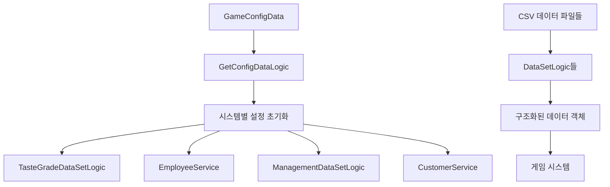

# 설정 데이터

츄츄버거는 복잡한 게임 시스템을 유연하게 조정하기 위해 포괄적인 데이터 관리 시스템을 구축했습니다. 이 시스템은 CSV 기반 데이터 테이블과 중앙집중식 설정 관리를 통해 게임 밸런스와 기능을 효율적으로 제어합니다.

## 데이터 시스템 개요

### 데이터 아키텍처



## GetConfigDataLogic 시스템

### 중앙 설정 관리자

GetConfigDataLogic은 GameConfigData 테이블의 키-값 쌍을 관리하는 핵심 설정 시스템입니다.

#### 설정 초기화

OnBeginPlay() 메서드에서 중앙집중식 설정 관리를 수행합니다:

1. **데이터 로드**: GameConfigData 테이블에서 모든 설정값 로드
2. **시스템 적용**: 각 시스템에 설정값 배포
3. **환경별 초기화**: 클라이언트/서버 별도 초기화

핵심 로직: `self.ConfigValues[key] = value`

<details>
<summary>설정 초기화 구현</summary>

```lua
-- RootDesk/MyDesk/Common/GetConfigDataLogic.mlua :: OnBeginPlay()
method void OnBeginPlay()
    local config = _DataService:GetTable("GameConfigData")
    for i = 1, config:GetRowCount() do
        local row = config:GetRow(i)
        local key = row:GetItem("ConfigType")
        local value = row:GetItem("ConfigValue")
        
        if not _UtilLogic:IsNilorEmptyString(key) then
            self.ConfigValues[key] = value
        end    
    end
    
    -- 시스템별 설정 값 적용
    _TasteGradeDataSetLogic.FinalBalancePenalty = self:GetConfigNumDataByKey("RecipeBalanceFailPenalty")
    _TasteGradeDataSetLogic.BunTypeBonus = self:GetConfigNumDataByKey("RecipeBunCombinationBonus")
    _TasteGradeDataSetLogic.MaxTasteScoreCap = self:GetConfigNumDataByKey("RecipeMaxScore")
    
    _SettlementUIService.GraphHightMin = self:GetConfigNumDataByKey("GraphHeightMinValue")
    _CustomerService.tipRemoveTime = self:GetConfigNumDataByKey("TipLifeTimeOnTheFloor")
    
    -- 클라이언트/서버별 초기화
    if self:IsClient() then
        _EmployeeService:LoadConfigData(_UserService.LocalPlayer.PlayerComponent.UserId)
        _ManagementDataSetLogic:LoadConfigData(_UserService.LocalPlayer.PlayerComponent.UserId)
    end
    
    if self:IsServer() then
        _ManagementDataSetLogic:LoadConfigData()    
        _CustomerService:LoadDataOnServer()
    end
end
```
</details>

#### 설정 값 조회

```lua
-- GetConfigDataLogic.mlua :: GetConfigNumDataByKey()
method number GetConfigNumDataByKey(string key)
    local data = self.ConfigValues[key]
    return tonumber(data)
end
```

### 설정 적용 예시

#### 레시피 시스템 설정
- `RecipeBalanceFailPenalty`: 밸런스 실패 시 페널티
- `RecipeBunCombinationBonus`: 번 조합 보너스
- `RecipeMaxScore`: 최대 맛 점수 한도

#### 직원 시스템 설정
- `WorkDurationMin/Max`: 작업 시간 범위
- `WorkProgressConstant1~4`: 작업 진행 상수들
- `CookEmployeeWarningWorkDuration`: 요리 직원 경고 시간

#### 고객 시스템 설정
- `TipLifeTimeOnTheFloor`: 바닥 팁 생존 시간

## DataSetLogic 시스템

### 공통 패턴

모든 DataSetLogic은 다음과 같은 공통 패턴을 따릅니다:

모든 DataSetLogic은 일관된 패턴을 따릅니다:

1. **OnBeginPlay()**: LoadDataSet() 호출
2. **LoadDataSet()**: CSV 데이터를 구조체로 변환
3. **중복 방지**: 동일 ID 데이터 중복 방지

<details>
<summary>공통 DataSetLogic 패턴 구현</summary>

```lua
-- 공통 DataSetLogic 패턴
method void OnBeginPlay()
    self:LoadDataSet()
end

method void LoadDataSet()
    table.clear(self.DataTable)
    local dataSet = _DataService:GetTable("DataTableName")
    for i = 1, dataSet:GetRowCount() do
        local data = DataStructure()
        data:Load(dataSet, i)
        
        if self.DataTable[data.Id] ~= nil then
            break  -- 중복 방지
        end
        
        self.DataTable[data.Id] = data
    end
end
```
</details>

### 주요 DataSetLogic들

#### IngredientDataSetLogic
재료와 번 데이터를 관리합니다.

```lua
-- IngredientDataSetLogic.mlua :: LoadDataSet()
method void LoadDataSet()
    table.clear(self.IngredientData)
    local ingreDataSet = _DataService:GetTable("IngredientData")
    for i = 1, ingreDataSet:GetRowCount() do
        local ingreData = IngredientData()
        ingreData:Load(ingreDataSet, i)
        
        if self.IngredientData[ingreData.Index] ~= nil then
            break
        end
    
        self.IngredientData[ingreData.Index] = ingreData
    end
    
    -- 번 데이터 처리 (복잡한 구조)
    table.clear(self.BunData)
    local bunDataSet = _DataService:GetTable("BunData")
    local bunDatas = {}
    for i = 1, bunDataSet:GetRowCount() do
        local index = tonumber(bunDataSet:GetRow(i):GetItem("Index"))
        if not isvalid(bunDatas[index]) then
            bunDatas[index] = {}
        end
        
        local type = bunDataSet:GetRow(i):GetItem("Type")
        bunDatas[index][type] = bunDataSet:GetRow(i)
        bunDatas[index]["Tag"] = bunDataSet:GetRow(i):GetItem("Tag")
        bunDatas[index]["Grade"] = bunDataSet:GetRow(i):GetItem("Grade")
    end
    
    for k, v in pairs(bunDatas) do
        local bunData = BunData()
        bunData:Load(v, k)
        self.BunData[bunData.Index] = bunData
    end
end
```

#### BalanceDataSetLogic
게임 밸런스 관련 데이터를 관리합니다.

```lua
-- BalanceDataSetLogic.mlua :: LoadDataSet()
method void LoadDataSet()
    table.clear(self.StageConfigData)
    local scDataSet = _DataService:GetTable("StageConfigData")
    for i = 1, scDataSet:GetRowCount() do
        local scData = StageConfigData()
        scData:Load(scDataSet, i)
        
        if self.StageConfigData[scData.StageId] ~= nil then
            break
        end
        
        self.StageConfigData[scData.StageId] = scData
    end
    
    self.IsLoadConfigData = true
    
    table.clear(self.StoreAttractiveLevelData)
    local aDataSet = _DataService:GetTable("StoreAttractiveLevelData")
    for i = 1, aDataSet:GetRowCount() do
        local aData = StoreAttractiveLevelData()
        aData:Load(aDataSet, i)
        self.StoreAttractiveLevelData[aData.StoreAttractiveLevel] = aData
    end
end
```

#### TrialDataSetLogic
대회 시스템 데이터를 관리합니다.

```lua
-- TrialDataSetLogic.mlua :: LoadDataSet()
method void LoadDataSet()
    table.clear(self.TrialData)
    local dataSet = _DataService:GetTable("TrialDataSet")
    
    for i = 1, dataSet:GetRowCount() do
        local data = TrialData()
        data:Load(dataSet, i)
        
        if self.TrialData[data.Id] ~= nil then
            break
        end
        
        self.TrialData[data.Id] = data
    end
    
    -- 승리 가중치 데이터 추가 로딩
    table.clear(self.WinningWeightData)
    local wDataSet = _DataService:GetTable("TrialWinningWeightData")
    for i = 1, wDataSet:GetRowCount() do
        local row = wDataSet:GetRow(i)
        local data = {}
        data["StatPerReq"] = tonumber(row:GetItem("StatPerRequirement"))
        data[1] = tonumber(row:GetItem("1"))
        data[2] = tonumber(row:GetItem("2"))
        data[3] = tonumber(row:GetItem("3"))
        table.insert(self.WinningWeightData, data)
    end
end
```

## ManagementDataSetLogic 경영 시스템

### 경영 레벨 데이터

```lua
-- ManagementDataSetLogic.mlua :: LoadDataSet()
method void LoadDataSet()
    table.clear(self.ManagementLevelData)
    local levelData = _DataService:GetTable("ManagementLevelData")
    for i = 1, levelData:GetRowCount() do
        local data = ManagementLevelData()
        data:Load(levelData, i)
        
        if self.ManagementLevelData[data.Level] ~= nil then
            break
        end
        
        self.ManagementLevelData[data.Level] = data
    end
    
    table.clear(self.MaintenanceCostData)
    
    local costData = _DataService:GetTable("MaintenanceCostDataSet") 
    for i =1 , costData:GetRowCount() do
        local type = costData:GetCell(i,"MaintenanceType") 
        local value = tonumber(costData:GetCell(i,"MaintenanceCost"))
        self.MaintenanceCostData[type] = value
    end    
end
```

### 설정 데이터 로딩

```lua
-- ManagementDataSetLogic.mlua :: LoadConfigData()
method void LoadConfigData()
    table.clear(self.ApplianceCountSectionValue)    
    table.clear(self.ApplianceLevelSectionRate)
    table.clear(self.DisplayLevelSectionValue)
    
    for i = 1 , self.ApplianceScectionNum do 
        self.ApplianceCountSectionValue[i] = _GetConfigDataLogic:GetConfigNumDataByKey("ApplianceCount"..tostring(i))
        self.ApplianceLevelSectionRate[i] = _GetConfigDataLogic:GetConfigNumDataByKey("ApplianceLevelRate"..tostring(i))
        self.DisplayLevelSectionValue[i] = _GetConfigDataLogic:GetConfigNumDataByKey("DisplayLevelSection"..tostring(i))
    end    
end
```

### 유지비용 계산

```lua
-- ManagementDataSetLogic.mlua :: ReturnMaintenance()
method integer ReturnMaintenance(Entity player)
    -- 가게 임대료 계산
    local storeCost = self.MaintenanceCostData["Store"]
    
    -- 직원 급여 계산
    local employeeCost = 0
    for employeeId, _ in pairs(player.EmployeeManager.EmployeeData) do
        local employeeData = _EmployeeService:GetData(employeeId)
        employeeCost = employeeCost + employeeData.Salary
    end
    
    -- 시설 유지비 계산
    local facilityCost = self:CalculateFacilityCost(player)
    
    return storeCost + employeeCost + facilityCost
end
```

## 경영 UI 시스템

### UIHUDManagement

HUD에 표시되는 경영 정보를 관리합니다.

#### UI 갱신

```lua
-- UIHUDManagement.mlua :: Refresh()
method void Refresh()
    local player = _UserService.LocalPlayer
    local isUnlock = _UIButtonUnlockLogic:IsButtonUnlocked(_ButtonUnlockEnum.HUDManagement, player)
    if isUnlock == false then
        -- 잠금 상태 UI
        self.GradeBG.Entity.Enable = false
        self.GaugeParent.Enable = false
        self.RedDot.Enable = false
        self.Maple.Enable = true
        self.GradeIcon.Entity.Enable = false
        return
    end
    
    -- 해제 상태 UI
    self.GradeBG.Entity.Enable = true
    self.GaugeParent.Enable = true
    self.Maple.Enable = false
    self.GradeIcon.Entity.Enable = true
    
    local playerLevel = player.PlayerManagement.ManagementLevel
    local managementMaxLevel = player.PlayerStage.NowStage == 1 and 2 or _ManagementDataSetLogic.ManagementMaxLevel
    
    local levelData = _ManagementDataSetLogic:GetManagementLevelData(playerLevel)
    self.GradeIcon.ImageRUID = levelData.IconRUID
    
    -- 목표 달성률 계산
    local canLevelUp = true
    local goalCount = 0
    for k, v in pairs(player.PlayerManagement.CurrentGoals) do
        if v then
            goalCount = goalCount + 1
        else
            canLevelUp = false
        end
    end
    
    local goalPercent = 0.25 * goalCount
    if playerLevel+1 > managementMaxLevel then
        canLevelUp = false
        goalPercent = 1
    end
    
    -- UI 설정
    self.Gauge.Color = levelData.HUDGaugeColor
    self.Gauge.FillAmount = goalPercent
    self.GradeBG.Color = levelData.HUDBackColor
    
    if canLevelUp then
        self.RedDot.Enable = true
    else
        self.RedDot.Enable = false
    end
end
```

### UIManagement

경영 화면의 메인 UI를 관리합니다.

#### 애니메이션이 포함된 UI 열기

```lua
-- UIManagement.mlua :: Open()
method void Open()
    if self.Entity.Parent.Enable then
        return
    end
    
    _UIGroupManager:EnableManagementGroup(true)
    self:Refresh()
    
    -- 초기 알파 설정
    self.GradeIcon.CanvasGroupComponent.GroupAlpha = 0
    self.CloseBtn.CanvasGroupComponent.GroupAlpha = 0
    self.Contents.CanvasGroupComponent.GroupAlpha = 0
    self._T.isProcessing = true
    
    _SoundService:PlaySound(_ResourceManager.SFXTable["Open_Management"], 1)
    
    -- 순차적 애니메이션
    _UIEntityService:PlayUIOpenAnim(self.Entity, self.Entity.UITransformComponent.anchoredPosition, Vector2.down, 0.6, nil, nil, "CubicEaseOut", nil)
    _TimerService:SetTimerOnce(function()
        _UIEntityService:PlayUIOpenAnim(self.Contents, self.Contents.UITransformComponent.anchoredPosition, Vector2.up, 0.6, nil, Vector2(100, 100), "Linear", nil)
        
        _TimerService:SetTimerOnce(function()
            _UIEntityService:PlayUIOpenAnim(self.CloseBtn, self.CloseBtn.UITransformComponent.anchoredPosition, Vector2.down, 0.6, nil, Vector2(50, 50), nil, nil)
            
            _TimerService:SetTimerOnce(function()
                _UIEntityService:PlayUIOpenAnim(self.GradeIcon, self.GradeIcon.UITransformComponent.anchoredPosition, Vector2.right, 0.6, nil, Vector2(50, 50), nil, function()
                    self._T.isProcessing = false
                end)
            end, 0.2)        
        end, 0.2)
        
    end, 0.2)
end
```

## 데이터 구조 예시

### TasteGradeData
레시피 맛 등급 데이터:
```lua
struct TasteGradeData
    property integer Index         -- 등급 인덱스
    property integer GradeValue    -- 등급 기준 점수
    property integer AttractiveScore -- 매력도 점수
    property string GradeName      -- 등급 이름
end
```

### ManagementLevelData
경영 레벨 데이터:
```lua
struct ManagementLevelData
    property integer Level         -- 경영 레벨
    property string IconRUID       -- 아이콘 RUID
    property Color HUDGaugeColor   -- HUD 게이지 색상
    property Color HUDBackColor    -- HUD 배경 색상
    property string NameKey        -- 이름 키
end
```

### StageConfigData
스테이지 설정 데이터:
```lua
struct StageConfigData
    property integer StageId       -- 스테이지 ID
    property integer MaxCustomers  -- 최대 고객 수
    property number SpawnDelay     -- 스폰 딜레이
    property number BaseAttractiveness -- 기본 매력도
end
```

## 설정 관리 모범 사례

### 1. 중앙집중식 설정
모든 게임 상수는 GameConfigData 테이블에 집중:
```csv
ConfigType,ConfigValue
RecipeBalanceFailPenalty,-10
RecipeBunCombinationBonus,5
RecipeMaxScore,100
WorkDurationMin,3
WorkDurationMax,8
```

### 2. 타입 안전성
설정값 접근 시 타입 변환 처리:
```lua
method number GetConfigNumDataByKey(string key)
    local data = self.ConfigValues[key]
    return tonumber(data)  -- 안전한 숫자 변환
end
```

### 3. 초기화 순서 관리
의존성을 고려한 초기화 순서:
1. GetConfigDataLogic 먼저 초기화
2. 기본 DataSetLogic들 초기화
3. 설정값이 필요한 시스템들 초기화

### 4. 클라이언트/서버 분리
```lua
if self:IsClient() then
    _EmployeeService:LoadConfigData(_UserService.LocalPlayer.PlayerComponent.UserId)
elseif self:IsServer() then
    _CustomerService:LoadDataOnServer()
end
```

## 개발 워크플로우

### 1. 새 설정 추가
1. GameConfigData.csv에 새 키-값 쌍 추가
2. GetConfigDataLogic에 초기화 코드 추가
3. 해당 시스템에서 설정값 사용

### 2. 새 데이터 테이블 추가
1. CSV 파일 생성
2. 데이터 구조체 정의 (mlua 파일)
3. DataSetLogic 생성
4. LoadDataSet 메소드 구현
5. 접근 메소드들 구현

### 3. 데이터 변경 시 주의사항
- 기존 데이터와의 호환성 고려
- 중복 방지 로직 구현
- 에러 처리 및 폴백 값 준비

## 성능 고려사항

### 1. 로딩 최적화
- 게임 시작 시 한 번만 로딩
- 필요한 데이터만 메모리에 유지
- 중복 데이터 방지

### 2. 메모리 관리
- table.clear()로 메모리 해제
- 사용하지 않는 데이터 구조 정리
- 대용량 데이터는 필요시에만 로딩

### 3. 접근 최적화
- ID 기반 해시 테이블 사용
- 빈번한 조회는 캐시 고려
- 불필요한 데이터 변환 최소화

## 코드 참조

### 설정 관리 시스템
- `RootDesk/MyDesk/Common/GetConfigDataLogic.mlua :: OnBeginPlay(), GetConfigNumDataByKey()` — 중앙 설정 관리
- `RootDesk/MyDesk/Common/GameConfigData.userdataset` — 게임 설정 데이터 테이블

### DataSetLogic 시스템들
- `RootDesk/MyDesk/04. Recipe/Data/IngredientDataSetLogic.mlua :: LoadDataSet()` — 재료 데이터 관리
- `RootDesk/MyDesk/Common/Balance/BalanceDataSetLogic.mlua :: LoadDataSet()` — 밸런스 데이터 관리
- `RootDesk/MyDesk/10. Trial/Data/TrialDataSetLogic.mlua :: LoadDataSet()` — 대회 데이터 관리

### 경영 시스템
- `RootDesk/MyDesk/09. Management/ManagementDataSetLogic.mlua :: LoadDataSet(), LoadConfigData()` — 경영 데이터 관리
- `RootDesk/MyDesk/09. Management/UIHUDManagement.mlua :: Refresh()` — HUD 경영 정보 표시
- `RootDesk/MyDesk/09. Management/UIManagement.mlua :: Open(), Refresh()` — 경영 UI 관리

### 핵심 인터페이스
```lua
-- GetConfigDataLogic 주요 메소드
method number GetConfigNumDataByKey(string key)

-- 공통 DataSetLogic 패턴
method void OnBeginPlay()
method void LoadDataSet()

-- ManagementDataSetLogic 주요 메소드
method void LoadConfigData()
method integer ReturnMaintenance(Entity player)
method ManagementLevelData GetManagementLevelData(integer level)

-- UI 시스템 주요 메소드
method void Refresh()  -- 데이터 기반 UI 갱신
method void Open()     -- 애니메이션과 함께 UI 열기
```
