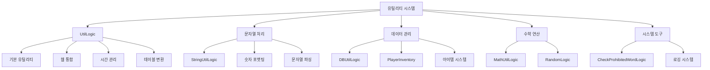

# 유틸리티 도구

츄츄버거는 개발 효율성과 코드 품질을 위해 다양한 유틸리티 도구와 공통 함수들을 제공합니다. 이러한 도구들은 문자열 처리, 수학 연산, 데이터 변환, 인벤토리 관리 등 게임 개발의 모든 영역에서 활용되며, 일관성 있는 코드 작성을 도와줍니다.

## 유틸리티 시스템 개요

### 핵심 유틸리티 아키텍처



## UtilLogic 네이티브 유틸리티

### 기본 문자열 처리

MapleStory Worlds에서 제공하는 강력한 문자열 처리 도구들입니다.

```lua
-- 문자열 포함 확인
local hasWord = _UtilLogic:Contains("Hello World", "World")  -- true
print("Contains check: " .. tostring(hasWord))

-- 문자열 삽입
local inserted = _UtilLogic:Insert("Hello!", 6, " World")  -- "Hello World!"
print("Inserted string: " .. inserted)

-- 문자열 분할
local parts = _UtilLogic:Split("apple,banana,orange", ",")
for i, part in ipairs(parts) do
    print("Part " .. i .. ": " .. part)
end
-- 결과: "apple", "banana", "orange"

-- 문자열 교체
local replaced = _UtilLogic:Replace("Hello World", "World", "Universe")
print("Replaced: " .. replaced)  -- "Hello Universe"

-- 공백 제거
local trimmed = _UtilLogic:Trim("  Hello World  ")
print("Trimmed: '" .. trimmed .. "'")  -- "Hello World"
```

#### 고급 문자열 처리

```lua
-- 부분 문자열 추출
local substring = _UtilLogic:SubString("Hello World", 7, 5)  -- "World"
print("Substring: " .. substring)

-- 앞뒤 공백 제거 (개별)
local startTrimmed = _UtilLogic:TrimStart("  Hello")  -- "Hello"
local endTrimmed = _UtilLogic:TrimEnd("World  ")      -- "World"

-- 빈 문자열 확인
local isEmpty = _UtilLogic:IsNilorEmptyString("")     -- true
local isEmpty2 = _UtilLogic:IsNilorEmptyString(nil)   -- true
local isEmpty3 = _UtilLogic:IsNilorEmptyString("Hi")  -- false
```

### 테이블과 문자열 변환

```lua
-- 테이블을 문자열로 변환
local myTable = {name = "김철수", age = 25, score = 100}
local tableString = _UtilLogic:TableToString(myTable)
print("Table as string: " .. tableString)

-- 문자열을 테이블로 변환
local restoredTable = _UtilLogic:StringToTable(tableString)
print("Restored name: " .. restoredTable.name)

-- 기존 테이블에 문자열 데이터 로드
local targetTable = {}
_UtilLogic:StringToTable(targetTable, tableString)
print("Loaded age: " .. targetTable.age)
```

### 시간 관리

```lua
-- 경과 시간 확인
local elapsedTime = _UtilLogic.ElapsedSeconds
print("Client elapsed time: " .. elapsedTime .. " seconds")

local serverTime = _UtilLogic.ServerElapsedSeconds
print("Server elapsed time: " .. serverTime .. " seconds")

-- 로컬 시간 변환 (클라이언트 전용)
@ExecSpace("ClientOnly")
local function GetLocalTime()
    local utcTime = DateTime.UtcNow
    local localTime = _UtilLogic:GetLocalTimeFrom(utcTime)
    
    print("UTC Time: " .. tostring(utcTime))
    print("Local Time: " .. tostring(localTime))
    
    return localTime
end
```

### 웹 연동 기능

```lua
-- URL 열기 (클라이언트 전용)
@ExecSpace("Client")
local function OpenExternalLink()
    _UtilLogic:OpenUrl("https://www.example.com")
end

-- 웹뷰 팝업 열기 (클라이언트 전용)
@ExecSpace("ClientOnly")
local function ShowWebPopup()
    _UtilLogic:OpenWebViewPopup("게임 가이드", "https://guide.example.com", true)
end

-- 웹뷰 팝업 닫기
@ExecSpace("ClientOnly")
local function CloseWebPopup()
    _UtilLogic:CloseWebViewPopup()
end
```

### 랜덤 함수

```lua
-- 범위 내 랜덤 정수
local randomNum = _UtilLogic:RandomIntegerRange(1, 100)
print("Random number (1-100): " .. randomNum)

-- 랜덤 실수 (0.0 ~ 1.0)
local randomFloat = _UtilLogic:RandomNumber()
print("Random float: " .. randomFloat)

-- 테이블 셔플
local numbers = {1, 2, 3, 4, 5}
local shuffled = _UtilLogic:ShuffleTable(numbers)
for i, num in ipairs(shuffled) do
    print("Shuffled " .. i .. ": " .. num)
end
```

### 파일 관리 (클라이언트 전용)

```lua
-- 파일에 라인 추가
@ExecSpace("ClientOnly")
local function WriteToFile()
    local lines = {"Line 1", "Line 2", "Line 3"}
    _UtilLogic:AppendFileLines("game_log.txt", lines)
end

-- 파일 읽기
@ExecSpace("ClientOnly")
local function ReadFromFile()
    local content = _UtilLogic:ReadFileLines("game_log.txt")
    for i, line in ipairs(content) do
        print("File line " .. i .. ": " .. line)
    end
end
```

## StringUtilLogic 문자열 전용 도구

### 숫자 포맷팅 시스템

게임에서 자주 사용되는 숫자 표시 기능들을 제공합니다.

#### 천 단위 구분자

```lua
-- StringUtilLogic.mlua :: ReturnThousandsSeparatedString()
method string ReturnThousandsSeparatedString(integer value)
    if value == 0 then return "0" end
    
    local sign = value < 0 and "-" or ""
    value = math.abs(value)
    
    local prev_string = tostring(value)
    local pos = string.len(prev_string) % 3
    
    if pos == 0 then 
        pos = 3 
    end
        
    local new_string = string.sub(prev_string, 1, pos)..string.gsub(string.sub(prev_string, pos + 1), "(...)", ",%1") 
    
    return sign..new_string
end

-- 사용 예시
local formatted = _StringUtilLogic:ReturnThousandsSeparatedString(1234567)
print(formatted)  -- "1,234,567"

local negative = _StringUtilLogic:ReturnThousandsSeparatedString(-999999)
print(negative)   -- "-999,999"
```

#### K/M/B 단위 변환

```lua
-- StringUtilLogic.mlua :: FormatNumber()
method string FormatNumber(integer value)
    function formatNumberWithKMB(number)
        local result
        
        if number >= 1000000000 then
            local billions = number / 1000000000	
            result = customFormatString(billions).."B"
                            
        elseif number >= 1000000 then
            local millions = number / 1000000
            result = customFormatString(millions).."M"
                
         elseif number >= 1000 then
            local thousands = number / 1000
            result = customFormatString(thousands).."K"
                
      	 else
            result = tostring(number)
        end
        
        return result
    end
    
    return formatNumberWithKMB(value)
end

-- 사용 예시
local formatted1 = _StringUtilLogic:FormatNumber(1500)      -- "1.5K"
local formatted2 = _StringUtilLogic:FormatNumber(2500000)   -- "2.5M"
local formatted3 = _StringUtilLogic:FormatNumber(3200000000) -- "3.2B"
```

#### 구분자 제거

```lua
-- StringUtilLogic.mlua :: ReturnOriginString()
method string ReturnOriginString(string value)
    local prev_string = tostring(value)
    if not _UtilLogic:Contains(prev_string, ",") then 
        return prev_string 
    end
    
    while _UtilLogic:Contains(prev_string, ",") do
        prev_string = _UtilLogic:Replace(prev_string, ",", "")
    end
    
    return prev_string
end

-- 사용 예시
local original = _StringUtilLogic:ReturnOriginString("1,234,567")
print(original)  -- "1234567"
local number = tonumber(original)  -- 1234567
```

### 아이템 문자열 파싱

```lua
-- StringUtilLogic.mlua :: ParseItemsStringToItemTable()
method SyncTable<string, integer> ParseItemsStringToItemTable(string itemsString)
    local result = {} 
    for pair in itemsString:gmatch("([^:]+)") do
        local foundIndex, _ = string.find(pair, ",")
        if foundIndex == nil then
            continue
        end
        local key = string.sub(pair, 1, foundIndex - 1)
        local value = tonumber(string.sub(pair, foundIndex + 1))
        result[key] = value
    end
    
    return result
end

-- 사용 예시
local itemString = "G0001,1000:M4001,5:M4002,3:"
local itemTable = _StringUtilLogic:ParseItemsStringToItemTable(itemString)
-- 결과: {["G0001"] = 1000, ["M4001"] = 5, ["M4002"] = 3}

for itemId, count in pairs(itemTable) do
    print("Item: " .. itemId .. ", Count: " .. count)
end
```

### 타입 변환 유틸리티

```lua
-- 숫자를 문자열로
local numStr = _StringUtilLogic:NumToString(42.7)  -- "42"
print("Number to string: " .. numStr)

-- 문자열을 정수로
local intNum = _StringUtilLogic:StringToInt("123")  -- 123
print("String to int: " .. intNum)

-- 문자열을 Boolean으로
local bool1 = _StringUtilLogic:GetBoolByString("true", false)   -- true
local bool2 = _StringUtilLogic:GetBoolByString("false", true)   -- false
local bool3 = _StringUtilLogic:GetBoolByString("", true)        -- true (기본값)
local bool4 = _StringUtilLogic:GetBoolByString("TRUE", false)   -- true
```

### 테이블 처리

```lua
-- SyncTable을 문자열로 변환
local syncTable = {"apple", "banana", "cherry"}
local csvString = _StringUtilLogic:GetSyncTableVStr(syncTable)
print("CSV string: " .. csvString)  -- "apple,banana,cherry"

-- 테이블 셔플
local items = {"sword", "shield", "potion", "scroll"}
local shuffled = _StringUtilLogic:ShuffleStringTable(items)
-- 결과: 랜덤하게 섞인 순서
```

### 시간 포맷팅

```lua
-- UTC 시간을 RFC3339 형식으로
local utcTime = os.time()
local rfc3339 = _StringUtilLogic:get_utc_time_rfc3339_format(utcTime)
print("RFC3339 format: " .. rfc3339)  -- "2024-01-15T14:30:25Z"
```

### 리소스 RUID 관리

StringUtilLogic은 자주 사용되는 리소스들의 RUID를 상수로 관리합니다.

```lua
-- 공통 RUID들
local emptyIcon = _StringUtilLogic.EmptyRUID           -- 빈 아이콘
local starIcon = _StringUtilLogic.StarRUID             -- 별 아이콘  
local burgerIcon = _StringUtilLogic.BurgerRUID         -- 버거 아이콘
local emptyStarIcon = _StringUtilLogic.EmptyStarRUID   -- 빈 별 아이콘

-- 시간대별 아이콘
local morningIcon = _StringUtilLogic.MorningIconRuid   -- 아침 아이콘
local afternoonIcon = _StringUtilLogic.AfternoonIconRuid -- 오후 아이콘  
local nightIcon = _StringUtilLogic.NightIconRuid       -- 밤 아이콘

-- 재질
local grayMaterial = _StringUtilLogic.GrayScaleMaterial -- 회색조 재질

-- UI에서 사용
local function SetTimeIcon(timeOfDay)
    local iconRUID
    if timeOfDay >= 6 and timeOfDay < 12 then
        iconRUID = _StringUtilLogic.MorningIconRuid
    elseif timeOfDay >= 12 and timeOfDay < 18 then
        iconRUID = _StringUtilLogic.AfternoonIconRuid
    else
        iconRUID = _StringUtilLogic.NightIconRuid
    end
    
    timeIconSprite.SpriteGUIRendererComponent.ImageRUID = iconRUID
end
```

## DBUtilLogic 데이터베이스 유틸리티

### 안전한 데이터 추출

데이터베이스나 테이블에서 값을 안전하게 추출하는 도구들입니다.

```lua
-- DBUtilLogic.mlua :: 안전한 값 추출
method number GetNumberByTable(table dataTable, string key, integer defaultValue)
    local value = dataTable[key]
    if value == nil then
        return defaultValue
    end
    return tonumber(value)
end

method string GetStringByTable(table dataTable, string key, string defaultValue)
    local value = dataTable[key]
    if value == nil then
        return defaultValue
    end
    return value
end

-- 사용 예시
local playerData = {
    name = "김철수",
    level = "25",
    exp = "1500"
}

-- 안전한 값 추출 (기본값 지원)
local playerName = _DBUtilLogic:GetStringByTable(playerData, "name", "Unknown")     -- "김철수"
local playerLevel = _DBUtilLogic:GetNumberByTable(playerData, "level", 1)          -- 25
local playerMoney = _DBUtilLogic:GetNumberByTable(playerData, "money", 0)          -- 0 (기본값)
local playerClass = _DBUtilLogic:GetStringByTable(playerData, "class", "Novice")   -- "Novice" (기본값)

print(string.format("Player: %s, Level: %d, Money: %d, Class: %s", 
      playerName, playerLevel, playerMoney, playerClass))
```

### 빈 테이블 확인

```lua
-- DBUtilLogic.mlua :: IsEmpty()
method boolean IsEmpty(table tbl)
    if tbl == nil then
        return true
    end
    
    if next(tbl) == nil then
        return true
    end
    
    return false
end

-- 사용 예시
local emptyTable = {}
local nilTable = nil
local filledTable = {name = "test"}

print("Empty table: " .. tostring(_DBUtilLogic:IsEmpty(emptyTable)))   -- true
print("Nil table: " .. tostring(_DBUtilLogic:IsEmpty(nilTable)))       -- true
print("Filled table: " .. tostring(_DBUtilLogic:IsEmpty(filledTable))) -- false

-- 실제 사용 케이스
local function ProcessPlayerData(playerData)
    if _DBUtilLogic:IsEmpty(playerData) then
        print("플레이어 데이터가 없습니다.")
        return
    end
    
    -- 데이터 처리 로직
    local name = _DBUtilLogic:GetStringByTable(playerData, "name", "Unknown")
    print("Processing data for: " .. name)
end
```

## MathUtilLogic 수학 유틸리티

### Vector3 비교

게임에서 자주 사용되는 위치 비교 함수입니다.

```lua
-- MathUtilLogic.mlua :: Vector3AlmostEquals()
method boolean Vector3AlmostEquals(Vector3 pos1, Vector3 pos2)
    if pos1 == nil and pos2 == nil then
        return true
    end
    
    if pos1 == nil or pos2 == nil then
        return false
    end
    
    if math.almostequal(pos1.x, pos2.x) and math.almostequal(pos1.y, pos2.y) then
        return true
    end
    
    return false
end

-- 사용 예시
local playerPos = Vector3(10.0001, 20.0002, 0)
local targetPos = Vector3(10.0000, 20.0000, 0)

local isClose = _MathUtilLogic:Vector3AlmostEquals(playerPos, targetPos)
print("Positions almost equal: " .. tostring(isClose))  -- true

-- 실제 게임에서 사용
local function IsPlayerAtTarget(player, target)
    local playerPosition = player.TransformComponent.Position
    local targetPosition = target.TransformComponent.Position
    
    if _MathUtilLogic:Vector3AlmostEquals(playerPosition, targetPosition) then
        print("플레이어가 목표 지점에 도착했습니다!")
        return true
    end
    
    return false
end
```

## PlayerInventory 인벤토리 시스템

### 아이템 관리

츄츄버거 중앙 아이템 관리 시스템입니다.

#### 아이템 추가

```lua
-- PlayerInventory.mlua :: AddItem()
@ExecSpace("ServerOnly")
method integer AddItem(string itemId, integer count, string source, string modMapNameForNxLog)
    local itemData = _ItemDatta(itemId)
    if itemData == nil then
        return 1  -- 아이템 데이터 없음
    end
    
    if count < 1 then
        return 2  -- 잘못된 수량
    end
    
    -- 특수 아이템 처리
    if itemId == "G0001" then  -- 골드
        self:ModifyMoney(count, source, modMapNameForNxLog)
        return
    elseif itemId == "G0002" then  -- 도시락
        self:ModifyLunchBox(count, source, modMapNameForNxLog)
        return
    elseif itemId == "G0004" then  -- 아케인 심볼
        self:ModifyArcaneSymbol(count, source, modMapNameForNxLog)
        return
    -- ... 기타 특수 아이템들
    end
    
    -- 일반 아이템 처리
    if itemData.SaveToOutgameDB == true then 
        -- 아웃게임 DB에 저장되는 아이템
        self.Entity.PlayerOutgameManager:AddItem(itemId, count, source, modMapNameForNxLog)
    else 
        -- 인게임에만 저장되는 아이템
        if self.Items[itemId] == nil then
            self.Items[itemId] = 0
        end
        
        -- 스택 제한 확인
        if itemData.MaxStackCount == nil then
            self.Items[itemId] = self.Items[itemId] + count
        else
            if self.Items[itemId] + count > itemData.MaxStackCount then
                self.Items[itemId] = itemData.MaxStackCount
            else
                self.Items[itemId] = self.Items[itemId] + count
            end
        end
    end
    
    -- 로그 기록
    self.Entity.PlayerLog:ItemFlow(logValue, flowType, modresourcename, 
                                   modresourcechangecnt, modresourceaftcnt, 
                                   modresourcemakerdefinetag, modmapname, nil)
    
    return 0  -- 성공
end

-- 사용 예시
local result = player.PlayerInventory:AddItem("M4001", 5, "Quest Reward", "QuestMap")
if result == 0 then
    print("아이템 추가 성공!")
else
    print("아이템 추가 실패: " .. result)
end
```

#### 아이템 제거

```lua
-- PlayerInventory.mlua :: RemoveItem() (예상 구조)
@ExecSpace("ServerOnly")
method integer RemoveItem(string itemId, integer count, string source, string modMapNameForNxLog)
    -- 아이템 사용 가능성 확인
    local canUse = self:CanUseItem(itemId, count)
    if canUse ~= 0 then
        return canUse  -- 사용 불가능
    end
    
    -- 아이템 제거 로직
    if itemData.SaveToOutgameDB == true then 
        self.Entity.PlayerOutgameManager:RemoveItem(itemId, count, source, modMapNameForNxLog)
    else 
        self.Items[itemId] = self.Items[itemId] - count
        if self.Items[itemId] <= 0 then
            self.Items[itemId] = nil  -- 0개가 되면 항목 제거
        end
    end
    
    return 0  -- 성공
end

-- 사용 예시
local result = player.PlayerInventory:RemoveItem("M4001", 3, "Crafting", "Kitchen")
```

#### 아이템 사용 가능성 확인

```lua
-- PlayerInventory.mlua :: CanUseItem()
method integer CanUseItem(string itemId, integer count)
    local itemData = _ItemDataSetLogic:GetItemData(itemId)
    if itemData == nil then
        return 1  -- 아이템 데이터 없음
    end
    
    if count < 1 then
        return 2  -- 잘못된 수량
    end
    
    if itemData.SaveToOutgameDB == true then 
        if self.Entity.PlayerOutgameManager.OutgameInventory[itemId] == nil then
            return 3  -- 아이템 없음
        end
        
        if self.Entity.PlayerOutgameManager.OutgameInventory[itemId] < count then
            return 3  -- 수량 부족
        end
    else 
        if self.Items[itemId] == nil then
            return 3  -- 아이템 없음
        end
        
        if self.Items[itemId] < count then
            return 3  -- 수량 부족
        end
    end
    
    return 0  -- 사용 가능
end

-- 사용 예시
local canUse = player.PlayerInventory:CanUseItem("M4001", 5)
if canUse == 0 then
    print("아이템 사용 가능")
    -- 아이템 사용 로직 실행
else
    print("아이템 사용 불가능: " .. canUse)
end
```

### 재화 관리

#### 골드 관리

```lua
-- PlayerInventory.mlua :: ModifyMoney()
@ExecSpace("Server")
method boolean ModifyMoney(integer money, string source, string modMapNameForNxLog)
    if money == 0 then
        return true
    elseif money > 0 then
        return self:AddMoney(money, source, modMapNameForNxLog)
    else
        return self:SubMoney(-money, source, modMapNameForNxLog)
    end
end

-- 골드 추가
@ExecSpace("ServerOnly")
method boolean AddMoney(integer money, string source, string modMapNameForNxLog)
    if money <= 0 then
        return false
    end
    
    self.Money = self.Money + money
    
    -- 로그 기록
    self.Entity.PlayerLog:CurrencyFlow("AddMoney", money, self.Money, source, modMapNameForNxLog)
    
    return true
end

-- 골드 차감
@ExecSpace("ServerOnly") 
method boolean SubMoney(integer money, string source, string modMapNameForNxLog)
    if money <= 0 then
        return false
    end
    
    if self.Money < money then
        return false  -- 잔액 부족
    end
    
    self.Money = self.Money - money
    
    -- 로그 기록
    self.Entity.PlayerLog:CurrencyFlow("SubMoney", -money, self.Money, source, modMapNameForNxLog)
    
    return true
end

-- 사용 예시
local success = player.PlayerInventory:ModifyMoney(-1000, "Shop Purchase", "ShopMap")
if success then
    print("결제 완료")
else
    print("잔액 부족")
end
```

#### 기타 재화 관리

```lua
-- 도시락 관리
player.PlayerInventory:ModifyLunchBox(5, "Daily Login", "LobbyMap")

-- 아케인 심볼 관리  
player.PlayerInventory:ModifyArcaneSymbol(100, "Achievement", "AchievementSystem")

-- 하트 관리
player.PlayerInventory:ModifyHeart(10, "Event Reward", "EventMap")

-- 평판 관리
player.PlayerInventory:ModifyReputation(50)  -- 평판은 source가 필요 없음
```

## CheckProhibitedWordLogic 콘텐츠 필터링

### 금지어 검사

플레이어가 입력하는 텍스트의 적절성을 검사하는 시스템입니다.

```lua
-- CheckProhibitedWordLogic.mlua :: 금지어 검사
@ExecSpace("ServerOnly")
method boolean ContainsProhibitedWord(string text)
    -- MapleStory Worlds의 내장 금지어 검사 시스템 활용
    return _UtilLogic:ContainsProhibitedWordAndWait(text)
end

-- 채팅 메시지 검사
@ExecSpace("Server")
method boolean ValidateChatMessage(string message, Entity player)
    if _UtilLogic:IsNilorEmptyString(message) then
        return false
    end
    
    if _CheckProhibitedWordLogic:ContainsProhibitedWord(message) then
        -- 금지어 포함 시 경고 처리
        self:SendWarningToPlayer(player, "부적절한 언어가 포함되어 있습니다.")
        return false
    end
    
    return true
end

-- 닉네임 검사
@ExecSpace("Server")
method boolean ValidateNickname(string nickname, Entity player)
    if string.len(nickname) < 2 or string.len(nickname) > 12 then
        return false  -- 길이 제한
    end
    
    if _CheckProhibitedWordLogic:ContainsProhibitedWord(nickname) then
        return false  -- 금지어 포함
    end
    
    return true
end

-- 가게 이름 검사
@ExecSpace("Server")
method boolean ValidateStoreName(string storeName, Entity player)
    if _UtilLogic:IsNilorEmptyString(storeName) then
        return false
    end
    
    if _CheckProhibitedWordLogic:ContainsProhibitedWord(storeName) then
        return false
    end
    
    -- 추가 제한사항 검사
    if string.len(storeName) > 20 then
        return false  -- 길이 제한
    end
    
    return true
end
```

## 실용적인 활용 예시

### 게임 데이터 처리 파이프라인

```lua
-- 복합 데이터 처리 예시
local function ProcessGameData(rawData)
    -- 1. 빈 데이터 확인
    if _DBUtilLogic:IsEmpty(rawData) then
        return nil
    end
    
    -- 2. 안전한 데이터 추출
    local playerName = _DBUtilLogic:GetStringByTable(rawData, "name", "Unknown")
    local score = _DBUtilLogic:GetNumberByTable(rawData, "score", 0)
    local level = _DBUtilLogic:GetNumberByTable(rawData, "level", 1)
    
    -- 3. 금지어 검사
    if _CheckProhibitedWordLogic:ContainsProhibitedWord(playerName) then
        playerName = "Player_" .. _UtilLogic:RandomIntegerRange(1000, 9999)
    end
    
    -- 4. 수치 포맷팅
    local formattedScore = _StringUtilLogic:FormatNumber(score)
    local formattedMoney = _StringUtilLogic:ReturnThousandsSeparatedString(score * 10)
    
    return {
        name = playerName,
        displayScore = formattedScore,
        displayMoney = formattedMoney,
        level = level
    }
end

-- 사용
local rawPlayerData = {name = "김철수", score = 1234567, level = 25}
local processedData = ProcessGameData(rawPlayerData)
print(string.format("Player: %s, Score: %s, Money: %s", 
      processedData.name, processedData.displayScore, processedData.displayMoney))
```

### UI 데이터 바인딩

```lua
-- UI 업데이트를 위한 통합 시스템
local function UpdatePlayerUI(player)
    local inventory = player.PlayerInventory
    
    -- 재화 정보 포맷팅
    local money = _StringUtilLogic:ReturnThousandsSeparatedString(inventory.Money)
    local lunchBox = _StringUtilLogic:FormatNumber(inventory.LunchBox)
    local arcaneSymbol = _StringUtilLogic:FormatNumber(inventory.ArcaneSymbol)
    
    -- UI 컴포넌트 업데이트
    _UIManager:UpdateCurrencyDisplay({
        money = money,
        lunchBox = lunchBox,
        arcaneSymbol = arcaneSymbol
    })
    
    -- 아이템 개수 확인 및 표시
    local potionCount = inventory.Items["M4001"] or 0
    local scrollCount = inventory.Items["M4002"] or 0
    
    _UIManager:UpdateItemCounts({
        potions = potionCount,
        scrolls = scrollCount
    })
end
```

### 데이터 검증 시스템

```lua
-- 종합적인 데이터 검증 시스템
local ValidationSystem = {}

function ValidationSystem:ValidateUserInput(inputType, value, player)
    -- 빈 값 확인
    if _UtilLogic:IsNilorEmptyString(value) then
        return false, "입력값이 없습니다."
    end
    
    if inputType == "nickname" then
        -- 닉네임 길이 검사
        if string.len(value) < 2 or string.len(value) > 12 then
            return false, "닉네임은 2-12자여야 합니다."
        end
        
        -- 금지어 검사
        if _CheckProhibitedWordLogic:ContainsProhibitedWord(value) then
            return false, "부적절한 단어가 포함되어 있습니다."
        end
        
    elseif inputType == "storeName" then
        -- 가게 이름 길이 검사
        if string.len(value) > 20 then
            return false, "가게 이름은 20자 이하여야 합니다."
        end
        
        -- 금지어 검사
        if _CheckProhibitedWordLogic:ContainsProhibitedWord(value) then
            return false, "부적절한 단어가 포함되어 있습니다."
        end
        
    elseif inputType == "chat" then
        -- 채팅 길이 검사
        if string.len(value) > 100 then
            return false, "채팅 메시지는 100자 이하여야 합니다."
        end
        
        -- 금지어 검사
        if _CheckProhibitedWordLogic:ContainsProhibitedWord(value) then
            return false, "부적절한 언어가 포함되어 있습니다."
        end
    end
    
    return true, "검증 성공"
end

-- 사용 예시
local isValid, message = ValidationSystem:ValidateUserInput("nickname", "김철수", player)
if not isValid then
    _UIManager:ShowError(message)
end
```

## 개발자를 위한 가이드

### 새로운 유틸리티 함수 추가

1. **적절한 Logic 클래스 선택**: 기능에 맞는 Logic 클래스에 추가
2. **네이밍 컨벤션 준수**: 기존 함수들과 일관성 있는 이름 사용
3. **에러 처리**: 예외 상황에 대한 적절한 처리
4. **문서화**: 함수의 용도와 사용법 문서화

### 성능 최적화 팁

1. **문자열 조작 최소화**: 불필요한 문자열 생성 방지
2. **캐싱 활용**: 반복적인 계산 결과 캐시
3. **조기 반환**: 조건을 만족하지 않을 때 빠른 반환
4. **메모리 관리**: 큰 데이터 구조의 적절한 해제

### 에러 처리 모범 사례

```lua
-- 안전한 함수 작성 예시
local function SafeProcessData(data, defaultValue)
    -- nil 체크
    if data == nil then
        return defaultValue
    end
    
    -- 타입 검사
    if type(data) ~= "table" then
        print("Warning: Expected table, got " .. type(data))
        return defaultValue
    end
    
    -- 빈 테이블 확인
    if _DBUtilLogic:IsEmpty(data) then
        return defaultValue
    end
    
    -- 실제 처리 로직
    local result = ProcessComplexData(data)
    
    return result or defaultValue
end
```

## 코드 참조

### 네이티브 유틸리티
- `Environment/NativeScripts/Logic/UtilLogic.d.mlua :: Split(), Replace(), Contains()` — 기본 문자열 처리
- `Environment/NativeScripts/Logic/UtilLogic.d.mlua :: TableToString(), StringToTable()` — 테이블/문자열 변환
- `Environment/NativeScripts/Logic/UtilLogic.d.mlua :: RandomIntegerRange(), ElapsedSeconds` — 랜덤과 시간 관리

### 문자열 전용 도구
- `RootDesk/MyDesk/Common/StringUtilLogic.mlua :: ReturnThousandsSeparatedString()` — 천 단위 구분자
- `RootDesk/MyDesk/Common/StringUtilLogic.mlua :: FormatNumber()` — K/M/B 단위 변환
- `RootDesk/MyDesk/Common/StringUtilLogic.mlua :: ParseItemsStringToItemTable()` — 아이템 문자열 파싱

### 데이터베이스 유틸리티
- `RootDesk/MyDesk/Common/DBUtilLogic.mlua :: GetNumberByTable(), GetStringByTable()` — 안전한 데이터 추출
- `RootDesk/MyDesk/Common/DBUtilLogic.mlua :: IsEmpty()` — 빈 테이블 확인

### 수학 유틸리티
- `RootDesk/MyDesk/Common/MathUtilLogic.mlua :: Vector3AlmostEquals()` — Vector3 근사 비교

### 인벤토리 시스템
- `RootDesk/MyDesk/00. Player/PlayerInventory.mlua :: AddItem(), RemoveItem()` — 아이템 관리
- `RootDesk/MyDesk/00. Player/PlayerInventory.mlua :: ModifyMoney(), CanUseItem()` — 재화 관리

### 콘텐츠 필터링
- `RootDesk/MyDesk/Common/CheckProhibitedWordLogic.mlua :: ContainsProhibitedWord()` — 금지어 검사

### 핵심 인터페이스
```lua
-- UtilLogic 주요 메소드
method boolean Contains(string origin, string targetString)
method string Replace(string origin, string oldString, string newString)
method table Split(string str, string separator)
method string TableToString(table table)
method table StringToTable(string str)

-- StringUtilLogic 주요 메소드  
method string ReturnThousandsSeparatedString(integer value)
method string FormatNumber(integer value)
method SyncTable<string, integer> ParseItemsStringToItemTable(string itemsString)

-- DBUtilLogic 주요 메소드
method number GetNumberByTable(table dataTable, string key, integer defaultValue)
method string GetStringByTable(table dataTable, string key, string defaultValue)
method boolean IsEmpty(table tbl)

-- PlayerInventory 주요 메소드
method integer AddItem(string itemId, integer count, string source, string modMapNameForNxLog)
method integer CanUseItem(string itemId, integer count)
method boolean ModifyMoney(integer money, string source, string modMapNameForNxLog)
```
