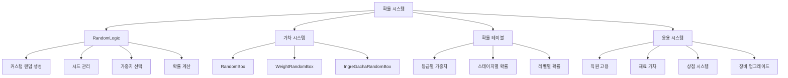

# 확률과 랜덤

츄츄버거는 공정하고 예측 불가능한 게임플레이를 위해 정교한 확률 시스템을 구축했습니다. 커스텀 랜덤 생성기, 가중치 기반 가차 시스템, 다양한 확률 테이블을 통해 게임의 재미와 균형을 제공합니다.

## 확률 시스템 개요

### 핵심 확률 아키텍처



## RandomLogic 커스텀 랜덤 시스템

### 커스텀 랜덤 생성기

게임의 공정성을 보장하기 위한 독립적인 랜덤 생성기입니다.

```lua
-- RandomLogic.mlua :: 커스텀 랜덤 생성
property integer Seed = 0

method integer RandomInteger()
    local next = self.Seed * 6364136223846793005 + 1442695040888963407
    self.Seed = next & 0x7fffffff
    return next >> 16 & 0x7fffffff
end

method number RandomDouble()
    return self:RandomInteger() / 0x80000000
end

method integer RandomIntegerRange(integer a, integer b)
    return self:RandomInteger() % (b - a + 1) + a
end
```

#### 시드 관리 시스템

```lua
-- RandomLogic.mlua :: 시드 관리
method void NextSeed(SyncTable<integer> seed)
    self.Seed = seed[1]
    seed[1] = self:RandomIntegerRange(0, 123456789)
end

method number GetRandomDouble(SyncTable<integer> seed)
    self:NextSeed(seed)
    return self:RandomDouble()
end

-- 여러 개의 랜덤 값 생성
method SyncTable<number> GetRandomDoubles(SyncTable<integer> seed, integer count)
    self:NextSeed(seed)
    
    local values = {}
    for i = 1, count do
        table.insert(values, self:RandomDouble())
    end
    return values
end

-- 사용 예시
local seed = {12345}
local randomValue = _RandomLogic:GetRandomDouble(seed)
local multipleValues = _RandomLogic:GetRandomDoubles(seed, 5)  -- 5개의 랜덤값
```

### 가중치 기반 선택 시스템

```lua
-- RandomLogic.mlua :: ReturnRandomPickWeight()
method integer ReturnRandomPickWeight(table weights)
    local eventIndex = 1
    local totalWeight = 0
    local eventWeights = {}
    
    -- 총 가중치 계산
    for i, key in pairs(weights) do
        local weight = weights[i]
        if not _UtilLogic:IsNilorEmptyString(weight) then
            totalWeight = tonumber(totalWeight) + tonumber(weight)
            eventWeights[i] = tonumber(weight)
        end
    end
    
    -- 가중치 기반 선택
    local randNum = _UtilLogic:RandomIntegerRange(1, totalWeight)
    
    if randNum <= eventWeights[1] then
        eventIndex = 1
    elseif randNum <= eventWeights[1] + eventWeights[2] then
        eventIndex = 2
    elseif randNum <= eventWeights[1] + eventWeights[2] + eventWeights[3] then
        eventIndex = 3
    -- ... 최대 6개까지 지원
    else
        eventIndex = 6
    end
    
    return eventIndex
end

-- 사용 예시
local weights = {30, 50, 20}  -- 30%, 50%, 20% 확률
local selectedIndex = _RandomLogic:ReturnRandomPickWeight(weights)
```

### 확률 계산 유틸리티

```lua
-- RandomLogic.mlua :: ReturnIsDropProb100()
method boolean ReturnIsDropProb100(integer prob)
    if tonumber(prob) < 1 then
        return false
    end
    
    if _UtilLogic:RandomIntegerRange(1, 100) <= tonumber(prob) then
        return true
    else
        return false
    end
end

-- 사용 예시
local dropChance = 15  -- 15% 확률
local isDropped = _RandomLogic:ReturnIsDropProb100(dropChance)

if isDropped then
    -- 아이템 드롭
    print("아이템이 드롭되었습니다!")
end
```

### 순열과 셔플

```lua
-- RandomLogic.mlua :: RandomIntegersInRange()
method table RandomIntegersInRange(integer range)
    local ints = {}
    for i = 1, range do
        table.insert(ints, i)
    end
    
    return _StringUtilLogic:ShuffleStringTable(ints)
end

-- 사용 예시
local shuffledNumbers = _RandomLogic:RandomIntegersInRange(10)
-- 결과: {3, 7, 1, 9, 2, 5, 8, 4, 6, 10} (랜덤하게 섞인 1~10)
```

## RandomBox 가차 시스템

### 기본 RandomBox 구조

가중치 기반으로 아이템을 선택하는 핵심 가차 시스템입니다.

```lua
-- RandomBox.mlua :: 기본 구조
@Struct
script RandomBox

property table items = {}           -- 아이템 저장소 (가중치 누적값 → 아이템)
property table itemWeight = {}      -- 가중치 누적값 배열
property integer totalWeight = 0    -- 총 가중치

-- 아이템 추가
method boolean AddItem(integer weight, any value)
    if weight == 0 then
        return false
    end
    
    local nextWeight = self.totalWeight + weight
    self.items[self.totalWeight] = value  -- 현재 누적값을 키로 사용
    table.insert(self.itemWeight, self.totalWeight)
    self.totalWeight = nextWeight
end

-- 사용 예시
local gachaBox = RandomBox()
gachaBox:AddItem(50, "일반 아이템")    -- 50% 확률
gachaBox:AddItem(30, "레어 아이템")    -- 30% 확률  
gachaBox:AddItem(15, "에픽 아이템")    -- 15% 확률
gachaBox:AddItem(5, "레전더리 아이템") -- 5% 확률
```

#### 이진 검색 기반 선택

```lua
-- RandomBox.mlua :: Pick()
method any Pick()
    if self.totalWeight < 1 then
        return nil
    end
    
    if #self.itemWeight == 1 then
        return self.items[self.itemWeight[1]]
    end
    
    local pickNumber = _UtilLogic:RandomIntegerRange(0, self.totalWeight - 1)
    local pickedIndex = self:FindMaxValueLessThanOrEqual(self.itemWeight, pickNumber)
    
    return self.items[pickedIndex]
end

-- 이진 검색으로 효율적인 선택
method integer FindMaxValueLessThanOrEqual(table arr, integer target)
    local left, right = 1, #arr
    local result = -1 
    
    while left <= right do
        local mid = math.floor((left + right) / 2)
    
        if arr[mid] <= target then
            result = arr[mid] 
            left = mid + 1 
        else
            right = mid - 1 
        end
    end
    
    return result
end

-- 사용 예시
local selectedItem = gachaBox:Pick()
print("선택된 아이템: " .. selectedItem)
```

#### 동적 아이템 제거

```lua
-- RandomBox.mlua :: RemoveItem()
method integer RemoveItem(any value)
    local weight = 0
    for i = 1, self.totalWeight do
        if self.items[i] == value then
            table.remove(self.items, i)
            weight += 1
        end
    end
    
    return weight  -- 제거된 가중치 반환
end

-- 사용 예시
local removedWeight = gachaBox:RemoveItem("레어 아이템")
print("제거된 가중치: " .. removedWeight)
```

## IngreGachaRandomBoxData 재료 가차

### 등급별 가중치 시스템

재료 가차에서 사용되는 고급 가중치 관리 시스템입니다.

```lua
-- IngreGachaRandomBoxData.mlua :: 구조
@Struct
script IngreGachaRandomBoxData

property string Id = ""
property SyncTable<integer, integer> GradeWeight  -- 등급별 가중치

method void Load(any dataTable, integer index)
    local row = dataTable:GetRow(index)
    
    self.Id = row:GetItem("Id")
    local gradeTb = _UtilLogic:Split(row:GetItem("ContainsGrade"), ",")
    local weightTb = _UtilLogic:Split(row:GetItem("GradeWeight"), ",")
    
    for i = 1, #gradeTb do
        local grade = tonumber(gradeTb[i])
        local weight = tonumber(weightTb[i])
        
        self.GradeWeight[grade] = weight
    end
end

-- CSV 데이터 예시:
-- Id: "IN_001", ContainsGrade: "1,2,3,4,5", GradeWeight: "50,30,15,4,1"
-- 1등급: 50%, 2등급: 30%, 3등급: 15%, 4등급: 4%, 5등급: 1%
```

#### 등급별 확률 계산

```lua
-- IngreGachaRandomBoxData.mlua :: Pick()
method table Pick(Entity player, integer count)
    local result = {}
    
    local gachaType = _UtilLogic:SubString(self.Id, 1, 2)  -- "IN" 또는 "BN"
    
    -- 등급 선택 함수
    local getGrade = function()
        local gradePool = {}
        for grade, weight in pairs(self.GradeWeight) do
            for i = 1, weight do
                table.insert(gradePool, grade)  -- 가중치만큼 풀에 추가
            end
        end
        
        return gradePool[_UtilLogic:RandomIntegerRange(1, #gradePool)]
    end
    
    if gachaType == "IN" then 
        -- 재료 가차
        local pool = _StageDataSetLogic:GetStageTotalIngredient(player.PlayerStage.NowStage, player)
        
        for i = 1, count do	
            local gachaPool = self:GetGachaPool(player, pool, gachaType, getGrade())
            local randomId = gachaPool[_UtilLogic:RandomIntegerRange(1, #gachaPool)]
            table.insert(result, randomId)
        end
        
    elseif gachaType == "BN" then 
        -- 번 가차
        local pool = table.keys(_IngredientDataSetLogic.BunData)
        for i = 1, count do
            local gachaPool = self:GetGachaPool(player, pool, gachaType, getGrade())
            local randomId = gachaPool[_UtilLogic:RandomIntegerRange(1, #gachaPool)]
            table.insert(result, randomId)
        end
    end
    
    return result
end

-- 사용 예시
local gachaData = IngreGachaRandomBoxData()
-- ... 데이터 로드 ...
local rewards = gachaData:Pick(player, 10)  -- 10개 뽑기
```

## 응용 시스템들

### 직원 고용 확률 시스템

직원 고용에서 사용되는 다층적 확률 시스템입니다.

#### 고용 풀 생성

```lua
-- PlayerEmployment.mlua :: OnProcessingRecruit() 일부
@ExecSpace("ServerOnly")
method void OnProcessingRecruit(integer employmentId)
    -- 튜토리얼 중에는 고정 직원 제공
    if self.Entity.PlayerStage.NowStage == 1 then
        if self.Entity.PlayerAchievement:ReturnAchievementProgress(_TutorialAchievementTypeEnum.EmploymentCount) < 1 then
            self:Recruit_Fix(employmentId, _EmployeeTypeEnum.Serving)
            return
        end
    end
    
    -- 랜덤 직원 풀에서 5명 선택
    local empIdRandomBox = self:ReturnEmploymentChuchuPool(employmentId)
    local empList = {}
    
    for i = 1, self.DEFINE_EMPNUM do
        -- 중복 없이 5명 선택
        local idx = _UtilLogic:RandomIntegerRange(1, #empIdRandomBox)
        local newEmployeeId = empIdRandomBox[idx]
        empList[i] = newEmployeeId
        table.remove(empIdRandomBox, idx)  -- 중복 방지
    end
    
    self.NewEmployeeIdList = empList
end
```

#### 고용 레벨별 확률 조정

```lua
-- PlayerEmployment.mlua :: CalcEmploymentStartLv()
method table CalcEmploymentStartLv()
    local nowStage = self.Entity.PlayerStage.NowStage
    local stageValue = _StageDataSetLogic:GetStageData(nowStage).EmployeeInitLevel
    
    local lvSum = self.EmploymentLv + self.ScoutLv
    local v = _GetConfigDataLogic:GetConfigNumDataByKey("RecruitmentPerEmployeeInitLevelUp") 
    local lvBonus = math.floor(lvSum / v) - 1 
    local maxLv = _GetConfigDataLogic:GetConfigNumDataByKey("EmployeeInitLevelMax") 
    local maxLvBonus = maxLv - stageValue
    lvBonus = math.min(lvBonus, maxLvBonus) 
    
    local chuchuStartLv = stageValue + lvBonus
    
    return {math.floor(chuchuStartLv), stageValue, math.floor(lvBonus)}
end

-- 고용할 때마다 고용 레벨이 올라가면서 더 높은 레벨의 직원이 나올 확률 증가
```

#### 랜덤 직원 선택

```lua
-- EmployeeService.mlua :: ReturnRandomCharId()
method string ReturnRandomCharId(Entity player, string type)
    local employees = player.EmployeeManager.EmployeeDetailTable
    local randomTable = {}
    
    for i = 1, #employees do
        local data = employees[i]
        local id = data.Id
        
        local empData = _EmployeeService:GetData(id)
        if _UtilLogic:IsNilorEmptyString(type) == false then
            if empData.Type ~= type then
                continue  -- 타입이 맞지 않으면 제외
            end
        end
        
        table.insert(randomTable, id)
    end
    
    local randomIndex = _UtilLogic:RandomIntegerRange(1, #randomTable)
    local randomId = randomTable[randomIndex]
    
    return randomId
end

-- 사용 예시
local randomServingEmployee = _EmployeeService:ReturnRandomCharId(player, "Serving")
local randomAnyEmployee = _EmployeeService:ReturnRandomCharId(player, "")  -- 타입 무관
```

### 상점 상품 진열 확률

상점에서 상품이 진열되는 확률을 관리하는 시스템입니다.

```lua
-- ShopDataLogic.mlua :: PickProductsByShopId()
method table PickProductsByShopId(string shopId)
    local candidateProduct = self.ProductIdsByShopId[shopId]
    local picked = {}
    
    local dependetCandidate = {}
    for i, id in ipairs(candidateProduct) do
        local product = self:GetShopProductData(id)
        if product == nil then
            continue
        end
        
        if product.PutoutType == "Independent" then
            -- 독립적 확률: 각각 개별 확률로 진열 여부 결정
            local randomValue = _UtilLogic:RandomIntegerRange(0, 100000) 
            if product.PutoutValue > randomValue then
                table.insert(picked, id)
            end
            
        elseif product.PutoutType:len() > 0 then
            -- 의존적 확률: 같은 타입 내에서 가중치 기반 선택
            if dependetCandidate[product.PutoutType] == nil then
                dependetCandidate[product.PutoutType] = RandomBox()
            end 
            local randomBox = dependetCandidate[product.PutoutType]
            randomBox:AddItem(product.PutoutValue, product.ProductId)
        end
    end
    
    -- 의존적 상품들 중에서 각 타입별로 하나씩 선택
    for k, v in pairs(dependetCandidate) do
        local pickedId = v:Pick()
        table.insert(picked, pickedId)
    end
    
    return picked
end

-- 예시:
-- Independent 상품들: 각각 개별 확률로 진열 (여러 개 동시 진열 가능)
-- "WeaponType" 의존적 상품들: 무기 타입 중 하나만 선택되어 진열
-- "ArmorType" 의존적 상품들: 방어구 타입 중 하나만 선택되어 진열
```

### 대회 라이벌 선택

대회에서 라이벌을 랜덤하게 선택하는 시스템입니다.

```lua
-- TrialLogic.mlua :: ReturnRandomRivalId()
method string ReturnRandomRivalId(Entity player)
    local rivalPool = {}
    
    for id, data in pairs(_EmployeeService.EmployeeData) do
        local empData = data
        
        -- 선택된 직원과 같으면 제외
        if not _UtilLogic:IsNilorEmptyString(player.PlayerTrial.SelectedEmployeeId) then
            if id == player.PlayerTrial.SelectedEmployeeId then
                continue
            end
        end
        
        -- 이미 나온 라이벌과 중복되면 제외
        if isvalid(player.PlayerTrial.CharacterData) then
            local isSame = false
            
            for k, v in pairs(player.PlayerTrial.CharacterData) do
                if v == id then
                    isSame = true
                    break
                end
            end
            
            if isSame then
                continue
            end
        end
        
        table.insert(rivalPool, id)
    end
    
    local randIndex = _UtilLogic:RandomIntegerRange(1, #rivalPool)
    return rivalPool[randIndex]
end

-- 중복을 피하면서 새로운 라이벌 선택
```

### 장비 업그레이드 확률

장비 강화에서 사용되는 복잡한 확률 계산 시스템입니다.

```lua
-- 장비 업그레이드 확률 계산 (문서에서 발췌)
@ExecSpace("Server")
method boolean UpgradeProcess(integer upgradeProb)
    -- 복잡한 시드 생성으로 예측 불가능한 랜덤 보장
    local seedOffset = 1
    for i=1, 10 do
        seedOffset = math.random(1, 100000)
    end
    local seed = os.time() * 1000000 + os.clock() * 1000000 + seedOffset
    math.randomseed(seed)
    
    local res = math.random(1, 100)
    
    -- 결과가 확률 이하면 성공
    if res <= upgradeProb then
        return true
    end
    
    return false
end

-- 업그레이드 프로세스
@ExecSpace("Server")
method void RequestUpgradeEmployeeEquip(string employeeId, string userId, string currencyId)
    local equipUpgradeData = _EmployeeEquipUpgradeDataLogic:GetEmployeeEquipUpgrageData(nextEquipLevel)
    local upgradeCost = equipUpgradeData.UpgradeCost
    local upgradeProb = equipUpgradeData.UpgradeProb
    
    -- 비용 차감
    userEntity.PlayerInventory:RemoveItem(currencyId, upgradeCost, "Employee Equip Upgrade")
    
    -- 확률 계산
    local res = self:UpgradeProcess(upgradeProb)
    
    if res then
        -- 성공: 장비 레벨 증가
        userEntity.EmployeeManager:AddEmployeeEquipLevel(employeeId)
    else
        -- 실패: 아이템만 소모
    end
end
```

## 고급 확률 기법

### 체감 확률 조정

플레이어가 느끼는 확률과 실제 확률을 조정하는 기법들입니다.

#### 연속 실패 보정

```lua
-- 연속 실패 시 확률 보정 시스템 (예시)
local function GetAdjustedProbability(baseProbability, consecutiveFailures)
    local adjustment = consecutiveFailures * 5  -- 실패할 때마다 5% 증가
    local adjustedProb = baseProbability + adjustment
    return math.min(adjustedProb, 100)  -- 최대 100%로 제한
end

-- 사용 예시
local baseProb = 20  -- 기본 20% 확률
local failures = 3   -- 연속 3번 실패
local adjustedProb = GetAdjustedProbability(baseProb, failures)
-- 결과: 35% (20% + 15%)
```

#### 가변 가중치 시스템

```lua
-- 시간이나 상황에 따라 가중치를 동적으로 조정
local function GetTimeBasedWeight(baseWeight, timeOfDay)
    if timeOfDay >= 18 and timeOfDay <= 22 then
        -- 저녁 시간대에는 레어 아이템 확률 증가
        return baseWeight * 1.5
    elseif timeOfDay >= 2 and timeOfDay <= 6 then
        -- 새벽 시간대에는 확률 감소
        return baseWeight * 0.7
    else
        return baseWeight
    end
end
```

### 시드 동기화

멀티플레이어 환경에서 서버-클라이언트 간 동일한 랜덤 결과를 보장하는 시스템입니다.

```lua
-- 동기화된 랜덤 값 생성
local function GetSyncedRandom(player, seedKey)
    local playerSeed = player.PlayerData.RandomSeeds[seedKey]
    if playerSeed == nil then
        playerSeed = {math.random(1, 999999)}
        player.PlayerData.RandomSeeds[seedKey] = playerSeed
    end
    
    return _RandomLogic:GetRandomDouble(playerSeed)
end

-- 사용 예시
local gachaResult = GetSyncedRandom(player, "dailyGacha")
```

### 확률 분석 도구

개발자용 확률 검증 도구들입니다.

```lua
-- 확률 분포 테스트
local function TestProbabilityDistribution(testFunction, iterations)
    local results = {}
    
    for i = 1, iterations do
        local result = testFunction()
        results[result] = (results[result] or 0) + 1
    end
    
    -- 결과 분석
    for outcome, count in pairs(results) do
        local percentage = (count / iterations) * 100
        print(string.format("결과 %s: %d회 (%.2f%%)", outcome, count, percentage))
    end
end

-- 사용 예시
TestProbabilityDistribution(function()
    local gachaBox = RandomBox()
    gachaBox:AddItem(70, "일반")
    gachaBox:AddItem(25, "레어")
    gachaBox:AddItem(5, "에픽")
    return gachaBox:Pick()
end, 10000)
```

## 성능 최적화

### 확률 테이블 캐싱

```lua
-- 확률 테이블 미리 계산하여 캐싱
local probabilityCache = {}

local function GetCachedProbabilityTable(configId)
    if probabilityCache[configId] == nil then
        local config = _DataService:GetTable(configId)
        local probabilityTable = {}
        
        for i = 1, config:GetRowCount() do
            local row = config:GetRow(i)
            local weight = tonumber(row:GetItem("Weight"))
            local item = row:GetItem("ItemId")
            table.insert(probabilityTable, {weight = weight, item = item})
        end
        
        probabilityCache[configId] = probabilityTable
    end
    
    return probabilityCache[configId]
end
```

### 대량 가차 최적화

```lua
-- 대량 가차 시 효율성을 위한 배치 처리
local function BatchGacha(gachaBox, count)
    local results = {}
    local batchSize = math.min(count, 100)  -- 한 번에 최대 100개
    
    for batch = 1, math.ceil(count / batchSize) do
        local remaining = math.min(batchSize, count - (batch - 1) * batchSize)
        
        for i = 1, remaining do
            table.insert(results, gachaBox:Pick())
        end
        
        -- 배치마다 가비지 컬렉션 여유 제공
        if batch % 10 == 0 then
            collectgarbage("step", 200)
        end
    end
    
    return results
end
```

## 개발자를 위한 가이드

### 새로운 가차 시스템 추가

1. **데이터 구조 정의**: CSV에서 확률 테이블 정의
2. **RandomBox 생성**: 가중치와 아이템 추가
3. **확률 검증**: 테스트를 통한 분포 확인
4. **UI 연동**: 결과를 사용자에게 표시

### 확률 밸런싱 가이드

1. **기준 확률 설정**: 게임 디자인에 맞는 기본 확률
2. **단계별 조정**: 플레이어 진행도에 따른 확률 변화
3. **체감 보정**: 연속 실패 방지 메커니즘
4. **데이터 분석**: 실제 플레이 데이터를 통한 조정

### 성능 고려사항

1. **메모리 사용량**: 큰 확률 테이블의 효율적 관리
2. **연산 최적화**: 빈번한 확률 계산의 캐싱
3. **동기화 비용**: 서버-클라이언트 간 확률 동기화
4. **가비지 컬렉션**: 대량 가차 시 메모리 관리

### 디버깅과 테스트

```lua
-- 확률 시스템 디버깅
local function DebugRandomSystem()
    -- 시드 상태 확인
    print("Current Seed: " .. _RandomLogic.Seed)
    
    -- 확률 분포 테스트
    local testResults = {}
    for i = 1, 1000 do
        local result = _RandomLogic:RandomIntegerRange(1, 10)
        testResults[result] = (testResults[result] or 0) + 1
    end
    
    for i = 1, 10 do
        print(string.format("Value %d: %d times (%.1f%%)", i, testResults[i] or 0, ((testResults[i] or 0) / 1000) * 100))
    end
end

-- 가차 시스템 검증
local function VerifyGachaSystem(gachaBox, iterations)
    local results = {}
    for i = 1, iterations do
        local item = gachaBox:Pick()
        results[item] = (results[item] or 0) + 1
    end
    
    print("Gacha Results after " .. iterations .. " pulls:")
    for item, count in pairs(results) do
        local percentage = (count / iterations) * 100
        print(string.format("%s: %d (%.2f%%)", item, count, percentage))
    end
end
```

## 코드 참조

### 핵심 랜덤 시스템
- `RootDesk/MyDesk/Common/RandomLogic.mlua :: RandomInteger(), RandomIntegerRange()` — 커스텀 랜덤 생성기
- `RootDesk/MyDesk/Common/RandomLogic.mlua :: ReturnRandomPickWeight()` — 가중치 기반 선택
- `RootDesk/MyDesk/Common/RandomLogic.mlua :: ReturnIsDropProb100()` — 확률 계산 유틸리티

### 가차 시스템
- `RootDesk/MyDesk/Common/Gacha/RandomBox.mlua :: AddItem(), Pick()` — 기본 가차 시스템
- `RootDesk/MyDesk/Common/Gacha/RandomBox.mlua :: FindMaxValueLessThanOrEqual()` — 이진 검색 기반 선택
- `RootDesk/MyDesk/Common/Gacha/Ingredient/IngreGachaRandomBoxData.mlua :: Pick()` — 재료 가차 시스템

### 응용 시스템들
- `RootDesk/MyDesk/11. Employment/PlayerEmployment.mlua :: OnProcessingRecruit()` — 직원 고용 확률
- `RootDesk/MyDesk/Shop/ShopDataLogic.mlua :: PickProductsByShopId()` — 상점 상품 진열 확률
- `RootDesk/MyDesk/10. Trial/TrialLogic.mlua :: ReturnRandomRivalId()` — 대회 라이벌 선택

### 직원 관련 확률
- `RootDesk/MyDesk/02. Employee/EmployeeService.mlua :: ReturnRandomCharId()` — 랜덤 직원 선택
- `RootDesk/MyDesk/11. Employment/PlayerEmployment.mlua :: CalcEmploymentStartLv()` — 고용 레벨 계산

### 핵심 인터페이스
```lua
-- RandomLogic 주요 메소드
method integer RandomIntegerRange(integer a, integer b)
method number RandomDouble()
method integer ReturnRandomPickWeight(table weights)
method boolean ReturnIsDropProb100(integer prob)

-- RandomBox 주요 메소드
method boolean AddItem(integer weight, any value)
method any Pick()
method integer RemoveItem(any value)
method integer FindMaxValueLessThanOrEqual(table arr, integer target)

-- IngreGachaRandomBoxData 주요 메소드
method void Load(any dataTable, integer index)
method table Pick(Entity player, integer count)
method table GetGachaPool(Entity player, table originPool, string type, integer grade)
```
