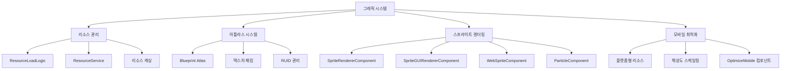

# 그래픽과 사운드

츄츄버거는 모바일과 PC를 지원하는 크로스플랫폼 게임으로서, 효율적인 리소스 관리와 플랫폼 최적화 시스템을 갖추고 있습니다. 아틀라스 기반의 그래픽 시스템과 다층화된 사운드 관리 시스템을 통해 최적의 성능과 사용자 경험을 제공합니다.

## 그래픽 시스템 개요

### 핵심 그래픽 아키텍처



## ResourceLoadLogic 리소스 관리

### 중앙 집중식 리소스 관리

ResourceLoadLogic은 모든 리소스의 로딩과 언로딩을 담당하는 핵심 시스템입니다.

```lua
-- ResourceLoadLogic.mlua :: OnBeginPlay()
method void OnBeginPlay()
    self:AvatarResourcesUnload("CustomAvatarDataSet")
    
    local data = _DataService:GetTable("MobileResourceDataSet")
    
    for i = 1,data:GetRowCount() do
        local row = data:GetRow(i)
        local pc = row:GetItem("PCRUID")
        local mobile = row:GetItem("MobileRUID")
        
        self.MobileResourceTable[pc] = mobile
    end
    
    -- 플랫폼별 기본 리소스 프리로딩
    local ruids
    if Environment:IsMobilePlatform() then
        ruids = {"75e532e60091464eae250f0d147cdf98", ...}
    else
        ruids = {"ce1622084bb14a31b82cb5b2bd624352", ...}
    end
    
    _ResourceService:PreloadAsync(ruids, nil)
end
```

#### 비동기 리소스 로딩

```lua
-- ResourceLoadLogic.mlua :: PreLoadResources()
@ExecSpace("ClientOnly")
method void PreLoadResources(table ruids, any onLoadCallback)
    if #ruids > 0 then
        _ResourceService:PreloadAsync(ruids, onLoadCallback)
    end
end

-- 사용 예시
local ruids = {"ruid1", "ruid2", "ruid3"}
_ResourceLoadLogic:PreLoadResources(ruids, function()
    print("리소스 로딩 완료!")
    -- UI 업데이트나 게임 로직 실행
end)
```

#### 리소스 언로딩과 메모리 관리

```lua
-- ResourceLoadLogic.mlua :: UnloadResources()
@ExecSpace("ClientOnly")
method void UnloadResources(table ruids)
    _ResourceService:RemoveCaches(ruids)
    _ResourceService:UnloadUnusedResources(0)
end

-- 아바타 리소스 관리
method void AvatarResourcesUnload(string dataSetName)
    if self.stage == 0 then 
        return
    end
    
    local totalRuids = self:DialogAvatarRuids(self.stage, dataSetName)
    self:UnloadResources(totalRuids)
end
```

### 스테이지별 아바타 리소스 로딩

```lua
-- ResourceLoadLogic.mlua :: DialogAvatarRuids()
method table DialogAvatarRuids(number stage, string dataSetName)
    local avatarDataSet = _DataService:GetTable("AvatarStageDataSet")
    local stageKey = "Stage"..tostring(stage)
    local selectIds = {}
    
    -- 현재 스테이지에 필요한 아바타 ID 수집
    for _ , row in pairs(avatarDataSet:GetAllRow()) do
        local idValue = row:GetItem(stageKey)
        if idValue and idValue ~= "" then
            table.insert(selectIds, tonumber(idValue))
        end
    end
    
    -- 해당 ID들의 모든 RUID 수집
    local dataSet = _DataService:GetTable(dataSetName)
    local totalRuids = {}
    -- ... RUID 수집 로직
    
    return totalRuids
end
```

## Blueprint Atlas 시스템

### 아틀라스 구조와 패킹

Blueprint Atlas는 여러 개의 개별 이미지를 하나의 큰 텍스처로 통합하여 드로우 콜을 최적화하는 시스템입니다.

#### 아틀라스 정의 구조

```json
// Atlas_UI_Common.blueprintatlas 예시
{
  "Id": "",
  "EntryKey": "blueprintatlas://374b1899-dbd9-40d6-89c5-48dd27ca7a70",
  "ContentType": "x-mod/blueprintatlas",
  "ContentProto": {
    "Use": "Json",
    "Json": {
      "name": "Atlas_UI_Common",
      "width": 2048,
      "height": 2048,
      "padding": 4,
      "filtermode": 1,
      "resource_guid": "53f84fe7ac8c4819bc80ad052a3c6a3b",
      "images": [
        {
          "RUID": "70e39ebdfa944266911da9a7ba02c4af",
          "VersionString": null
        }
      ]
    }
  }
}
```

#### 카테고리별 아틀라스 분류

게임의 각 기능별로 아틀라스가 분류되어 있어 필요한 시점에만 로딩할 수 있습니다:

- **Atlas_UI_Common**: 공통 UI 요소들
- **Atlas_UI_Recipe**: 레시피 관련 UI
- **Atlas_Training_Place**: 출장 배경과 오브젝트
- **Atlas_NPC**: 캐릭터와 고객 스프라이트
- **Atlas_TitleScene**: 타이틀 화면 전용 리소스
- **Atlas_Anim_Ready_X**: 애니메이션 프레임들

### 아틀라스 최적화 기법

#### 패딩과 필터링

```json
"padding": 4,           // 각 이미지 간 4픽셀 간격
"filtermode": 1,        // 필터링 모드 (0=Point, 1=Linear)
```

#### 해상도별 최적화

```json
"width": 2048,
"height": 2048,
```

대부분의 아틀라스가 2048x2048 크기로 통일되어 있어 GPU 효율성을 극대화합니다.

## 스프라이트 렌더링 시스템

### SpriteRendererComponent (월드 스프라이트)

월드 공간에서 렌더링되는 3D/2.5D 스프라이트를 담당합니다.

```lua
-- 월드 스프라이트 설정 예시
local spriteEntity = world:SpawnEntity()
local renderer = spriteEntity.SpriteRendererComponent

renderer.SpriteRUID = "70e39ebdfa944266911da9a7ba02c4af"
renderer.SortingLayer = "Default"
renderer.OrderInLayer = 1
renderer.FlipX = false
renderer.DrawMode = SpriteDrawMode.Simple
```

#### 애니메이션 재생

```lua
-- SpriteRendererComponent 애니메이션
renderer.PlayRate = 1.0
renderer.StartFrameIndex = 0
renderer.EndFrameIndex = 24
-- 자동으로 프레임별 재생됨
```

### SpriteGUIRendererComponent (UI 스프라이트)

UI 공간에서 렌더링되는 2D 스프라이트를 담당합니다.

```lua
-- UI 스프라이트 설정
local uiSprite = uiEntity.SpriteGUIRendererComponent

uiSprite.ImageRUID = "a0ad3f12e81840fd95198444effc1a84"
uiSprite.LocalPosition = Vector2(100, 50)
uiSprite.LocalScale = Vector2(1.5, 1.5)
uiSprite.SortingLayer = "UI"
uiSprite.OrderInLayer = 10
```

#### UI 애니메이션 클립

```lua
-- SpriteGUIRendererComponent 애니메이션
uiSprite.AnimClipPlayType = SpriteAnimClipPlayType.Loop
uiSprite.PlayRate = 2.0
uiSprite.StartFrameIndex = 0
uiSprite.EndFrameIndex = 15
```

### WebSpriteComponent (웹 이미지)

인터넷에서 이미지를 동적으로 로딩하여 표시하는 컴포넌트입니다.

```lua
-- WebSpriteComponent 사용
local webSprite = entity.WebSpriteComponent

webSprite.Url = "https://example.com/image.png"
webSprite.SortingLayer = "UI"
webSprite.Color = Color(1, 1, 1, 0.8)  -- 80% 투명도

-- 애니메이션 URL 시퀀스
webSprite.AnimationUrl = {
    "https://example.com/frame1.png",
    "https://example.com/frame2.png",
    "https://example.com/frame3.png"
}
```

### SpriteParticleComponent (파티클 효과)

스프라이트 기반 파티클 효과를 생성하는 컴포넌트입니다.

```lua
-- SpriteParticleComponent 설정
local particle = entity.SpriteParticleComponent

particle.SpriteRUID = "particle_star_ruid"
particle.ParticleType = SpriteParticleType.Explosion
particle.ParticleCount = 20
particle.ParticleLifeTime = 2.0
particle.ParticleSpeed = 5.0
particle.ParticleSize = 1.5
particle.Color = Color(1, 0.8, 0, 1)  -- 황금색
particle.Loop = false
particle.AutoRandomSeed = true
```

### PixelRendererComponent (픽셀 아트)

픽셀 단위로 직접 그리는 커스텀 스프라이트를 생성할 수 있습니다.

```lua
-- PixelRendererComponent 사용
local pixelRenderer = entity.PixelRendererComponent

pixelRenderer.Width = 16
pixelRenderer.Height = 16
pixelRenderer.FilterMode = PixelRendererFilterMode.Point

-- 전체를 빨간색으로 칠하기
pixelRenderer:FillColor(Color(1, 0, 0, 1))

-- 특정 픽셀 설정
pixelRenderer:SetPixel(8, 8, Color(0, 1, 0, 1))  -- 중앙을 초록색으로

-- 전체 픽셀 배열로 설정
local pixels = {}
for i = 1, 256 do  -- 16x16 = 256
    pixels[i] = Color(math.random(), math.random(), math.random(), 1)
end
pixelRenderer:ResetWithColors(16, 16, pixels)
```

## 모바일 최적화 시스템

### 플랫폼별 리소스 매핑

모바일과 PC 플랫폼에 대해 각각 최적화된 리소스를 제공합니다.

```lua
-- ResourceLoadLogic.mlua :: OptimizeMobileResource()
@ExecSpace("ClientOnly")
method string OptimizeMobileResource(string ruid)
    if self.MobileResourceTable[ruid] == nil then
        return ruid  -- 원본 리소스 사용
    else 
        return self.MobileResourceTable[ruid]  -- 모바일 최적화 버전
    end
end
```

### OptimizeMobileResource 컴포넌트

UI 요소의 자동 모바일 최적화를 담당합니다.

```lua
-- OptimizeMobileResource.mlua :: OnBeginPlay()
@ExecSpace("ClientOnly")
method void OnBeginPlay()
    self.Entity.SpriteGUIRendererComponent.ImageRUID = 
        _ResourceLoadLogic:OptimizeMobileResource(self.originRUID)
end
```

사용법:
```lua
-- 컴포넌트 설정
local optimizer = uiEntity.OptimizeMobileResource
optimizer.originRUID = "pc_high_res_image_ruid"
-- OnBeginPlay에서 자동으로 모바일용 이미지로 교체됨
```

### OptimizeMobileMapResource 컴포넌트

맵 오브젝트의 모바일 최적화를 담당합니다.

```lua
-- OptimizeMobileMapResource.mlua :: OnBeginPlay()
@ExecSpace("ClientOnly")
method void OnBeginPlay()
    self.Entity.SpriteRendererComponent.SpriteRUID = 
        _ResourceLoadLogic:OptimizeMobileResource(self.originRUID)
        
    -- 스케일링 적용
    local scale = _ResourceLoadLogic:OptimizeMobileSize(self.multiplication)
    self.Entity.TransformComponent.Scale.x = 
        self.Entity.TransformComponent.Scale.x * scale
    self.Entity.TransformComponent.Scale.y = 
        self.Entity.TransformComponent.Scale.y * scale
end
```

#### 동적 스케일링 시스템

```lua
-- ResourceLoadLogic.mlua :: OptimizeMobileSize()
@ExecSpace("ClientOnly")
method integer OptimizeMobileSize(integer multiplication)
    if not Environment:IsMobilePlatform() then
        return 1  -- PC는 원본 크기
    else
        return multiplication  -- 모바일은 지정된 배율
    end
end
```

## 사운드 시스템

### BGMService 배경음악 관리

게임의 모든 배경음악을 중앙에서 관리하는 시스템입니다.

```lua
-- BGMService.mlua :: 주요 BGM RUID 상수들
property string LobbyBGM = "6b68d1ba391643fab60cd5f726cad64c"
property string RecipeMakingBGM = "fdd63a2f506643f08a6d8e2136a773e3"
property string TrialBGM = "27845f761e1441fda0a6df50a0ca1027"
property string VIPOrderBGM = "1401aacb48bf42fea21c965da4a835a9"
property string TrainingBGM = "fdd63a2f506643f08a6d8e2136a773e3"
property string OutroBGM = "f5bb92d91e134c699e7bb2cf1aaca8e6"
```

#### BGM 재생과 교체

```lua
-- BGMService.mlua :: ApplyBGM()
@ExecSpace("Client")
method void ApplyBGM(string BGMRuid)
    local player = _UserService.LocalPlayer
    local curMap = player.CurrentMap
    
    curMap.SoundComponent:Stop()
    curMap.SoundComponent.AudioClipRUID = BGMRuid
    curMap.SoundComponent.Volume = 0.6
    
    if self.MUTE == false then
        curMap.SoundComponent:Play()
    end
end

-- 사용 예시
_BGMService:ApplyBGM(_BGMService.TrialBGM)
```

#### 스팟 기반 BGM 시스템

```lua
-- BGMService.mlua :: ApplySpotBGM()
@ExecSpace("Client")
method void ApplySpotBGM(string curSpotID)
    local spotDataSet = _DataService:GetTable("SpotDataSet")
    local row = spotDataSet:FindRow("SpotKey", curSpotID)
    
    if isvalid(row) then
        local spotBGM = row:GetItem("BGMRuid")
        
        if not _UtilLogic:IsNilorEmptyString(spotBGM) then
            local curMap = _UserService.LocalPlayer.CurrentMap
            curMap.SoundComponent:Stop()
            curMap.SoundComponent.AudioClipRUID = spotBGM
            curMap.SoundComponent:Play()
        end
    end
end
```

### SoundComponent 개별 사운드

각 엔티티에 부착되어 개별 사운드를 재생하는 컴포넌트입니다.

```lua
-- SoundComponent 설정 예시
local soundEntity = world:SpawnEntity()
local sound = soundEntity.SoundComponent

sound.AudioClipRUID = "button_click_sound_ruid"
sound.Volume = 0.8
sound.Loop = false
sound.PlayOnEnable = true
sound.Bgm = false
sound.HearingDistance = 15.0
sound.Pitch = 1.0
```

#### 3D 포지셔널 사운드

```lua
-- 위치 기반 사운드
sound.SetCameraAsListener = true
sound.HearingDistance = 20.0

-- 또는 SoundService를 통한 위치 기반 재생
_SoundService:PlaySoundAtPos("explosion_ruid", 
    Vector3(10, 0, 5), listenerEntity, 1.0)
```

### SoundService 전역 사운드 관리

시스템 레벨에서 사운드를 관리하는 네이티브 서비스입니다.

#### 기본 사운드 재생

```lua
-- 즉시 재생
_SoundService:PlaySound("button_click", 0.8)

-- 루프 재생
_SoundService:PlayLoopSound("ambient_loop", 0.5)

-- BGM 재생
_SoundService:PlayBGM("main_bgm", 0.6)
```

#### 사운드 제어

```lua
-- 일시정지/재개
_SoundService:PauseSound("ambient_loop")
_SoundService:ResumeSound("ambient_loop")

-- 정지
_SoundService:StopSound("ambient_loop")
_SoundService:StopBGM(true)  -- 즉시 정지

-- 볼륨 조절
_SoundService:SetBGMVolume(0.3)
```

#### 사운드 이벤트 시스템

```lua
-- SoundPlayStateChangedEvent 리스너
@EventHandler
method void OnSoundStateChanged(SoundPlayStateChangedEvent event)
    local soundId = event.SoundId
    local isPlaying = event.IsPlaying
    
    if soundId == "boss_bgm" and not isPlaying then
        -- 보스 BGM이 끝났을 때 처리
        _BGMService:ApplyBGM(_BGMService.LobbyBGM)
    end
end
```

## 성능 최적화 전략

### 메모리 관리

#### 선택적 리소스 로딩

```lua
-- 필요한 시점에만 로딩
local function LoadStageResources(stageId)
    local requiredRuids = GetStageRuids(stageId)
    _ResourceLoadLogic:PreLoadResources(requiredRuids, function()
        OnStageResourcesReady()
    end)
end

-- 사용하지 않는 리소스 언로딩
local function UnloadPreviousStageResources(prevStageId)
    local unusedRuids = GetStageRuids(prevStageId)
    _ResourceLoadLogic:UnloadResources(unusedRuids)
end
```

#### 캐시 관리

```lua
-- 수동 캐시 정리
_ResourceService:RemoveCaches({"old_ruid_1", "old_ruid_2"})
_ResourceService:UnloadUnusedResources(0)  -- 즉시 정리

-- 또는 시간 기반 정리 (예: 30초 후)
_ResourceService:UnloadUnusedResources(30)
```

### 렌더링 최적화

#### 레이어 기반 정렬

```lua
-- 렌더링 우선순위 설정
backgroundSprite.SortingLayer = "Background"
backgroundSprite.OrderInLayer = 0

gameObjectSprite.SortingLayer = "Default"  
gameObjectSprite.OrderInLayer = 10

uiSprite.SortingLayer = "UI"
uiSprite.OrderInLayer = 100

popupSprite.SortingLayer = "Popup"
popupSprite.OrderInLayer = 1000
```

#### 드로우 콜 최소화

```lua
-- 같은 아틀라스의 스프라이트들은 함께 배치
local function OptimizeDrawCalls()
    -- Atlas_UI_Common의 모든 UI 요소들을 연속된 OrderInLayer로 설정
    local commonUIElements = GetUIElementsByAtlas("Atlas_UI_Common")
    for i, element in ipairs(commonUIElements) do
        element.SpriteGUIRendererComponent.OrderInLayer = 100 + i
    end
end
```

### 플랫폼별 최적화

#### 모바일 디바이스 감지

```lua
local function ApplyPlatformOptimizations()
    if Environment:IsMobilePlatform() then
        -- 모바일: 낮은 해상도 텍스처 사용
        ApplyLowResTextures()
        ReduceParticleCount()
        LimitSoundChannels()
    else
        -- PC: 고해상도 텍스처 사용
        ApplyHighResTextures()
        EnableFullParticleEffects()
        EnableSurroundSound()
    end
end
```

#### 해상도 적응형 UI

```lua
-- 해상도별 스케일링
local function AdaptToScreenResolution()
    local screenWidth = Screen.width
    local screenHeight = Screen.height
    local baseWidth = 1920
    local baseHeight = 1080
    
    local scaleX = screenWidth / baseWidth
    local scaleY = screenHeight / baseHeight
    local scale = math.min(scaleX, scaleY)
    
    -- UI 루트의 스케일 조정
    UIRoot.TransformComponent.Scale = Vector3(scale, scale, 1)
end
```

## 디버깅과 모니터링

### 리소스 사용량 모니터링

```lua
-- 개발자용 리소스 모니터링
local function DebugResourceUsage()
    local loadedResources = _ResourceService:GetLoadedResourceCount()
    local memoryUsage = _ResourceService:GetMemoryUsage()
    
    print(string.format("Loaded Resources: %d", loadedResources))
    print(string.format("Memory Usage: %d KB", memoryUsage / 1024))
    
    -- 특정 아틀라스 사용량 체크
    local atlasUsage = {}
    for _, atlas in pairs(GetAllAtlasNames()) do
        atlasUsage[atlas] = GetAtlasReferenceCount(atlas)
    end
    
    for atlas, count in pairs(atlasUsage) do
        print(string.format("Atlas %s: %d references", atlas, count))
    end
end
```

### 사운드 디버깅

```lua
-- 현재 재생 중인 사운드 확인
local function DebugCurrentSounds()
    local bgmPlaying = _SoundService:IsPlayBGM()
    print("BGM Playing: " .. tostring(bgmPlaying))
    
    -- 개별 사운드 상태 체크
    for _, soundId in pairs(GetActiveSoundIds()) do
        local isPlaying = _SoundService:IsSoundPlaying(soundId)
        print(string.format("Sound %s: %s", soundId, isPlaying and "Playing" or "Stopped"))
    end
end
```

## 개발자를 위한 가이드

### 새로운 아틀라스 추가

1. **이미지 준비**: 2048x2048 이내의 적절한 크기로 이미지들 준비
2. **아틀라스 생성**: Blueprint Atlas 파일 생성 및 이미지들 추가
3. **RUID 관리**: 각 이미지의 RUID를 기록하고 관리
4. **로딩 최적화**: 필요한 시점에만 로딩되도록 리소스 그룹 설정

### 성능 최적화 체크리스트

1. **아틀라스 효율성**: 동일 아틀라스의 스프라이트들을 함께 사용
2. **메모리 관리**: 사용하지 않는 리소스는 즉시 언로딩
3. **플랫폼 대응**: 모바일과 PC에 적합한 리소스 제공
4. **캐싱 전략**: 자주 사용되는 리소스는 미리 로딩
5. **사운드 채널**: 동시 재생되는 사운드 수 제한

### 에러 처리

```lua
-- 리소스 로딩 실패 처리
local function SafeLoadResource(ruid, callback)
    _ResourceService:PreloadAsync({ruid}, function(success, error)
        if success then
            callback(true)
        else
            print("리소스 로딩 실패: " .. ruid .. ", 오류: " .. tostring(error))
            -- 대체 리소스 또는 기본값 사용
            UseDefaultResource()
            callback(false)
        end
    end)
end

-- 사운드 재생 실패 처리
local function SafePlaySound(soundId, volume)
    pcall(function()
        _SoundService:PlaySound(soundId, volume)
    end)
    -- 실패해도 게임은 계속 진행
end
```

## 코드 참조

### 리소스 관리
- `RootDesk/MyDesk/Resource/ResourceLoadLogic.mlua :: PreLoadResources(), UnloadResources(), OptimizeMobileResource()` — 중앙 집중식 리소스 관리
- `RootDesk/MyDesk/Resource/OptimizeMobileResource.mlua :: OnBeginPlay()` — UI 모바일 최적화
- `RootDesk/MyDesk/Resource/OptimizeMobileMapResource.mlua :: OnBeginPlay()` — 맵 오브젝트 모바일 최적화

### 아틀라스 시스템
- `RootDesk/MyDesk/Atlas/Atlas_UI_Common.blueprintatlas` — UI 공통 아틀라스 정의
- `RootDesk/MyDesk/Atlas/Atlas_Training_Place.blueprintatlas` — 출장 배경 아틀라스
- `RootDesk/MyDesk/Atlas/Atlas_NPC.blueprintatlas` — 캐릭터 스프라이트 아틀라스

### 스프라이트 렌더링
- `Environment/NativeScripts/Component/SpriteRendererComponent.d.mlua :: SpriteRUID, SortingLayer` — 월드 스프라이트 렌더링
- `Environment/NativeScripts/Component/SpriteGUIRendererComponent.d.mlua :: ImageRUID, LocalPosition` — UI 스프라이트 렌더링  
- `Environment/NativeScripts/Component/SpriteParticleComponent.d.mlua :: ParticleType, ParticleCount` — 스프라이트 파티클

### 사운드 시스템
- `RootDesk/MyDesk/Common/BGMService.mlua :: ApplyBGM(), ApplySpotBGM()` — BGM 중앙 관리
- `Environment/NativeScripts/Component/SoundComponent.d.mlua :: AudioClipRUID, Volume` — 개별 사운드 컴포넌트
- `Environment/NativeScripts/Service/SoundService.d.mlua :: PlaySound(), PlayBGM()` — 전역 사운드 서비스

### 핵심 인터페이스
```lua
-- ResourceLoadLogic 주요 메소드
method void PreLoadResources(table ruids, any onLoadCallback)
method void UnloadResources(table ruids)
method string OptimizeMobileResource(string ruid)
method void AvatarResourcesLoad(string dataSetName, any onLoadCallback)

-- BGMService 주요 메소드  
method void ApplyBGM(string BGMRuid)
method void ApplySpotBGM(string curSpotID)
method void StopBGM()
method void ResumeBGM()

-- SoundService 주요 메소드
method void PlaySound(string id, float volume)
method void PlayBGM(string id, float volume)  
method void PlayLoopSound(string id, float volume)
method void StopSound(string id)
```
