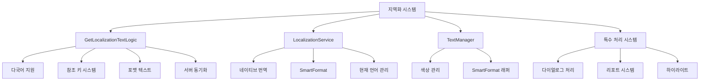

# 다국어와 지역화

츄츄버거는 전 세계 플레이어들을 위한 포괄적인 다국어 지원 시스템을 갖추고 있습니다. 5개 언어(한국어, 영어, 중국어 간체, 중국어 번체, 스페인어)를 지원하며, 동적 파라미터 삽입, 참조 키 시스템, 리치 텍스트 등 고급 지역화 기능을 제공합니다.

## 지역화 시스템 개요

### 핵심 지역화 아키텍처



## GetLocalizationTextLogic 중앙 관리

### 다국어 지원 시스템

츄츄버거는 5개 주요 언어를 지원합니다.

```lua
-- GetLocalizationTextLogic.mlua :: 지원 언어 목록
property table SupportedLocaleList = {"ko", "en", "zh-cn", "zh-tw", "es"}

-- 현재 언어 가져오기
@ExecSpace("ClientOnly")
method string GetText(string key)
    return _LocalizationService:GetTranslatorForLocale(_LocalizationService.CurrentLocaleId):GetText(key) 
end
```

#### 언어별 번역 테이블

지역화 데이터는 LocalizationTable CSV에서 관리됩니다:

| Key | ko | en | zh-cn | zh-tw | es | type | Arguments |
|-----|----|----|-------|-------|----|----- |-----------|
| Burger | 버거 | Burger | 汉堡 | 漢堡 | Hamburguesa | Default text | |
| Welcome | 환영합니다 | Welcome | 欢迎 | 歡迎 | Bienvenido | Format text | Player |

### 기본 텍스트와 포맷 텍스트

```lua
-- GetLocalizationTextLogic.mlua :: MakeLocalizeDataText()
method string MakeLocalizeDataText(string textKey)
    local table = _DataService:GetTable("LocalizationTable")
    local row = table:FindRow("Key", textKey)
    
    if row == nil then 		
        if self:IsReferKey(textKey) == true then
            return self:GetReferKeyText(textKey)
        else	
            return self.errorText
        end
    end
    
    local source = row:GetItem("type")
    
    if source == "Default text" then
        -- 기본 텍스트: 단순 번역
        local text = _LocalizationService:GetTranslatorForLocale(_LocalizationService.CurrentLocaleId):GetText(textKey) 
        return text
        
    elseif source == "Format text" then
        -- 포맷 텍스트: 파라미터 포함
        local args = _UtilLogic:Split(row:GetItem("Arguments"), "/")
        return self:ProcessFormatText(textKey, args)
    end
end
```

### 다중 파라미터 시스템

최대 4개의 파라미터를 지원하는 유연한 텍스트 포맷팅 시스템입니다.

#### 1개 파라미터 처리

```lua
-- GetLocalizationTextLogic.mlua :: 1개 파라미터 처리
if #args == 1 then
    local text1 = args[1]
    if self:IsReferKey(args[1]) == true then
        text1 = self:GetReferKeyText(text1)
    else	
        text1 = _LocalizationService:GetTranslatorForLocale(_LocalizationService.CurrentLocaleId):GetText(args[1]) 
    end	
    
    return _LocalizationService:GetTranslatorForLocale(_LocalizationService.CurrentLocaleId):GetTextFormat(textKey, text1)
end

-- 사용 예시
-- LocalizationTable에서:
-- Key: "WelcomeMessage"
-- Arguments: "Player"
-- ko: "{0}님, 환영합니다!"
-- en: "Welcome, {0}!"

-- 결과:
-- 한국어: "김철수님, 환영합니다!"
-- 영어: "Welcome, KimChulSoo!"
```

#### 2개 파라미터 처리

```lua
-- GetLocalizationTextLogic.mlua :: 2개 파라미터 처리  
elseif #args == 2 then
    local text1 = args[1]
    local text2 = args[2]		
    
    for i, arg in ipairs(args) do
        if self:IsReferKey(arg) == true then
            if i == 1 then 
                text1 = self:GetReferKeyText(text1)
            elseif i == 2 then	
                text2 = self:GetReferKeyText(text2)
            end
        else	
            if i == 1 then 
                text1 = _LocalizationService:GetTranslatorForLocale(_LocalizationService.CurrentLocaleId):GetText(arg)
            elseif i == 2 then	
                text2 = _LocalizationService:GetTranslatorForLocale(_LocalizationService.CurrentLocaleId):GetText(arg)
            end
        end			
    end	
    
    return _LocalizationService:GetTranslatorForLocale(_LocalizationService.CurrentLocaleId):GetTextFormat(textKey, text1, text2)
end

-- 사용 예시
-- Key: "OrderComplete"
-- Arguments: "Player/PlayerShopName"
-- ko: "{0}님이 {1}에서 주문을 완료했습니다!"
-- en: "{0} completed an order at {1}!"
```

#### 3개 및 4개 파라미터 처리

```lua
-- GetLocalizationTextLogic.mlua :: 4개 파라미터까지 지원
elseif #args == 4 then	
    local text1 = args[1]
    local text2 = args[2]	
    local text3 = args[3]
    local text4 = args[4]
    
    -- 각 파라미터 처리 (참조 키 또는 지역화 키)
    for i, arg in ipairs(args) do
        -- ... 개별 파라미터 처리 로직
    end
    
    return _LocalizationService:GetTranslatorForLocale(_LocalizationService.CurrentLocaleId):GetTextFormat(textKey, text1, text2, text3, text4)
end
```

### 참조 키 시스템

동적 데이터를 텍스트에 삽입하기 위한 특수 키 시스템입니다.

```lua
-- GetLocalizationTextLogic.mlua :: GetReferKeyText()
method string GetReferKeyText(string referKey)
    local referText = referKey
    
    if referKey == "Player" then
        referText = _UserService.LocalPlayer.PlayerComponent.Nickname
        
    elseif referKey == "PlayerShopName" then	
        referText = _UserService.LocalPlayer.PlayerOutgameManager.StoreName
        
    elseif referKey == "PassedYear" then
        referText = _IntroDialogLogic.OutroYear
    end 
    
    return referText
end

-- 참조 키 확인
method boolean IsReferKey(string arg)
    local isReferKey = false
    for i, referKey in pairs(self.ReferKeys) do
        if referKey == arg then
            isReferKey = true
        end
    end
    return isReferKey 
end
```

#### 참조 키 등록 시스템

```lua
-- GetLocalizationTextLogic.mlua :: OnBeginPlay()
method void OnBeginPlay()
    local referKeyTable = _DataService:GetTable("LocalizationReferKeyTable")
    local keyCount = referKeyTable:GetRowCount() 
    
    for i = 1, keyCount do
        table.insert(self.ReferKeys, referKeyTable:GetCell(i, "Key"))
    end
end
```

사용 가능한 참조 키들:
- **Player**: 플레이어 닉네임
- **PlayerShopName**: 플레이어 가게 이름  
- **PassedYear**: 게임 내 경과 년수

## LocalizationService 네이티브 서비스

### 기본 번역 기능

MapleStory Worlds의 내장 지역화 서비스를 활용합니다.

```lua
-- 현재 언어 확인
local currentLanguage = _LocalizationService.CurrentLocaleId
print("Current Language: " .. currentLanguage)  -- "ko", "en", etc.

-- 기본 텍스트 가져오기
local text = _LocalizationService:GetText("Burger")
print(text)  -- "버거" (한국어), "Burger" (영어)

-- 포맷 텍스트 사용
local welcomeText = _LocalizationService:GetTextFormat("WelcomeMessage", playerName)
print(welcomeText)  -- "김철수님, 환영합니다!"
```

#### 특정 언어로 번역

```lua
-- 특정 언어의 Translator 가져오기
local koreanTranslator = _LocalizationService:GetTranslatorForLocale("ko")
local englishTranslator = _LocalizationService:GetTranslatorForLocale("en")

local koreanText = koreanTranslator:GetText("Burger")  -- "버거"
local englishText = englishTranslator:GetText("Burger")  -- "Burger"

-- 포맷 텍스트도 지원
local formattedText = koreanTranslator:GetTextFormat("WelcomeMessage", "김철수")
```

### SmartFormat 시스템

```lua
-- LocalizationService.mlua :: SmartFormat
local smartText = _LocalizationService:SmartFormat("Hello {0}, you have {1} items", playerName, itemCount)
print(smartText)  -- "Hello 김철수, you have 10 items"

-- 복잡한 포맷팅
local complexText = _LocalizationService:SmartFormat(
    "Player: {0}, Shop: {1}, Revenue: {2:C}, Date: {3:D}",
    playerName, shopName, revenue, date
)
```

## TextManager 색상과 스타일

### 색상 관리 시스템

텍스트에 적용할 수 있는 사전 정의된 색상들을 관리합니다.

```lua
-- TextManager.mlua :: 색상 상수들
property string Yellow = "#FFE92C"
property string Red = "#FA5246"
property string Grey = "#DDDDDD"
property string White = "#FFFFFF"
property string Brick = "#DD6822"
property string Olive = "#635743"
property string Skyblue = "#1091C7"

-- 색상 헥스 코드 가져오기
method string GetHexCode(string color)
    if color == "yellow" then
        return self.Yellow
    elseif color == "red" then
        return self.Red
    -- ... 다른 색상들
    else
        return "#FFFFFF"  -- 기본값 흰색
    end
end

-- 사용 예시
local yellowHex = _TextManager:GetHexCode("yellow")
local coloredText = "<color=" .. yellowHex .. ">중요한 텍스트</color>"
```

#### 리치 텍스트 색상 적용

```lua
-- 색상이 적용된 텍스트 생성
local function CreateColoredText(text, colorName)
    local hexCode = _TextManager:GetHexCode(colorName)
    return "<color=" .. hexCode .. ">" .. text .. "</color>"
end

-- 사용
local redWarning = CreateColoredText("경고!", "red")
local yellowHighlight = CreateColoredText("중요", "yellow")
```

### SmartFormat 래퍼 메소드

```lua
-- TextManager.mlua :: SmartFormat 래퍼들
method string GetSmartText(string str, any arg1)
    return _LocalizationService:SmartFormat(str, arg1)
end

method string GetSmartText2(string str, any arg1, any arg2)
    return _LocalizationService:SmartFormat(str, arg1, arg2)
end

method string GetSmartText3(string str, any arg1, any arg2, any arg3)
    return _LocalizationService:SmartFormat(str, arg1, arg2, arg3)
end

method string GetSmartText4(string str, any arg1, any arg2, any arg3, any arg4)
    return _LocalizationService:SmartFormat(str, arg1, arg2, arg3, arg4)
end

-- 사용 예시
local text1 = _TextManager:GetSmartText("Hello {0}!", playerName)
local text2 = _TextManager:GetSmartText2("Player {0} earned {1} coins", playerName, coins)
```

## 서버-클라이언트 동기화

### 서버용 지역화 시스템

서버에서도 지역화된 텍스트가 필요한 경우를 위한 시스템입니다.

```lua
-- GetLocalizationTextLogic.mlua :: LocalizedTextServer 관리
property table LocalizedTextServer = {}

-- 서버로 지역화 텍스트 전송 요청
@ExecSpace("Client")
method void RequestSetLocalizedTextServer()
    local serverKeyList = {
        "Burger", 
        "InitialBurgerName", 
        "ItemNameG1001", "ItemNameM4001", "ItemNameM4002", "ItemNameM4003", 
        "MaxStackCountMailMessage", 
        "MaintenanceRewardText" 
    }
    
    for _, key in pairs(serverKeyList) do
        local localizedTextData = LocalizedTextServer()
        localizedTextData.key = key
        
        table.clear(localizedTextData.localeText)
        for _, localeId in pairs(self.SupportedLocaleList) do
            localizedTextData.localeText[localeId] = 
                _LocalizationService:GetTranslatorForLocale(localeId):GetText(key) 
        end
        
        self.LocalizedTextServer[key] = localizedTextData
    end
    
    -- 서버로 전송
    local currentLocaleId = _LocalizationService.CurrentLocaleId
    self:SetLocalizedTextServer(self.LocalizedTextServer, currentLocaleId, self.SupportedLocaleList, _UserService.LocalPlayer)
end
```

#### LocalizedTextServer 구조체

```lua
-- LocalizedTextServer.mlua :: 서버용 지역화 데이터
@Struct
script LocalizedTextServer

property string key = ""
property SyncTable<string, string> localeText

method string GetText(string localeId)
    return self.localeText[localeId]
end
```

#### 서버에서 지역화 텍스트 사용

```lua
-- GetLocalizationTextLogic.mlua :: GetLocalizedTextServer()
@ExecSpace("Server")
method string GetLocalizedTextServer(string localeId, string key)
    local localizedTextServer = self.LocalizedTextServer[key]
    return localizedTextServer.localeText[localeId]
end

-- 사용 예시
local koreanBurgerName = _GetLocalizationTextLogic:GetLocalizedTextServer("ko", "Burger")  -- "버거"
local englishBurgerName = _GetLocalizationTextLogic:GetLocalizedTextServer("en", "Burger")  -- "Burger"
```

## 특수 텍스트 처리 시스템

### 다이얼로그 텍스트 처리

다이얼로그에서 사용되는 특수한 텍스트 치환 시스템입니다.

```lua
-- DialogDataLogic.mlua :: ChangeDefinitionWord()
method string ChangeDefinitionWord(string message)
    local result = message
    local highlight = {}
    
    -- 플레이어 닉네임 치환
    local nick = _UserService.LocalPlayer.PlayerComponent.Nickname
    result, _ = string.gsub(result, "@Nick", nick)
    
    -- 가게 이름 치환
    local storeName = _UserService.LocalPlayer.PlayerOutgameManager.StoreName
    result, _ = string.gsub(result, "@Store", storeName)
    
    -- 줄바꿈 처리
    local empty = " \n"
    result, _ = string.gsub(result, "@enter", empty)
    
    -- 하이라이트 마커 처리
    local highStr = "*"
    while string.find(result, highStr) do
        local a, _ = string.find(result, highStr)
        highlight[#highlight+1] = a
        result, _ = string.gsub(result, highStr, "", 1)
    end
    
    return result, highlight
end
```

#### 다이얼로그 치환 규칙

- **@Nick** → 플레이어 닉네임
- **@Store** → 플레이어 가게 이름  
- **@enter** → 줄바꿈
- **\*** → 하이라이트 시작/끝 마커

#### 하이라이트 시스템

```lua
-- DialogDataLogic.mlua :: SetHighlight()
method string SetHighlight(string target, table highlightTable)
    if #highlightTable == 0 then
        return target
    end
    
    local result = string.sub(target, 0, highlightTable[1]-1)
    local first = "<color=#"..self.HighligtColor..">" 
    local last = "</color>" 
    
    for i=1, #highlightTable do
        local nextidx = highlightTable[i+1]
        if not nextidx then
            nextidx = -1
        end
        
        if i%2 == 1 then
            result = result..first..string.sub(target, highlightTable[i], nextidx-1)
        elseif i == #highlightTable then
            result = result..last..string.sub(target, highlightTable[i], nextidx)
        else
            result = result..last..string.sub(target, highlightTable[i], nextidx-1)
        end
    end
    
    return result
end

-- 사용 예시
local originalText = "안녕하세요 *@Nick*님! *@Store*에 오신 것을 환영합니다!"
local processedText, highlights = DialogDataLogic:ChangeDefinitionWord(originalText)
-- 결과: "안녕하세요 김철수님! 맛있는 햄버거점에 오신 것을 환영합니다!"

local finalText = DialogDataLogic:SetHighlight(processedText, highlights)
-- 결과: "안녕하세요 <color=#FFFF00>김철수</color>님! <color=#FFFF00>맛있는 햄버거점</color>에 오신 것을 환영합니다!"
```

### 리포트 메시지 시스템

게임 내 알림 메시지를 위한 지역화 시스템입니다.

```lua
-- ReportMessageMaker.mlua :: MakeReport()
method void MakeReport(integer reportId, string param1, string param2, string param3)
    local reportData = _StoreInfoDataSetLogic.StoreInfoReportData[reportId]
    if reportData == nil then return end
    
    local categoryTextKey = reportData.CategoryTextKey
    local reportTexttkey = reportData.ReportTextKey
    local paramCount = tonumber(reportData.ParamCount)
    
    local reportText = ""
    
    if paramCount <= 0 then
        reportText = _LocalizationService:GetTranslatorForLocale(_LocalizationService.CurrentLocaleId):GetText(reportTexttkey) 
        
    elseif paramCount <= 1 then
        if self:CheckParamIsNilOrNot(param1) then return end 
        reportText = _LocalizationService:GetTranslatorForLocale(_LocalizationService.CurrentLocaleId):GetTextFormat(reportTexttkey, param1)
        
    elseif paramCount <= 2 then
        if self:CheckParamIsNilOrNot(param1) then return end 
        if self:CheckParamIsNilOrNot(param2) then return end 
        reportText = _LocalizationService:GetTranslatorForLocale(_LocalizationService.CurrentLocaleId):GetTextFormat(reportTexttkey, param1, param2)
        
    elseif paramCount <= 3 then
        -- 3개 파라미터 처리
        reportText = _LocalizationService:GetTranslatorForLocale(_LocalizationService.CurrentLocaleId):GetTextFormat(reportTexttkey, param1, param2, param3)
    end
    
    -- 리포트 큐에 추가
    table.insert(self.ReportMessageQueue, reportText)
end
```

### 토스트 메시지 지역화

```lua
-- GetLocalizationTextLogic.mlua :: CallToastByLocalizationKey()
method void CallToastByLocalizationKey(string key, table args, boolean needLocalize)
    if needLocalize then
        local newArgs = {}
        for i, arg in pairs(args) do
            table.insert(newArgs, _GetLocalizationTextLogic:GetText(arg))
        end
        table.initialize(args, newArgs)
    end
    
    local message = ""
    if isvalid(args) then
        if #args == 1 then
            message = _LocalizationService:GetTranslatorForLocale(_LocalizationService.CurrentLocaleId):GetTextFormat(key, args[1])
        elseif #args == 2 then
            message = _LocalizationService:GetTranslatorForLocale(_LocalizationService.CurrentLocaleId):GetTextFormat(key, args[1], args[2])
        -- ... 최대 4개 파라미터까지
        else
            message = _GetLocalizationTextLogic:GetText(key)
        end
    else
        message = _GetLocalizationTextLogic:GetText(key)
    end
    
    _UIToast:ShowMessage(message)
end

-- 사용 예시
_GetLocalizationTextLogic:CallToastByLocalizationKey("ItemReceived", {"Player", "ItemNameG1001"}, true)
-- 결과: "김철수님이 햄버거를 받았습니다!" (args 내 키들도 지역화됨)
```

## 실제 사용 예시

### UI에서 지역화 텍스트 사용

```lua
-- UI 텍스트 설정
local function SetLocalizedUIText(textComponent, key, ...args)
    local localizedText
    if args and #args > 0 then
        localizedText = _LocalizationService:GetTextFormat(key, ...)
    else
        localizedText = _LocalizationService:GetText(key)
    end
    
    textComponent.text = localizedText
end

-- 사용 예시
SetLocalizedUIText(welcomeLabel, "WelcomeMessage", playerName)
SetLocalizedUIText(menuTitle, "MenuTitle")  -- 파라미터 없음
```

### 동적 텍스트 생성

```lua
-- 플레이어 상태에 따른 동적 텍스트
local function GetStatusMessage(player)
    local playerName = player.PlayerComponent.Nickname
    local shopName = player.PlayerOutgameManager.StoreName
    local level = player.PlayerManagement.ManagementLevel
    
    if level >= 10 then
        return _LocalizationService:GetTextFormat("HighLevelStatus", playerName, shopName, level)
    elseif level >= 5 then
        return _LocalizationService:GetTextFormat("MidLevelStatus", playerName, shopName, level)
    else
        return _LocalizationService:GetTextFormat("LowLevelStatus", playerName, shopName)
    end
end
```

### 색상이 적용된 지역화 텍스트

```lua
-- 색상과 지역화를 함께 사용
local function CreateColoredLocalizedText(key, colorName, ...args)
    local text
    if args and #args > 0 then
        text = _LocalizationService:GetTextFormat(key, ...)
    else
        text = _LocalizationService:GetText(key)
    end
    
    local hexCode = _TextManager:GetHexCode(colorName)
    return "<color=" .. hexCode .. ">" .. text .. "</color>"
end

-- 사용 예시
local redWarning = CreateColoredLocalizedText("WarningMessage", "red", playerName)
local yellowHighlight = CreateColoredLocalizedText("ImportantNotice", "yellow")
```

## 개발자를 위한 가이드

### 새로운 지역화 키 추가

1. **LocalizationTable.csv에 새 행 추가**:
   ```csv
   Key,ko,en,zh-cn,zh-tw,es,type,Arguments
   NewFeatureTitle,새로운 기능,New Feature,新功能,新功能,Nueva Función,Default text,
   ```

2. **코드에서 사용**:
   ```lua
   local title = _LocalizationService:GetText("NewFeatureTitle")
   ```

### 파라미터가 있는 텍스트 추가

1. **CSV에서 Format text로 설정**:
   ```csv
   Key,ko,en,type,Arguments
   PlayerAction,{0}님이 {1}을 했습니다,{0} did {1},Format text,Player/ActionName
   ```

2. **코드에서 사용**:
   ```lua
   local message = _GetLocalizationTextLogic:MakeLocalizeDataText("PlayerAction")
   -- 또는 직접
   local message = _LocalizationService:GetTextFormat("PlayerAction", playerName, actionName)
   ```

### 참조 키 추가

1. **LocalizationReferKeyTable.csv에 추가**:
   ```csv
   Key
   Player
   PlayerShopName
   NewReferenceKey
   ```

2. **GetLocalizationTextLogic.mlua에서 처리 추가**:
   ```lua
   method string GetReferKeyText(string referKey)
       -- ... 기존 코드 ...
       elseif referKey == "NewReferenceKey" then
           referText = GetNewReferenceValue()
       end 
       
       return referText
   end
   ```

### 성능 최적화

#### 텍스트 캐싱

```lua
local textCache = {}

local function GetCachedText(key, locale)
    local cacheKey = key .. "_" .. locale
    if textCache[cacheKey] == nil then
        textCache[cacheKey] = _LocalizationService:GetTranslatorForLocale(locale):GetText(key)
    end
    return textCache[cacheKey]
end
```

#### 배치 로딩

```lua
-- 자주 사용되는 텍스트들을 한 번에 로딩
local function PreloadCommonTexts()
    local commonKeys = {"Burger", "WelcomeMessage", "MenuTitle", "WarningMessage"}
    local currentLocale = _LocalizationService.CurrentLocaleId
    
    for _, key in pairs(commonKeys) do
        GetCachedText(key, currentLocale)
    end
end
```

### 에러 처리

```lua
-- 안전한 텍스트 가져오기
local function SafeGetText(key, fallback)
    pcall(function()
        local text = _LocalizationService:GetText(key)
        if text and text ~= "" then
            return text
        else
            return fallback or key
        end
    end)
    
    return fallback or key
end

-- 안전한 포맷 텍스트
local function SafeGetTextFormat(key, fallback, ...args)
    pcall(function()
        local text = _LocalizationService:GetTextFormat(key, ...)
        if text and text ~= "" then
            return text
        else
            return fallback or key
        end
    end)
    
    return fallback or key
end
```

## 코드 참조

### 중앙 지역화 관리
- `RootDesk/MyDesk/Common/Localization/GetLocalizationTextLogic.mlua :: GetText(), MakeLocalizeDataText()` — 중앙 지역화 시스템
- `RootDesk/MyDesk/Common/Localization/GetLocalizationTextLogic.mlua :: GetReferKeyText(), IsReferKey()` — 참조 키 시스템
- `RootDesk/MyDesk/Common/Localization/GetLocalizationTextLogic.mlua :: CallToastByLocalizationKey()` — 토스트 메시지 지역화

### 네이티브 서비스
- `Environment/NativeScripts/Service/LocalizationService.d.mlua :: GetText(), GetTextFormat()` — 기본 지역화 서비스
- `Environment/NativeScripts/Service/LocalizationService.d.mlua :: GetTranslatorForLocale()` — 특정 언어 번역기
- `Environment/NativeScripts/Service/LocalizationService.d.mlua :: SmartFormat()` — 스마트 포맷팅

### 색상과 텍스트 관리
- `RootDesk/MyDesk/Common/Localization/TextManager.mlua :: GetHexCode(), GetSmartText()` — 색상 관리 및 SmartFormat 래퍼
- `RootDesk/MyDesk/Common/Localization/LocalizedTextServer.mlua :: GetText()` — 서버용 지역화 데이터

### 특수 처리 시스템
- `RootDesk/MyDesk/15. Intro/Dialog/DialogDataLogic.mlua :: ChangeDefinitionWord(), SetHighlight()` — 다이얼로그 텍스트 처리
- `RootDesk/MyDesk/01. Lobby/ReportMessageMaker.mlua :: MakeReport()` — 리포트 메시지 지역화

### 핵심 인터페이스
```lua
-- GetLocalizationTextLogic 주요 메소드
method string GetText(string key)
method string MakeLocalizeDataText(string textKey)
method string GetReferKeyText(string referKey)
method void CallToastByLocalizationKey(string key, table args, boolean needLocalize)

-- LocalizationService 주요 메소드
method string GetText(string key)
method string GetTextFormat(string key, any... args)
method Translator GetTranslatorForLocale(string localeId)
method string SmartFormat(string format, any... args)

-- TextManager 주요 메소드
method string GetHexCode(string color)
method string GetSmartText(string str, any arg1)
method string GetSmartText2(string str, any arg1, any arg2)
```
