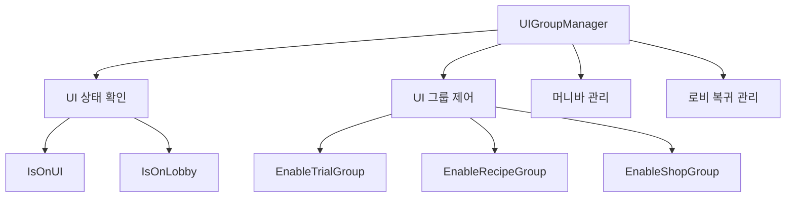
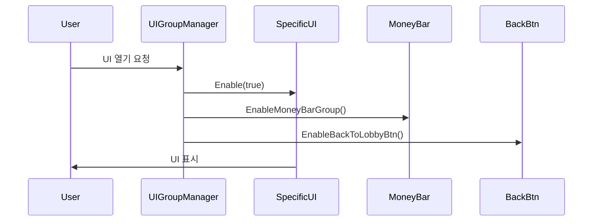
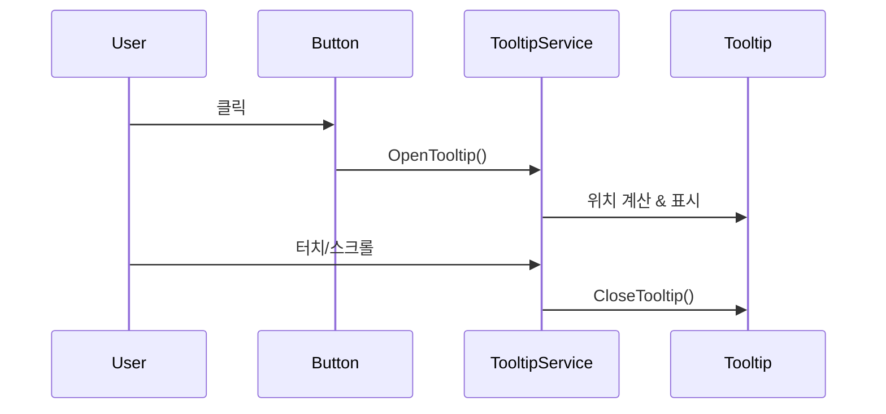
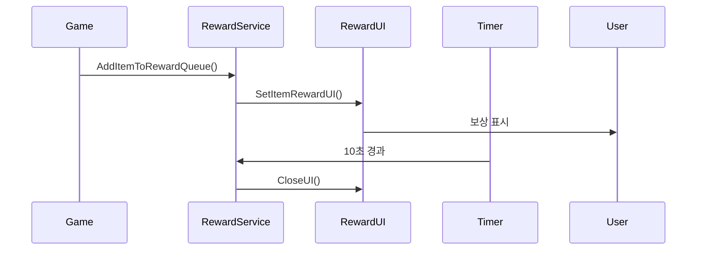

# UI 기본 구조

츄츄버거는 포괄적인 UI 시스템을 통해 다양한 게임 기능들의 사용자 인터페이스를 체계적으로 관리합니다. 이 시스템은 UI 그룹 관리, 재사용 가능한 컴포넌트, 툴팁 관리, 그리고 보상 시스템으로 구성되어 있습니다.

## 핵심 구성 요소

### 1. UI 그룹 관리자 (UIGroupManager)

UIGroupManager는 게임 내 모든 주요 UI 그룹들의 통합 관리자 역할을 합니다.

#### 주요 UI 그룹들
- **게임플레이 UI**: RecipeGroup, EmployeeManageGroup, TrainingGroup
- **경영 UI**: ManagementGroup, UpgradeGroup, StoreRankingGroup  
- **상점 UI**: ShopGroup, SpecialShopGroup, StagePassGroup
- **시스템 UI**: EventGroup, TutorialGroup, FadeGroup, PopupGroup
- **컬렉션 UI**: AchievementGroup, BadgeGroup, ChuchuCollectionGroup

#### 핵심 기능

##### UI 상태 확인 및 제어
- `IsOnUI()`: 현재 활성화된 UI가 있는지 확인
- `IsOnLobby()`: 로비 상태인지 확인
- `ClearAllUI()`: 모든 UI 닫기

##### 특수 UI 제어
- `EnableMoneyBarGroup()`: 머니바 표시 제어
- `EnableBackToLobbyBtn()`: 로비 복귀 버튼 제어



### 2. 재사용 가능한 UI 컴포넌트

Common/UIScript 폴더에는 게임 전반에서 사용되는 표준 UI 컴포넌트들이 구현되어 있습니다.

#### 기본 컴포넌트들

##### UIPopup 시리즈
- **UIPopup**: 확인/취소 버튼이 있는 기본 팝업
- **UIPopupOK**: 확인 버튼만 있는 단순 팝업  
- **UIPopupPurchase**: 구매 확인용 특별 팝업

##### 입력 컴포넌트들
- **UIButtonTypeA**: 표준 버튼 컴포넌트
- **UIToggleTypeA**: 선택 토글 컴포넌트
- **UIGaugeBar**: 진행도 표시 게이지바

#### 컴포넌트 특징
- 팝업 중첩 방지 검증 (`IsEnableOpenPopUp()`)
- 트윈 애니메이션 지원 (열기/닫기 효과)
- 이벤트 핸들링 및 콜백 시스템
- 사운드 효과 연동

### 3. 툴팁 관리 시스템 (TooltipService)

TooltipService는 게임 내 모든 툴팁 표시와 관리를 담당합니다.

#### 핵심 기능
- **기본 툴팁**: `OpenTooltip()` - 단순 텍스트 툴팁
- **패딩 툴팁**: `OpenTooltipWithPadding()` - 위치 조정과 플립 기능이 있는 툴팁
- **자동 닫기**: 터치/스크롤 이벤트로 자동 닫힘

#### 고급 기능
- 화면 경계 감지 및 자동 플립
- 패딩 적용 및 위치 조정
- 아이템명/설명 분리 표시
- 스크롤 이벤트 감지

### 4. 보상 UI 시스템 (UIItemRewardService)

게임 내 모든 보상 표시를 담당하는 전용 시스템입니다.

#### 보상 표시 기능
- **아이템 보상**: 획득 아이템들의 시각적 표시
- **평판 보상**: 평판 변화에 대한 별도 UI
- **큐 시스템**: 여러 보상을 순차적으로 표시

#### 특별 기능
- 자동 타이머 (10초 후 자동 닫힘)
- 다중 행 표시 지원
- 소스별 타이틀 변경
- 애니메이션 효과

## UI 시스템 작동 원리

### 1. UI 열기 플로우


### 2. 툴팁 시스템 플로우


### 3. 보상 표시 플로우


## 개발자를 위한 가이드

### UI 그룹 추가 시
1. UIGroupManager에 새 그룹 프로퍼티 추가
2. `IsOnUI()` 및 `IsOnLobby()` 메소드에 조건 추가
3. 전용 Enable 메소드 구현
4. 머니바 및 로비 버튼 상태 고려

### 새 UI 컴포넌트 개발 시
1. Common/UIScript 패턴 준수
2. `IsEnableOpenPopUp()` 검증 포함
3. 트윈 애니메이션 지원 고려
4. 사운드 효과 연동

### 툴팁 사용 시
1. 간단한 텍스트는 `OpenTooltip()` 사용
2. 아이템 정보는 `OpenTooltipWithPadding()` 사용
3. 화면 경계 고려한 위치 설정
4. 터치/스크롤 이벤트로 자동 닫힘 활용

## 코드 참조

### 주요 파일들
- `RootDesk/MyDesk/Common/UIScript/UIGroupManager.mlua :: IsOnUI(), ClearAllUI(), EnableMoneyBarGroup()` — UI 그룹 통합 관리
- `RootDesk/MyDesk/Common/UIScript/UIPopup.mlua :: Open(), StartTween()` — 기본 팝업 컴포넌트
- `RootDesk/MyDesk/Common/UIScript/TooltipService.mlua :: OpenTooltip(), OpenTooltipWithPadding()` — 툴팁 관리 시스템
- `RootDesk/MyDesk/Common/UIScript/UIItemRewardService.mlua :: SetItemRewardUI(), AddItemToRewardQueue()` — 보상 UI 시스템
- `RootDesk/MyDesk/Common/UIScript/UIButtonTypeA.mlua :: OnClickButton(), SetEnable()` — 표준 버튼 컴포넌트
- `RootDesk/MyDesk/Common/UIScript/UIToggleTypeA.mlua :: SetSelect(), OnClickButton()` — 토글 컴포넌트

### 핵심 인터페이스
**핵심 인터페이스:**

<details>
<summary>UI 시스템 핵심 메서드 정의</summary>

```lua
-- UIGroupManager 핵심 메소드
method boolean IsOnUI()
method boolean ClearAllUI()
method void EnableMoneyBarGroup(boolean isEnable)

-- TooltipService 핵심 메소드  
method void OpenTooltip(Entity tooltipEntity, string text)
method void OpenTooltipWithPadding(Entity tooltipEntity, string descKey, string nameKey, Vector3 worldPosition)

-- UIItemRewardService 핵심 메소드
method void SetItemRewardUI(SyncTable<string, integer> items, string source)
method void AddItemToRewardQueue(string itemId, integer itemCount)
```
</details>
